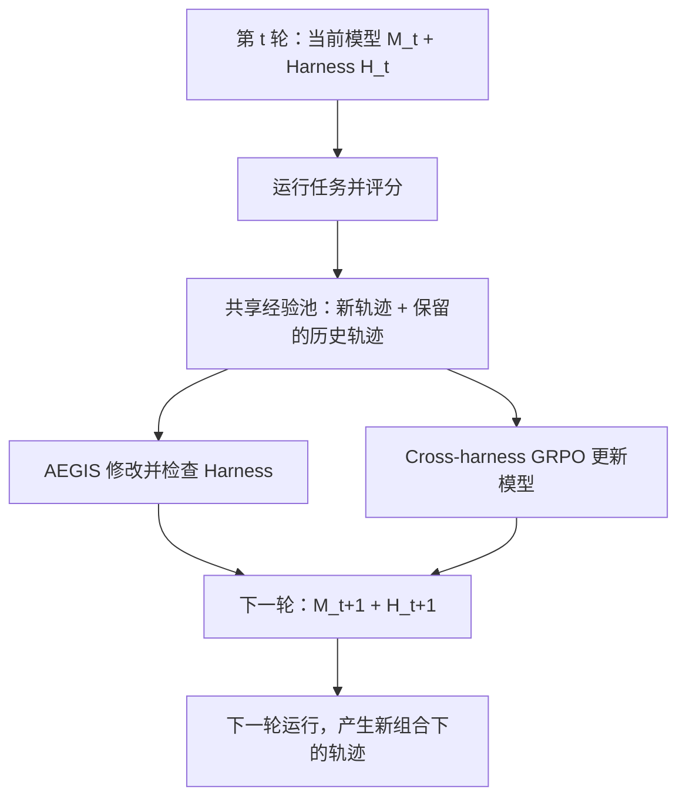

# 模型与 Harness 协同演进调研：八项工作

整理日期：2026-09-14；2026-09-16 补充公开代码核查与逐项目 walkthrough，见第 8 节。本文合并已有调研总览与协同流程示例，范围为 HarnessX、SIA、Continual Harness、HarnessForge、Co-Harness、HASE、ReSkill、MetaClaw。第 1–7 节以已访问的原始论文为依据；代码实现证据另列，不能将论文流程直接视为当前公开代码已复现。

## 1. 核心结论

**除 SIA、Continual Harness、HarnessX 外，HarnessForge、Co-Harness、HASE、ReSkill、MetaClaw 都值得纳入模型与 Harness 协同演进的研究范围。**但“双方都更新”“形成多轮反馈”“稳定获得协同收益”是三个不同层次，不能互相替代。

- **共同更新已有实验支持，更新顺序各不相同。**SIA 的实验主要是先迭代 Harness，停滞后训练权重；HarnessForge、Co-Harness 实测了多轮交替；HarnessX 在同一轮使用共享经验池分别更新两者；HASE 将局部 Harness 编辑纳入模型的训练行为。[SIA 论文][S2]、[HarnessForge 论文][S4]、[Co-Harness 论文][S5]、[HarnessX 论文][S1]、[HASE 论文][S6]
- **模型训练不必采用 RL。**HarnessForge、Co-Harness 使用监督微调；Continual Harness 使用教师纠正与 soft-SFT；其他工作使用 GRPO 等强化学习方法。决定是否属于共同更新的是更新对象与反馈关系。[HarnessForge 论文][S4]、[Co-Harness 论文][S5]、[Continual Harness 论文][S3]
- **需要研究的是模型与 Harness 的配合，而不仅是分别提升它们。**HarnessForge 将不同代的模型与 Harness 交叉组合，配套的最终组合表现更好，说明不能默认某个 Harness 对所有模型版本都同样合适。[HarnessForge §4.4][S4]
- **共同更新尚不能等同于整个 AI 研发系统的递归增强。**HASE 开始训练模型实施 Harness 修改的能力，但修改范围、训练算法与最终审核协议仍由外部设定；其他工作中的改进器也不能仅因参与流程，就被视为已经获得自我改进。[HASE §3][S6]、[SIA §5、§9][S2]

## 2. 概念与证据口径

### 2.1 本文讨论哪些对象

| 对象或角色 | 本文含义 |
|---|---|
| 模型 `M` | 执行任务的 LLM 权重，包括可训练 LoRA。模型更新指真实的参数训练。 |
| Harness `H` | 影响 Agent 运行的外部组件，包括提示词、工具、技能、记忆、上下文组织、控制流和解析规则。不同工作的可修改范围并不相同。 |
| 轨迹与数据 `D` | 任务输入、模型动作、工具返回、最终结果，以及奖励或教师纠正标签。保存的经验不一定全部用于梯度训练。 |
| 改进器 | 根据当前版本、执行记录和评价，提出 Harness 修改的组件，例如 AEGIS、Feedback-Agent、HarnessCritic、Skill Creator。HASE 中，执行任务的模型也可以直接提出修改。 |
| 验证器或评分器 | 检查答案、工具执行或任务完成情况，产生奖励或候选接纳依据的组件。过程评分与最终验收可以由不同组件承担。 |
| 训练器 | 根据训练数据执行 SFT、GRPO 等参数更新的基础设施；它不等同于决定整个系统应该改哪里的改进器。 |

上述术语用于统一比较，不表示八项工作的组件命名和实现完全一致。具体分工以各项论文的方法章节为准。[HarnessX §5][S1]、[SIA §3、§5][S2]、[HASE §3][S6]

`M₀、M₁` 和 `H₀、H₁` 分别表示模型与 Harness 的版本。“跨轮”意味着新版本被后续运行使用。一轮通常处理一批任务，不是仅对某一道题训练一次。

### 2.2 如何阅读流程示例

本文区分三类表述：

1. **论文事实：**论文明确报告的方法、工作负载、实验安排与结果。
2. **机制说明例：**依据论文方法，用一个任务情景串起“失败—修改—数据—训练—后续运行”。为便于理解而补出的情节是解释性假设，不是论文公开的完整实验日志，也不保证更新必然成功。
3. **证据边界：**没有公开或未在实验中验证的环节，明确写为“不明确”“未公开”或“未验证”。

分析每个工作时，重点追踪：**哪一版模型，在什么 Harness 条件下产生了哪批数据；这批数据分别用于更新什么；新组合何时开始运行。**

## 3. 工作总览

| 工作与机构 | 场景、具体问题与工作负载 | 协同机制 | 实验证据与限制 |
|---|---|---|---|
| **[HarnessX][S1]**；小米 Darwin Agent Team，归属依据[作者主页](https://shaokun91.github.io/) | 通用工具 Agent 的提示、工具和控制流需要持续适配；共同更新子实验使用 Qwen3.5-9B，在 GAIA 文本子集 103 题、WebShop 100 个任务上运行。 | 同一批轨迹写入共享经验池，分别用于 AEGIS 修改 Harness 和 cross-harness GRPO 训练模型；新组合进入下一轮。 | 共同更新优于仅演化 Harness；成绩来自用于适配的任务集，没有独立未见任务集验证迁移。论文实验与本地代码审计的证据应分开。 |
| **[SIA][S2]**；Hexo AI / Hexo Labs [开源项目](https://github.com/hexo-ai/sia)，论文未逐一列出作者机构 | Agent 编写与优化任务解法，单靠外围搜索和工具调整可能停滞；任务包括 LawBench 法律分类、H100 上 TriMul 算子优化、MAGIC 单细胞 RNA 去噪。 | Feedback-Agent 选择修改 Harness，或调用训练基础设施更新模型 LoRA。 | 实验主要是多轮 Harness 搜索后切换到权重更新，不能据此声称已验证多次 `Harness→权重→Harness` 往返。 |
| **[Continual Harness][S3]**；普林斯顿、Google DeepMind、ARISE Foundation | 长程、部分可观察游戏中，导航、记忆与策略需要随进展适配；模型—Harness 共学实验为 Pokémon Red。 | 运行中持续修改提示、技能、子 Agent 和记忆；每个训练窗口由教师纠正低分片段，soft-SFT 更新模型，再继续游戏。 | 有跨训练轮反馈，游戏状态持续推进；依赖外部教师和过程评分模型，缺少充分分离两类更新贡献的消融。 |
| **[HarnessForge][S4]**；论文署名机构包括北航、清华 | 不同任务需要不同规划、工具执行与记忆方式；演化池来自 EnvScaler-RL、ToolHop 及 NQ/HotpotQA/2Wiki 检索任务；测试覆盖 ToolHop、HotpotQA、2Wiki、RestBench-TMDB、API-Bank。 | 候选 Harness 的成功评测轨迹用于训练配套 LoRA，下一轮继承模型—Harness 组合。 | 三轮共同更新，并交叉测试不同代的模型与 Harness；RestBench-TMDB、API-Bank 为迁移评测，不用其测试样本进行任务专属 Harness 搜索。 |
| **[Co-Harness][S5]**；美团、Allen Institute for AI、独立研究者 | 使用 Python 解数学题时，提示、工具接口、异常恢复与执行预算会限制训练数据质量；涉及 Qwen3-8B/32B，AIME24、AIME25、HMMT 2025 年 2 月赛事，每个基准 30 题。 | 固定模型修改并接纳 Harness；在新 Harness 下重新采集成功轨迹，SFT 更新模型，再进入下一轮。 | 两个完整共同更新轮次；长程 Harness-only 案例需单独看待，缺少充分的同等算力消融，不能将全部增益归因于协同。 |
| **[HASE][S6]**；香港大学、中国移动九天、Grace Investment Machine | 检索、记忆或可编辑评测辅助组件存在缺陷，固定 Harness 限制解题；包括 Symptom2Disease、股票因子挖掘、圆堆积和 Heilbronn 几何优化。 | 同一个模型生成任务解法和 Harness 编辑动作；执行轨迹用于 GRPO，阶段末验证并保存修改。 | 有多阶段共同更新；几何任务包含冻结权重对照。即使编辑局部评测组件，最终正确性仍受不可编辑的外部标准约束。 |
| **[ReSkill][S7]**；宾州州立大学、Amazon IntelliHub、AWS AI Labs | 新技能可能与正在变化的策略不匹配；共同训练覆盖 ALFWorld、搜索问答，以及 ScienceWorld、InterCode-SQL、WANDS。 | 在同一训练步内，让同一模型对同一任务试用不同技能版本；奖励同时用于 GRPO 和技能版本选择。 | 共同演进对象是模型与技能组件；另有 ALFWorld→ScienceWorld 的冻结权重迁移实验，不能把它算作共同训练，也不能推为整个框架都可自改。 |
| **[MetaClaw][S8]**；UNC-Chapel Hill、UC Santa Cruz、UC Berkeley、CMU | 持续助手需要快速适应新操作规则，同时提升执行可靠性；MetaClaw-Bench 包含 934 个问题、44 个模拟工作日，涉及文件、JSON、Shell 和规则问答。 | 失败触发即时技能更新；积累新技能条件下的轨迹，在用户空闲窗口使用 RL/LoRA 更新模型，并管理技能版本。 | Full 条件对 Kimi-K2.5 进行训练，未报告固定共同更新总轮数；44 个模拟日不是 44 轮权重更新，模拟结果也不直接证明长期真实部署效果。 |

### HarnessX 的代码证据限定

此前本地代码审计的快照为 `bf5f199ee65034d55db0c536e582f1e7c8abf669`。其中 Harness 演化与 Slime/veRL 训练分属不同路径，尚未发现把两者自动交替编排的顶层闭环。因此，本文的共同更新结论来自论文，不能表述为已经通过该快照完整复现，也不能把该提交认定为论文实验使用的提交。见[对应上游代码快照](https://github.com/Darwin-Agent/HarnessX/blob/bf5f199ee65034d55db0c536e582f1e7c8abf669/README.md)及[本地架构与代码审计](research/harnessx/CODE_ARCHITECTURE_ANALYSIS.md)。后者是本次调研形成的分析材料，不是上游作者的实验报告。

## 4. 用具体任务串起协同流程

### 4.1 HarnessX：购物 Agent 反复搜索，却迟迟不下单

**机制说明例。**假设 `M₀ + H₀` 执行购物任务时，不断翻页和重复搜索，最终没有买到满足要求的商品。

1. **产生数据。**系统记录搜索词、翻页动作、商品信息和任务奖励，连同生成轨迹的 Harness 版本写入共享经验池。
2. **修改 Harness。**AEGIS 读取这些记录，提出 `H₁`：增加重复搜索告警，并提示模型及时比较候选商品。通过检查后接纳。
3. **训练模型。**同一轮，GRPO 使用同一个经验池，将同一购物任务在不同历史版本下的轨迹放在一起比较，更新为 `M₁`。计算每条轨迹的模型输出概率时，保留它原来的提示、工具接口和观察上下文。
4. **下一轮运行。**`M₁ + H₁` 再执行购物任务。假设告警帮助它停止重复搜索，但又暴露出漏选尺寸的问题，新轨迹进入经验池。
5. **继续更新。**AEGIS 据此提出 `H₂`；GRPO 将新的执行经验与保留的历史经验一起用于训练 `M₂`。

**协同连接：**同一份执行经验分别推动两种更新；两种更新在本轮不依赖对方刚产生的结果。`H₁` 的运行经验到下一轮才产生，随后才能影响后续训练。不能说本轮 `M₁` 已经从尚未运行的 `H₁` 中学到了东西。

**证据边界：**论文实测了多轮共同更新；上述购物故事是按照真实更新协议构造的示例，不是某条购物任务的完整公开训练日志。[方法 §5.1–5.4、实验 §6.5][S1]

### 4.2 SIA：去噪程序不断调参数，但效果不再提高

**机制说明例。**`M₀ + H₀` 生成 MAGIC 去噪程序，每次只尝试少量参数，结果也不方便比较。

1. **发现问题。**Feedback-Agent 读取程序、运行结果与评分，判断先改善实验工具。
2. **修改 Harness。**加入批量运行参数组合的工具，以及整理“参数—得分”的解析器，得到 `H₁`；模型仍是 `M₀`。
3. **生成新数据。**`M₀ + H₁` 能系统地尝试更多方案，但若继续修改 Harness 后仍出现得分停滞，改进器便切换更新对象。
4. **训练模型。**固定当前最佳 Harness，继续生成候选去噪程序，用实际评测分数作奖励，通过 GRPO 更新模型 LoRA，得到 `M₁`。更新的是编写程序的 LLM。
5. **再次执行。**`M₁` 在相同 Harness 下生成新解法。论文实际观察到，第一个更新后的模型版本生成了此前未出现的 `np.clip + np.rint` 后处理。

**协同连接：**Harness 先改善“怎样做实验”，模型训练再改善“能够提出什么解法”。批量运行器和解析器属于 Harness；模型生成的去噪后处理代码属于任务解法。

**证据边界：**实验主要是多轮 Harness 搜索后切换权重训练，没有实证展示此后又用新模型的失败继续生成 `H₂`。也没有公开逐个训练样本与上述代码变化之间的因果对应关系。[§6.2–6.3、§7.2、§9][S2]

### 4.3 Continual Harness：游戏 Agent 在障碍物附近反复移动

**机制说明例。**假设当前 Gemma 模型 `M₀` 控制 Pokémon Red，在某处不断尝试走进障碍物。

1. **运行中发现问题。**Refiner 读取最近的截图、动作与结果，发现移动没有带来进展。
2. **即时修改 Harness。**把导航技能改成“移动失败后重新判断可行方向”，形成新的 Harness 状态；`M₀` 立即继续使用它。
3. **收集训练窗口。**模型继续完成共 256 步。期间 Harness 还可以继续变化，窗口数据记录这些条件下的实际动作与结果。
4. **构造纠正标签并训练。**过程评分模型找出低分片段，教师根据当时的截图和上下文给出更合适的动作，例如纠正下一步的移动选择；soft-SFT 据此更新为 `M₁`。
5. **继续游戏。**`M₁` 从当前游戏状态接着运行，后续行为再次成为 Refiner 修改导航技能、记忆等组件的依据。

**协同连接：**运行中先改变外部指导，再根据模型实际执行这些指导的表现进行纠正训练。一个模型训练窗口内可以出现多个 Harness 状态，模型更新和 Harness 更新并非一对一同步。

**证据边界：**有跨训练迭代和游戏里程碑推进的实验；未公开某次导航修改与某次权重更新的完整逐条对应日志。训练样本是否包含 Refiner 的编辑输出不明确，不能说 Refiner 也被训练了。[§3.3、§4.5、附录 D][S3]

### 4.4 HarnessForge：日期工具反复收到错误格式的参数

**机制说明例。**`M₀ + H₀` 将自然语言日期直接传给要求标准格式的工具，调用失败。

1. **定位失败。**改进器从报错中发现参数格式不匹配。
2. **生成并测试候选 Harness。**增加日期规范化与参数预检查，形成 `H₁`，再由当前模型测试。论文实际日期案例中，规范化使日期工具能够正确执行。
3. **保留成功示范。**候选评测时产生“查询日期→规范化→调用日期计算→回答”的成功轨迹，转换为训练数据。
4. **更新配套模型。**从父模型继承权重，用这些成功执行示范训练增量 LoRA，得到与 `H₁` 配套的 `M₁`。
5. **下一轮。**从 `M₁ + H₁` 出发继续运行、发现失败和生成候选。例如格式问题减少后，下一轮可能转向工具之间的结果传递问题。

**协同连接：**新 Harness 评测时产生的成功执行方式，用于训练它的配套模型；下一轮继承这个组合。不能把来自不同代的模型与 Harness 默认视为可互换。

**证据边界：**论文实测了三轮共同更新，并开展交叉组合评测；没有说明具体日期题是否进入相应训练批次。Qwen3-4B 在 API-Bank 的交叉组合实验中，最终配套组合为 77.19%，最终 Harness 配所有较早策略平均为 71.93%，最终策略配所有较早 Harness 平均为 71.06%。这些数据支持特定谱系的配套兼容性，不能外推为普适结论。[方法 §3.2–3.4、组合实验 §4.4、多轮实验 §4.5、附录 G][S4]

### 4.5 Co-Harness：数学题调用 Python 出错后无法恢复

**机制说明例。**`M₀ + H₀` 解数学题时，工具调用格式不合要求，报错后又重复同样的调用。

1. **收集失败。**保存问题、错误调用和异常信息。
2. **先修改并接纳 Harness。**HarnessCritic 提出参数格式或重试处理修改，用 `M₀` 重测目标失败任务及需要保留的既有行为，通过接纳条件才得到 `H₁`。
3. **重新采样。**接纳后，用 `M₀ + H₁` 再解一批数学题，收集通过答案验证的成功轨迹。
4. **训练模型。**用这些新轨迹做 SFT，得到 `M₁`，学习新 Harness 条件下成功的工具调用和解题动作。
5. **下一轮。**用 `M₁ + H₁` 再寻找当前瓶颈，继续修改 Harness。

**协同连接：**接纳新 Harness 后重新生成成功示范，再训练模型。这里不是直接把原先的旧 Harness 失败轨迹当成成功监督目标。

**证据边界：**论文实测两个完整共同更新轮次；具体某道数学题从修改、入训到再次解题的全链记录未公开。200 多小时的长程 Harness 优化案例不能直接当成同样时长的模型共同训练证据。[§3、算法 3、§4][S5]

### 4.6 HASE：模型分类错误后，自己重写检索器

**机制说明例。**症状分类任务中，`M₀ + H₀` 因检索到无关样例而错误分类。

1. **模型自己修改。**`M₀` 在本次运行的沙箱副本中编辑 `classification_tools.py`，把按最近记录检索改为按症状相似度检索。
2. **当场测试。**仍在本次任务里调用修改后的工具，重新检索并作答，获得任务奖励。
3. **训练模型。**“编辑代码→调用工具→重新回答”整条轨迹参加 GRPO，模型同时学习解题动作和 Harness 修改动作。
4. **阶段末再接纳 Harness。**有正向效果的代码修改进入候选池；到阶段结束，通过验证选出持久保存的 `H₁`。阶段内的新运行仍从当时的公共 Harness 出发，单次成功不会直接改变其他运行。
5. **下一阶段。**已经训练过的 `M₁` 配合选定的 `H₁` 运行，并继续尝试新的局部修改。

**协同连接：**修改 Harness 本身就是模型需要学习的行动。顺序是先局部修改、利用其执行轨迹训练，再决定哪些修改值得跨阶段保留。

**证据边界：**论文实际给出了通过重写检索器纠正疾病分类的例子，但没有明确该条具体修改是否最终成为持久 Harness。可编辑文件也不意味着模型可以修改最终验收标准。[§3、附录 A.1–A.3][S6]

### 4.7 ReSkill：新增“完整对象名”技能是否适合当前模型

**机制说明例。**模型在 ScienceWorld 中混淆 `glass jar` 和 `glass cup`；下面用这个任务情景演示技能与策略共同训练的协议。

1. **提出候选技能。**Skill Creator 根据失败记录，生成“提取并始终使用完整对象名称”的新技能，旧技能库保留。
2. **试用新旧版本。**每个训练步，对同一任务、同一当前模型，为组内每条轨迹独立抽取旧技能或新技能。这形成同期比较数据，但不保证每一组都恰好包含两种版本。
3. **同一批结果做两件事。**任务奖励用于 GRPO 更新模型；也按技能版本累计结果，估计新技能是否更有效。下一训练步的模型可以已经更新。
4. **选择或回退。**经过一个比较周期，若新版本更好就接纳，否则继续使用旧技能。默认周期包含 5 个训练步。
5. **下一周期。**已经更新的模型配合保留下来的技能库继续运行，最新失败与版本选择历史用于提出下一候选。

**协同连接：**模型在试用新旧技能时就持续训练，技能则按当前模型的实际表现来选择。技能文本本身不通过梯度更新。

**证据边界：**论文公开了玻璃罐相关失败及成功行为，但没有公开该技能所在周期的完整分配、评分与接纳记录；也不能把单独冻结权重的迁移实验算作共同训练。本例演示的是方法，不据此断言这条具体成功轨迹来自某次权重更新。[§3.1–3.3、附录 F.3][S7]

### 4.8 MetaClaw：部署日志漏字段，先补技能再训练执行能力

**机制说明例。**`M₀` 写部署日志时，把 `timestamp` 写成 `date`，还漏掉 `changes`。

1. **失败用于改技能。**技能改进器总结格式要求，写入新技能库 `H₁`，立即供后续任务使用。
2. **积累新条件下的数据。**`M₀ + H₁` 继续处理文件任务。模型可能知道了时间格式，却仍偶尔漏字段，这些实际执行结果被记录。
3. **区分数据用途。**触发技能修改的旧失败属于 support，只用于改技能；新技能生效后的执行数据属于 query，才可用于 RL。按论文 §3.4，技能版本递增时清空训练池中的旧版本样本，之前的 query 也可能因此过期。这是按时间和版本隔离，不是普通训练集/测试集划分。
4. **空闲时训练。**积累足够数据后，利用过程奖励和 GRPO 更新为 `M₁`。
5. **继续服务。**`M₁` 使用当前技能库处理新任务，新出现的失败再触发下一次技能更新。

**协同连接：**先给模型新的操作指导，再训练它在这些指导下的执行表现。技能可以先更新多次，模型训练在满足数据量与空闲窗口条件后再执行。

**证据边界：**论文的部署日志案例确实显示，仅加技能仍会漏字段，完整训练后检查通过；这不代表公开了该任务所对应的逐个梯度更新。Full 条件明确描述了 5 天训练，但未报告技能总版本数、权重热更新次数或固定交替轮数。44 个模拟工作日及案例中的 Round 编号不能当作共同演进轮数；另测的 AutoResearchClaw 仅使用技能更新，没有权重训练。[§3、§4.1、§4.2 表 3][S8]

## 5. 共同点与差异

### 5.1 共同点

八项工作都把外部运行条件与模型行为联系起来：当前组合产生执行经验，经验用于改变 Harness、训练模型或两者，之后评测新组合。数据在这里承担连接作用，但数据的使用规则并不一致，不能统一称为“把所有历史轨迹加入 RL”。[HarnessX §5][S1]、[Co-Harness §3][S5]、[MetaClaw §3][S8]

共同更新的目标可以概括为：外部组件帮助模型产生更有效的行为，而模型训练使后续执行更适合当前组件。这个目标能否实现，需要通过任务结果验证，不能从组件同时变化直接推出。[HarnessForge §4.4][S4]、[ReSkill §3][S7]

### 5.2 关键差异

| 工作 | Harness 何时变化 | 模型训练使用什么数据 | 下一轮起点与主要边界 |
|---|---|---|---|
| [HarnessX][S1] | 当前轮读取共享经验池后提出并检查修改。 | 相同任务在保留的不同模型/Harness 版本下的轨迹，按各自原上下文计算训练目标。 | 两种更新完成后再运行新组合；本轮训练不直接消费尚未运行的新 Harness 的经验。 |
| [SIA][S2] | 实验先多轮搜索 Harness，停滞后切换权重训练。 | 当前最佳 Harness 下生成的候选解法及任务奖励。 | 已验证新模型配合最佳 Harness；之后再改 Harness 的多次往返未实证。 |
| [Continual Harness][S3] | 在游戏运行中持续变化，一个训练窗口内可以更新多次。 | 当前模型经过持续调整的 Harness 产生的轨迹，低分窗口由教师纠正。 | 新模型继续当前游戏状态与在线适配流程。 |
| [HarnessForge][S4] | 先生成与筛选候选 Harness。 | 候选评测产生的成功轨迹，转为配套 LoRA 的监督数据。 | 继承模型—Harness 配对，实测三轮。 |
| [Co-Harness][S5] | 固定模型，先修改并接纳 Harness。 | 接纳后在新 Harness 下重新采样的成功轨迹，用于 SFT。 | 从新模型和已接纳 Harness 开始下一轮，实测两轮。 |
| [HASE][S6] | 单条运行内局部修改，阶段末才决定持久版本。 | 包含模型编辑动作、工具调用和答案动作的执行轨迹，用于 GRPO。 | 上一阶段训练后的模型与通过验证的 Harness 进入下一阶段。 |
| [ReSkill][S7] | 提出候选后，先与旧技能比较，周期结束再接纳或回退。 | 同一任务下新旧技能的混合轨迹，同时用于 GRPO 与技能版本统计。 | 已训练的模型、保留的技能库及下一候选继续比较。 |
| [MetaClaw][S8] | 失败触发即时技能更新。 | 技能生效后的执行数据；触发修改的旧失败与训练数据分开。 | 技能快速变化，模型在数据足够且用户空闲时更新。 |

### 5.3 对 RSI 的定位

这些工作已经把“运行 Agent”和“改进 Agent”连接起来，但连接强度不同。HASE 尤其值得关注：被训练的模型可以输出 Harness 编辑动作，训练信号开始覆盖改进操作本身。它仍不意味着训练器、接纳机制、修改权限和全部 AI 研发基础设施都能递归更新。[HASE §3][S6]

SIA 的 Feedback-Agent、HarnessX 的 AEGIS 等负责提出或选择改进；它们参与改进流程，并不自动构成这些改进器自身能力持续增强的证据。[SIA §5、§9][S2]、[HarnessX §4–5][S1]

## 6. 由现有证据推导的后续研究方向

以下是调研分析提出的方向，不是论文已经验证的结论。

| 方向 | 需要回答的具体问题 | 对应依据 |
|---|---|---|
| **选择更新对象与时机** | 失败来自模型能力不足，还是工具、上下文或控制流不合适？何时继续改 Harness，何时值得训练模型？ | SIA 的停滞后切换、Continual Harness 与 MetaClaw 的不同更新频率。[SIA][S2]、[Continual Harness][S3]、[MetaClaw][S8] |
| **管理版本与训练数据** | 哪些历史轨迹仍可用？如何保留生成它们的模型/Harness 条件，避免把不同条件下的奖励混用？ | HarnessX 的跨版本复用、MetaClaw 的数据分离、ReSkill 的同期版本比较。[HarnessX][S1]、[MetaClaw][S8]、[ReSkill][S7] |
| **验证新组合的适配与迁移** | 新模型与新 Harness 是否配套？提高当前任务得分时是否破坏既有能力？能否迁移到独立任务？ | HarnessForge 的交叉组合、Co-Harness 的接纳检查，以及 HarnessX 的未见任务泛化证据缺口。[HarnessForge][S4]、[Co-Harness][S5]、[HarnessX][S1] |
| **训练实施改进的能力** | 如何让模型学会提出有效修改、验证修改并在适当边界内保留修改？ | HASE 将编辑动作纳入训练，但最终审核机制仍由外部设定。[HASE][S6] |

若继续展开，优先比较 HarnessForge、HarnessX、HASE、ReSkill，分别研究配套适配、共享轨迹、修改能力训练、技能与策略同步选择。

## 7. 原始来源与版本

以下均按所读 arXiv 预印本记录，不据此额外推定会议接收或同行评审状态。日期为首次提交日期；作者栏列首作者，完整名单见原文。元数据于 2026-09-14 复核。

| 编号 | 工作与首作者 | 首次提交 / 本文版本 | 来源与重点位置 |
|---|---|---|---|
| S1 | HarnessX；Tingyang Chen 等 | 2026-06-12 / v3，2026-07-23 修订 | [版本信息](https://arxiv.org/abs/2606.14249v3)；[正文][S1]。§5 为共同更新，§6.5 为对应实验。 |
| S2 | SIA；Prannay Hebbar 等 | 2026-05-26 / v2，2026-05-28 修订 | [版本信息](https://arxiv.org/abs/2605.27276v2)；[正文][S2]。§5 为机制，§6 为实验，§9 为未来工作。 |
| S3 | Continual Harness；Seth Karten 等 | 2026-05-11 / v1 | [版本信息](https://arxiv.org/abs/2605.09998v1)；[正文][S3]。§3.3、§4.5、附录 D 为共学流程。 |
| S4 | HarnessForge；Mingju Chen 等 | 2026-06-01 / v1 | [版本信息](https://arxiv.org/abs/2606.01779v1)；[正文][S4]。§3 为方法，§4.4 为组合分析、§4.5 为多轮实验，附录 G.3 为日期案例。 |
| S5 | Co-Harness；Zhengyu Chen 等 | 2026-07-17 / v1 | [版本信息](https://arxiv.org/abs/2607.22688v1)；[正文][S5]。§3、算法 3 为时序与数据构造，§4 为实验。 |
| S6 | HASE；Haochen Luo 等 | 2026-07-04 / v1 | [版本信息](https://arxiv.org/abs/2607.03935v1)；[正文][S6]。§3 为方法，附录 A 为局部修改、候选筛选与分类案例。 |
| S7 | ReSkill；Zelin He 等 | 2026-06-01 / v2，2026-06-08 修订 | [版本信息](https://arxiv.org/abs/2606.01619v2)；[正文][S7]。§3 为版本比较与训练，附录 F.3 为行为案例。 |
| S8 | MetaClaw；Peng Xia 等 | 2026-03-17 / v1 | [版本信息](https://arxiv.org/abs/2603.17187v1)；[正文][S8]。§3 为快慢更新与数据管理，§4.2 表 3 为部署日志案例。 |

[S1]: https://arxiv.org/html/2606.14249v3
[S2]: https://arxiv.org/html/2605.27276v2
[S3]: https://arxiv.org/html/2605.09998v1
[S4]: https://arxiv.org/html/2606.01779
[S5]: https://arxiv.org/html/2607.22688v1
[S6]: https://arxiv.org/html/2607.03935v1
[S7]: https://arxiv.org/html/2606.01619v2
[S8]: https://arxiv.org/html/2603.17187v1

## 8. 公开代码核查与 Walkthrough（2026-09-16）

**六项工作取得官方公开源码：三项复用本地已有仓库，三项前轮 clone。Co-Harness、HASE 尚未找到能够确认归属的官方仓库。**后两项是本次检索结果，不是对代码一定未公开的断言。统一入口、commit、许可证、验证范围与阅读顺序见 [Walkthrough 总索引](walkthroughs/README.md)。

| 工作 | 本地处理与源码阅读入口 | 与前述论文机制的对照 |
|---|---|---|
| HarnessX | 复用 `HarnessX/`；[代码 walkthrough](walkthroughs/HARNESSX_CODE_WALKTHROUGH.md) | GAIA 的多轮 Harness 演化能静态串联，Slime/veRL 为独立路径；尚未找到把共享批次、候选 Harness 和训练后模型自动连接起来的顶层循环。 |
| SIA | 复用 `sia/`；[代码 walkthrough](walkthroughs/SIA_CODE_WALKTHROUGH.md) | README 报告 W+H 组合实验，论文实验先改 Harness、停滞后训练；本轮用 LawBench id=0 追踪程序、评分和文件修改。公开 main 的 focus 分支固定，实验选择器、训练数据到新模型再回接的完整映射未定位；不能用 CLI 限制否定 W+H。 |
| Continual Harness | 以已有实验分支摘录串联协同流程，main 差异单列；[代码 walkthrough](walkthroughs/CONTINUAL_HARNESS_CODE_WALKTHROUGH.md) | 实验分支在游戏窗口内编辑 Harness，窗口后以评分和教师纠正构建文本标签，再做 LoRA SFT；未见 soft-target loss。跨窗口 Harness 继承、adapter 保存/选择存在明确核查缺口。 |
| HarnessForge | 前轮 clone `HarnessForge/`；[代码 walkthrough](walkthroughs/HARNESSFORGE_CODE_WALKTHROUGH.md) | 候选包生成、验证、筛选、数据整理与训练工具可读，但主要通过独立命令连接；发布的 policy 为指针而非模型权重，自动父模型继承与部署链未闭合。根代码许可证未找到。 |
| Co-Harness | [来源核查与待补路线](walkthroughs/CO_HARNESS_CODE_WALKTHROUGH.md) | 论文和已核查作者主页未提供可确认代码入口；无法把 HarnessCritic、SFT 和下一轮映射为实际函数。 |
| HASE | [来源核查与待补路线](walkthroughs/HASE_CODE_WALKTHROUGH.md) | 论文附录有局部代码片段，但未找到可确认的完整官方工程；不能由片段补出沙箱、训练和阶段接纳的实现链。 |
| ReSkill | 前轮 clone `reskill/` 及固定 veRL 子模块；[代码 walkthrough](walkthroughs/RESKILL_CODE_WALKTHROUGH.md) | 调用顺序为 rollout → 技能记录/决定/提案 → GRPO 更新；新技能首次影响后续 rollout，拒绝技能版本不回滚模型。ScienceWorld 默认配置和测试中途恢复存在缺口；论文任务清单不直接等于当前仓库支持清单。 |
| MetaClaw | 前轮 clone `MetaClaw/`；[代码 walkthrough](walkthroughs/METACLAW_CODE_WALKTHROUGH.md) | 训练后的 sampler 会接回后续请求；但当前入口未保证论文所述的严格 support/query 隔离：手动入口先训练再用同批失败样本演化，API 演化与 trainer 的 generation 基线也未完整衔接。云端训练内部与本地接口证据分别记录。 |

本次 walkthrough 优先使用仓内实际题目、脚本、测试或历史记录。SIA 本轮采用 LawBench id=0（前轮 GPQA 检查仅保留其原有证据范围），HarnessForge 采用 ToolHop 原始 id=161，Continual Harness 采用真实 Red 历史按键记录并另读实验训练分支。这些材料不自动构成某一条样本从失败、编辑、入训到提升的完整运行日志。

本轮没有进行模型训练或论文收益复现。已执行的有限检查（例如 SIA 评分函数/CLI、HarnessForge 工具与评分函数）在各文档中单独说明；未运行的测试只用于解释源码定义的预期。所有“未找到”“未闭合”的结论均限定在索引记录的代码快照和本次已核查入口。

上述 walkthrough 已按完整协同流程重写：每份先定义对象与类，再说明任务执行、结果评价、成败分析、修改、候选接纳、训练数据、参数更新和下一轮生效；环节顺序以各项目实际调用为准。统一比较见[总索引第 4–5 节](walkthroughs/README.md)。本次文档重写只复核源码和引用，前述局部执行结果来自前轮，没有重新运行模型或训练。

SIA 补充说明：README 明确列出 SIA-W+H。第 8 节的单值 `--focus` 与固定模式结论仅适用于已读公开 CLI，不否定该实验设置。W+H 实验到当前入口的完整映射尚不明确，详见 [SIA 对照说明](walkthroughs/SIA_CODE_WALKTHROUGH.md)。

本轮进一步补齐了 Harness 的具体修改操作和模型更新的双向触发关系：新增/替换/删除什么、何时生效、谁启动训练、新权重怎样产生下一次诊断依据。逐项覆盖与缺口见[十项核查表](walkthroughs/REWRITE_COVERAGE.md)。

其余七篇现已按已确认的 SIA 标准，从全篇重写调用、等待、返回和触发关系，并配流程图；两项无官方源码的工作仍仅描述论文协议。此次保留 SIA 正文和原始代码基线，详细范围见[本轮校验](walkthroughs/evidence/other_projects_call_chain_validation.json)。
