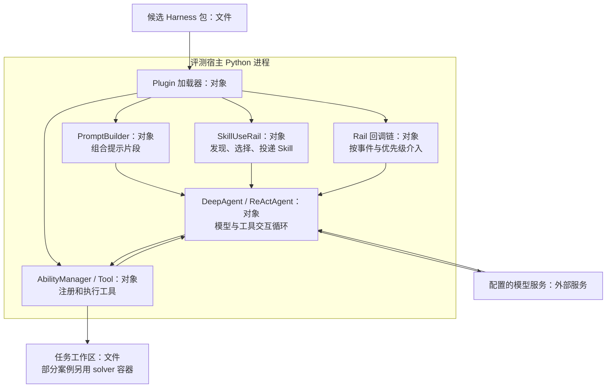
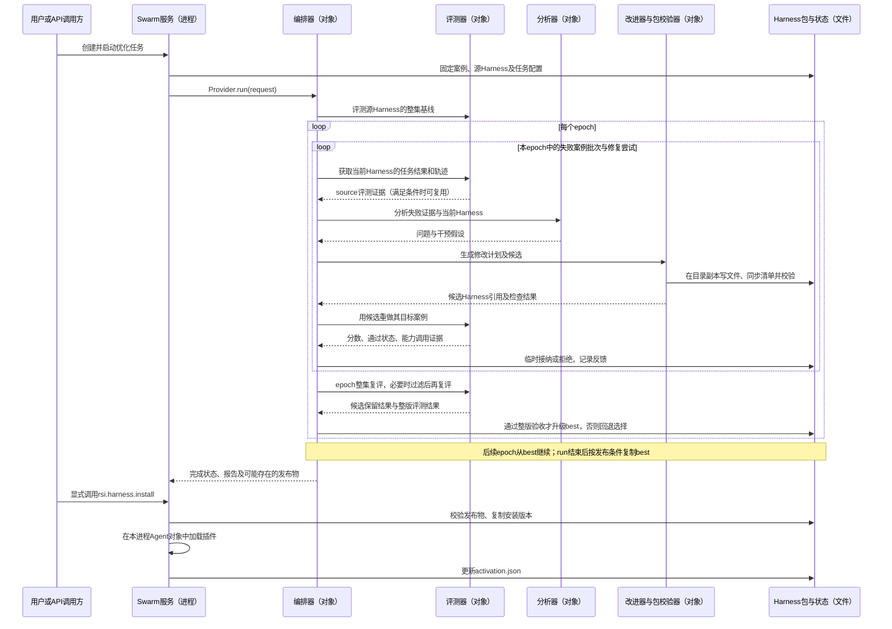

# F01：代码与独立测试参考

本文保留各组件的代码定位与独立测试边界；贯穿案例见 [F01 主文档](OPENJIUWEN_F01_HARNESS_ITERATION.md)。2026-09-16新增 [F01 组件衔接深入分析](OPENJIUWEN_F01_DEEP_DIVE.md)：逐段展开调用、字段、文件及失败路径，并补充有限局部验证。

核查日期：2026-09-15。延续 [全局特性实现视图](OPENJIUWEN_RSI_OVERVIEW.md) 的 F01。本轮只分析 Swarm 接入的 `SingleHarnessIterativeOptimizationOrchestrator`，不混入 Meta AutoHarness、Team Skill 自演进或模型训练。

代码基线：agent-core `13d226d91ccc1ff4c041e984fb6aa90de6c5e0ff`；jiuwenswarm `f29c060cee90aef10e46b2a3646fe3628f60ea7c`。二者工作区核查时均无修改。Swarm 声明的 core 依赖仍是 `564997732e22fcdd204959b79b38b4768f5220c0`，因此跨仓映射是静态观察，不能当作这一版本组合的运行验证。[依赖声明](https://gitcode.com/openJiuwen/jiuwenswarm/blob/f29c060cee90aef10e46b2a3646fe3628f60ea7c/pyproject.toml#L20)

**本质：这是“用固定配置的模型执行任务、诊断失败并生成 Harness 文件，再由程序复评和选择候选”的改进流程。** 它修改的是插件包内的 Prompt 片段、Skill、Tool 和 Rail；本路径没有训练模型参数，也不优化 Team Skill、身份设定或子 Agent 结构。[单 Harness 边界](https://gitcode.com/openJiuwen/agent-core/blob/13d226d91ccc1ff4c041e984fb6aa90de6c5e0ff/openjiuwen/rsi/harness_rsi/single_harness/iterative.py#L130)

本轮没有调用外部 LLM、运行训练或部署服务，也没有执行下述 pytest。以下区分生产代码逻辑、真实组件参与的测试定义、使用替身的控制流测试与作者历史运行说明；预设测试分数不计为性能证据。本次补充重点是“运行时如何装配”“具体修改什么”“谁评分、谁诊断”以及完整演进案例的证据边界。

## 1. 参与者：名字分别表示什么

| 名称 | 本文中的具体含义 | 对应实现 / 实体类型 |
|---|---|---|
| 被改进的 Agent | 用指定模型和当前 Harness 执行任务的求解器；每个评测案例装载所指定的 Harness 包 | `SingleHarnessExecutionBackend` 创建 `DeepAgent` 并 `load_plugin()`；Python 对象；任务环境按案例配置可能使用容器 |
| 编排器 | 决定执行顺序、批次/轮次、何时尝试候选、验收、回滚和发布 | `SingleHarnessIterativeOptimizationOrchestrator`，进程内 Python 对象 |
| 评测器 | 执行案例、收集轨迹，再调用评分逻辑得到分数和通过状态 | `TeamEvaluator` + `CaseRunner`；类名含 Team，但 F01 强制使用单 Harness 后端 |
| 评分器 | 判断这次任务是否达标；可以是精确匹配、脚本或 LLM Judge | `EvaluationJudger` 的实现；不必是另一个大模型 |
| 分析器 | 读取失败任务、轨迹、验证证据和当前 Harness，提出有证据支持的问题及干预建议 | `EvaluationResultAnalyzer`；内部调用只读诊断 Agent，输出问题文件 |
| 改进器 | 把问题转为允许的修改动作，生成文件内容、构造并检查候选包 | `MemberOptimizer` 及 Planner、Executor、Verifier 等对象的组合；不是单独一套可训练权重 |
| 包校验器 | 检查候选的路径、格式、注册清单、工具 schema、资源挂载和可加载性 | `HarnessChangeVerifier`；其通过不等于任务效果提升 |
| 安装器 | 消费已发布 Harness，管理应用侧版本及运行时切换 | Swarm `RsiHarnessInstaller`，服务进程内对象 |

依据：[任务执行与插件加载](https://gitcode.com/openJiuwen/agent-core/blob/13d226d91ccc1ff4c041e984fb6aa90de6c5e0ff/openjiuwen/rsi/harness_rsi/evaluator/case_backend.py#L173)、[评测器装配](https://gitcode.com/openJiuwen/agent-core/blob/13d226d91ccc1ff4c041e984fb6aa90de6c5e0ff/openjiuwen/rsi/harness_rsi/evaluator/team_evaluator.py#L66)、[评分器选择](https://gitcode.com/openJiuwen/agent-core/blob/13d226d91ccc1ff4c041e984fb6aa90de6c5e0ff/openjiuwen/rsi/harness_rsi/evaluator/judger/__init__.py#L21)、[诊断器职责](https://gitcode.com/openJiuwen/agent-core/blob/13d226d91ccc1ff4c041e984fb6aa90de6c5e0ff/openjiuwen/rsi/harness_rsi/evaluation_result_analyzer/analyzer.py#L3)、[改进器组成](https://gitcode.com/openJiuwen/agent-core/blob/13d226d91ccc1ff4c041e984fb6aa90de6c5e0ff/openjiuwen/rsi/harness_rsi/member_optimizer/optimizer.py#L115)、[包校验实现](https://gitcode.com/openJiuwen/agent-core/blob/13d226d91ccc1ff4c041e984fb6aa90de6c5e0ff/openjiuwen/rsi/harness_rsi/member_optimizer/verification.py#L1126)、[安装器](https://gitcode.com/openJiuwen/jiuwenswarm/blob/f29c060cee90aef10e46b2a3646fe3628f60ea7c/jiuwenswarm/agents/harness/common/rsi/harness_activation.py#L553)。

Swarm 的 `HarnessProvider`、`RsiWorker` 及 core 编排对象由 AgentServer 装配，并不是按类名分别部署的微服务。模型调用依赖配置的模型服务；这条控制流程没有使用模型训练链的 Ray Actor。[装配入口](https://gitcode.com/openJiuwen/jiuwenswarm/blob/f29c060cee90aef10e46b2a3646fe3628f60ea7c/jiuwenswarm/server/agent_ws_server.py#L10529)、[队列与 asyncio 任务](https://gitcode.com/openJiuwen/jiuwenswarm/blob/f29c060cee90aef10e46b2a3646fe3628f60ea7c/jiuwenswarm/agents/harness/common/rsi/worker.py#L40)

## 2. 输入、插件文件与运行时编排

输入至少包含案例集文件、源 Harness 引用和输出目录。Swarm 新建任务会要求先评测源 Harness 的整集基线；核心 API 也允许提供已有基线。`model_refs` 中的 tester 配置被评测 Agent 的模型，optimizer 配置分析/改进所用模型；修改这些引用不等于训练权重。[请求结构](https://gitcode.com/openJiuwen/agent-core/blob/13d226d91ccc1ff4c041e984fb6aa90de6c5e0ff/openjiuwen/rsi/harness_rsi/single_harness/iterative.py#L94)、[Swarm 基线设置](https://gitcode.com/openJiuwen/jiuwenswarm/blob/f29c060cee90aef10e46b2a3646fe3628f60ea7c/jiuwenswarm/agents/harness/common/rsi/harness_provider.py#L203)、[模型引用映射](https://gitcode.com/openJiuwen/jiuwenswarm/blob/f29c060cee90aef10e46b2a3646fe3628f60ea7c/jiuwenswarm/agents/harness/common/rsi/harness_provider.py#L427)

| 更新对象 | 典型包内文件 | 如何进入 Agent 运行 |
|---|---|---|
| Prompt 片段 | `prompt_sections/files/*.md` 与 `prompt_sections/sections.yaml` | 插件加载后参与指令组装 |
| Skill | `skills/<name>/SKILL.md`、必要脚本、`skills/skills.yaml` | 注册、发现，再由 Skill 使用逻辑加载；不能只写文件而不挂载 |
| Tool | `tools/*.py` 与 `tools/tools.yaml` | 加载合法 Tool 实现与输入 schema，供 Agent 调用 |
| Rail | `rails/*.py` 与 `rails/rails.yaml` | 加载 AgentRail，在相应执行阶段介入行为 |

这些不是随意假设的文件布局：代码维护上述四类注册清单，并将修改后的清单同步到原生插件 manifest；允许的动作是 add/modify/remove。[清单映射](https://gitcode.com/openJiuwen/agent-core/blob/13d226d91ccc1ff4c041e984fb6aa90de6c5e0ff/openjiuwen/rsi/harness_rsi/member_optimizer/plugin_manifest.py#L14)、[manifest 同步](https://gitcode.com/openJiuwen/agent-core/blob/13d226d91ccc1ff4c041e984fb6aa90de6c5e0ff/openjiuwen/rsi/harness_rsi/member_optimizer/plugin_manifest.py#L57)、[动作定义](https://gitcode.com/openJiuwen/agent-core/blob/13d226d91ccc1ff4c041e984fb6aa90de6c5e0ff/openjiuwen/rsi/harness_rsi/member_optimizer/action_groups/definitions.py#L19)

**实际写入过程：** 原 Harness 先被复制到隔离目录；add/modify 主要由改进模型返回 `file_writes`，每一项包含相对路径和完整文件内容；Python 检查路径是否在声明范围内、内容是否合法，再调用 `write_text()` 写入。执行器随后同步注册清单并检查资源。Skill/Tool 的生成分支直接调用模型；Prompt/Rail 分支通过执行 Agent 调用模型，两者最终都消费结构化文件内容。**remove 另走确定性删除分支，不要求模型返回删除后的文件内容。**[隔离目录复制](https://gitcode.com/openJiuwen/agent-core/blob/13d226d91ccc1ff4c041e984fb6aa90de6c5e0ff/openjiuwen/rsi/harness_rsi/member_optimizer/worktree_coordinator.py#L123)、[生成分支](https://gitcode.com/openJiuwen/agent-core/blob/13d226d91ccc1ff4c041e984fb6aa90de6c5e0ff/openjiuwen/rsi/harness_rsi/member_optimizer/action_executor.py#L704)、[实际文件写入](https://gitcode.com/openJiuwen/agent-core/blob/13d226d91ccc1ff4c041e984fb6aa90de6c5e0ff/openjiuwen/rsi/harness_rsi/member_optimizer/action_executor.py#L868)、[删除分支](https://gitcode.com/openJiuwen/agent-core/blob/13d226d91ccc1ff4c041e984fb6aa90de6c5e0ff/openjiuwen/rsi/harness_rsi/member_optimizer/action_executor.py#L1396)

这里的 worktree 是代码通过 `copytree/copy2` 建立的工作目录副本；不要把它误画成进程，也不要与 F02 使用的 Git 工作树流程混为一谈。

### 2.1 Harness 的装配不是四种组件依次执行

这里区分**固定宿主**和**可演进插件包**。默认宿主已经有模型调用、工具执行、文件/命令工具及基础 Rail；Swarm 的空基线插件表示“尚未添加插件能力”，不是没有执行能力的 Agent。F01 修改可演进插件，不重写宿主 ReAct 循环。[Swarm 基线包](https://gitcode.com/openJiuwen/jiuwenswarm/blob/f29c060cee90aef10e46b2a3646fe3628f60ea7c/jiuwenswarm/agents/harness/common/rsi/harness_config.yaml#L1)、[F01 宿主创建](https://gitcode.com/openJiuwen/agent-core/blob/13d226d91ccc1ff4c041e984fb6aa90de6c5e0ff/openjiuwen/rsi/harness_rsi/evaluator/case_backend.py#L173)

默认 `solver_backend=deep_agent` 按以下方式装配：先创建 DeepAgent 和基础 Rails，注册 RSI 的 SkillUseRail，然后 `load_plugin()`。加载器读取 manifest，解析成 Tool、Rail、PromptSection、Skill，再绑定到已有宿主对象。**Manifest 表示加载哪些资源，不定义 `Prompt → Skill → Tool → Rail` 的串行工作流。**[默认求解后端](https://gitcode.com/openJiuwen/agent-core/blob/13d226d91ccc1ff4c041e984fb6aa90de6c5e0ff/openjiuwen/rsi/harness_rsi/config/config.py#L63)、[原生加载入口](https://gitcode.com/openJiuwen/agent-core/blob/13d226d91ccc1ff4c041e984fb6aa90de6c5e0ff/openjiuwen/harness/deep_agent.py#L1986)、[插件资源解析](https://gitcode.com/openJiuwen/agent-core/blob/13d226d91ccc1ff4c041e984fb6aa90de6c5e0ff/openjiuwen/harness/resources/extension_resolver.py#L103)、[对象绑定](https://gitcode.com/openJiuwen/agent-core/blob/13d226d91ccc1ff4c041e984fb6aa90de6c5e0ff/openjiuwen/harness/extension_binder.py#L27)



### 2.2 一次任务中，组件怎样配合

| 时机 | 真正发生的动作 | 哪类 Harness 修改会影响这里 |
|---|---|---|
| 任务开始 | RSI Skill Rail 根据任务和 Skill 的元数据选择相关项，读取 SKILL.md | Skill 的名称/描述影响选择，正文影响被投递的操作规程 |
| 构造模型上下文 | PromptSection 进入提示构建器；选中 Skill 的 Decision Capsule（缺少时用正文）作为本会话活跃指令 | 新增/修改提示片段、Skill 决策规则 |
| 模型调用前后 | Rail 接收模型调用事件，可以按钩子实现调整上下文等行为 | Rail 的 Python 实现 |
| 模型要求调用工具 | AbilityManager 找到已注册 Tool；工具调用前后执行相应 Rail，结果进入后续上下文 | Tool 名称、schema、实现；Rail 的拦截/调整逻辑 |
| 模型继续或结束 | 有工具请求则继续交互；满足终止条件才形成最终回答 | 通过上述输入与工具间接影响执行；F01 不修改这个宿主循环 |

F01 默认原生评测后端设置 `enable_task_loop=False`、`max_iterations=100`：关闭的是外层 TaskLoop，内部 ReAct 仍可多次调用模型和工具。同事件 Rail 按 priority 从高到低执行；PromptSection 的拼接则从低到高。两种优先级规则不能混写。[后端配置](https://gitcode.com/openJiuwen/agent-core/blob/13d226d91ccc1ff4c041e984fb6aa90de6c5e0ff/openjiuwen/rsi/harness_rsi/evaluator/case_backend.py#L185)、[ReAct 循环](https://gitcode.com/openJiuwen/agent-core/blob/13d226d91ccc1ff4c041e984fb6aa90de6c5e0ff/openjiuwen/core/single_agent/agents/react_agent.py#L2740)、[工具事件](https://gitcode.com/openJiuwen/agent-core/blob/13d226d91ccc1ff4c041e984fb6aa90de6c5e0ff/openjiuwen/core/single_agent/ability_manager.py#L1270)、[事件优先级](https://gitcode.com/openJiuwen/agent-core/blob/13d226d91ccc1ff4c041e984fb6aa90de6c5e0ff/openjiuwen/core/runner/callback/framework.py#L459)、[提示拼接](https://gitcode.com/openJiuwen/agent-core/blob/13d226d91ccc1ff4c041e984fb6aa90de6c5e0ff/openjiuwen/core/single_agent/prompts/builder.py#L86)

一个具体 Rail 是 F01 自带的 `HarnessInputRail`：评测中的任务 Agent 若通过工具试图写入正在评测的 Harness 包，Rail 会拦截并要求把任务产物写到工作区。这说明 Rail 是执行钩子中的程序逻辑；这个固定保护机制并非某次优化生成的候选。[拦截实现](https://gitcode.com/openJiuwen/agent-core/blob/13d226d91ccc1ff4c041e984fb6aa90de6c5e0ff/openjiuwen/rsi/harness_rsi/evaluator/harness_input_rail.py#L14)

### 2.3 最小实例：新增 verify_patch 后，文字怎样成为运行能力

`test_empty_baseline_supports_candidate_skill_through_native_plugin_loader` 先建立空包 H0，再建立包含下列文件的候选包。以下路径与内容来自该测试，不是本文新设计的插件。[测试定义](https://gitcode.com/openJiuwen/agent-core/blob/13d226d91ccc1ff4c041e984fb6aa90de6c5e0ff/tests/unit_tests/rsi/test_runtime_adapters.py#L24)

```text
candidate/
├── harness_config.yaml           # schema_version: '1.0'; id: candidate
└── skills/verify_patch/SKILL.md
```

```markdown
---
name: verify_patch
description: Verify a code patch before delivery.
---
Run targeted tests.
```

测试真实调用 `create_deep_agent → register_rail → load_plugin → reload_skills → SkillTool.invoke`：H0 的 Skill 列表为空；候选列表含 `verify_patch`；SkillTool 返回上述正文。模型对象是 `MagicMock`，测试没有让 Agent 修补代码或执行测试命令，所以它验证的是**发现和读取能力**。[读取及断言](https://gitcode.com/openJiuwen/agent-core/blob/13d226d91ccc1ff4c041e984fb6aa90de6c5e0ff/tests/unit_tests/rsi/test_runtime_adapters.py#L55)

若按默认原生 F01 路径执行任务，且任务开始的 Skill 选择器返回相关项，程序会取首项并将 `## Decision Capsule` 段作为活跃指令；没有该段时使用正文，任务结束清除。无相关项或选择失败时可跳过加载。因而“Skill 写好了”之后仍需检查是否被选中、是否投递、是否产生预期行为。[选择与读取](https://gitcode.com/openJiuwen/agent-core/blob/13d226d91ccc1ff4c041e984fb6aa90de6c5e0ff/openjiuwen/rsi/harness_rsi/evaluator/runtime_adapters.py#L237)、[实际投递](https://gitcode.com/openJiuwen/agent-core/blob/13d226d91ccc1ff4c041e984fb6aa90de6c5e0ff/openjiuwen/rsi/harness_rsi/evaluator/runtime_adapters.py#L177)、[内容提取与清理](https://gitcode.com/openJiuwen/agent-core/blob/13d226d91ccc1ff4c041e984fb6aa90de6c5e0ff/openjiuwen/rsi/harness_rsi/evaluator/runtime_adapters.py#L340)

## 3. 改进器如何把问题变成文件修改

### 3.1 add、modify、remove 分别做什么

| 对象 | add | modify | remove |
|---|---|---|---|
| Prompt 片段 | 写 Markdown，并向 sections.yaml 登记名称、文件与 priority | 在本轮允许的片段内替换完整文本 | 删除片段及对应登记项 |
| Skill | 写完整 SKILL.md 和声明的辅助文件，规范元数据、登记 skills.yaml | 修改决策规则、触发条件、操作步骤或验证脚本 | 删除整个 Skill 根目录及登记项 |
| Tool | 程序预建可加载骨架，模型填充输入 schema 与 invoke/stream，实现后登记 tools.yaml | 替换声明范围内的 Python 文件与必要注册信息 | 删除实现文件及 tools.yaml 中相应记录 |
| Rail | 程序预建 AgentRail 骨架，模型填写生命周期钩子并登记 rails.yaml | 替换钩子逻辑与允许修改的配置 | 删除实现文件及 rails.yaml 中相应记录 |

F01 的 Prompt 表面是片段，不包含其他路径允许的 identity/soul。新增 Tool/Rail 的骨架只保证初始结构，不能当作所需语义已经实现。[F01 允许范围](https://gitcode.com/openJiuwen/agent-core/blob/13d226d91ccc1ff4c041e984fb6aa90de6c5e0ff/openjiuwen/rsi/harness_rsi/single_harness/iterative.py#L83)、[四类操作](https://gitcode.com/openJiuwen/agent-core/blob/13d226d91ccc1ff4c041e984fb6aa90de6c5e0ff/openjiuwen/rsi/harness_rsi/member_optimizer/action_groups/definitions.py#L19)、[删除细节](https://gitcode.com/openJiuwen/agent-core/blob/13d226d91ccc1ff4c041e984fb6aa90de6c5e0ff/openjiuwen/rsi/harness_rsi/member_optimizer/action_executor.py#L1655)、[骨架创建](https://gitcode.com/openJiuwen/agent-core/blob/13d226d91ccc1ff4c041e984fb6aa90de6c5e0ff/openjiuwen/rsi/harness_rsi/member_optimizer/action_executor.py#L1804)

修改注册表后，程序把对应资源集合同步回原生插件 manifest，包含删除语义；不是简单追加新记录。否则磁盘上的文件虽然改了，Agent 仍可能加载旧声明。另一个 `candidate_manifest.yaml` 记录假设与动作来源，是优化证据，不是运行时插件清单。[清单同步](https://gitcode.com/openJiuwen/agent-core/blob/13d226d91ccc1ff4c041e984fb6aa90de6c5e0ff/openjiuwen/rsi/harness_rsi/member_optimizer/plugin_manifest.py#L22)、[候选来源记录](https://gitcode.com/openJiuwen/agent-core/blob/13d226d91ccc1ff4c041e984fb6aa90de6c5e0ff/openjiuwen/rsi/harness_rsi/member_optimizer/hypothesis.py#L141)

### 3.2 模型和程序各负责哪一步

| 步骤 | 模型负责 | 程序负责及产物 |
|---|---|---|
| 问题转假设 | 此前由分析模型提出失败解释与应改变的行为 | 编译、绑定 case ID、计算摘要，写不可变的 optimization hypotheses |
| 选择操作 | Planner 选择改哪种组件、哪个文件、add/modify/remove，说明预期效果 | 检查允许范围和依赖，重新绑定行为契约；单 Harness 不再额外跑多角色归属模型 |
| 安排执行 | 在计划中表达依赖、成功/失败分支 | 根据 depends_on 重算 action_waves；独立动作可并发；目录副本隔离修改 |
| 生成文件 | 返回声明路径对应的完整内容，即 file_writes | 校验 JSON、路径和内容，写文件、同步清单；remove 直接由程序删除 |
| 结构检查 | 可修复问题交给 Repair Agent 修改文件 | Verifier 检查实际文件与可加载性，修复后再次检查 |
| 任务效果验证 | 被改进 Agent 用候选重做任务，必要时由 Judge 模型逐项判断 | 外层编排器执行接纳规则；MemberOptimizer 的“生成成功”本身不能证明提升 |

假设摘要用于防止下游偷换目标。例如不能把“必须支持直接 `__next__`”改成“只支持 `__iter__`”；仓内测试验证篡改会触发摘要不匹配，Planner 草稿也要重新绑定原契约。[假设编译与校验](https://gitcode.com/openJiuwen/agent-core/blob/13d226d91ccc1ff4c041e984fb6aa90de6c5e0ff/openjiuwen/rsi/harness_rsi/member_optimizer/hypothesis.py#L25)、[单角色路径](https://gitcode.com/openJiuwen/agent-core/blob/13d226d91ccc1ff4c041e984fb6aa90de6c5e0ff/openjiuwen/rsi/harness_rsi/member_optimizer/optimizer.py#L230)、[计划依赖](https://gitcode.com/openJiuwen/agent-core/blob/13d226d91ccc1ff4c041e984fb6aa90de6c5e0ff/openjiuwen/rsi/harness_rsi/member_optimizer/action_planner.py#L1540)、[动作执行与整合](https://gitcode.com/openJiuwen/agent-core/blob/13d226d91ccc1ff4c041e984fb6aa90de6c5e0ff/openjiuwen/rsi/harness_rsi/member_optimizer/action_executor.py#L1170)、[假设测试](https://gitcode.com/openJiuwen/agent-core/blob/13d226d91ccc1ff4c041e984fb6aa90de6c5e0ff/tests/unit_tests/rsi/test_member_optimizer.py#L4265)

### 3.3 实例：改进器写出的 Skill 可以包含完整决策规程

`test_action_executor_writes_complete_skill_from_one_model_call` 的目标是 `skills/enum_contract_verify/SKILL.md`，操作为 `skill/add`。替身模型返回 `file_writes=[{path: 该路径, content: 完整SKILL正文}]`；真实执行器写文件并登记 `skills/skills.yaml`。[写入测试](https://gitcode.com/openJiuwen/agent-core/blob/13d226d91ccc1ff4c041e984fb6aa90de6c5e0ff/tests/unit_tests/rsi/test_member_optimizer.py#L3824)

它的正文不是一句“更认真地测试”，而是以下明确规程（中文概括原测试内容）：

1. 枚举任务明确要求的每个协议操作。
2. 为每个操作构造正常输入与边界输入的 probe。
3. 直接调用要求的操作；不能把包装对象上的近似操作当成替代。
4. 用返回值或协议规定的终止异常区分实现是否完整，再选择实现。
5. 运行协议检查和权威测试，保留命令、退出状态与断言证据。

原文包含 frontmatter、Decision Capsule、Decision Rule、Procedure、Verification。这会给后续相关任务增加具体的判断和执行指令；测试验证的是完整正文写入与注册，尚未验证遵循规程后的任务收益。[完整 Skill 内容](https://gitcode.com/openJiuwen/agent-core/blob/13d226d91ccc1ff4c041e984fb6aa90de6c5e0ff/tests/unit_tests/rsi/test_member_optimizer.py#L3752)

### 3.4 实例：生成的 Tool 不合格，下一次究竟怎么改

独立测试 `test_action_executor_retries_tool_generation_after_safety_validation_error` 使用真实动作执行器，但模型返回值是预设 JSON。输入动作如下，字段取自测试：[动作及测试](https://gitcode.com/openJiuwen/agent-core/blob/13d226d91ccc1ff4c041e984fb6aa90de6c5e0ff/tests/unit_tests/rsi/test_member_optimizer.py#L4977)

```yaml
action_group: tool
operation: add
target_path: tools/risk_checker.py
declared_write_paths: [tools/risk_checker.py, tools/tools.yaml]
constraints: {class_name: RiskChecker}
```

| 次序 | 具体内容与结果 |
|---|---|
| 第一次生成 | 替身返回完整 Python 文件和注册 YAML，声称 succeeded；invoke 中使用 `module = __import__('json')` |
| 程序检查 | 写入动作副本后，静态检查拒绝，错误为 `dangerous call '__import__'`；生成器自述成功不算通过 |
| 第二次输入 | 原动作、上次完整输出、精确错误一并交回生成器 |
| 第二次生成 | 替身返回新的完整文件，invoke 改为判断 artifact_text 是否非空，不再调用 `__import__` |
| 测试断言 | 生成调用恰好两次、最终状态 succeeded、最终源码不含 `__import__` |

这说明重试是“带错误重新生成文件并再检查”。这里最终实现只是检查非空，不能因类名叫 RiskChecker 就声称完成了风险识别；该测试没有调用它执行任务。[写入后检查与重试](https://gitcode.com/openJiuwen/agent-core/blob/13d226d91ccc1ff4c041e984fb6aa90de6c5e0ff/openjiuwen/rsi/harness_rsi/member_optimizer/action_executor.py#L742)、[错误回传提示](https://gitcode.com/openJiuwen/agent-core/blob/13d226d91ccc1ff4c041e984fb6aa90de6c5e0ff/openjiuwen/rsi/harness_rsi/member_optimizer/action_executor.py#L970)

另一个独立的 Tool 测试在第 8 节列明：它会真实加载和调用实现，但不能作为本次重试案例的后半段。

### 3.5 “根据反馈再改”有三个不同层次

| 层次 | 输入反馈 | 后续操作 |
|---|---|---|
| 单个文件生成重试 | JSON、路径、Python 或资源检查错误 | 将原任务、上次输出、错误再次交给生成器；本分支最多三次尝试 |
| 整合包修复 | YAML/Python/挂载等可修复问题 | Repair Agent 修改隔离包，Verifier 重新检查；只回复“已修好”不能放行 |
| 任务效果回流 | source/candidate 得分、失败项、能力调用证据、上一候选诊断 | Analyzer 重新诊断，Planner 参考 journal/动作统计，继续选修改方向 |

其中 journal 和 lever scoreboard 是程序汇总的实验记录，不是梯度或更新后的改进器权重。它们可以告诉下一次规划“哪类修改试过、为何拒绝、目标分怎样变”，但不能保证规划模型学到了有效策略。[包修复](https://gitcode.com/openJiuwen/agent-core/blob/13d226d91ccc1ff4c041e984fb6aa90de6c5e0ff/openjiuwen/rsi/harness_rsi/member_optimizer/verification.py#L1252)、[反馈送入分析与规划](https://gitcode.com/openJiuwen/agent-core/blob/13d226d91ccc1ff4c041e984fb6aa90de6c5e0ff/openjiuwen/rsi/harness_rsi/single_harness/iterative.py#L450)、[经验记录](https://gitcode.com/openJiuwen/agent-core/blob/13d226d91ccc1ff4c041e984fb6aa90de6c5e0ff/openjiuwen/rsi/harness_rsi/single_harness/iterative.py#L1853)

## 4. 谁评分、谁分析：结合具体数值说明

### 4.1 评分器先判断任务，分析器再解释失败

`CaseRunner` 执行任务后调用 Judge；`EvaluationResultAnalyzer` 读取已有分数、回答、轨迹及验证证据，诊断为什么失败。分析结果中的任务 score 来自评测结果；`confidence=high/medium/low` 表示诊断的证据支持程度，不是新任务分、校准概率或预期提升幅度。[Judge 调用](https://gitcode.com/openJiuwen/agent-core/blob/13d226d91ccc1ff4c041e984fb6aa90de6c5e0ff/openjiuwen/rsi/harness_rsi/evaluator/case_runner.py#L172)、[诊断输入](https://gitcode.com/openJiuwen/agent-core/blob/13d226d91ccc1ff4c041e984fb6aa90de6c5e0ff/openjiuwen/rsi/harness_rsi/evaluation_result_analyzer/analyzer.py#L509)、[confidence 定义](https://gitcode.com/openJiuwen/agent-core/blob/13d226d91ccc1ff4c041e984fb6aa90de6c5e0ff/openjiuwen/rsi/harness_rsi/evaluation_result_analyzer/analyzer.py#L178)

| 评分方式 | 当前怎样评分 | 需要什么依据 |
|---|---|---|
| exact_match | 对照显式参考答案，得到 1/0 | 必须有参考答案；不是语义相似度模型 |
| script_based（默认） | 接受 backend 已给出的 JudgeResult；SWE-bench 分支使用官方评测；普通答案分支做相等比较 | 没有可判定依据时明确报错；当前通用分支不是任意脚本运行器 |
| llm_as_judge | LLM 逐项给判断和证据，Python 按案例的评分契约算连续分，再按阈值给正式 1/0 分 | 显式配置 Judge 模型，以及参考答案/评分要求和产物证据 |

执行结束、回答“done”或生成了文件都不自动等于成功。当前 `script_based` 对没有适配器的 `reference.files` 直接报错，不能仅凭名称推断支持任意文件验证。[默认与工厂](https://gitcode.com/openJiuwen/agent-core/blob/13d226d91ccc1ff4c041e984fb6aa90de6c5e0ff/openjiuwen/rsi/harness_rsi/evaluator/judger/__init__.py#L21)、[精确匹配](https://gitcode.com/openJiuwen/agent-core/blob/13d226d91ccc1ff4c041e984fb6aa90de6c5e0ff/openjiuwen/rsi/harness_rsi/evaluator/judger/exact_match.py#L28)、[ScriptBased 实现](https://gitcode.com/openJiuwen/agent-core/blob/13d226d91ccc1ff4c041e984fb6aa90de6c5e0ff/openjiuwen/rsi/harness_rsi/evaluator/judger/script_based.py#L40)

### 4.2 仓内评分实例：为什么算出 0.7，却写正式 score=0

测试任务是 `Name Monday and Tuesday.`，参考答案为 `Monday and Tuesday.`。测试后端输出 `Monday Friday Sunday`，Judge 模型由替身返回逐项判断。[任务、评分规则与预设判断](https://gitcode.com/openJiuwen/agent-core/blob/13d226d91ccc1ff4c041e984fb6aa90de6c5e0ff/tests/unit_tests/rsi/test_weighted_judge_contract.py#L22)

| 评分项 | 案例规定的权重/扣分 | 替身 Judge 的判断 | 计入连续分 |
|---|---:|---|---:|
| 出现 Monday | 80% | 是，项分 1 | +0.80 |
| 出现 Tuesday | 20% | 否，项分 0 | +0.00 |
| 出现 Friday | 扣 6% | 触发 | −0.06 |
| 出现 Sunday | 扣 4% | 触发 | −0.04 |

本例导入后的惩罚模式是 `subtract`，所以连续分为 **0.80 − 0.06 − 0.04 = 0.70**。权重和扣分由案例提供；即便模型返回 overall_score=1、篡改权重或 penalty，程序仍按可信契约重算为 0.7。普通旧契约的默认 `ceiling` 是限制分数上界，与逐项扣分不同，不能把本例公式套到所有配置。[公式实现](https://gitcode.com/openJiuwen/agent-core/blob/13d226d91ccc1ff4c041e984fb6aa90de6c5e0ff/openjiuwen/rsi/harness_rsi/evaluator/judger/scoring.py#L144)、[拒绝模型改写权重的测试](https://gitcode.com/openJiuwen/agent-core/blob/13d226d91ccc1ff4c041e984fb6aa90de6c5e0ff/tests/unit_tests/rsi/test_weighted_judge_contract.py#L181)

当前 LLM Judge 默认阈值为 0.8，返回 `passed = continuous_score >= 0.8`、`score = float(passed)`。因此本例：

```text
continuous_score = 0.70
passed = false
正式 case.score = 0.0
诊断输入仍保留：缺 Tuesday、两个扣分项及各自证据
```

这是使用真实评分、CaseRunner、CaseReader 和分析输入构造逻辑的测试；求解回答和模型判断为替身，不是一次真实模型评分实验。[二值返回](https://gitcode.com/openJiuwen/agent-core/blob/13d226d91ccc1ff4c041e984fb6aa90de6c5e0ff/openjiuwen/rsi/harness_rsi/evaluator/judger/llm_as_judge.py#L160)、[评分到诊断的交接测试](https://gitcode.com/openJiuwen/agent-core/blob/13d226d91ccc1ff4c041e984fb6aa90de6c5e0ff/tests/unit_tests/rsi/test_weighted_judge_contract.py#L211)

**对候选接纳的影响：** 当前局部 gate 比较正式 case.score；连续分单独记录。按此代码推导，0.70 → 0.79 仍是正式 0 → 0，单凭连续分提高不足以接纳；0.70 → 0.85 才有 0 → 1，但仍须通过能力调用和其他检查。这两个分数变化是解释规则的推导例，不是项目实测。对当前二值路径，整集平均正式分相当于通过比例。[实际接纳条件](https://gitcode.com/openJiuwen/agent-core/blob/13d226d91ccc1ff4c041e984fb6aa90de6c5e0ff/openjiuwen/rsi/harness_rsi/single_harness/iterative.py#L1374)、[连续分独立记录](https://gitcode.com/openJiuwen/agent-core/blob/13d226d91ccc1ff4c041e984fb6aa90de6c5e0ff/openjiuwen/rsi/harness_rsi/single_harness/iterative.py#L1529)、[均值汇总](https://gitcode.com/openJiuwen/agent-core/blob/13d226d91ccc1ff4c041e984fb6aa90de6c5e0ff/openjiuwen/rsi/harness_rsi/evaluator/metrics_collector.py#L29)

### 4.3 分析器如何从“没通过”定位为可修改的问题

分析器先提取确定性信号，再为未通过案例建立隔离证据上下文，向只读诊断 Agent 提供完整任务、评分拆分、轨迹、当前 Harness 和此前候选反馈。模型需输出局部原因、证据位置、修改对象、建议，以及包含触发时机、必要动作、可观测验收条件的 `decision_contract`。无法可靠归因时可标记 `unassigned`。程序检查事实冲突，并按目标与失败机制聚合成 issues；当前实际聚合路径是 Python，并未调用文件中遗留的“聚合 Agent”提示词。[诊断流程](https://gitcode.com/openJiuwen/agent-core/blob/13d226d91ccc1ff4c041e984fb6aa90de6c5e0ff/openjiuwen/rsi/harness_rsi/evaluation_result_analyzer/analyzer.py#L2432)、[结构契约](https://gitcode.com/openJiuwen/agent-core/blob/13d226d91ccc1ff4c041e984fb6aa90de6c5e0ff/openjiuwen/rsi/harness_rsi/evaluation_result_analyzer/analyzer.py#L250)、[事实冲突处理](https://gitcode.com/openJiuwen/agent-core/blob/13d226d91ccc1ff4c041e984fb6aa90de6c5e0ff/openjiuwen/rsi/harness_rsi/evaluation_result_analyzer/analyzer.py#L2616)、[实际聚合](https://gitcode.com/openJiuwen/agent-core/blob/13d226d91ccc1ff4c041e984fb6aa90de6c5e0ff/openjiuwen/rsi/harness_rsi/evaluation_result_analyzer/analyzer.py#L2724)

一个有具体语义的交接测试使用“生成结构化报告”的任务。它手工给出以下诊断，再验证真实聚合器和假设编译器如何将其交给改进器：[完整交接测试](https://gitcode.com/openJiuwen/agent-core/blob/13d226d91ccc1ff4c041e984fb6aa90de6c5e0ff/tests/unit_tests/rsi/test_analyzer_optimizer_handoff.py#L32)

| 字段 | 测试中的含义 |
|---|---|
| 失败现象 | 写入器遗漏字段，Agent 把写文件成功当作校验通过 |
| 证据位置 | case_a 的 step_4 |
| 修改对象 | `member_harness.solver.skill` |
| 必须改变的动作 | 写完结构化产物后重新打开，逐字段对照声明的 schema |
| 触发时机 | `pre_submission`，提交之前 |
| 验收观察 | 重新打开的字段符合 schema |
| 适用边界 | 不修改无关字段 |

测试中的另一个案例因输入缺失被标为 unassigned，未进入可优化问题集合。对 case_a，程序生成假设并保留上述契约；测试再提供 `skill/add`、`skills/schema_check/SKILL.md` 的计划草稿，绑定函数把必要动作恢复到 `expected_effect` 和 constraints 中。**这里真实验证的是“诊断约束能传到改进计划”，没有真实模型诊断、生成 Skill 或任务复评。** 它和 Monday 评分例、enum_contract_verify 写入例是独立测试。

## 5. 从失败到下一轮的流程

先区分三个“轮次”：**batch** 是案例分组，内部可以多次诊断/修复；**epoch** 是遍历本轮案例批次并做整集检查；**run** 是一次可恢复的优化任务，包含若干 epoch。公共参数 `max_iteration` 在这里表示 epoch 数，不是 Agent 的工具调用步数。[定义与调度](https://gitcode.com/openJiuwen/agent-core/blob/13d226d91ccc1ff4c041e984fb6aa90de6c5e0ff/openjiuwen/rsi/harness_rsi/single_harness/iterative.py#L94)、[epoch/batch 循环](https://gitcode.com/openJiuwen/agent-core/blob/13d226d91ccc1ff4c041e984fb6aa90de6c5e0ff/openjiuwen/rsi/harness_rsi/single_harness/iterative.py#L311)



图将批次内的重复诊断/修复做了合并；整集检查发生在每个 epoch 末尾。模型服务请求、可选案例容器与内部线程未单独画出，不能把参与者列当作独立服务列表。

关键步骤及其判据如下：

| 步骤 | 做什么 | 结果与限制 |
|---|---|---|
| 1. 建立基线 | 对源 Harness 运行案例集，保留任务结果与轨迹 | Swarm 新任务默认建立整集基线；核心 API 可配置或提供已有基线 |
| 2. 诊断失败 | 分析器读取任务、轨迹、验证证据和当前 Harness | 输出有证据支持的问题及可尝试的干预；不是已经修好的任务，也不是效果证明 |
| 3. 生成候选 | 编排器把问题编译为优化假设；MemberOptimizer 规划动作、写包并检查 | 该入口 `defer_publish=True`，生成可评测候选不会立即发布或安装 |
| 4. 目标案例验收 | 比较 source 与 candidate 在相同 target cases 上的表现 | 原失败目标分数须各自超过 source 加阈值，目标内不得降分，且无阻断错误；声明的 Skill/Tool 还要有调用证据。先记为 `provisional`；当前内建 LLM Judge 用正式 0/1 分，因此其失败目标须从 0 变成 1，不能只靠连续分微增 |
| 5. 整轮候选筛选 | 累积候选对同一数据集整集复评 | 每个候选自身的目标须全部 pass，Skill/Tool 的调用条件仍须满足；不合格改动移除。混合保留/移除时从 epoch 起点重组，再整集复评 |
| 6. 整版升级 | 将过滤后的 Harness 与历史 best 对比 | 在已有历史基准时，全集平均分不降，历史通过的案例不能丢失；满足才更新 best，否则回到 epoch 起点 |
| 7. 结束与发布 | 按发布条件复制 best，保存报告和引用 | 不额外运行未见数据集；发布的是 best，不一定是最后生成的候选 |

依据：[诊断契约](https://gitcode.com/openJiuwen/agent-core/blob/13d226d91ccc1ff4c041e984fb6aa90de6c5e0ff/openjiuwen/rsi/harness_rsi/evaluation_result_analyzer/analyzer.py#L102)、[假设与候选调用](https://gitcode.com/openJiuwen/agent-core/blob/13d226d91ccc1ff4c041e984fb6aa90de6c5e0ff/openjiuwen/rsi/harness_rsi/single_harness/iterative.py#L443)、[结构校验与候选输出](https://gitcode.com/openJiuwen/agent-core/blob/13d226d91ccc1ff4c041e984fb6aa90de6c5e0ff/openjiuwen/rsi/harness_rsi/member_optimizer/optimizer.py#L488)、[目标分数与能力条件](https://gitcode.com/openJiuwen/agent-core/blob/13d226d91ccc1ff4c041e984fb6aa90de6c5e0ff/openjiuwen/rsi/harness_rsi/single_harness/iterative.py#L1326)、[临时接纳](https://gitcode.com/openJiuwen/agent-core/blob/13d226d91ccc1ff4c041e984fb6aa90de6c5e0ff/openjiuwen/rsi/harness_rsi/single_harness/iterative.py#L594)、[整轮筛选](https://gitcode.com/openJiuwen/agent-core/blob/13d226d91ccc1ff4c041e984fb6aa90de6c5e0ff/openjiuwen/rsi/harness_rsi/single_harness/iterative.py#L761)、[整版比较](https://gitcode.com/openJiuwen/agent-core/blob/13d226d91ccc1ff4c041e984fb6aa90de6c5e0ff/openjiuwen/rsi/harness_rsi/single_harness/iterative.py#L3237)、[最终发布](https://gitcode.com/openJiuwen/agent-core/blob/13d226d91ccc1ff4c041e984fb6aa90de6c5e0ff/openjiuwen/rsi/harness_rsi/single_harness/iterative.py#L3916)。

这里有四个容易混淆的边界：

- **包合法、目标改善、整版升级、应用安装是四件事。** 不能用某一个 `passed/accepted` 字段代替整个流程成功。gate 的最终 `accepted` 仍可能遇到整版 `promotion_applied=false`；最终发布引用以 best 为准。[分别记录的状态](https://gitcode.com/openJiuwen/agent-core/blob/13d226d91ccc1ff4c041e984fb6aa90de6c5e0ff/openjiuwen/rsi/harness_rsi/single_harness/iterative.py#L925)
- **对照结果不一定每次重跑。** source 评测可以在 Harness 内容、案例及评测上下文签名匹配时复用；candidate 的目标案例需要执行新评测。不能将它一概称为每次都新跑的双组实验。[证据复用](https://gitcode.com/openJiuwen/agent-core/blob/13d226d91ccc1ff4c041e984fb6aa90de6c5e0ff/openjiuwen/rsi/harness_rsi/single_harness/iterative.py#L994)、[候选评测](https://gitcode.com/openJiuwen/agent-core/blob/13d226d91ccc1ff4c041e984fb6aa90de6c5e0ff/openjiuwen/rsi/harness_rsi/single_harness/iterative.py#L1263)
- **全量检查没有要求整集全通过。** 它要求被保留候选的目标通过，并用平均分及历史通过集合限制整版退化。[两层规则](https://gitcode.com/openJiuwen/agent-core/blob/13d226d91ccc1ff4c041e984fb6aa90de6c5e0ff/openjiuwen/rsi/harness_rsi/single_harness/iterative.py#L3150)
- **这些是同集验收。** 构造器强制 `candidate_holdout_cases=0`，batch 与 full/selected_full 都来自同一请求数据集。不能据此证明未见任务泛化。[holdout 限制](https://gitcode.com/openJiuwen/agent-core/blob/13d226d91ccc1ff4c041e984fb6aa90de6c5e0ff/openjiuwen/rsi/harness_rsi/single_harness/iterative.py#L157)

## 6. 发布、安装与跨轮继承

### 6.1 发布后需要显式安装

优化完成后，API 调用方需另行请求 `rsi.harness.install(task_id)`；handler 才调用安装器。当前核查确认了 API 路径及前端 wrapper，没有找到现有页面实际调用该 wrapper 的证据，因此不把某个界面按钮当作已核实入口。`rsi.training.start` 在这条路径上只是将 Harness 优化任务入队，名字中的 training 不表示模型权重训练。[安装 handler](https://gitcode.com/openJiuwen/jiuwenswarm/blob/f29c060cee90aef10e46b2a3646fe3628f60ea7c/jiuwenswarm/server/rsi/rsi_handlers.py#L209)、[启动入队](https://gitcode.com/openJiuwen/jiuwenswarm/blob/f29c060cee90aef10e46b2a3646fe3628f60ea7c/jiuwenswarm/agents/harness/common/rsi/services.py#L458)

安装器只接受 `COMPLETED` 且 `publication_status=published` 的任务。它通过 **`published_harness_refs_path`** 找到发布包，校验后复制到保留的版本目录。运行时使用的是 **`activation.json` 中的 `active.runtime_path`**；不能把优化过程中的 `current_harness_refs_path` 直接当作应用正在使用的版本。[安装条件与发布指针](https://gitcode.com/openJiuwen/jiuwenswarm/blob/f29c060cee90aef10e46b2a3646fe3628f60ea7c/jiuwenswarm/agents/harness/common/rsi/harness_activation.py#L708)、[安装副本与记录](https://gitcode.com/openJiuwen/jiuwenswarm/blob/f29c060cee90aef10e46b2a3646fe3628f60ea7c/jiuwenswarm/agents/harness/common/rsi/harness_activation.py#L772)、[active 状态存储](https://gitcode.com/openJiuwen/jiuwenswarm/blob/f29c060cee90aef10e46b2a3646fe3628f60ea7c/jiuwenswarm/agents/harness/common/rsi/harness_activation.py#L296)

已缓存 Agent 的热加载路径为：`RsiHarnessInstaller → AgentManager → 根/会话 Adapter → DeepAgent.load_plugin()`。它发生在当前 AgentServer 进程内，成功后提交 active 指针；新建/重建 Adapter 会读取该指针恢复版本。没有找到跨 AgentServer 的即时广播或正在执行的普通 turn 的版本一致性保证。[进程内广播](https://gitcode.com/openJiuwen/jiuwenswarm/blob/f29c060cee90aef10e46b2a3646fe3628f60ea7c/jiuwenswarm/server/runtime/agent_manager.py#L1506)、[加载插件](https://gitcode.com/openJiuwen/jiuwenswarm/blob/f29c060cee90aef10e46b2a3646fe3628f60ea7c/jiuwenswarm/server/runtime/agent_adapter/interface_deep.py#L7312)、[会话对象分发](https://gitcode.com/openJiuwen/jiuwenswarm/blob/f29c060cee90aef10e46b2a3646fe3628f60ea7c/jiuwenswarm/server/runtime/agent_adapter/interface_deep.py#L7425)、[新对象恢复](https://gitcode.com/openJiuwen/jiuwenswarm/blob/f29c060cee90aef10e46b2a3646fe3628f60ea7c/jiuwenswarm/server/runtime/agent_adapter/interface_deep.py#L9895)

### 6.2 “下一轮继承”必须区分三种情况

| 场景 | Harness 如何继承 | 其他状态如何继承 |
|---|---|---|
| 同一 run 的后续 batch / epoch | batch 内可沿临时候选继续修复；下个 epoch 从通过整版验收的 best 开始 | 保留评测、候选反馈、journal 和 lever scoreboard，供后续规划使用；不是重新训练改进器 |
| 同一任务 resume | 从原状态、已完成批次与 checkpoint 恢复 | 验证输入指纹及评测协议，保留 run 的实验历史 |
| 安装后新建优化任务 | 默认在**创建任务时**复制当前 active Harness 为新任务基线；显式选择别的插件可覆盖 | 新 run 重新初始化状态；未找到自动迁移旧 run 的 journal/scoreboard 的逻辑 |

依据：[每轮起点](https://gitcode.com/openJiuwen/agent-core/blob/13d226d91ccc1ff4c041e984fb6aa90de6c5e0ff/openjiuwen/rsi/harness_rsi/single_harness/iterative.py#L310)、[优化经验输入](https://gitcode.com/openJiuwen/agent-core/blob/13d226d91ccc1ff4c041e984fb6aa90de6c5e0ff/openjiuwen/rsi/harness_rsi/single_harness/iterative.py#L513)、[状态创建/恢复](https://gitcode.com/openJiuwen/agent-core/blob/13d226d91ccc1ff4c041e984fb6aa90de6c5e0ff/openjiuwen/rsi/harness_rsi/single_harness/iterative.py#L1730)、[默认源 Harness 选择](https://gitcode.com/openJiuwen/jiuwenswarm/blob/f29c060cee90aef10e46b2a3646fe3628f60ea7c/jiuwenswarm/server/agent_ws_server.py#L10594)、[创建时物化](https://gitcode.com/openJiuwen/jiuwenswarm/blob/f29c060cee90aef10e46b2a3646fe3628f60ea7c/jiuwenswarm/agents/harness/common/rsi/services.py#L213)、[基线目录复制](https://gitcode.com/openJiuwen/jiuwenswarm/blob/f29c060cee90aef10e46b2a3646fe3628f60ea7c/jiuwenswarm/agents/harness/common/rsi/materializer.py#L177)。

例如：先创建优化任务 A，再安装新版 Harness，最后启动 A，**A 仍使用创建时的旧基线**；安装后才创建的 B，在未显式指定别的插件时，默认使用新版。这由创建时复制和启动时只入队的代码共同决定，不是一次实测记录。

数据文件在同一 run 的恢复指纹中有 SHA-256，流程也不会自动生成新数据集。模型侧只有配置与调用记录，没有通用、不可变的模型权重版本标识；因此可以确认本流程不训练模型，不能确认外部模型服务在同名端点后永远不换权重。[数据指纹](https://gitcode.com/openJiuwen/agent-core/blob/13d226d91ccc1ff4c041e984fb6aa90de6c5e0ff/openjiuwen/rsi/harness_rsi/single_harness/iterative.py#L1672)、[单 Harness 范围](https://gitcode.com/openJiuwen/agent-core/blob/13d226d91ccc1ff4c041e984fb6aa90de6c5e0ff/openjiuwen/rsi/harness_rsi/single_harness/iterative.py#L130)

### 6.3 回滚有两个不同层次

- **优化内部回滚：** 保留候选及评测文件，将选择指针退回安全基线，或从 epoch 起点重组只含保留改动的包。[候选与整版选择](https://gitcode.com/openJiuwen/agent-core/blob/13d226d91ccc1ff4c041e984fb6aa90de6c5e0ff/openjiuwen/rsi/harness_rsi/single_harness/iterative.py#L817)
- **应用安装回滚：** 显式调用 rollback，校验某个历史安装版本，加载该版本后切 active 指针；它不重新运行优化。热加载与指针失败有补偿逻辑，但不是已核实的跨进程事务。[应用回滚](https://gitcode.com/openJiuwen/jiuwenswarm/blob/f29c060cee90aef10e46b2a3646fe3628f60ea7c/jiuwenswarm/agents/harness/common/rsi/harness_activation.py#L617)

2026-09-16进一步核查：安装先await广播再commit active；session fanout补偿失败可能仅记日志，成功计数也不等于每个底层实例已确认加载。另发现Worker的terminate取消外层`_run_until_slot_free` Task，未保证取消其另建的`_execute_task`；原方法的受控协程检查确认此传播缺口，不能把公开TERMINATED直接等同于core/模型已停。详细调用及验证范围见 [深入分析](OPENJIUWEN_F01_DEEP_DIVE.md)、[局部原始结果](research/f01/evidence/local_contract_checks.json)。

## 7. 本轮结论与仍不明确的内容

1. **更新对象明确：** F01 通过生成和选择插件文件改变 Agent 的执行机制。Prompt/Skill 是文字和脚本，Tool/Rail 是可执行组件，注册清单决定其能否被加载。
2. **改进与接纳职责分开：** 模型参与诊断和内容生成；程序控制修改范围、包检查、任务复评、整版选择及发布。评分本身可使用脚本、精确匹配或模型。
3. **递归层次有限：** 当前路径沿用改进器，通过 Harness 和实验反馈跨轮积累改进；它明确禁止启用外部 `improver_policy_ref`，也没有接入模型权重训练。[构造器限制](https://gitcode.com/openJiuwen/agent-core/blob/13d226d91ccc1ff4c041e984fb6aa90de6c5e0ff/openjiuwen/rsi/harness_rsi/single_harness/iterative.py#L150)
4. **不能把验收说成泛化证明：** 当前内部使用同一优化数据集；未找到本次快照对应的真实端到端运行产物、未见测试集结果或可靠性能提升结论。
5. **可以继续验证的缺口：** 真实任务上生成内容是否有效、评分器稳定性、发布版本在多进程/进行中任务的生效语义，以及不同 Harness 与模型版本的联合验收，目前没有在本轮获得可靠答案。

F08 已形成[在线模型适配专题](OPENJIUWEN_F08_ONLINE_MODEL_ADAPTATION.md)。后续可继续对照两条路径的版本身份、联合验收和回滚缺口。以下最后用同一个编排器测试串起完整演进，再单独列出真实运行证据的范围。

## 8. 完整演进案例与真实验证边界

### 8.1 完整流程例子：两个 Skill 候选，只保留一个

**证据性质：真实编排器参与的控制流测试，分析、生成、评测使用替身。** 本轮未找到可把任务、诊断、真实模型生成、前后 Harness 包、复评和安装串成同一次运行的完整记录。最完整的单 Harness 控制流测试是 `test_epoch_checkpoint_keeps_effective_skill_and_prunes_failed_skill_once`；本轮阅读其代码，没有执行。[测试及替身装配](https://gitcode.com/openJiuwen/agent-core/blob/13d226d91ccc1ff4c041e984fb6aa90de6c5e0ff/tests/unit_tests/rsi/test_single_harness_iterative.py#L2276)、[编排器调用](https://gitcode.com/openJiuwen/agent-core/blob/13d226d91ccc1ff4c041e984fb6aa90de6c5e0ff/tests/unit_tests/rsi/test_single_harness_iterative.py#L2418)

**起点。** 数据集只有两个合成输入：`case_keep → "keep"`、`case_drop → "drop"`。初始包中仅有 `skills/baseline/SKILL.md`，注册清单是 `skills: [skills/baseline]`；不存在两个候选技能。[数据与初始文件](https://gitcode.com/openJiuwen/agent-core/blob/13d226d91ccc1ff4c041e984fb6aa90de6c5e0ff/tests/unit_tests/rsi/test_single_harness_iterative.py#L2392)

**第一次修改。** 替身改进器针对 `case_keep` 复制当前包，新增 `skills/keep_skill/SKILL.md`，内容只有 `# keep_skill`，再向 `skills/skills.yaml` 追加 `skills/keep_skill`。这是真正的文件变更，但内容是测试硬编码的，没有调用 LLM 学习技能。[候选文件写入](https://gitcode.com/openJiuwen/agent-core/blob/13d226d91ccc1ff4c041e984fb6aa90de6c5e0ff/tests/unit_tests/rsi/test_single_harness_iterative.py#L2283)

**第二次修改。** 同样针对 `case_drop` 新增 `skills/drop_skill/SKILL.md` 并登记清单。按测试替身的规则，目录存在就算对应任务通过，所以两个候选在局部回放时都能得到预设的 1 分。初始无目录则为 0 分。替身还构造了技能触发记录，不是实际 Agent 的执行证据。[评分及触发记录替身](https://gitcode.com/openJiuwen/agent-core/blob/13d226d91ccc1ff4c041e984fb6aa90de6c5e0ff/tests/unit_tests/rsi/test_single_harness_iterative.py#L2338)

**整轮检查。** 在 epoch 的全量检查阶段，测试代码故意令 `case_drop` 失败。编排器应过滤 `drop_skill` 并再次回放；测试断言最终状态为 `filtered`，`keep_skill` 被接纳而 `drop_skill` 被拒绝。[故意注入失败](https://gitcode.com/openJiuwen/agent-core/blob/13d226d91ccc1ff4c041e984fb6aa90de6c5e0ff/tests/unit_tests/rsi/test_single_harness_iterative.py#L2353)、[过滤与回放断言](https://gitcode.com/openJiuwen/agent-core/blob/13d226d91ccc1ff4c041e984fb6aa90de6c5e0ff/tests/unit_tests/rsi/test_single_harness_iterative.py#L2441)

**最终产物。** 测试要求发布包中的技能集合精确为：

```text
初始：baseline
候选：baseline + keep_skill + drop_skill
最终：baseline + keep_skill
```

对应文件：

```text
发布的 Harness 包/
└── skills/
    ├── skills.yaml              # [skills/baseline, skills/keep_skill]
    ├── baseline/SKILL.md
    └── keep_skill/SKILL.md
```

测试还要求 `drop_skill` 目录不存在，且发布引用关联过滤后的回放证据。[发布包断言](https://gitcode.com/openJiuwen/agent-core/blob/13d226d91ccc1ff4c041e984fb6aa90de6c5e0ff/tests/unit_tests/rsi/test_single_harness_iterative.py#L2453)

把同一测试从头到尾展开，顺序如下。表中分数按测试替身的代码规则列出，不是本轮运行结果。

| 阶段 | 输入包/目标 | 产生的文件或证据 | 编排器的决定 |
|---|---|---|---|
| 初始化 | H0=`baseline`；案例 keep、drop | dataset、baseline_refs；batch_size=1，max_epochs=1 | 建立一次优化 run |
| 第一个 batch | H0 / case_keep | source=0；替身诊断与生成；C1=`baseline+keep_skill`；目标复评=1，带预设调用记录 | C1 临时接纳，后续 batch 以它继续 |
| 第二个 batch | C1 / case_drop | source=0；C2=`baseline+keep_skill+drop_skill`；目标复评=1，带预设调用记录 | C2 临时接纳 |
| epoch 全量检查 | C2 / keep、drop | keep=1、drop=0；测试故意只在 full 阶段令 drop 失败 | 判定 drop_skill 不应保留 |
| 过滤后复评 | 从 epoch 起点重组，只保留 keep_skill | selected 包=`baseline+keep_skill`；再次评测并写引用 | 检查整版升级条件，选择最终版本 |
| 结束发布 | 最终选择的包 | published_harness_refs；报告中 keep accepted、drop rejected、epoch filtered | 发布包只含 baseline 和 keep_skill |

测试实际断言 `accepted_candidate_count=1`、`post_checkpoint_replay_performed=true`，并检查被删除的目录不在发布包中。因此它覆盖的完整链条是：**任务分组 → 源结果 → 问题/修改接口 → 两次文件候选 → 目标验收 → 全量推翻局部结果 → 重组/复评 → 发布**。[最终状态与文件断言](https://gitcode.com/openJiuwen/agent-core/blob/13d226d91ccc1ff4c041e984fb6aa90de6c5e0ff/tests/unit_tests/rsi/test_single_harness_iterative.py#L2441)

它没有覆盖真实 Skill 内容生成、实际 Agent 调用 Skill 的行为或 Swarm 安装。若继续执行第 6 节的生产安装路径，调用方需用发布引用安装、更新 active；随后新建优化任务才默认复制新版。这段延伸由安装源码支持，但**不属于上述测试定义覆盖的阶段**。verify_patch 的加载测试、结构报告的诊断测试和本例也不是同一次实验。

这个例子说明了**文件修改、临时接纳、整轮筛选和最终发布之间的区别**。其中 0/1 是控制流测试值；两个 Skill 的一行标题也不是生产质量的生成内容。实际 Skill 可以写到什么程度，见第 3.3 节的 enum_contract_verify 独立测试。

### 8.2 具体可执行内容：另一个独立的 Tool 测试

为了说明 Harness 除 Markdown 外还能增加什么，另一组测试提供 `RiskChecker(Tool)`。它新增 `tools/risk_checker.py`，接收 `artifact_text`、`required_phrase`，判断指定短语是否出现在输入文本中，并返回 `status` 和 `found`；同时在 `tools/tools.yaml` 登记文件与类名。[工具代码及注册](https://gitcode.com/openJiuwen/agent-core/blob/13d226d91ccc1ff4c041e984fb6aa90de6c5e0ff/tests/unit_tests/rsi/test_member_optimizer.py#L3196)

测试编写了以下加载/调用路径：`HarnessChangeVerifier → load_plugin_package → resolve_plugin_parts → tool.invoke`，使用输入：

```json
{
  "artifact_text": "risk: stable runtime evidence",
  "required_phrase": "stable runtime"
}
```

其断言要求结构检查通过，工具返回 `{"status":"passed","found":true}`。[加载、调用与断言](https://gitcode.com/openJiuwen/agent-core/blob/13d226d91ccc1ff4c041e984fb6aa90de6c5e0ff/tests/unit_tests/rsi/test_member_optimizer.py#L5289)

这里真实运行路径是 `MemberActionExecutor → HarnessChangeVerifier → 插件解析 → tool.invoke`；生成文件的对象仍是替身。Tool 由测试代码主动取出并调用，未验证任务模型自主选择工具。这组测试使用多角色目录 fixture，说明的是 F01 共用改进组件的可加载能力，不是 F01 的单 Harness 端到端运行。[测试装配与调用](https://gitcode.com/openJiuwen/agent-core/blob/13d226d91ccc1ff4c041e984fb6aa90de6c5e0ff/tests/unit_tests/rsi/test_member_optimizer.py#L5248)

本轮未执行该测试。它不能证明真实模型生成成功，也不能与上面的 Skill 案例或第 3.4 节 Tool 重试案例拼成同一次优化运行。

### 8.3 哪些是真实组件测试，哪些是真实运行说明

| 证据 | 实际覆盖的范围 | 未覆盖的部分 |
|---|---|---|
| verify_patch 测试 | 真实宿主与 Plugin/Skill 加载、文件读取 | 模型求解、行为收益 |
| enum_contract_verify 测试 | 真实执行器写完整 Skill、登记注册表 | 真实生成与任务复评 |
| RiskChecker 两组测试 | 分别覆盖生成错误重试；工具加载和显式调用 | 不是同次运行，不证明 Agent 自主调用或任务提升 |
| Monday 评分测试 | 真实权重计算、二值分、结果到分析输入的交接 | 求解与 Judge 判断都是预设 |
| schema_check 交接测试 | 诊断聚合、假设冻结、约束绑定 | 诊断和计划草稿是预设，不生成/运行 Skill |
| keep/drop 完整控制流测试 | 编排、文件候选、筛选、复评、发布 | 分析器、改进器、评分器均替换；没有安装 |
| 独立真模型 smoke 入口 | 项目有真 Judge 和真 Analyzer 的可选测试 | 需模型配置，默认条件跳过；部分 Judge 断言过期，仍不是完整 Harness 演进 |

上述测试源码分别链接于对应章节；真模型入口为 [Judge live 测试](https://gitcode.com/openJiuwen/agent-core/blob/13d226d91ccc1ff4c041e984fb6aa90de6c5e0ff/tests/system_tests/rsi/test_evaluator_agent_live.py#L1)、[Analyzer live 测试](https://gitcode.com/openJiuwen/agent-core/blob/13d226d91ccc1ff4c041e984fb6aa90de6c5e0ff/tests/unit_tests/rsi/test_evaluation_result_analyzer.py#L3570)。本轮没有执行它们。当前系统默认 Python 为 3.9，缺少 pytest/项目依赖；发现的 3.12 解释器又因标准库缺失无法启动，所以没有形成新的本地运行证据。

**额外核查到的静态不一致：** Judge live 测试仍有“分项为 1 和 0 时 `result.score == 0.5`”以及 `result.score ≈ 0.7` 的旧断言；当前生产 Judge 返回的是按阈值转换后的 0/1，连续值保存在 metadata。这些断言不能作为当前实现通过验证的证据，本轮也没有修改它们。[旧断言](https://gitcode.com/openJiuwen/agent-core/blob/13d226d91ccc1ff4c041e984fb6aa90de6c5e0ff/tests/system_tests/rsi/test_evaluator_agent_live.py#L55)、[另一旧断言](https://gitcode.com/openJiuwen/agent-core/blob/13d226d91ccc1ff4c041e984fb6aa90de6c5e0ff/tests/system_tests/rsi/test_evaluator_agent_live.py#L117)、[当前返回契约](https://gitcode.com/openJiuwen/agent-core/blob/13d226d91ccc1ff4c041e984fb6aa90de6c5e0ff/openjiuwen/rsi/harness_rsi/evaluator/judger/llm_as_judge.py#L160)

另有**已克隆 Git 历史中的作者验证说明**，本轮保存了原始提交正文与完整 commit ID，便于直接核对；它们不是本轮复现：

- `67058566…` 记录三个内置插件经真实 DeepAgent 加载，以及安装、恢复和失败回滚验证；作者明确限定为加载闭环验证。
- `c679ea13…` 记录真实 Judge 调用、五题 H0 完成并进入 epoch 全量评测；作者明确说明不等同优化验收通过。
- `e5c818e2…` 记录定向工程回归，并明确未提交实验产物，不能作为多题提升或泛化结论。

来源：[原始 Git 提交说明摘录](assets/openjiuwen-rsi/f01-historical-commit-evidence.txt)。摘录直接由 `git show` 导出，文件开头保留提取方式和代码基线；在线 PR 页面本轮未能读取，所以不把未访问成功的页面当作新增证据。

### 8.4 对“完整的真实 Harness 实际演进”的结论

当前可以基于项目代码完整说明：**旧 Harness 被装入宿主执行任务 → Judge 评分 → Analyzer 用证据定位失败机制 → Planner 选择修改对象与动作 → Executor 在副本中改文件和注册清单 → Verifier 检查包 → 候选重做目标案例 → epoch 整集筛选与升级 → 发布 → 显式安装 → 后续任务复用。** 每一步的参与者、文件和判据均有上文源码依据。

但“某个真实业务任务从 H0 失败，经真实模型诊断和生成得到 H1，再以实测分数验收并安装”的完整案例，本轮仍没有足够证据。所缺的是同一次 run 的原始任务与评分契约、前后插件包、诊断/计划、真实执行轨迹、目标及整集结果、发布和安装记录。不能用这些彼此独立的测试补齐成一次成功实验；当前最完整可核查的是第 8.1 节的控制流测试。
