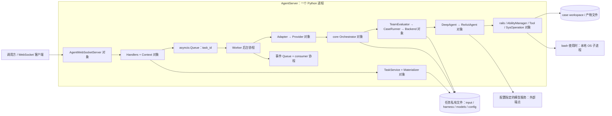
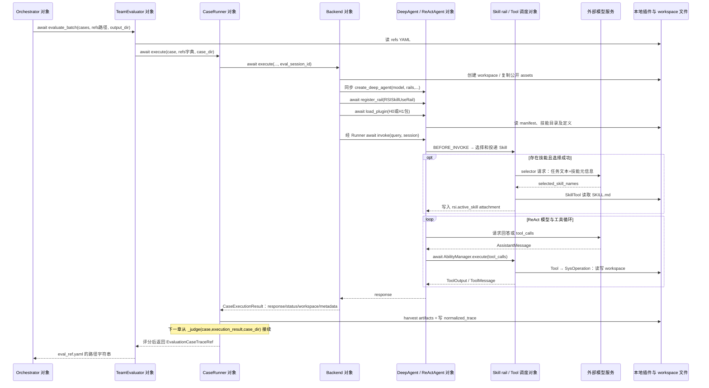
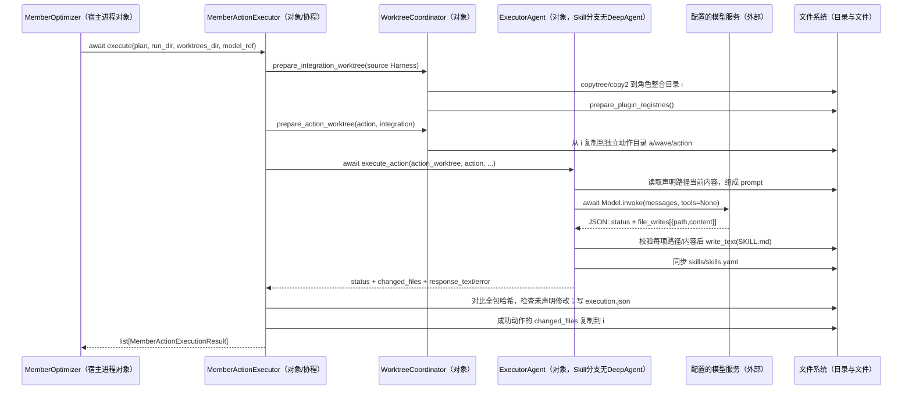

# F01 代码深入分析：组件怎样衔接，Harness 怎样修改并生效

核查日期：2026-09-16。本文完成原 [F01/F08 walkthrough](OPENJIUWEN_F01_F08_CODE_WALKTHROUGH.md) 的 F01 前三轮：A1–A3 执行、A3–A5 评分与改写、A6 验收与安装。代码基线为 agent-core `13d226d91ccc1ff4c041e984fb6aa90de6c5e0ff`、jiuwenswarm `f29c060cee90aef10e46b2a3646fe3628f60ea7c`；源码工作树保持不变。Swarm 声明的 core 依赖为另一个提交，本文的跨仓连接是静态源码映射，未联调这两个版本。[依赖声明](https://gitcode.com/openJiuwen/jiuwenswarm/blob/f29c060cee90aef10e46b2a3646fe3628f60ea7c/pyproject.toml#L20)

**F01 的控制主线在编排器：它拿当前 Harness 执行案例，接收评测引用，再调用分析器、假设编译器和改进器，最后自行决定候选筛选与发布。** 改进器生成的是插件文件；运行 Agent 是否采用它，还要经过单独的安装与加载。每个交接点在后文给出调用方法、输入/输出、文件路径和异常去向。[core 主循环](https://gitcode.com/openJiuwen/agent-core/blob/13d226d91ccc1ff4c041e984fb6aa90de6c5e0ff/openjiuwen/rsi/harness_rsi/single_harness/iterative.py#L216)、[独立安装入口](https://gitcode.com/openJiuwen/jiuwenswarm/blob/f29c060cee90aef10e46b2a3646fe3628f60ea7c/jiuwenswarm/server/rsi/rsi_handlers.py#L209)

本文区分三类依据：**源码控制流**、**仓内测试的预设与断言**、**本轮实际执行的有限局部检查**。未运行真实模型、AgentServer、安装操作或整条优化流程。没有同一次 run 的完整证据时，不把独立测试拼成一次成功演进记录。

## 1. 阅读导航与贯穿案例

| 阅读章节 | 重点 |
|---|---|
| [第2章](OPENJIUWEN_F01_DEEP_DIVE.md?plain=1#L63) | 请求固定、队列与协程、三层请求转换、插件/Skill/工具 |
| [第3章](OPENJIUWEN_F01_DEEP_DIVE.md?plain=1#L333) | 执行证据、Judge、正式分与连续分、Analyzer回读 |
| [第4章](OPENJIUWEN_F01_DEEP_DIVE.md?plain=1#L425) | 诊断契约、Planner、file_writes、注册表、Verifier与candidate |
| [第5章](OPENJIUWEN_F01_DEEP_DIVE.md?plain=1#L658) | 局部/整集筛选、best、发布、热加载、active与继承 |
| [第6章](OPENJIUWEN_F01_DEEP_DIVE.md?plain=1#L869) | 局部验证、未验证边界、数据身份链 |

### 1.1 同一个例子，以及它的证据边界

仍沿用“生成结构化报告，遗漏 `currency`，尝试新增 `schema_check` Skill”的案例。**原型测试只有 `case_a: Create a structured report` 和预设的未校验字段诊断**；销售金额、报告文件、实际工具动作与新 Skill 正文是教学补充。本次还读取了其他独立测试来固定接口预期，它们各自的输入和模型替身会单独说明。[原型测试](https://gitcode.com/openJiuwen/agent-core/blob/13d226d91ccc1ff4c041e984fb6aa90de6c5e0ff/tests/unit_tests/rsi/test_analyzer_optimizer_handoff.py#L32)、[原教学案例](OPENJIUWEN_F01_HARNESS_ITERATION.md)

以下是沿真实数据契约补全的**教学数据集结构**，本次没有提交给服务或创建运行任务：

```json
[
  {
    "case_id": "case_a",
    "input": "读取 orders.json 和 report_schema.json，汇总 amounts，生成 report.json；currency 从当前输入读取，提交前确认落盘报告满足 schema。",
    "assets": ["orders.json", "report_schema.json"],
    "reference": {
      "rubric": [
        "report.json 包含 total、currency，字段及类型满足 report_schema.json。",
        "total 等于 orders.json 中 amounts 的和。"
      ],
      "expected_artifacts": ["report.json"]
    }
  }
]
```

`orders.json` 教学值为 `{"currency":"CNY","amounts":[10,20]}`；schema 要求数值 total 与字符串 currency。H0 假定写出 `{"total":30}`；H1 若有效，应通过重读、校验、修复得到 `{"total":30,"currency":"CNY"}`。数据集的 assets 是相对路径列表，物化时复制；任务 Agent 只取得公共附件与 task input，Judge 另读 reference。`expected_artifacts` 决定要收集的产物，存在这个字段本身不会执行 JSON Schema 校验。[附件协议](https://gitcode.com/openJiuwen/agent-core/blob/13d226d91ccc1ff4c041e984fb6aa90de6c5e0ff/openjiuwen/rsi/harness_rsi/data_loader/case_files.py#L31)、[公共附件投递](https://gitcode.com/openJiuwen/agent-core/blob/13d226d91ccc1ff4c041e984fb6aa90de6c5e0ff/openjiuwen/rsi/harness_rsi/data_loader/case_files.py#L126)、[指定产物收集](https://gitcode.com/openJiuwen/agent-core/blob/13d226d91ccc1ff4c041e984fb6aa90de6c5e0ff/openjiuwen/rsi/harness_rsi/evaluator/case_runner.py#L358)

身份统一规则：本例走 Swarm 默认单包创建入口，Harness refs 的角色键为 `validation_harness`；原型单测的 `solver` 保留为测试原值。源码没有把前者自动改名为后者。后文展示原测试时会保留 solver；展示本例生产接口的教学计划时使用 validation_harness，不能把二者误接成同一次运行。[物化默认角色](https://gitcode.com/openJiuwen/jiuwenswarm/blob/f29c060cee90aef10e46b2a3646fe3628f60ea7c/jiuwenswarm/agents/harness/common/rsi/materializer.py#L182)、[角色原样读取](https://gitcode.com/openJiuwen/agent-core/blob/13d226d91ccc1ff4c041e984fb6aa90de6c5e0ff/openjiuwen/rsi/harness_rsi/member_optimizer/loader.py#L282)

### 1.2 先看全部组件交接，再展开每条边

| 阶段 | 调用者 → 接收者 | 最重要的交接物 |
|---|---|---|
| 固定输入 | Handlers → TaskService → Materializer/ModelResolver | task_id、私有数据集/Harness快照、三份模型配置、profile |
| 启动 | TaskService → Worker task_id队列 → 后台执行Task | CREATED→QUEUED→RUNNING；另有EngineEvent队列 |
| 进入core | Worker → HarnessEngineAdapter → HarnessProvider → Orchestrator | RsiTaskView→HarnessEngineRequest→IterativeSingleHarnessRequest；Provider加载profile |
| 执行与评分 | Orchestrator → TeamEvaluator → CaseRunner → Backend / Judger | refs路径→角色字典→DeepAgent；执行结果→产物/轨迹→JudgeResult→eval_ref路径 |
| 诊断与编译 | Orchestrator → Analyzer；随后调用假设编译函数 | eval_ref→issues/analysis_ref→optimization_hypotheses.yaml |
| 改写文件 | Orchestrator → MemberOptimizer → Planner / Executor / Verifier | 假设→plan→模型file_writes→动作副本/整合副本→candidate refs |
| 验收 | Orchestrator → 同一套Evaluator；读取分数及使用证据 | 局部gate→provisional→full筛选→必要时selected_full→best |
| 发布与回传 | Orchestrator复制best；Provider读state；Worker更新任务 | published_harness_refs_path、publication_status、EngineResult；事件另走队列 |
| 安装 | 另一次install请求 → Installer → AgentManager → facade → DeepAdapter | 发布包→独立安装副本→instance.load_plugin→active/history |
| 后续继承 | 新Agent初始化 / 新建优化Task分别读取active | 一个加载运行包；另一个重新冻结成任务私有baseline |

这张表的每条边都在第2–5章展开。最容易遗漏的是：Analyzer 和 Optimizer 大量返回**引用文件的路径**，由编排器读回；它们不是各自运行完后自行调用下一组件。Skill 的 `file_writes` 是模型响应数据，真正写磁盘的是 Executor 的 Python 代码。[分析后调用改进器](https://gitcode.com/openJiuwen/agent-core/blob/13d226d91ccc1ff4c041e984fb6aa90de6c5e0ff/openjiuwen/rsi/harness_rsi/single_harness/iterative.py#L450)、[实际文件写入](https://gitcode.com/openJiuwen/agent-core/blob/13d226d91ccc1ff4c041e984fb6aa90de6c5e0ff/openjiuwen/rsi/harness_rsi/member_optimizer/action_executor.py#L868)

## 2. 第一轮：A1–A3 请求、装配与Harness执行

### 2.1 先固定本章要跟踪的任务

贯穿教学任务是“读取销售数据，生成 `report.json`，必填字段包含 `currency`”。假设 H0 生成的报告缺 `currency`，之后尝试新增 `schema_check` Skill。`currency`、销售数据、具体工具轨迹不是仓库内一次真实演进的运行结果。真实 handoff 测试使用 `case_a` / `Create a structured report`，预设的要求是生成结构化产物后重新打开并对照 schema；其计划确实指向 `skills/schema_check/SKILL.md`。这提供机制原型，不提供端到端效果证明。[handoff 测试](https://gitcode.com/openJiuwen/agent-core/blob/13d226d91ccc1ff4c041e984fb6aa90de6c5e0ff/tests/unit_tests/rsi/test_analyzer_optimizer_handoff.py#L32)

为了让调用链具体，本章使用如下**教学请求轮廓**；数据文件和模型 ID 需由真实环境提供，不能直接当作已运行的命令：

```json
{
  "req_method": "rsi.task.create",
  "params": {
    "scenario": "HARNESS",
    "name": "report-schema-check",
    "input_file": "<已准备的数据集路径>",
    "model_refs": {
      "tester": "<models.list 中的被评测模型引用>",
      "optimizer": "<models.list 中的分析和改写模型引用>"
    },
    "max_iterations": 1,
    "training_options": {
      "evaluation_method": "llm_as_judge",
      "batch_size": 1
    }
  }
}
```

`rsi.task.create` 要求 HARNESS 场景同时提供 tester、optimizer 和数据集，且不接受 `optimization_instruction`。本例显式选 `llm_as_judge`；真实 API 默认是 `script-based`。`training_options` 中字段也可以放在顶层，同名时顶层优先。`execution_mode` 默认 local，当前适配拒绝其他模式。[请求校验](https://gitcode.com/openJiuwen/jiuwenswarm/blob/f29c060cee90aef10e46b2a3646fe3628f60ea7c/jiuwenswarm/agents/harness/common/rsi/services.py#L124)、[参数优先级与默认值](https://gitcode.com/openJiuwen/jiuwenswarm/blob/f29c060cee90aef10e46b2a3646fe3628f60ea7c/jiuwenswarm/agents/harness/common/rsi/services.py#L843)

### 2.2 这些组件是什么运行实体，谁装配它们

本例从 AgentServer 开始，到优化编排器、Evaluator、DeepAgent 都是**同一 Python 进程中的对象**。Worker 中的 Task 指 `asyncio.Task`，不是独立 OS 进程、远程 actor 或 Ray actor。模型端点是进程外依赖；只有调用 shell 工具时才可能创建本地子进程。generic local 路径不要求 Docker；SWE-bench 的容器分支是另一路，本例不经过它。[Worker 创建 Task](https://gitcode.com/openJiuwen/jiuwenswarm/blob/f29c060cee90aef10e46b2a3646fe3628f60ea7c/jiuwenswarm/agents/harness/common/rsi/worker.py#L198)、[local backend 分支](https://gitcode.com/openJiuwen/agent-core/blob/13d226d91ccc1ff4c041e984fb6aa90de6c5e0ff/openjiuwen/rsi/harness_rsi/evaluator/case_backend.py#L140)、[本地 shell 创建子进程](https://gitcode.com/openJiuwen/agent-core/blob/13d226d91ccc1ff4c041e984fb6aa90de6c5e0ff/openjiuwen/core/sys_operation/local/shell_operation.py#L333)

| 对象或运行实体 | 谁创建、何时创建 | 实際持有和传给谁 |
|---|---|---|
| `RsiServiceContext` 对象 | `AgentWebSocketServer._get_rsi_handlers()` 首次收到 RSI 请求时懒创建，后续复用 | 创建 store、worker、projector、artifact service、task service；把同一个 store 交给 Worker 和 TaskService。`context.adapters` 就是 `worker.adapters` 的同一个字典。[装配](https://gitcode.com/openJiuwen/jiuwenswarm/blob/f29c060cee90aef10e46b2a3646fe3628f60ea7c/jiuwenswarm/agents/harness/common/rsi/context.py#L49) |
| `RsiTaskMaterializer`、`RsiModelConfigResolver` 对象 | `build_rsi_service_context(...enable_harness_materialization=True)` 创建 | 注入 TaskService；ModelResolver 同实例也传给 Provider。任务输入固定发生在 create 中。[组合根](https://gitcode.com/openJiuwen/jiuwenswarm/blob/f29c060cee90aef10e46b2a3646fe3628f60ea7c/jiuwenswarm/agents/harness/common/rsi/context.py#L270) |
| `HarnessProvider` 与 `HarnessEngineAdapter` 对象 | real 模式下 AgentServer 创建 Provider；Context 用 Adapter 包装并注册为 `HARNESS` | Adapter 持有 `provider`；Worker 按 task.scenario 从字典拿同一个 Adapter。默认模式 real，环境可显式选择 mock。[模式与注册](https://gitcode.com/openJiuwen/jiuwenswarm/blob/f29c060cee90aef10e46b2a3646fe3628f60ea7c/jiuwenswarm/server/agent_ws_server.py#L10536)、[包装](https://gitcode.com/openJiuwen/jiuwenswarm/blob/f29c060cee90aef10e46b2a3646fe3628f60ea7c/jiuwenswarm/agents/harness/common/rsi/context.py#L219) |
| `RsiAgentServerHandlers` 对象 | 同一懒创建过程 | 持有 Context；绑定 `harness_refs_provider` 回调到 TaskService、状态与进度推送回调；执行 workspace 恢复，但恢复不自动重新入队。[构造](https://gitcode.com/openJiuwen/jiuwenswarm/blob/f29c060cee90aef10e46b2a3646fe3628f60ea7c/jiuwenswarm/server/rsi/rsi_handlers.py#L52) |
| `SingleHarnessIterativeOptimizationOrchestrator` 对象 | Provider 每次 `_resolve_orchestrator(request)` 根据 task profile 创建；测试可直接注入对象 | 构造 `TeamEvaluator`、`EvaluationResultAnalyzer`、`MemberOptimizer`、`DataLoader`。这些名字都是对象，不对应四个服务进程。[Provider 工厂](https://gitcode.com/openJiuwen/jiuwenswarm/blob/f29c060cee90aef10e46b2a3646fe3628f60ea7c/jiuwenswarm/agents/harness/common/rsi/harness_provider.py#L396)、[core 构造](https://gitcode.com/openJiuwen/agent-core/blob/13d226d91ccc1ff4c041e984fb6aa90de6c5e0ff/openjiuwen/rsi/harness_rsi/single_harness/iterative.py#L141) |
| `CaseRunner`、`SingleHarnessExecutionBackend` 对象 | `TeamEvaluator._make_case_runner()` 调用 backend 工厂，再把 backend 和 judger 注入 CaseRunner | backend 执行，CaseRunner 收集产物并评分。`TeamEvaluator` 的历史名字不表示本例运行多 Agent Team，当前 backend registry 只有 single_harness。[创建](https://gitcode.com/openJiuwen/agent-core/blob/13d226d91ccc1ff4c041e984fb6aa90de6c5e0ff/openjiuwen/rsi/harness_rsi/evaluator/team_evaluator.py#L67)、[registry](https://gitcode.com/openJiuwen/agent-core/blob/13d226d91ccc1ff4c041e984fb6aa90de6c5e0ff/openjiuwen/rsi/harness_rsi/evaluator/case_backend.py#L694) |
| `DeepAgent`、内部 `ReActAgent`、rails、tools 对象 | backend 每次执行 case 创建 DeepAgent；工厂装配其运行组件 | DeepAgent 持有内部 ReActAgent；rails 在生命周期/工具调用前后介入；AbilityManager 通过进程全局 `Runner.resource_mgr` 找实际 Tool 实例。[创建 Agent](https://gitcode.com/openJiuwen/agent-core/blob/13d226d91ccc1ff4c041e984fb6aa90de6c5e0ff/openjiuwen/rsi/harness_rsi/evaluator/case_backend.py#L185)、[工具调度](https://gitcode.com/openJiuwen/agent-core/blob/13d226d91ccc1ff4c041e984fb6aa90de6c5e0ff/openjiuwen/core/single_agent/ability_manager.py#L1386) |



### 2.3 A1：create 固定输入，start 交给后台执行

#### 2.3.1 WebSocket 请求怎样到 TaskService

AgentServer 的 `_handle_rsi_request` 先拿 handlers，再调用并 `await handle_async(request)`。后者根据 `_METHOD_DISPATCH` 找 `_do_task_create`；它先执行普通同步调用 `context.task_service.create(params)`。所以“外层 handler 是 async”不等于物化工作已经卸载到线程：这里没有 `to_thread`；文件复制和 YAML/JSON 写入直接在当前调用中执行。返回值是 `{ok:true,payload:{task_id,status:"CREATED"}}`，AgentServer 把它包装为 `AgentResponse` 后在 send lock 内发送。[传输入口](https://gitcode.com/openJiuwen/jiuwenswarm/blob/f29c060cee90aef10e46b2a3646fe3628f60ea7c/jiuwenswarm/server/agent_ws_server.py#L10476)、[实际 dispatch](https://gitcode.com/openJiuwen/jiuwenswarm/blob/f29c060cee90aef10e46b2a3646fe3628f60ea7c/jiuwenswarm/server/rsi/rsi_handlers.py#L104)、[create handler](https://gitcode.com/openJiuwen/jiuwenswarm/blob/f29c060cee90aef10e46b2a3646fe3628f60ea7c/jiuwenswarm/server/rsi/rsi_handlers.py#L146)

`request_id` 用于这次传输响应；`task_id` 是长期优化任务身份；`request.session_id` 被放入 `_rsi_session_id`，持久化为 `task.config.rsi_session_id`，用于后续事件推送路由。它不是后面每次评测产生的 `eval_<case_id>_<uuid>` 会话。[会话转存](https://gitcode.com/openJiuwen/jiuwenswarm/blob/f29c060cee90aef10e46b2a3646fe3628f60ea7c/jiuwenswarm/server/rsi/rsi_handlers.py#L120)、[持久化](https://gitcode.com/openJiuwen/jiuwenswarm/blob/f29c060cee90aef10e46b2a3646fe3628f60ea7c/jiuwenswarm/agents/harness/common/rsi/services.py#L296)

#### 2.3.2 源 Harness 何时选定，复制了哪些内容

TaskService 先解析 source，再调用 materializer；不是到第一次 Agent 执行时才读取全局 active 指针。正常浏览器可用 `package_id` 选已安装插件；未指定时，AgentServer 的 provider 依次尝试 RSI active runtime、`initial_harness_refs.yaml`、generic registry（含 legacy harness_id 路径）和 native baseline。显式 package_id 不会静默改用 H0，并拒绝带 MCP 依赖的插件。TaskService 还允许受控调用/测试传 `harness_path`，这不等于普通 UI 暴露任意路径选择器。[源选择](https://gitcode.com/openJiuwen/jiuwenswarm/blob/f29c060cee90aef10e46b2a3646fe3628f60ea7c/jiuwenswarm/agents/harness/common/rsi/services.py#L333)、[package/active](https://gitcode.com/openJiuwen/jiuwenswarm/blob/f29c060cee90aef10e46b2a3646fe3628f60ea7c/jiuwenswarm/server/agent_ws_server.py#L10594)、[fallback](https://gitcode.com/openJiuwen/jiuwenswarm/blob/f29c060cee90aef10e46b2a3646fe3628f60ea7c/jiuwenswarm/server/agent_ws_server.py#L10634)

令 `T = <用户 workspace>/rsi/tasks/<task_id>`。源码定义的物化与消费者如下；路径中的 `<...>` 是占位符：

| 创建阶段写出的文件 | 写入者与内容 | 后续谁读 |
|---|---|---|
| `T/input/cases.json`，或保留源文件名的数据集 | `materialize_dataset` 规范化或 copy2 数据集，并通过 `copy_dataset_files` 复制引用附件，再验证 task-local 数据。[实现](https://gitcode.com/openJiuwen/jiuwenswarm/blob/f29c060cee90aef10e46b2a3646fe3628f60ea7c/jiuwenswarm/agents/harness/common/rsi/materializer.py#L108) | Adapter 把此路径放入 `dataset_files`；core load_cases/DataLoader 读取。 |
| `T/harness/versions/baseline-<hash16>/<包目录>` | `materialize_harness_refs` 验证源包并复制；目录源校验复制后的 hash。[实现](https://gitcode.com/openJiuwen/jiuwenswarm/blob/f29c060cee90aef10e46b2a3646fe3628f60ea7c/jiuwenswarm/agents/harness/common/rsi/materializer.py#L177) | 后续 backend 的 `agent.load_plugin(harness_path)` 读取这份包，而不是全局 active 原目录。 |
| `T/harness/harness_refs.yaml` | 写 `harness_refs: {validation_harness: <任务私有包绝对路径>}`；这是引用包装文件，不是 Skill 内容。[写入](https://gitcode.com/openJiuwen/jiuwenswarm/blob/f29c060cee90aef10e46b2a3646fe3628f60ea7c/jiuwenswarm/agents/harness/common/rsi/materializer.py#L231) | TeamEvaluator 读 YAML 为 `dict[str,str]`，backend 取唯一 role/path。 |
| `T/models/evaluation.yaml`、`analysis.yaml`、`member_optimization.yaml` | Resolver 按配置模型 ID 输出 core 可读配置；tester→evaluation，optimizer→另外两份。这是推理配置文件，没有权重更新。[映射](https://gitcode.com/openJiuwen/jiuwenswarm/blob/f29c060cee90aef10e46b2a3646fe3628f60ea7c/jiuwenswarm/agents/harness/common/rsi/materializer.py#L396)、[resolver](https://gitcode.com/openJiuwen/jiuwenswarm/blob/f29c060cee90aef10e46b2a3646fe3628f60ea7c/jiuwenswarm/agents/harness/common/rsi/model_resolver.py#L147) | 被评测 Agent 用 evaluation；分析/改写组件读各自配置；本例 LLM Judge 明确用 analysis。 |
| `T/config/harness_orchestrator.yaml` | 写 backend、评分方法、模型配置路径、batch/epoch 和优化约束，立即调用安装环境中的 core 配置加载器校验。[profile](https://gitcode.com/openJiuwen/jiuwenswarm/blob/f29c060cee90aef10e46b2a3646fe3628f60ea7c/jiuwenswarm/agents/harness/common/rsi/materializer.py#L278) | Provider `_build_config` 加载成 `AutoCoordinatingHarnessConfig`。 |
| `T/task.json` 及 `T/run/` | 上述步骤成功后 TaskService 才提交 `RsiTask`，配置内保存 `rsi_materials` manifest/hash 等。[提交](https://gitcode.com/openJiuwen/jiuwenswarm/blob/f29c060cee90aef10e46b2a3646fe3628f60ea7c/jiuwenswarm/agents/harness/common/rsi/services.py#L283) | Worker 从 store 读 RsiTaskView；run 是编排器产物根目录。 |

物化失败发生在 `task.json` 提交之前，TaskService 会移除未提交任务目录后重抛。运行前 Provider 再验证材料路径和 hash；因此“创建后换掉原始数据/active Harness”与“篡改任务私有输入”是不同情况，前者不会自动替换任务基线，后者可能被一致性校验拒绝。[失败清理](https://gitcode.com/openJiuwen/jiuwenswarm/blob/f29c060cee90aef10e46b2a3646fe3628f60ea7c/jiuwenswarm/agents/harness/common/rsi/services.py#L235)、[运行前检查](https://gitcode.com/openJiuwen/jiuwenswarm/blob/f29c060cee90aef10e46b2a3646fe3628f60ea7c/jiuwenswarm/agents/harness/common/rsi/harness_provider.py#L210)

#### 2.3.3 start 返回时，优化还没有完成

另一条 `rsi.training.start` 请求只带 `task_id`。TaskService 同步调用 `worker.enqueue`，将 CREATED 改为 QUEUED、`put_nowait(task_id)`，创建或复用 `_run_loop` 后立即返回 QUEUED。队列循环取得 ID 后才改为 RUNNING，并创建 `_run_until_slot_free` Task；该 Task 再创建 `_execute_task` Task。[start](https://gitcode.com/openJiuwen/jiuwenswarm/blob/f29c060cee90aef10e46b2a3646fe3628f60ea7c/jiuwenswarm/agents/harness/common/rsi/services.py#L458)、[入队](https://gitcode.com/openJiuwen/jiuwenswarm/blob/f29c060cee90aef10e46b2a3646fe3628f60ea7c/jiuwenswarm/agents/harness/common/rsi/worker.py#L91)、[两层 Task](https://gitcode.com/openJiuwen/jiuwenswarm/blob/f29c060cee90aef10e46b2a3646fe3628f60ea7c/jiuwenswarm/agents/harness/common/rsi/worker.py#L212)

`_execute_task` 创建另一条容量 128 的**事件队列**及 `consume_queue` Task，将 `_sink(queue)` 作为 `on_event` 回调传给 Adapter。不要把它与保存 task_id 的任务队列混淆：前者装 `EngineEvent`，用于 usage/tree/progress；后者安排优化任务。最终结果在 Adapter await 返回后被转成任务状态，再持久化。[事件与执行装配](https://gitcode.com/openJiuwen/jiuwenswarm/blob/f29c060cee90aef10e46b2a3646fe3628f60ea7c/jiuwenswarm/agents/harness/common/rsi/worker.py#L288)、[事件 sink](https://gitcode.com/openJiuwen/jiuwenswarm/blob/f29c060cee90aef10e46b2a3646fe3628f60ea7c/jiuwenswarm/agents/harness/common/rsi/worker.py#L810)

### 2.4 A2：三种请求/配置对象如何交接

| 调用边 | 方式 | 输入→输出/下一层 |
|---|---|---|
| Worker→`adapter.build_request(task_view)` | 普通同步方法 | `RsiTaskView`→冻结 dataclass `HarnessEngineRequest`。`input_file`→单元素 tuple `dataset_files`；config refs/profile→对应字段；run_dir→output_dir；保留 task_id/model_refs/max_iterations。[定义与转换](https://gitcode.com/openJiuwen/jiuwenswarm/blob/f29c060cee90aef10e46b2a3646fe3628f60ea7c/jiuwenswarm/agents/harness/common/rsi/harness_adapter.py#L27) |
| Worker→`adapter.run(request,on_event)`→`provider.run` | 两层 `await`，同进程 | Adapter 不执行算法，仅转发同一个 request 和回调。[转发](https://gitcode.com/openJiuwen/jiuwenswarm/blob/f29c060cee90aef10e46b2a3646fe3628f60ea7c/jiuwenswarm/agents/harness/common/rsi/harness_adapter.py#L137) |
| Provider→`_build_config`→Orchestrator 构造 | 同步装配 | task profile 优先；已物化 profile 不再用公共模型 ID 覆写。`max_iterations` 已在 profile 映射为 `max_epochs`，不是靠 engine request 的 Agent step 参数传入。[加载](https://gitcode.com/openJiuwen/jiuwenswarm/blob/f29c060cee90aef10e46b2a3646fe3628f60ea7c/jiuwenswarm/agents/harness/common/rsi/harness_provider.py#L402)、[epoch 写入](https://gitcode.com/openJiuwen/jiuwenswarm/blob/f29c060cee90aef10e46b2a3646fe3628f60ea7c/jiuwenswarm/agents/harness/common/rsi/materializer.py#L410) |
| Provider→`orchestrator.run(engine_request)` | `await` | 把 tuple 转 list，构造 `IterativeSingleHarnessRequest(dataset_files,harness_refs_path,output_dir,dataset_id,resume,auto_full_baseline,task_id)`。新任务将 auto_full_baseline 设 True；core dataclass 自身默认 False，不能混用这两个入口的默认行为。[转换](https://gitcode.com/openJiuwen/jiuwenswarm/blob/f29c060cee90aef10e46b2a3646fe3628f60ea7c/jiuwenswarm/agents/harness/common/rsi/harness_provider.py#L203)、[core 定义](https://gitcode.com/openJiuwen/agent-core/blob/13d226d91ccc1ff4c041e984fb6aa90de6c5e0ff/openjiuwen/rsi/harness_rsi/single_harness/iterative.py#L94) |
| Orchestrator→Provider→Worker | await 返回后读取状态文件 | core 返回 `IterativeSingleHarnessResult`；当前 Provider 没使用其返回对象，而是 `_result_from_state(task_id)` 从 run 状态重建 `EngineResult`，Worker `_apply_result_status` 将其映射为任务终态。[Provider 返回](https://gitcode.com/openJiuwen/jiuwenswarm/blob/f29c060cee90aef10e46b2a3646fe3628f60ea7c/jiuwenswarm/agents/harness/common/rsi/harness_provider.py#L237)、[状态映射](https://gitcode.com/openJiuwen/jiuwenswarm/blob/f29c060cee90aef10e46b2a3646fe3628f60ea7c/jiuwenswarm/agents/harness/common/rsi/worker.py#L451) |

在教学任务中 tester 是写报告的模型；optimizer 是诊断/规划/生成 Skill 的模型。名称 tester 很容易被误读为专门“打分的模型”，实际不是：backend 从 `evaluator.model_config_ref` 加载它创建 DeepAgent。选 `llm_as_judge` 时，profile 将 `judge_model_config_ref` 指向 analysis，也就是 optimizer 对应配置，并将 judge_success_score 设为 0.8。[执行模型加载](https://gitcode.com/openJiuwen/agent-core/blob/13d226d91ccc1ff4c041e984fb6aa90de6c5e0ff/openjiuwen/rsi/harness_rsi/evaluator/case_backend.py#L173)、[Judge 配置](https://gitcode.com/openJiuwen/jiuwenswarm/blob/f29c060cee90aef10e46b2a3646fe3628f60ea7c/jiuwenswarm/agents/harness/common/rsi/materializer.py#L332)

#### 2.4.1 run、epoch、batch、Agent iteration 是四种粒度

**run** 是 task 的一次完整优化执行，状态文件为 `run/single_harness_state.yaml`。它先读全部 cases，核对协议/fingerprint，并按生产入口要求全量执行一次 H0，输出到 `run/evaluations/frozen_baseline`。[初始化与 H0](https://gitcode.com/openJiuwen/agent-core/blob/13d226d91ccc1ff4c041e984fb6aa90de6c5e0ff/openjiuwen/rsi/harness_rsi/single_harness/iterative.py#L216)

**epoch** 是一整轮优化；请求的公共 max_iterations 控制它，代码明确一轮不是模型的一步。每个 epoch 从 best refs 起步，DataLoader 的 `load_files(...epoch=epoch)` 计划 batch；**batch** 是本轮一组案例，可能先过滤已有匹配版本证据中的通过项，过滤后为空则记 skipped。非空 batch 使用 `run/evaluations/e001/b001/source` 一类路径进行源评测/复用，再进入分析和改写。epoch 结束的全量检查不等同于这个 batch 的检查。[epoch/batch](https://gitcode.com/openJiuwen/agent-core/blob/13d226d91ccc1ff4c041e984fb6aa90de6c5e0ff/openjiuwen/rsi/harness_rsi/single_harness/iterative.py#L310)、[source 路径](https://gitcode.com/openJiuwen/agent-core/blob/13d226d91ccc1ff4c041e984fb6aa90de6c5e0ff/openjiuwen/rsi/harness_rsi/single_harness/iterative.py#L396)

**Agent iteration** 是一次 case 内部的 ReAct 循环步。backend 对 DeepAgent 显式设置 `enable_task_loop=False,max_iterations=100`；关闭的是 DeepAgent 外层 task loop，不是关闭内部“模型→工具→模型”循环。本例 max_iterations=1 的 RSI run 仍可让被评测 Agent 执行多次模型/工具调用。[backend 参数](https://gitcode.com/openJiuwen/agent-core/blob/13d226d91ccc1ff4c041e984fb6aa90de6c5e0ff/openjiuwen/rsi/harness_rsi/evaluator/case_backend.py#L185)、[DeepAgent 单轮分支](https://gitcode.com/openJiuwen/agent-core/blob/13d226d91ccc1ff4c041e984fb6aa90de6c5e0ff/openjiuwen/harness/deep_agent.py#L3045)、[内部 ReAct 循环](https://gitcode.com/openJiuwen/agent-core/blob/13d226d91ccc1ff4c041e984fb6aa90de6c5e0ff/openjiuwen/core/single_agent/agents/react_agent.py#L2766)

### 2.5 A3：Harness 文件怎样接到真实 Agent 和工具

#### 2.5.1 Orchestrator 并不直接调用 DeepAgent

`Orchestrator._evaluate` 把 cases、当前 refs 文件、output_dir 交给 `TeamEvaluator.evaluate_batch`，并明确 `team_skill_ref_path=""`。Evaluator 先加载 refs 文件为字典，逐个把深拷贝 case/refs 交给 `CaseRunner.execute`。CaseRunner 生成评测专用 session_id、绑定 case-local home，然后调用 backend。接口调用不是靠文件轮询触发；文件承载的是输入包和持久化结果。[编排器交接](https://gitcode.com/openJiuwen/agent-core/blob/13d226d91ccc1ff4c041e984fb6aa90de6c5e0ff/openjiuwen/rsi/harness_rsi/single_harness/iterative.py#L1115)、[Evaluator 交接](https://gitcode.com/openJiuwen/agent-core/blob/13d226d91ccc1ff4c041e984fb6aa90de6c5e0ff/openjiuwen/rsi/harness_rsi/evaluator/team_evaluator.py#L138)、[CaseRunner 交接](https://gitcode.com/openJiuwen/agent-core/blob/13d226d91ccc1ff4c041e984fb6aa90de6c5e0ff/openjiuwen/rsi/harness_rsi/evaluator/case_runner.py#L92)

Evaluator 默认一次评测 case_concurrency=1；调用方指定大于 1 时，它创建多个 asyncio Task，用 Semaphore 限流，并按输入顺序 gather 结果。并发分支会创建相应 CaseRunner/backend 对象，共享 context-isolated trajectory processor；没有因此创建进程池。短暂基础设施/网络错误可按 transient_case_retry_limit 重跑，profile 默认该值为 2。[并发和重试](https://gitcode.com/openJiuwen/agent-core/blob/13d226d91ccc1ff4c041e984fb6aa90de6c5e0ff/openjiuwen/rsi/harness_rsi/evaluator/team_evaluator.py#L162)

#### 2.5.2 backend 依次准备 workspace、模型、rails、插件

以下顺序很关键：**先有能使用技能的宿主 rail，再加载 H0/H1 中的技能文件**。

1. backend 从唯一 refs 项取 `role_name=validation_harness` 和包路径；普通任务创建 `<case_dir>/workspace`，有 `workspace_source_dir` 时复制源 workspace，再复制公开 assets。实际输入通过 `task_input(case)` 派生为 query。[准备](https://gitcode.com/openJiuwen/agent-core/blob/13d226d91ccc1ff4c041e984fb6aa90de6c5e0ff/openjiuwen/rsi/harness_rsi/evaluator/case_backend.py#L133)、[workspace 分支](https://gitcode.com/openJiuwen/agent-core/blob/13d226d91ccc1ff4c041e984fb6aa90de6c5e0ff/openjiuwen/rsi/harness_rsi/evaluator/case_backend.py#L455)
2. `_single_harness_rails` 创建 `RSISysOperationRail`、reliability rail、`HarnessInputRail`、`RSISkillUseRail`。普通路径没有 controlled-skill 配置时不注入指定 Skill；空 H0 也有 SkillUseRail，但它本身不凭空增加 schema_check。[rails](https://gitcode.com/openJiuwen/agent-core/blob/13d226d91ccc1ff4c041e984fb6aa90de6c5e0ff/openjiuwen/rsi/harness_rsi/evaluator/case_backend.py#L331)
3. 同步 `create_deep_agent` 创建对象。RSISkillUseRail 先从 factory 的 rails 参数排除，然后 backend 显式 `await agent.register_rail(rail)`，使它在 plugin discovery 前获得 SysOperation 等依赖。`register_rail` 将 deep_config 中的 operation/workspace 设置到 rail，执行 init 后注册回调。[注册顺序](https://gitcode.com/openJiuwen/agent-core/blob/13d226d91ccc1ff4c041e984fb6aa90de6c5e0ff/openjiuwen/rsi/harness_rsi/evaluator/case_backend.py#L204)、[注册内部](https://gitcode.com/openJiuwen/agent-core/blob/13d226d91ccc1ff4c041e984fb6aa90de6c5e0ff/openjiuwen/harness/deep_agent.py#L1929)
4. `await agent.load_plugin(harness_path)` 依次 `find_plugin_manifest`→`load_plugin_package`→`resolve_plugin_parts`→`_apply_extension_parts`。支持 manifest.json 及 legacy harness YAML；resolver 生成实际工具、rails、prompt sections、skills，不生成 subagent。[load_plugin](https://gitcode.com/openJiuwen/agent-core/blob/13d226d91ccc1ff4c041e984fb6aa90de6c5e0ff/openjiuwen/harness/deep_agent.py#L1986)、[resolver](https://gitcode.com/openJiuwen/agent-core/blob/13d226d91ccc1ff4c041e984fb6aa90de6c5e0ff/openjiuwen/harness/resources/extension_resolver.py#L103)
5. `apply_extension_hot` 按 tools、MCP、rails、prompt sections、skills 的顺序绑定；失败会反向撤销本次已绑定资源。Skill `_bind_skill` 找已有 SkillUseRail，更新技能 roots、清缓存并 `await reload_skills()`，成功后才提交 config.skills；找不到 rail 会抛错。[binder 顺序](https://gitcode.com/openJiuwen/agent-core/blob/13d226d91ccc1ff4c041e984fb6aa90de6c5e0ff/openjiuwen/harness/extension_binder.py#L27)、[skill binder](https://gitcode.com/openJiuwen/agent-core/blob/13d226d91ccc1ff4c041e984fb6aa90de6c5e0ff/openjiuwen/harness/extension_binder.py#L210)
6. backend 设置 Skill rail 的 selector 模型为同一个被评测 model，开启 task-start trigger，挂 TrajectoryRail，再 `await run_agent_with_empty_response_recovery(agent,{"query":...},session_id)`。[启动前装配](https://gitcode.com/openJiuwen/agent-core/blob/13d226d91ccc1ff4c041e984fb6aa90de6c5e0ff/openjiuwen/rsi/harness_rsi/evaluator/case_backend.py#L217)

`HarnessInputRail` 拦截已识别的向当前插件包写入的工具操作，提示把交付物写到 workspace；编排器评测前后还比较材料身份。这解释了两个写操作的区别：Agent 写的是本次报告产物；后续优化器写的是另一份 candidate Harness 文件，不能把 report.json 的修复当成持久改进已经完成。[输入包保护](https://gitcode.com/openJiuwen/agent-core/blob/13d226d91ccc1ff4c041e984fb6aa90de6c5e0ff/openjiuwen/rsi/harness_rsi/evaluator/harness_input_rail.py#L14)、[评测前后检查](https://gitcode.com/openJiuwen/agent-core/blob/13d226d91ccc1ff4c041e984fb6aa90de6c5e0ff/openjiuwen/rsi/harness_rsi/single_harness/iterative.py#L1123)

#### 2.5.3 空 H0 为什么也能读写文件，H1 的新 Skill 如何生效

`read_file`、`write_file`、`edit_file`、glob、list_dir、grep、bash 来自 **RSISysOperationRail 对宿主工具的注册**，不要求 H0 包里定义这些工具。rail 创建对应 Tool 对象，调用 `agent.ability_manager.add_ability(tool.card,tool)`；工厂默认以 LOCAL 模式创建 SysOperation，并注册在进程全局 Runner.resource_mgr。普通评测显式 `restrict_to_work_dir=False`，所以 workspace 是工作位置，不等于 OS 沙箱。[工具列表](https://gitcode.com/openJiuwen/agent-core/blob/13d226d91ccc1ff4c041e984fb6aa90de6c5e0ff/openjiuwen/rsi/harness_rsi/evaluator/runtime_adapters.py#L73)、[LOCAL operation](https://gitcode.com/openJiuwen/agent-core/blob/13d226d91ccc1ff4c041e984fb6aa90de6c5e0ff/openjiuwen/harness/factory.py#L269)

当 H1 真正包含 schema_check 时，执行并不是 Python 编排器硬编码“每次写完 report.json 后必须运行 schema_check”。在本条 RSI 评测链，`DeepAgent.invoke` 的 BEFORE_INVOKE 生命周期触发 `RSISkillUseRail.before_invoke`：

| 实际衔接 | 输入与输出 | 对本例的含义 |
|---|---|---|
| `_trigger_relevant_skill`→`ListSkillTool.invoke` | query + 可用 Skill 元信息→`selected_skill_names` | 选择器可能选 schema_check，也可能没有相关技能；不是保证选择。[选择](https://gitcode.com/openJiuwen/agent-core/blob/13d226d91ccc1ff4c041e984fb6aa90de6c5e0ff/openjiuwen/rsi/harness_rsi/evaluator/runtime_adapters.py#L237) |
| rail→`SkillTool.invoke` | `{skill_name:首个选中项,relative_file_path:"SKILL.md"}`→`skill_content` | 读候选包中的文件；这个 task-start 调用是 rail 主动调用 Tool 对象，不是 Agent 模型发出的普通 tool_call。[读取](https://gitcode.com/openJiuwen/agent-core/blob/13d226d91ccc1ff4c041e984fb6aa90de6c5e0ff/openjiuwen/rsi/harness_rsi/evaluator/runtime_adapters.py#L285) |
| rail→`after_tool_call`→attachment writer | 从 Skill 正文提取 decision capsule；没有则用全正文；加 `rsi.active_skill` prompt attachment | 把“重读产物→对照 schema→修复”的约束加入本次推理上下文；记录内容 hash 和投递方式，AFTER_INVOKE 清除本次 attachment。[附件写入](https://gitcode.com/openJiuwen/agent-core/blob/13d226d91ccc1ff4c041e984fb6aa90de6c5e0ff/openjiuwen/rsi/harness_rsi/evaluator/runtime_adapters.py#L158) |
| DeepAgent→内部 ReActAgent | await 内部 invoke | 由模型继续决定 read/write/bash 的实际调用；Skill 已加载/已投递不等于模型执行正确，更不等于评分通过。[单轮调用](https://gitcode.com/openJiuwen/agent-core/blob/13d226d91ccc1ff4c041e984fb6aa90de6c5e0ff/openjiuwen/harness/deep_agent.py#L2258) |

真实测试 `test_empty_baseline_supports_candidate_skill_through_native_plugin_loader` 创建空 H0 与带 verify_patch 的 H1，使用真实 plugin binder/SkillTool 检查加载与正文读取；模型是 MagicMock，没有完成报告、补 currency 或证明 schema_check 提升效果。这个测试可以用于定位“文件→可用技能”的边，但不能替代本例的实际 Agent 轨迹。[测试](https://gitcode.com/openJiuwen/agent-core/blob/13d226d91ccc1ff4c041e984fb6aa90de6c5e0ff/tests/unit_tests/rsi/test_runtime_adapters.py#L24)

#### 2.5.4 以一次 write_file 为例，完整穿过调度层

下面是**教学工具调用**，用于对齐真实接口；不是抓取的模型输出：

```text
模型返回 tool_call:
  name = write_file
  arguments = {"file_path":"report.json","content":"{\"total\":30}"}

ReActAgent._execute_tool_call(ctx, tool_calls, session, context)
  await AbilityManager.execute(...)
    解析工具参数，按 tool name 找 ToolCard
    → Runner.resource_mgr.get_tool(tool_id,tag,session)
    → await WriteFileTool.invoke(tool_args,session=session)
       → 解析相对路径和覆盖条件
       → await SysOperation.fs().write_file(path,content,...)
       → ToolOutput(success/data/error)
  → 将 ToolMessage 加到模型上下文
下一次模型调用看到写入结果；可能结束，也可能重读/改写。
```

对应真实入口为 [ReAct 工具调用](https://gitcode.com/openJiuwen/agent-core/blob/13d226d91ccc1ff4c041e984fb6aa90de6c5e0ff/openjiuwen/core/single_agent/agents/react_agent.py#L2089)、[AbilityManager 定位实例并 await invoke](https://gitcode.com/openJiuwen/agent-core/blob/13d226d91ccc1ff4c041e984fb6aa90de6c5e0ff/openjiuwen/core/single_agent/ability_manager.py#L1377)、[WriteFile 参数](https://gitcode.com/openJiuwen/agent-core/blob/13d226d91ccc1ff4c041e984fb6aa90de6c5e0ff/openjiuwen/harness/tools/filesystem.py#L1252)、[底层文件写入](https://gitcode.com/openJiuwen/agent-core/blob/13d226d91ccc1ff4c041e984fb6aa90de6c5e0ff/openjiuwen/harness/tools/filesystem.py#L1374)。写已有文件存在先读/过期检查，不能假设任何 overwrite 都成功。read_file 同样调用 SysOperation.fs；bash 则调用 SysOperation.shell，再由 local shell 实现创建子进程。[ReadFile 读取](https://gitcode.com/openJiuwen/agent-core/blob/13d226d91ccc1ff4c041e984fb6aa90de6c5e0ff/openjiuwen/harness/tools/filesystem.py#L795)、[bash 调 shell](https://gitcode.com/openJiuwen/agent-core/blob/13d226d91ccc1ff4c041e984fb6aa90de6c5e0ff/openjiuwen/harness/tools/shell/bash/_tool.py#L206)

若 H0 在写入后直接给最终回答，代码没有自动证明 currency 存在。若 H1 的 Skill 被选中并且模型遵循它，模型可能随后 `read_file(report.json)`，发现缺字段后 `write_file` 或 `edit_file` 修复。两条是要通过后续评测验证的行为路径；源码本身不能确定真实模型会选哪条。



此图工具循环画的是发生 tool_calls 的轮次。模型无工具调用且没有继续请求时会直接返回最终答案。[结束条件](https://gitcode.com/openJiuwen/agent-core/blob/13d226d91ccc1ff4c041e984fb6aa90de6c5e0ff/openjiuwen/core/single_agent/agents/react_agent.py#L2793)

### 2.6 从 backend 返回到评分：明确交接材料

backend 返回的是 `CaseExecutionResult`，不是总分。它含 `response`、`execution_status`、`error`、`workspace_dir` 和 `metadata`；single_harness 固定 `judge_result=None`。其中 `execution_status="passed"` 首先表示执行代码没有走异常失败分支，不表示报告满足 schema。[结果类型](https://gitcode.com/openJiuwen/agent-core/blob/13d226d91ccc1ff4c041e984fb6aa90de6c5e0ff/openjiuwen/rsi/harness_rsi/evaluator/case_backend.py#L56)、[返回](https://gitcode.com/openJiuwen/agent-core/blob/13d226d91ccc1ff4c041e984fb6aa90de6c5e0ff/openjiuwen/rsi/harness_rsi/evaluator/case_backend.py#L273)

CaseRunner 收到该对象后才进入以下连接链；这就是后续评分章节的输入边界：

| 位置/对象 | 谁写、从什么得来 | 谁接着使用 |
|---|---|---|
| `<case_dir>/workspace/report.json`（教学产物名） | Agent 的工具写入；H0/H1 每次评测有独立 case workspace | CaseRunner 收集 expected artifacts，必要时收集 changed workspace files。[harvest](https://gitcode.com/openJiuwen/agent-core/blob/13d226d91ccc1ff4c041e984fb6aa90de6c5e0ff/openjiuwen/rsi/harness_rsi/evaluator/case_runner.py#L120) |
| `<case_dir>/artifacts/...` | `_harvest_artifacts` / fallback 把稳定产物复制到评分目录 | Judge 和后续诊断读取产物证据；不是从最终自然语言“已完成”推断文件内容。 |
| `<case_dir>/tr/...` | backend 绑定 TrajectoryRail 和 RoleFileTrajectoryStore；CaseRunner 写 `trajectory_events.jsonl` | 保存模型/工具相关执行证据，供归一化轨迹和分析使用。[轨迹绑定](https://gitcode.com/openJiuwen/agent-core/blob/13d226d91ccc1ff4c041e984fb6aa90de6c5e0ff/openjiuwen/rsi/harness_rsi/evaluator/case_backend.py#L309) |
| `<case_dir>/judge/normalized_trace.json` | CaseRunner 从 execution metadata、response、role traces 形成，评分前先写一版 | `_judge(case,execution_result,output_dir)` 开始使用这些已经稳定的输入。评分后补入结果再写。[评分前写入与调用](https://gitcode.com/openJiuwen/agent-core/blob/13d226d91ccc1ff4c041e984fb6aa90de6c5e0ff/openjiuwen/rsi/harness_rsi/evaluator/case_runner.py#L135) |
| `EvaluationCaseTraceRef` | CaseRunner 最后写 result.json/trace.json，再返回带路径、status、score 的对象 | Evaluator 收集所有 case refs，MetricsCollector 写 summary.json，最终返回 eval_ref.yaml 字符串。[CaseRunner 返回](https://gitcode.com/openJiuwen/agent-core/blob/13d226d91ccc1ff4c041e984fb6aa90de6c5e0ff/openjiuwen/rsi/harness_rsi/evaluator/case_runner.py#L252)、[Evaluator 返回](https://gitcode.com/openJiuwen/agent-core/blob/13d226d91ccc1ff4c041e984fb6aa90de6c5e0ff/openjiuwen/rsi/harness_rsi/evaluator/team_evaluator.py#L239) |

在 H0 评测中，case_dir 位于 `run/evaluations/frozen_baseline/cases/<case目录名>`；批次和候选评测使用各自 output_dir。引用都是绝对/可定位路径，因此分析器接到的是“某一次、某个 Harness 版本、某个 case 的证据”，不是全局单个 report.json。

### 2.7 失败、清理与取消：哪些边已经接好，哪些不能直接保证

正常结束及一般错误都需要释放 case 自己的资源。backend 的 finally 调 `agent.cleanup_task_resources()`、`ability_manager.teardown_tools()`，移除本 Agent 的 sys_operation；没有关闭进程全局 Runner，因为别的 case/Judge 可能正在使用它。CaseRunner finally 做 backend cleanup、scratch 清理和 task-local home 恢复。单 case 不通过与基础设施故障分开：`EvaluationInfrastructureError` 重抛并由上层决定重试；一般异常可转换成错误 case artifact。[backend 清理](https://gitcode.com/openJiuwen/agent-core/blob/13d226d91ccc1ff4c041e984fb6aa90de6c5e0ff/openjiuwen/rsi/harness_rsi/evaluator/case_backend.py#L243)、[CaseRunner 错误分支](https://gitcode.com/openJiuwen/agent-core/blob/13d226d91ccc1ff4c041e984fb6aa90de6c5e0ff/openjiuwen/rsi/harness_rsi/evaluator/case_runner.py#L270)

空响应有单独的一次恢复：`run_agent_with_empty_response_recovery` 用同一个 Agent 和 session 再调用 Runner，追加 `[RECOVERY]` 提示；它不是从头创建一个新 Harness，也不是优化循环新增一轮。[空响应恢复](https://gitcode.com/openJiuwen/agent-core/blob/13d226d91ccc1ff4c041e984fb6aa90de6c5e0ff/openjiuwen/rsi/harness_rsi/evaluator/runtime_adapters.py#L379)

生产 HarnessProvider 明确 `supports_pause=False,supports_resume=True,supports_terminate=False`。Provider 的 pause/terminate 方法直接报 not-ready；Worker 对不支持 terminate hook 的 provider 尝试 cancel 运行协程。这里必须进一步区分**设计意图**与**当前 Task 链实际传播**：[支持标志](https://gitcode.com/openJiuwen/jiuwenswarm/blob/f29c060cee90aef10e46b2a3646fe3628f60ea7c/jiuwenswarm/agents/harness/common/rsi/harness_provider.py#L168)

- `_execution_tasks[task_id]` 保存的是 `_run_until_slot_free` 的外层 Task。
- `_run_until_slot_free` 再创建 `_execute_task` 内层 runner，并用 `asyncio.wait` 等待；其 finally 只取消 slot Future。
- terminate 分支取消外层 Task 并先落公开 TERMINATED 状态；源码没有在这一分支显式 cancel 内层 runner。

因此不能仅根据公开 TERMINATED 断言 Agent/model/tool 的内层执行已停。本轮使用 AST 原样提取 `_run_until_slot_free`，仅将其内部 `_execute_task` 换成等待 Event 的受控协程：取消外层后，内层既未完成也未取消，slot 引用已移除，且未进入 `_winding_down`；最后显式放行并 await 完成清理。这个局部检查验证了实际方法的取消传播缺口，但没有执行完整 cancel/store/provider 服务链，更没有观测远端模型请求。外层取消还可能传播到 `_run_loop` 的 await；该处仅捕获 Exception，队列循环退出是静态推断，未被上述局部检查覆盖。core 的 `run` 确实有收到取消后写 terminated 的 finally，但前提是取消传到了那个协程。[外层取消](https://gitcode.com/openJiuwen/jiuwenswarm/blob/f29c060cee90aef10e46b2a3646fe3628f60ea7c/jiuwenswarm/agents/harness/common/rsi/worker.py#L161)、[实际嵌套](https://gitcode.com/openJiuwen/jiuwenswarm/blob/f29c060cee90aef10e46b2a3646fe3628f60ea7c/jiuwenswarm/agents/harness/common/rsi/worker.py#L247)、[core 取消处理](https://gitcode.com/openJiuwen/agent-core/blob/13d226d91ccc1ff4c041e984fb6aa90de6c5e0ff/openjiuwen/rsi/harness_rsi/single_harness/iterative.py#L181)、[检查脚本](research/f01/verify_local_contracts.py)、[局部检查结果](research/f01/evidence/local_contract_checks.json)

### 2.8 本轮代码阅读顺序与检查点

建议按下列顺序读，每步先看调用行，再点开实际实现；不需要从整个 AgentServer 文件顶部读起。

| 顺序 | 打开的入口 | 读完应能自己回答 |
|---|---|---|
| 1 | [AgentServer 懒装配](https://gitcode.com/openJiuwen/jiuwenswarm/blob/f29c060cee90aef10e46b2a3646fe3628f60ea7c/jiuwenswarm/server/agent_ws_server.py#L10529)→[Context](https://gitcode.com/openJiuwen/jiuwenswarm/blob/f29c060cee90aef10e46b2a3646fe3628f60ea7c/jiuwenswarm/agents/harness/common/rsi/context.py#L49) | 哪些对象只建一次，哪个 adapter 字典与 Worker 共享？ |
| 2 | [TaskService.create](https://gitcode.com/openJiuwen/jiuwenswarm/blob/f29c060cee90aef10e46b2a3646fe3628f60ea7c/jiuwenswarm/agents/harness/common/rsi/services.py#L213)→[materialize](https://gitcode.com/openJiuwen/jiuwenswarm/blob/f29c060cee90aef10e46b2a3646fe3628f60ea7c/jiuwenswarm/agents/harness/common/rsi/materializer.py#L357) | 把 T/input、T/harness、T/models、T/config 四条真实路径写在纸上；源包在哪一步固定？ |
| 3 | [enqueue](https://gitcode.com/openJiuwen/jiuwenswarm/blob/f29c060cee90aef10e46b2a3646fe3628f60ea7c/jiuwenswarm/agents/harness/common/rsi/worker.py#L91)→[_run_loop](https://gitcode.com/openJiuwen/jiuwenswarm/blob/f29c060cee90aef10e46b2a3646fe3628f60ea7c/jiuwenswarm/agents/harness/common/rsi/worker.py#L212)→[_execute_task](https://gitcode.com/openJiuwen/jiuwenswarm/blob/f29c060cee90aef10e46b2a3646fe3628f60ea7c/jiuwenswarm/agents/harness/common/rsi/worker.py#L288) | 两条 Queue、两层执行 Task 和事件 consumer 分别负责什么？ |
| 4 | [Adapter.build_request](https://gitcode.com/openJiuwen/jiuwenswarm/blob/f29c060cee90aef10e46b2a3646fe3628f60ea7c/jiuwenswarm/agents/harness/common/rsi/harness_adapter.py#L97)→[Provider._run](https://gitcode.com/openJiuwen/jiuwenswarm/blob/f29c060cee90aef10e46b2a3646fe3628f60ea7c/jiuwenswarm/agents/harness/common/rsi/harness_provider.py#L203)→[core._run](https://gitcode.com/openJiuwen/agent-core/blob/13d226d91ccc1ff4c041e984fb6aa90de6c5e0ff/openjiuwen/rsi/harness_rsi/single_harness/iterative.py#L216) | max_iterations 去了哪一层？哪个入口决定测 H0？ |
| 5 | [_evaluate](https://gitcode.com/openJiuwen/agent-core/blob/13d226d91ccc1ff4c041e984fb6aa90de6c5e0ff/openjiuwen/rsi/harness_rsi/single_harness/iterative.py#L1063)→[Evaluator.run_case](https://gitcode.com/openJiuwen/agent-core/blob/13d226d91ccc1ff4c041e984fb6aa90de6c5e0ff/openjiuwen/rsi/harness_rsi/evaluator/team_evaluator.py#L162)→[CaseRunner.execute](https://gitcode.com/openJiuwen/agent-core/blob/13d226d91ccc1ff4c041e984fb6aa90de6c5e0ff/openjiuwen/rsi/harness_rsi/evaluator/case_runner.py#L66)→[backend.execute](https://gitcode.com/openJiuwen/agent-core/blob/13d226d91ccc1ff4c041e984fb6aa90de6c5e0ff/openjiuwen/rsi/harness_rsi/evaluator/case_backend.py#L108) | refs 文件在哪变字典？case session/workspace 在哪创建？ |
| 6 | [load_plugin](https://gitcode.com/openJiuwen/agent-core/blob/13d226d91ccc1ff4c041e984fb6aa90de6c5e0ff/openjiuwen/harness/deep_agent.py#L1986)→[bind_skill](https://gitcode.com/openJiuwen/agent-core/blob/13d226d91ccc1ff4c041e984fb6aa90de6c5e0ff/openjiuwen/harness/extension_binder.py#L210)→[trigger](https://gitcode.com/openJiuwen/agent-core/blob/13d226d91ccc1ff4c041e984fb6aa90de6c5e0ff/openjiuwen/rsi/harness_rsi/evaluator/runtime_adapters.py#L237) | schema_check 文件怎样从磁盘变成这次模型上下文里的约束？失败会在哪返回？ |
| 7 | [ReAct 工具调用](https://gitcode.com/openJiuwen/agent-core/blob/13d226d91ccc1ff4c041e984fb6aa90de6c5e0ff/openjiuwen/core/single_agent/agents/react_agent.py#L2089)→[AbilityManager](https://gitcode.com/openJiuwen/agent-core/blob/13d226d91ccc1ff4c041e984fb6aa90de6c5e0ff/openjiuwen/core/single_agent/ability_manager.py#L1386)→[WriteFile](https://gitcode.com/openJiuwen/agent-core/blob/13d226d91ccc1ff4c041e984fb6aa90de6c5e0ff/openjiuwen/harness/tools/filesystem.py#L1252) | 模型只返回 tool_call，究竟是谁写出了 report.json？ |
| 8 | [CaseRunner 评分前收集](https://gitcode.com/openJiuwen/agent-core/blob/13d226d91ccc1ff4c041e984fb6aa90de6c5e0ff/openjiuwen/rsi/harness_rsi/evaluator/case_runner.py#L120) | 区分 response、workspace 文件、artifacts 副本、trace 和 score；接着进入下一轮评分分析。 |

本章形成的主线是：**传输请求→任务私有材料→后台协程→两层请求转换→H0/当前版本评测→新建 DeepAgent→加载插件→Skill 投递→模型工具循环→稳定证据→评分**。其中模型实际采取的行为和完整生产效果仍需运行证据验证。

## 3. 第二轮上半段：A3 证据与评分怎样交给分析器

### 3.1 谁装配评分器，谁真正调用

`TeamEvaluator.__init__` 同步执行 `_make_case_runner()`，通过 `build_backend(config)` 与 `build_judger(config)` 创建两个对象，再注入同一个 `CaseRunner`。因此 backend 的职责是执行，judger 的职责是评价。`CaseRunner.execute()` 先 `await backend.execute()`，再处理证据，最后 `await self._judge()`。这里没有单独部署“评分器进程”；本例 Judge 的 DeepAgent 在宿主中创建，模型请求访问外部服务。[装配](https://gitcode.com/openJiuwen/agent-core/blob/13d226d91ccc1ff4c041e984fb6aa90de6c5e0ff/openjiuwen/rsi/harness_rsi/evaluator/team_evaluator.py#L66)、[执行与评分调用](https://gitcode.com/openJiuwen/agent-core/blob/13d226d91ccc1ff4c041e984fb6aa90de6c5e0ff/openjiuwen/rsi/harness_rsi/evaluator/case_runner.py#L110)

| 交接 | 传递的数据与实际动作 | 返回或写入 |
|---|---|---|
| backend → CaseRunner | `CaseExecutionResult.response/execution_status/error/workspace_dir/metadata`；不把 response 的“检查完成”当成验收 | CaseRunner 拿到任务结束状态及工作目录 |
| CaseRunner → 证据整理函数 | 从任务目录收集指定产物；`_harvest_artifacts` 没取到文件时可按 `workspace_changes` 回收变化文件 | `artifacts/`、`tr/trajectory_events.jsonl`、评分前的 `judge/normalized_trace.json` |
| CaseRunner → `_judge` | 同时传 `case`、完整 `execution_result` 和案例输出目录；若 backend 已给 `judge_result`，优先采用；否则调用注入的 judger | `JudgeResult` 对象；没有评分器或只有完成状态时抛基础设施异常 |
| LlmAsJudgeJudger → `prepare_judge_workspace` | 经 `asyncio.to_thread` 复制产物、轨迹、公开附件、私有评分材料；写任务和 rubric | `judge/evaluation_<id>/evidence/request.json` 及证据副本 |
| Judger → `run_judge_agent` | 创建只读 DeepAgent，要求读 request 和证据后返回 JSON；`await Runner.run_agent` | 模型返回的 JSON 字符串，不是最终可信总分 |
| Judger → 解析及评分函数 | 校验 ID 全覆盖、逐项分数范围、reason/evidence；使用数据集给定权重计算 | 连续分、规范化 assessment、逐条 requirement 结果 |
| Judger → CaseRunner → TeamEvaluator | 阈值化为 `JudgeResult.score/passed`；CaseRunner 落盘并返回 `EvaluationCaseTraceRef` | 每题结果，继而 `summary.json` 和 `eval_ref.yaml` 路径 |
| 编排器 → Analyzer | 把 `eval_ref.yaml` 路径传给分析入口；Analyzer 的 CaseReader 重新读取结果和轨迹 | `CaseAnalysisInput`，进入下一节的诊断链 |

对应交接代码：[收集、轨迹与调用](https://gitcode.com/openJiuwen/agent-core/blob/13d226d91ccc1ff4c041e984fb6aa90de6c5e0ff/openjiuwen/rsi/harness_rsi/evaluator/case_runner.py#L120)、[`_judge` 优先级](https://gitcode.com/openJiuwen/agent-core/blob/13d226d91ccc1ff4c041e984fb6aa90de6c5e0ff/openjiuwen/rsi/harness_rsi/evaluator/case_runner.py#L306)、[证据副本](https://gitcode.com/openJiuwen/agent-core/blob/13d226d91ccc1ff4c041e984fb6aa90de6c5e0ff/openjiuwen/rsi/harness_rsi/evaluator/judger/judge_evidence.py#L90)、[模型调用](https://gitcode.com/openJiuwen/agent-core/blob/13d226d91ccc1ff4c041e984fb6aa90de6c5e0ff/openjiuwen/rsi/harness_rsi/evaluator/judger/judge_runtime.py#L115)、[回读结果](https://gitcode.com/openJiuwen/agent-core/blob/13d226d91ccc1ff4c041e984fb6aa90de6c5e0ff/openjiuwen/rsi/harness_rsi/evaluation_result_analyzer/case_reader.py#L110)。

### 3.2 用同一份报告跟踪一次评分

设本例 `reference.rubric` 有两项：①报告字段和类型符合 schema；②total 等于 amounts 的和。不要再无意加一个 `reference.answer`：默认 `answer_role=criterion` 会把它插入为第三项 `reference_answer`，改变分母；只供参考时应显式使用 `answer_role=reference`。这是源码规定，不是按任务语义推断。[评分契约](https://gitcode.com/openJiuwen/agent-core/blob/13d226d91ccc1ff4c041e984fb6aa90de6c5e0ff/openjiuwen/rsi/harness_rsi/evaluator/judger/scoring.py#L57)

下面展示的是**教学用 Judge 返回值**。它说明字段如何转换，不代表本次调用了评分模型：

```json
{
  "status": "completed",
  "overall_reason": "total正确，但实际report.json遗漏currency",
  "behaviors": [
    {"id":"rubric_001","score":0,"reason":"缺少必填字段","evidence":"artifacts/report.json只有total"},
    {"id":"rubric_002","score":1,"reason":"10+20=30","evidence":"assets/orders.json与artifacts/report.json"}
  ],
  "forbidden_hits": []
}
```

模型给出的是逐项判断及证据文字；`score_judge_output` 验证结构与数值，但不会再用一个确定性 JSON Schema 程序证明模型判断正确。每个要求必须恰好出现一次；模型额外给的 `overall_score` 不作为总分，模型自行改写的 weight/penalty 也会被数据集中的值覆盖。[覆盖与校验](https://gitcode.com/openJiuwen/agent-core/blob/13d226d91ccc1ff4c041e984fb6aa90de6c5e0ff/openjiuwen/rsi/harness_rsi/evaluator/judger/scoring.py#L125)、[计算](https://gitcode.com/openJiuwen/agent-core/blob/13d226d91ccc1ff4c041e984fb6aa90de6c5e0ff/openjiuwen/rsi/harness_rsi/evaluator/judger/scoring.py#L144)

```text
逐项分：schema=0，sum=1，两个权重均为1
连续分 = (0×1 + 1×1) / (1+1) = 0.5
passed = 连续分 >= judge_success_score；默认阈值0.8 → false
JudgeResult.score = float(passed) → 0.0
CaseRunner的最终status = failed（执行本身仍可是passed）
```

`execution_status=passed` 只表示 backend 正常结束；最终任务通过看 `JudgeResult.passed`。执行失败时最终 status 为 `error`，不与“执行完成但答案不合格”的 `failed` 混用。[阈值化](https://gitcode.com/openJiuwen/agent-core/blob/13d226d91ccc1ff4c041e984fb6aa90de6c5e0ff/openjiuwen/rsi/harness_rsi/evaluator/judger/llm_as_judge.py#L160)、[最终状态](https://gitcode.com/openJiuwen/agent-core/blob/13d226d91ccc1ff4c041e984fb6aa90de6c5e0ff/openjiuwen/rsi/harness_rsi/evaluator/case_runner.py#L347)

若使用 forbidden 项，默认 `ceiling` 是把连续分限制到 `1-max(已触发penalty)` 以下；显式 `subtract` 才累加扣分并以0为下界。`judge_rubrics` 的百分比导入可指定后者，不能把两种算式混写。[惩罚公式](https://gitcode.com/openJiuwen/agent-core/blob/13d226d91ccc1ff4c041e984fb6aa90de6c5e0ff/openjiuwen/rsi/harness_rsi/evaluator/judger/scoring.py#L179)、[rubric 归一化](https://gitcode.com/openJiuwen/agent-core/blob/13d226d91ccc1ff4c041e984fb6aa90de6c5e0ff/openjiuwen/rsi/harness_rsi/data_loader/grading_contract.py#L92)

### 3.3 同一个分数为什么保存在多个位置

| 位置 | 本例教学值 / 意义 | 下游怎么读 |
|---|---|---|
| `result.json.score`、`trace.json.evaluation.score` | `0.0`，阈值化后的正式 case 分数 | MetricsCollector 聚合；全局 best 等选择使用正式分 |
| `result.json.evaluation.passed` | `false` | CaseReader 及通过案例统计 |
| `evaluation.metadata.parsed.overall_score` | `0.5`，连续分 | 保留评审原始拆分与诊断依据 |
| `evaluation.metadata.optimization_signals.continuous_score.value` | `0.5`，显式优化信号契约 | 候选层记录连续改善供诊断；不替代当前 gate 对正式目标分提高的要求 |
| `evaluation.metadata.requirement_results.items` | schema未通过、sum通过 | 逐条比较失败修复和已通过要求是否回退 |
| `evaluation.metadata.parsed.dimensions` | 低分项、各项 reason/evidence、项数等 | `LlmJudgeSignalExtractor` 确定性提取，不再调用模型 |
| `summary.json.average_score` | 对本批正式 case 分求均值；仅有本例时为0 | `eval_ref.yaml` 指向 summary，供编排器读取 |

字段写入见 [JudgeResult 元数据](https://gitcode.com/openJiuwen/agent-core/blob/13d226d91ccc1ff4c041e984fb6aa90de6c5e0ff/openjiuwen/rsi/harness_rsi/evaluator/judger/llm_as_judge.py#L164)、[CaseRunner 的两个文件](https://gitcode.com/openJiuwen/agent-core/blob/13d226d91ccc1ff4c041e984fb6aa90de6c5e0ff/openjiuwen/rsi/harness_rsi/evaluator/case_runner.py#L206)、[MetricsCollector](https://gitcode.com/openJiuwen/agent-core/blob/13d226d91ccc1ff4c041e984fb6aa90de6c5e0ff/openjiuwen/rsi/harness_rsi/evaluator/metrics_collector.py#L22)、[确定性信号提取](https://gitcode.com/openJiuwen/agent-core/blob/13d226d91ccc1ff4c041e984fb6aa90de6c5e0ff/openjiuwen/rsi/harness_rsi/evaluation_result_analyzer/signal_extractor.py#L355)。

真实测试 `test_node_score_averages_binary_cases_not_raw_judge_scores` 固定五个模型分数，其中四个过0.8，断言整批 average_score=0.8；同时断言 native signals 仍保留五个连续分。该测试把模型调用换成 `AsyncMock`，本次没有执行它。它明确了两种评分口径的接口预期。[测试定义](https://gitcode.com/openJiuwen/agent-core/blob/13d226d91ccc1ff4c041e984fb6aa90de6c5e0ff/tests/unit_tests/rsi/test_evaluator_agent.py#L99)

### 3.4 证据如何冻结，异常如何回到上层

Judge 工作区只复制本题所需证据，不包含任务的可变工作区、模型配置或历史评分。评分前的 normalized trace 先被复制成 `execution_trace.json`；评分完成后 CaseRunner 才重写主目录的 trace，加入本次评分。因此 Judge 读到的是评分前快照。[准备证据](https://gitcode.com/openJiuwen/agent-core/blob/13d226d91ccc1ff4c041e984fb6aa90de6c5e0ff/openjiuwen/rsi/harness_rsi/evaluator/judger/judge_evidence.py#L103)、[评分前后写入](https://gitcode.com/openJiuwen/agent-core/blob/13d226d91ccc1ff4c041e984fb6aa90de6c5e0ff/openjiuwen/rsi/harness_rsi/evaluator/case_runner.py#L155)

`JudgeReadOnlyRail` 只注册 read_file/list_dir/glob/grep；不提供 shell、写文件、Skill 执行或子 Agent。默认最多8轮，最后一轮由 BudgetRail 关闭工具并要求完整 JSON；模型 temperature 固定0，但这不保证判断正确或输出绝对确定。[工具](https://gitcode.com/openJiuwen/agent-core/blob/13d226d91ccc1ff4c041e984fb6aa90de6c5e0ff/openjiuwen/rsi/harness_rsi/evaluator/judger/judge_runtime.py#L26)、[预算钩子](https://gitcode.com/openJiuwen/agent-core/blob/13d226d91ccc1ff4c041e984fb6aa90de6c5e0ff/openjiuwen/rsi/harness_rsi/evaluator/judger/judge_runtime.py#L50)、[模型装配](https://gitcode.com/openJiuwen/agent-core/blob/13d226d91ccc1ff4c041e984fb6aa90de6c5e0ff/openjiuwen/rsi/harness_rsi/evaluator/judger/judge_runtime.py#L90)

| 情况 | 谁处理、如何衔接 | 是否应解释为任务得0分 |
|---|---|---|
| 任务 Agent 正常结束，但产物缺字段 | Judge返回不满足项；程序算分和阈值 | 是任务失败或部分得分，取决于规则 |
| backend 的 execution_status 不是passed | Judger生成score=0、passed=false的failure result，CaseRunner最终status=error | 该数值0仍可计入均值，但须保留执行失败原因，不声称已完成业务验收 |
| Judge漏项、非数值分、输出格式不合法 | `_evaluate` 用同一份冻结证据最多补一次格式修复 | 两次均不可用则抛 `EvaluationInfrastructureError`，不是取两次高分 |
| Judge声称unavailable | 第一次要求复核“任务没完成”与“证据无法检查”；仍unavailable则抛异常 | 不直接归为任务低分 |
| 模型传输错误或评分超时 | Judger写error.json；TeamEvaluator仅对识别的临时传输错误按配置重试整题 | 未恢复则向上抛；不能伪造业务评分 |
| 评分基础设施异常 | CaseRunner写`evaluation_error.json`后抛出；finally清理运行资源 | 不能当成正常`result.json`中的失败案例 |

评分内的格式补救与模型调用重试是两层机制：格式补救固定最多两轮输出/解析尝试，两轮也可能均不可用；每次模型调用还经过 `run_model_call_with_retries`，默认 judge_max_retries=2。外层 TeamEvaluator 又有默认2次临时案例重试，可能重新执行任务，不能称所有重试都只读同一份证据。外层依赖异常文本识别传输错误；Judger 包装后的异常常只写“LLM evaluator failed”和error.json路径，因此不能保证评分传输错误或超时一定触发整题重试。[格式及调用重试](https://gitcode.com/openJiuwen/agent-core/blob/13d226d91ccc1ff4c041e984fb6aa90de6c5e0ff/openjiuwen/rsi/harness_rsi/evaluator/judger/llm_as_judge.py#L108)、[异常包装](https://gitcode.com/openJiuwen/agent-core/blob/13d226d91ccc1ff4c041e984fb6aa90de6c5e0ff/openjiuwen/rsi/harness_rsi/evaluator/judger/llm_as_judge.py#L91)、[案例重试](https://gitcode.com/openJiuwen/agent-core/blob/13d226d91ccc1ff4c041e984fb6aa90de6c5e0ff/openjiuwen/rsi/harness_rsi/evaluator/team_evaluator.py#L169)、[异常落盘](https://gitcode.com/openJiuwen/agent-core/blob/13d226d91ccc1ff4c041e984fb6aa90de6c5e0ff/openjiuwen/rsi/harness_rsi/evaluator/case_runner.py#L270)

### 3.5 怎样交给下一段诊断

每题完成后，`TeamEvaluator` 等所有案例结束，调用 `MetricsCollector.collect` 读取 `cases/*/result.json` 写 summary，再返回 `eval_ref.yaml`。这个返回值是**文件路径字符串**，不是直接把 Judge 对象交给 Analyzer。[汇总与返回](https://gitcode.com/openJiuwen/agent-core/blob/13d226d91ccc1ff4c041e984fb6aa90de6c5e0ff/openjiuwen/rsi/harness_rsi/evaluator/team_evaluator.py#L236)

Analyzer 的 `CaseReader.read_case_inputs` 再根据结果目录读取每题 result 和相邻 trace，把 `input/response/status/score/evaluation_metadata` 等装为 `CaseAnalysisInput`；`expected` 明确为None，不意味着案例没有评分标准。它随后选择 `LlmJudgeSignalExtractor` 读取已有评分拆分。至此，后续诊断拿到的是“任务+执行证据+评分结果+当前Harness”，并未再次执行报告任务。[对象转换](https://gitcode.com/openJiuwen/agent-core/blob/13d226d91ccc1ff4c041e984fb6aa90de6c5e0ff/openjiuwen/rsi/harness_rsi/evaluation_result_analyzer/case_reader.py#L132)

本轮实际执行的局部检查使用仓内 `_case/_output` 夹具（total存在、units缺失），原样抽取评分函数，得到连续分0.5；还验证漏评分项被拒绝、模型伪造权重不生效、subtract与ceiling分别为约0.7与0.8。**没有调用真实Judge、CaseRunner或完整pytest。**脚本与原始输出分别见 [verify_local_contracts.py](research/f01/verify_local_contracts.py)、[local_contract_checks.json](research/f01/evidence/local_contract_checks.json)。

## 4. 第二轮下半段：A4–A5 诊断怎样变成实际文件修改

### 4.1 先固定案例事实，避免把三个层次混在一起

本章沿“结构化报告未做字段校验 → 新增 `schema_check` Skill”阅读。

| 层次 | 有源码依据的事实 | 不能据此声称什么 |
|---|---|---|
| 交接测试 | `case_a` 的输入是 `Create a structured report`；测试预设根因是遗漏字段后，把成功写入当成已经验证；预设 `target_ref=member_harness.solver.skill`、`skill/add`、`skills/schema_check/SKILL.md` | 测试没有 `currency`、销售数据或实际 `report.json`，没有真实诊断模型/规划模型调用 |
| 文件执行测试 | 另一个测试预设完整 `enum_contract_verify/SKILL.md`，替换模型返回；真实 `execute_action()` 写文件并登记 `skills/skills.yaml` | 它不是前一个 `schema_check` 测试的后半程，也没有验证任务效果 |
| 教学串联 | 为解释相同实现如何处理报告，假设报告缺 `currency`，展示 `schema_check` 候选正文和文件变化 | 不能当成项目真实生成记录或已完成的端到端实验 |

来源：[报告交接测试](https://gitcode.com/openJiuwen/agent-core/blob/13d226d91ccc1ff4c041e984fb6aa90de6c5e0ff/tests/unit_tests/rsi/test_analyzer_optimizer_handoff.py#L32)、[独立写入测试](https://gitcode.com/openJiuwen/agent-core/blob/13d226d91ccc1ff4c041e984fb6aa90de6c5e0ff/tests/unit_tests/rsi/test_member_optimizer.py#L3824)。

**本段链路的结果是一个可加载、带来源信息的候选插件包；它是否修好报告，须交回 A6 重跑任务判断。** Analyzer 不重新打任务分数，Verifier 也不承担报告的正确性评分。

### 4.2 组件在哪里创建，实际以什么方式相连

以下所有控制组件都是宿主 Python 进程中的对象。`await` 和 `asyncio.gather` 调度协程；Verifier 的 `asyncio.to_thread` 在本进程线程池工作；worktree 是文件夹副本。调用所配置的模型服务有进程/服务边界，不能把每个带 Agent 后缀的类都画成一个独立进程。

| 创建方 → 被创建对象 | 注入内容及实际实现 | 对应源码 |
|---|---|---|
| `EvaluationResultAnalyzer.__init__` → `DiagnosisAgentStrategy` | Analyzer config；策略持有 `CaseReader` 与 `DiagnosisAgentRuntime` | [Facade](https://gitcode.com/openJiuwen/agent-core/blob/13d226d91ccc1ff4c041e984fb6aa90de6c5e0ff/openjiuwen/rsi/harness_rsi/evaluation_result_analyzer/analyzer.py#L2931)、[策略构造](https://gitcode.com/openJiuwen/agent-core/blob/13d226d91ccc1ff4c041e984fb6aa90de6c5e0ff/openjiuwen/rsi/harness_rsi/evaluation_result_analyzer/analyzer.py#L2403) |
| `DiagnosisAgentRuntime.build_agent` → 每个案例的 `DeepAgent` | 模型配置、诊断提示、隔离证据目录、只读 `RSISysOperationRail`、迭代预算 Rail | [诊断 Agent 创建](https://gitcode.com/openJiuwen/agent-core/blob/13d226d91ccc1ff4c041e984fb6aa90de6c5e0ff/openjiuwen/rsi/harness_rsi/evaluation_result_analyzer/agent_runtime.py#L74) |
| `MemberOptimizer.__init__` → Planner / Executor / Verifier | 可显式注入测试替身；未传时创建正式对象。Executor 同时持有 coordinator 与三个并发 semaphore | [Optimizer 构造](https://gitcode.com/openJiuwen/agent-core/blob/13d226d91ccc1ff4c041e984fb6aa90de6c5e0ff/openjiuwen/rsi/harness_rsi/member_optimizer/optimizer.py#L122)、[Executor 构造](https://gitcode.com/openJiuwen/agent-core/blob/13d226d91ccc1ff4c041e984fb6aa90de6c5e0ff/openjiuwen/rsi/harness_rsi/member_optimizer/action_executor.py#L1115) |
| `MemberActionPlanner.plan` → `MemberActionPlannerAgent` → `DeepAgent` | 模型引用、规划工作目录、动作定义、Harness 结构 Rail；通过 `agent.invoke` 获取结构化计划 | [计划包装层](https://gitcode.com/openJiuwen/agent-core/blob/13d226d91ccc1ff4c041e984fb6aa90de6c5e0ff/openjiuwen/rsi/harness_rsi/member_optimizer/action_planner.py#L1428)、[实际创建](https://gitcode.com/openJiuwen/agent-core/blob/13d226d91ccc1ff4c041e984fb6aa90de6c5e0ff/openjiuwen/rsi/harness_rsi/member_optimizer/action_planner.py#L647) |
| `MemberActionExecutor._get_executor_agent` → `MemberActionExecutorAgent` | 模型引用；本例 `skill/add` 直调 `Model.invoke(tools=None)`，并不创建执行 DeepAgent | [选对象](https://gitcode.com/openJiuwen/agent-core/blob/13d226d91ccc1ff4c041e984fb6aa90de6c5e0ff/openjiuwen/rsi/harness_rsi/member_optimizer/action_executor.py#L1131)、[直接调用模型](https://gitcode.com/openJiuwen/agent-core/blob/13d226d91ccc1ff4c041e984fb6aa90de6c5e0ff/openjiuwen/rsi/harness_rsi/member_optimizer/action_executor.py#L821) |
| `HarnessChangeVerifier.repair` → `HarnessRepairAgent` → `DeepAgent` | 只在有可修复失败时使用；工作目录是整合副本，输入是失败检查列表 | [修复调用](https://gitcode.com/openJiuwen/agent-core/blob/13d226d91ccc1ff4c041e984fb6aa90de6c5e0ff/openjiuwen/rsi/harness_rsi/member_optimizer/verification.py#L1286)、[修复 Agent 创建和调用](https://gitcode.com/openJiuwen/agent-core/blob/13d226d91ccc1ff4c041e984fb6aa90de6c5e0ff/openjiuwen/rsi/harness_rsi/member_optimizer/verification.py#L1034) |

`MemberOptimizer` 虽然还创建了 RoleAttributor / MechanismAttributor / MemberSelector，但 **F01 不经它们重新做模型归因和成员选择**。`single_harness=True` 要求恰好一个候选角色，直接根据不可变假设生成三份报告，归因置信度中的 `1.0` 是程序赋值，不是模型校准过的因果置信度。[直接编译](https://gitcode.com/openJiuwen/agent-core/blob/13d226d91ccc1ff4c041e984fb6aa90de6c5e0ff/openjiuwen/rsi/harness_rsi/member_optimizer/optimizer.py#L826)

### 4.3 A4：分数、证据怎样变成一个有来源的修改要求

#### 4.3.1 逐条追踪调用与返回

| 次序：调用方 → 方法 | 传入与内部处理 | 返回、写入和下一位读取者 |
|---|---|---|
| 1. 单 Harness 编排器 → `_analyze(...)` | 当前 `attempt_source_eval_ref`、`repair_refs`、analysis 输出目录、此前候选反馈 | Analyzer 使用的是当前评测及对应 Harness；不是一直分析最初 H0。[调用点](https://gitcode.com/openJiuwen/agent-core/blob/13d226d91ccc1ff4c041e984fb6aa90de6c5e0ff/openjiuwen/rsi/harness_rsi/single_harness/iterative.py#L450) |
| 2. Analyzer → `DiagnosisAgentStrategy.analyze(invocation)` | `CaseReader` 读取 `eval_ref.yaml`、summary、每个 `*/result.json`；按评测方法选择 SignalExtractor | `CaseAnalysisInput` 携带原有 `score`、`evaluation_passed`、judge 元数据、trace/result 路径，确定性信号只是整理已有事实。[读取](https://gitcode.com/openJiuwen/agent-core/blob/13d226d91ccc1ff4c041e984fb6aa90de6c5e0ff/openjiuwen/rsi/harness_rsi/evaluation_result_analyzer/analyzer.py#L2432)、[字段来源](https://gitcode.com/openJiuwen/agent-core/blob/13d226d91ccc1ff4c041e984fb6aa90de6c5e0ff/openjiuwen/rsi/harness_rsi/evaluation_result_analyzer/case_reader.py#L110) |
| 3. 策略 → `_per_case_diagnosis(...)` | 选择未通过案例；另包含非 `llm_as_judge` 且 `score<1.0` 的案例。为每个 case 创建隔离证据目录 | 写 `execution_history.json`、`evidence_summary.md`，准备可用的 evaluated repository snapshot 与当前 Harness 上下文；原评测 case 目录不直接暴露给诊断 Agent。[筛选](https://gitcode.com/openJiuwen/agent-core/blob/13d226d91ccc1ff4c041e984fb6aa90de6c5e0ff/openjiuwen/rsi/harness_rsi/evaluation_result_analyzer/analyzer.py#L2459)、[证据投递](https://gitcode.com/openJiuwen/agent-core/blob/13d226d91ccc1ff4c041e984fb6aa90de6c5e0ff/openjiuwen/rsi/harness_rsi/evaluation_result_analyzer/analyzer.py#L1648)、[Harness 上下文](https://gitcode.com/openJiuwen/agent-core/blob/13d226d91ccc1ff4c041e984fb6aa90de6c5e0ff/openjiuwen/rsi/harness_rsi/evaluation_result_analyzer/analyzer.py#L2560) |
| 4. 策略 → `_build_diagnosis_input_json` → 诊断 Agent | 完整 `case.input`、current_harness、case_facts、judge_breakdown、确定性验证清单与证据摘要进入 prompt | `Runner.run_agent(agent, inputs={query:prompt}, session=...)`，返回文本，再提取 JSON。不是“Analyzer 接收一个分数直接映射到动作”。[输入 JSON](https://gitcode.com/openJiuwen/agent-core/blob/13d226d91ccc1ff4c041e984fb6aa90de6c5e0ff/openjiuwen/rsi/harness_rsi/evaluation_result_analyzer/analyzer.py#L509)、[执行](https://gitcode.com/openJiuwen/agent-core/blob/13d226d91ccc1ff4c041e984fb6aa90de6c5e0ff/openjiuwen/rsi/harness_rsi/evaluation_result_analyzer/agent_runtime.py#L120) |
| 5. 策略 → JSON 规范化和证据冲突检查 | 模型判断 `root_cause`、`target_ref`、`general_mechanism`、`decision_contract` 等。无有效 JSON 时给一次内容修复机会；与确定性验证清单冲突时另给一次冲突修复机会 | 冲突仍存在或诊断不可用，写失败诊断记录；不能伪造一个可执行 issue。[输出及修复](https://gitcode.com/openJiuwen/agent-core/blob/13d226d91ccc1ff4c041e984fb6aa90de6c5e0ff/openjiuwen/rsi/harness_rsi/evaluation_result_analyzer/analyzer.py#L2584)、[仍冲突的分支](https://gitcode.com/openJiuwen/agent-core/blob/13d226d91ccc1ff4c041e984fb6aa90de6c5e0ff/openjiuwen/rsi/harness_rsi/evaluation_result_analyzer/analyzer.py#L2664) |
| 6. 策略 → `_aggregate_structured_diagnoses` | 丢弃 `analysis_failed` 与 `unassigned`；通常按 `target_ref + failure_mode` 分组，同 case 同机制多诊断时加 discriminator；按 severity/confidence 排序 | 产生 `TeamIssue(issue_001, ...)`；这一步是 Python 确定性聚合，**没有第二次聚合模型调用**。[聚合实现](https://gitcode.com/openJiuwen/agent-core/blob/13d226d91ccc1ff4c041e984fb6aa90de6c5e0ff/openjiuwen/rsi/harness_rsi/evaluation_result_analyzer/analyzer.py#L1212) |
| 7. 策略 → Analyzer facade → 编排器 | 策略返回 `EvaluationResultAnalysisArtifact`，Facade 将 issue 限定到当前可改范围，并补全缺少的证据路径 | 写问题文件与 `analysis_ref.yaml`；返回后者的路径。逐 case 诊断另存 `per_case_diagnoses.json`。[写分析引用](https://gitcode.com/openJiuwen/agent-core/blob/13d226d91ccc1ff4c041e984fb6aa90de6c5e0ff/openjiuwen/rsi/harness_rsi/evaluation_result_analyzer/analyzer.py#L2938) |
| 8. 编排器 → `compile_optimization_hypotheses` | `analysis_ref_path` + 本次 `active_cases`；取 issue 的语义、来源和 case 集合，构造 lever policy | 写 `optimization_hypotheses.yaml`；计算 `content_sha256`、`hypothesis_id= hyp_<摘要前12位>`，后续读取校验摘要。[调用](https://gitcode.com/openJiuwen/agent-core/blob/13d226d91ccc1ff4c041e984fb6aa90de6c5e0ff/openjiuwen/rsi/harness_rsi/single_harness/iterative.py#L464)、[编译](https://gitcode.com/openJiuwen/agent-core/blob/13d226d91ccc1ff4c041e984fb6aa90de6c5e0ff/openjiuwen/rsi/harness_rsi/member_optimizer/hypothesis.py#L25)、[摘要校验](https://gitcode.com/openJiuwen/agent-core/blob/13d226d91ccc1ff4c041e984fb6aa90de6c5e0ff/openjiuwen/rsi/harness_rsi/member_optimizer/hypothesis.py#L118) |

#### 4.3.2 用交接测试的具体值看语义如何保留

下面是交接测试中预设的诊断及真实函数形成的字段关系；省略不影响关系的字段，不伪造一次模型响应。

```text
预设诊断：
  case_id: case_a
  target_ref: member_harness.solver.skill
  failure_mode: unchecked_serialization
  wrong_decision: submit the output without reopening it
  causal_distinction: a successful write is not schema conformance
  required_action: After writing a structured artifact, reopen it
                   and compare its fields with the declared schema.
  acceptance_observable: reopened fields match the declared schema
  activation_phase: pre_submission
  scope_boundary: [do not alter unrelated fields]
              ↓ 确定性聚合
issue_001：affected_cases=[case_a]，metadata.attribution 保留上述语义
              ↓ compile_optimization_hypotheses
hyp_<digest>：source_issue_id=issue_001，target_case_ids=[case_a]
              required_behavior=上述 required_action
              public_trigger=[{case_id:case_a, task:Create a structured report}]
              decision_contract=上述决策契约
              ↓ Planner 产出动作后，程序 _bind_immutable_hypotheses
action add_check：expected_effect 被设置为 required_behavior
                  constraints.optimization_contracts 保留源契约与摘要
```

另一条 `case_b: Missing task input / target_ref=unassigned` 不进入 issue 集合。`activation_phase=pre_submission` 在这里是后续 Skill 应表达的语义要求，**还不是代码生成了一个“提交前强制执行”的调度钩子**；实际 Skill 能否被投递和遵守，要看 A3 的运行机制与 A6 的轨迹。[测试断言](https://gitcode.com/openJiuwen/agent-core/blob/13d226d91ccc1ff4c041e984fb6aa90de6c5e0ff/tests/unit_tests/rsi/test_analyzer_optimizer_handoff.py#L72)、[契约绑定](https://gitcode.com/openJiuwen/agent-core/blob/13d226d91ccc1ff4c041e984fb6aa90de6c5e0ff/openjiuwen/rsi/harness_rsi/member_optimizer/action_planner.py#L939)

摘要保障的是假设文件内容没有悄悄变化；它不能证明模型根因正确，也不能证明新 Skill 符合假设。另须区分证据位置：逐诊断的 `evidence_refs` 进入 issue 的 attribution metadata，假设顶层 `evidence_refs` 从聚合后的 `issue.evidence` 提取，不能假定所有原始 `step_pointer` 原样进入所有下游字段。[聚合证据](https://gitcode.com/openJiuwen/agent-core/blob/13d226d91ccc1ff4c041e984fb6aa90de6c5e0ff/openjiuwen/rsi/harness_rsi/evaluation_result_analyzer/analyzer.py#L1266)、[假设字段](https://gitcode.com/openJiuwen/agent-core/blob/13d226d91ccc1ff4c041e984fb6aa90de6c5e0ff/openjiuwen/rsi/harness_rsi/member_optimizer/hypothesis.py#L68)

### 4.4 A5 前半段：改进器如何把假设变成可执行动作

编排器调用 `MemberOptimizer.optimize` 时，明确传 `single_harness=True`、`defer_publish=True`、假设路径，以及本次选择的 `optimization_issue_ids`。它同时传已有实验 journal 和 lever scoreboard，供规划参考。返回值仍是文件路径，不是 H1 对象。[生产调用点](https://gitcode.com/openJiuwen/agent-core/blob/13d226d91ccc1ff4c041e984fb6aa90de6c5e0ff/openjiuwen/rsi/harness_rsi/single_harness/iterative.py#L522)

1. **Optimizer 读输入并绑定唯一角色。** 读取评测、分析、Harness refs、假设；验证每个 issue 都有假设，只保留本次 issue scope。`_compile_single_harness_planning_inputs` 根据 diagnosed lever 与允许 action groups 计算可执行 surface，生成 `role_attribution.yaml`、`mechanism_attribution.yaml`、`member_selection.yaml`。没有可执行 surface 则记录 deferred，不擅自换成另一类改法。[读入和分流](https://gitcode.com/openJiuwen/agent-core/blob/13d226d91ccc1ff4c041e984fb6aa90de6c5e0ff/openjiuwen/rsi/harness_rsi/member_optimizer/optimizer.py#L207)、[surface 选择](https://gitcode.com/openJiuwen/agent-core/blob/13d226d91ccc1ff4c041e984fb6aa90de6c5e0ff/openjiuwen/rsi/harness_rsi/member_optimizer/optimizer.py#L860)
2. **Optimizer → Planner。** 传 targets、上述 reports、动作定义、假设、模型引用、规划工作目录与限制。PlannerAgent 使用当前 Harness 结构摘要和模型提出动作草稿；返回 YAML/JSON 字典。[调用参数](https://gitcode.com/openJiuwen/agent-core/blob/13d226d91ccc1ff4c041e984fb6aa90de6c5e0ff/openjiuwen/rsi/harness_rsi/member_optimizer/optimizer.py#L372)、[模型调用与解析](https://gitcode.com/openJiuwen/agent-core/blob/13d226d91ccc1ff4c041e984fb6aa90de6c5e0ff/openjiuwen/rsi/harness_rsi/member_optimizer/action_planner.py#L628)
3. **Planner 程序校验草稿。** 补全隐含注册清单路径，检查角色、动作定义、issue 归属、surface、依赖、动作数量等。最多三轮计划校验，错误返回给 PlannerAgent 重新规划；每轮的 Agent 输出解析另有 `stage_retry_limit+1` 次尝试。不能把它们合并成“总共三次模型调用”。[计划校验循环](https://gitcode.com/openJiuwen/agent-core/blob/13d226d91ccc1ff4c041e984fb6aa90de6c5e0ff/openjiuwen/rsi/harness_rsi/member_optimizer/action_planner.py#L1454)、[Agent 解析重试](https://gitcode.com/openJiuwen/agent-core/blob/13d226d91ccc1ff4c041e984fb6aa90de6c5e0ff/openjiuwen/rsi/harness_rsi/member_optimizer/agents/output.py#L73)
4. **程序恢复源语义并安排执行。** `_bind_immutable_hypotheses` 写入 source contracts、覆盖 `expected_effect`，检查修改 lever 是否匹配诊断；动作顺序从 `depends_on` 拓扑排序重建，不信任模型自报的 wave 顺序。写 `plan.yaml`、`candidate_manifest.yaml`，后者记录假设和动作来源，并非运行时插件 manifest。[绑定及排序](https://gitcode.com/openJiuwen/agent-core/blob/13d226d91ccc1ff4c041e984fb6aa90de6c5e0ff/openjiuwen/rsi/harness_rsi/member_optimizer/action_planner.py#L1503)、[来源文件](https://gitcode.com/openJiuwen/agent-core/blob/13d226d91ccc1ff4c041e984fb6aa90de6c5e0ff/openjiuwen/rsi/harness_rsi/member_optimizer/hypothesis.py#L141)

对于本例，交接测试只提供了动作的最小草稿。下面补齐生产链路所需字段作**教学示意**；`role`、`declared_write_paths` 等不能说成该测试实际返回的完整计划。

```yaml
action_id: add_check
role: validation_harness
action_group: skill
operation: add
action_type: skill_creation
target_path: skills/schema_check/SKILL.md
attributed_issue_ids: [issue_001]
declared_write_paths:
  - skills/schema_check/SKILL.md
  - skills/skills.yaml
depends_on: []
# expected_effect / constraints.optimization_contracts 由绑定函数补入
```

这里按 Swarm 默认物化入口使用 `validation_harness`，对应诊断目标应为 `member_harness.validation_harness.skill`。上节单测中的 `solver` 是该测试输入的角色名；生产没有自动把实际角色改名为 solver。角色来自 Harness refs 的键，Analyzer 上下文和 Optimizer 都沿用它。因此不能把单测预设 JSON 不经调整直接视作本次生产请求的实际输出。[默认角色](https://gitcode.com/openJiuwen/jiuwenswarm/blob/f29c060cee90aef10e46b2a3646fe3628f60ea7c/jiuwenswarm/agents/harness/common/rsi/materializer.py#L182)、[读取角色](https://gitcode.com/openJiuwen/agent-core/blob/13d226d91ccc1ff4c041e984fb6aa90de6c5e0ff/openjiuwen/rsi/harness_rsi/member_optimizer/loader.py#L282)、[诊断上下文](https://gitcode.com/openJiuwen/agent-core/blob/13d226d91ccc1ff4c041e984fb6aa90de6c5e0ff/openjiuwen/rsi/harness_rsi/evaluation_result_analyzer/harness_context.py#L143)

`declared_write_paths` 确实是**列表**。Planner 机械补上目标文件和 `skills/skills.yaml`，Executor 的动作策略还会要求两者都显式包含；目标须符合 `skills/<snake_name>/SKILL.md`。需要额外脚本时，也要在计划中声明对应路径，不能让生成模型随意新增。[路径补齐](https://gitcode.com/openJiuwen/agent-core/blob/13d226d91ccc1ff4c041e984fb6aa90de6c5e0ff/openjiuwen/rsi/harness_rsi/member_optimizer/action_planner.py#L424)、[Skill/add 策略](https://gitcode.com/openJiuwen/agent-core/blob/13d226d91ccc1ff4c041e984fb6aa90de6c5e0ff/openjiuwen/rsi/harness_rsi/member_optimizer/action_groups/policy.py#L233)

### 4.5 A5 中段：哪个模型产出什么，谁实际修改磁盘

#### 4.5.1 一次 skill/add 的调用时序



箭头依据：[整合副本和执行 waves](https://gitcode.com/openJiuwen/agent-core/blob/13d226d91ccc1ff4c041e984fb6aa90de6c5e0ff/openjiuwen/rsi/harness_rsi/member_optimizer/action_executor.py#L1139)、[动作副本及调用](https://gitcode.com/openJiuwen/agent-core/blob/13d226d91ccc1ff4c041e984fb6aa90de6c5e0ff/openjiuwen/rsi/harness_rsi/member_optimizer/action_executor.py#L1346)、[直调模型和写入](https://gitcode.com/openJiuwen/agent-core/blob/13d226d91ccc1ff4c041e984fb6aa90de6c5e0ff/openjiuwen/rsi/harness_rsi/member_optimizer/action_executor.py#L704)、[文件合并](https://gitcode.com/openJiuwen/agent-core/blob/13d226d91ccc1ff4c041e984fb6aa90de6c5e0ff/openjiuwen/rsi/harness_rsi/member_optimizer/action_executor.py#L1578)。

这里有三处容易误读的细节：

- **worktree 的真实布局**是短路径 `.../wt/<角色SHA1前8位>/i` 和 `.../wt/<角色SHA1前8位>/a/<wave十六进制>/<动作SHA1前8位>`，`roles.yaml` 提供映射；源码旧类注释中的 `worktrees/{role}/integration` 不是当前新建路径。运行副本根目录由 PathLayout 推导为短 `mh` 目录，审计文档仍在 `member_optimizations/member_optimization_N`。[路径算法](https://gitcode.com/openJiuwen/agent-core/blob/13d226d91ccc1ff4c041e984fb6aa90de6c5e0ff/openjiuwen/rsi/harness_rsi/member_optimizer/worktree_coordinator.py#L48)、[复制入口](https://gitcode.com/openJiuwen/agent-core/blob/13d226d91ccc1ff4c041e984fb6aa90de6c5e0ff/openjiuwen/rsi/harness_rsi/member_optimizer/worktree_coordinator.py#L123)、[运行目录分离](https://gitcode.com/openJiuwen/agent-core/blob/13d226d91ccc1ff4c041e984fb6aa90de6c5e0ff/openjiuwen/rsi/harness_rsi/member_optimizer/path_layout.py#L53)
- **Skill 编写模型没有 read/write/edit tools。** Python 先读取已声明文件，把其内容、所需行为和输出格式放进 prompt，再以 `tools=None` 调模型。存在假设契约时，仅投递公共任务文字、generalized required behavior 与净化后的 decision contract；不把 case ID、trace pointer 或优化器依据直接写成 Skill 指令。[上下文投影](https://gitcode.com/openJiuwen/agent-core/blob/13d226d91ccc1ff4c041e984fb6aa90de6c5e0ff/openjiuwen/rsi/harness_rsi/member_optimizer/action_executor.py#L480)、[构建 prompt](https://gitcode.com/openJiuwen/agent-core/blob/13d226d91ccc1ff4c041e984fb6aa90de6c5e0ff/openjiuwen/rsi/harness_rsi/member_optimizer/action_executor.py#L1005)
- **合并不是 Git 三方合并。** 程序按依赖 waves 和声明路径冲突拆 subwaves；不重叠动作可 `asyncio.gather` 并发。成功动作按 action_id 排序，把实际变更文件 `copy2` 到整合副本。两个 Skill 都写 `skills/skills.yaml`，会因路径重叠分开执行，后一个从已更新的整合副本开始。[冲突分波](https://gitcode.com/openJiuwen/agent-core/blob/13d226d91ccc1ff4c041e984fb6aa90de6c5e0ff/openjiuwen/rsi/harness_rsi/member_optimizer/action_groups/scheduling.py#L61)、[实际 merge](https://gitcode.com/openJiuwen/agent-core/blob/13d226d91ccc1ff4c041e984fb6aa90de6c5e0ff/openjiuwen/rsi/harness_rsi/member_optimizer/action_executor.py#L1589)

#### 4.5.2 把 file_writes 展开到可见文件

下面是**教学模型输出**，用于说明字段形状与 Python 写入逻辑，不是仓内实际生成记录，也不是完整生产效果已经验证的 Skill：

```json
{
  "action_id": "add_check",
  "status": "succeeded",
  "file_writes": [{
    "path": "skills/schema_check/SKILL.md",
    "content": "---\nname: schema_check\ndescription: Validate a structured artifact against its declared schema before submission.\n---\n\n# Schema check\n\nAfter writing an artifact, reopen the written file. Compare its required fields and types with the current task schema. Repair mismatches using current task inputs, reopen it, and verify again. Do not alter unrelated fields. Report unresolved failures instead of submitting an unchecked artifact.\n"
  }],
  "errors": []
}
```

模型没有提供 `skills/skills.yaml` 仍可成功，因为下面这段交接是确定性的：

1. `_parse_action_response` 要求 JSON 有 `status` 与 `file_writes`；自报 succeeded 时写列表必须非空。
2. `_apply_structured_file_writes` 逐项检查相对路径、`..`、声明范围、字符串 content、解析后的根目录边界。Skill frontmatter 中 `name` 依据目录名规范化，缺 description 可从动作补；`skill/add` 要求有非空运行指令正文。随后 `write_text(content)` 写入动作副本。
3. `_sync_action_registries` → `_sync_skill_registry_for_written_files` 从已写的 `skills/schema_check/SKILL.md` 推导父目录 `skills/schema_check`；读取现有 registry，去重后追加，写成 `skills: [...]`，把 registry 路径加入返回的 changed_files。
4. 外层 Executor 不只信模型返回的文件列表，而是比较写前/写后文件哈希，验证实际变更没有越过声明范围；模型说成功但声明文件没有变更也判失败。

来源：[解析](https://gitcode.com/openJiuwen/agent-core/blob/13d226d91ccc1ff4c041e984fb6aa90de6c5e0ff/openjiuwen/rsi/harness_rsi/member_optimizer/action_executor.py#L855)、[逐项写入](https://gitcode.com/openJiuwen/agent-core/blob/13d226d91ccc1ff4c041e984fb6aa90de6c5e0ff/openjiuwen/rsi/harness_rsi/member_optimizer/action_executor.py#L868)、[Skill frontmatter 与正文检查](https://gitcode.com/openJiuwen/agent-core/blob/13d226d91ccc1ff4c041e984fb6aa90de6c5e0ff/openjiuwen/rsi/harness_rsi/member_optimizer/action_executor.py#L223)、[自动登记](https://gitcode.com/openJiuwen/agent-core/blob/13d226d91ccc1ff4c041e984fb6aa90de6c5e0ff/openjiuwen/rsi/harness_rsi/member_optimizer/action_executor.py#L149)、[实际哈希与边界检查](https://gitcode.com/openJiuwen/agent-core/blob/13d226d91ccc1ff4c041e984fb6aa90de6c5e0ff/openjiuwen/rsi/harness_rsi/member_optimizer/action_executor.py#L1440)。

教学 H0 假定无技能，则这次文件变化如下：

| 文件 | 写前 | 写后 | 实际写入者 |
|---|---|---|---|
| `skills/schema_check/SKILL.md` | 不存在 | 完整规程正文 | Python Executor 消费模型返回的 content |
| `skills/skills.yaml` | `skills: []` | `skills: [skills/schema_check]` | registry 同步函数；可不由模型生成 |
| `manifest.json`（仅 JSON 插件格式） | `"skills": []` | `"skills": ["skills/schema_check"]` | 后续 Verifier 加载前同步；不是本次模型的 file_writes |
| 用户任务目录的 `report.json` | 假定缺 currency | **本阶段不改它** | 下一次评测的任务 Agent 才可能补字段 |

仓内实际写入测试使用的是 `enum_contract_verify`。测试在替身模型被调用时先断言目标文件尚不存在，再返回完整正文；最终断言调用一次、正文保留、frontmatter name 正确、registry 含新目录。这证明执行器行为的测试预期，不能证明模型会自主产出有效规程；本轮未执行该测试。[完整测试](https://gitcode.com/openJiuwen/agent-core/blob/13d226d91ccc1ff4c041e984fb6aa90de6c5e0ff/tests/unit_tests/rsi/test_member_optimizer.py#L3824)

#### 4.5.3 root manifest 和 sidecar 如何衔接

初次复制 H0 到整合目录时，`prepare_plugin_registries` 从原生 JSON manifest 或 `expert_harness.v1` YAML 声明中创建可编辑的四类 sidecar。若是该旧 YAML schema，它会在私有副本中改为 `schema_version: 1.0` 并移除根部资源声明，使 sidecar 成为唯一资源声明来源。[准备 registry](https://gitcode.com/openJiuwen/agent-core/blob/13d226d91ccc1ff4c041e984fb6aa90de6c5e0ff/openjiuwen/rsi/harness_rsi/member_optimizer/plugin_manifest.py#L22)

Executor 改完 sidecar 后，Verifier 调 `_load_harness_plugin(integration)`，先 `synchronize_plugin_manifest(integration)`，再用实际运行时 `load_plugin_package(find_plugin_manifest(...))` 加载。同步函数只对根 `manifest.json` 生效，逐资源集**替换**根声明而非追加。因此不能把它写成“所有 YAML Harness 都必然写回 manifest.json”。[加载前同步](https://gitcode.com/openJiuwen/agent-core/blob/13d226d91ccc1ff4c041e984fb6aa90de6c5e0ff/openjiuwen/rsi/harness_rsi/member_optimizer/verification.py#L538)、[JSON 同步范围](https://gitcode.com/openJiuwen/agent-core/blob/13d226d91ccc1ff4c041e984fb6aa90de6c5e0ff/openjiuwen/rsi/harness_rsi/member_optimizer/plugin_manifest.py#L55)

### 4.6 A5 后半段：校验、有限修复、向 A6 交付

Optimizer 将 `execution_results.json` 与 `plan.yaml` 同时放到短运行目录的 `wt` 父目录，因 Verifier 正是从 `worktrees_dir.parent` 找这两份文件；不是靠 Verifier 内部持有 Executor 的 Python 对象结果。[写副本](https://gitcode.com/openJiuwen/agent-core/blob/13d226d91ccc1ff4c041e984fb6aa90de6c5e0ff/openjiuwen/rsi/harness_rsi/member_optimizer/optimizer.py#L494)、[Verifier 读取](https://gitcode.com/openJiuwen/agent-core/blob/13d226d91ccc1ff4c041e984fb6aa90de6c5e0ff/openjiuwen/rsi/harness_rsi/member_optimizer/verification.py#L1152)

| 交接 | 判断与状态 | 后续动作 |
|---|---|---|
| Optimizer → `Verifier.verify(plan, worktrees_dir)` | 校验计划/执行结果、每个角色的实际整合副本。检查注册指向存在、Skill 扫描与挂载、插件加载及资源解析、工具 schema、Python 编译、YAML/JSON 解析 | 返回 `MemberVerificationResult` 并写 `verification.json`；`status=passed` 只说明这些包级检查通过。[实际检查集](https://gitcode.com/openJiuwen/agent-core/blob/13d226d91ccc1ff4c041e984fb6aa90de6c5e0ff/openjiuwen/rsi/harness_rsi/member_optimizer/verification.py#L553) |
| Optimizer → `Verifier.repair(...)` | 已通过则写 `fix_result.status=not_needed`；只有被列为可修复的失败才进入 RepairAgent | YAML、Skill ref、资源加载等可修复；action policy、action result、merge、执行记录缺失等不能靠改包“修成成功”。[分类](https://gitcode.com/openJiuwen/agent-core/blob/13d226d91ccc1ff4c041e984fb6aa90de6c5e0ff/openjiuwen/rsi/harness_rsi/member_optimizer/verification.py#L54)、[分支](https://gitcode.com/openJiuwen/agent-core/blob/13d226d91ccc1ff4c041e984fb6aa90de6c5e0ff/openjiuwen/rsi/harness_rsi/member_optimizer/verification.py#L1252) |
| RepairAgent → integration 副本 | 使用 DeepAgent 的文件修改能力，输入失败检查和相关文件上下文；不复用 Skill 编写的 `file_writes` 直调协议 | 每个角色最多 `stage_retry_limit` 次；每次后重新运行包级检查，而非信其“修好了”。[Agent 调用](https://gitcode.com/openJiuwen/agent-core/blob/13d226d91ccc1ff4c041e984fb6aa90de6c5e0ff/openjiuwen/rsi/harness_rsi/member_optimizer/verification.py#L1011)、[重新检查](https://gitcode.com/openJiuwen/agent-core/blob/13d226d91ccc1ff4c041e984fb6aa90de6c5e0ff/openjiuwen/rsi/harness_rsi/member_optimizer/verification.py#L1294) |
| Optimizer → 再次 verify | 初次未通过时，repair 返回后再跑完整 verify，包含计划和执行记录约束 | 确认最终状态后进入 `_publish`；`fix_result.status=completed` 不能单独作为放行条件。[次序](https://gitcode.com/openJiuwen/agent-core/blob/13d226d91ccc1ff4c041e984fb6aa90de6c5e0ff/openjiuwen/rsi/harness_rsi/member_optimizer/optimizer.py#L502) |
| Optimizer `_publish` → candidate 目录 | F01 `defer_publish=True`：仅当角色验证通过且 `role_execution_errors` 为空，复制整合副本到本次 candidate 目录 | 写 `candidate_harness_refs.yaml`、`member_optimization_ref.yaml`，角色状态 `candidate_ready`；失败角色 `after_ref=before_ref`。返回 member ref 路径给外层编排器，再由 A6 评测。[候选写入](https://gitcode.com/openJiuwen/agent-core/blob/13d226d91ccc1ff4c041e984fb6aa90de6c5e0ff/openjiuwen/rsi/harness_rsi/member_optimizer/optimizer.py#L681)、[返回](https://gitcode.com/openJiuwen/agent-core/blob/13d226d91ccc1ff4c041e984fb6aa90de6c5e0ff/openjiuwen/rsi/harness_rsi/member_optimizer/optimizer.py#L552) |

这里的 `_publish` 是 Optimizer 内部命名；在 F01 此次调用中只产生 candidate。不要据这个函数名把它误记为“已发布到 Swarm 并热加载”。

### 4.7 失败具体停在哪里，哪些副本会保留

| 失败点 | 实际处理 | 边界 |
|---|---|---|
| 无可靠诊断 / unassigned | 不进入可优化 issue；没有 issues/hypotheses 时外层结束本次修复链 | 不应为凑修改而虚构根因。[停止条件](https://gitcode.com/openJiuwen/agent-core/blob/13d226d91ccc1ff4c041e984fb6aa90de6c5e0ff/openjiuwen/rsi/harness_rsi/single_harness/iterative.py#L476) |
| Planner 计划不合法 | 有限重生成；特定计划拒绝返回 `planning_rejected` 的 no-op artifact，其余异常外抛供编排器记录 | 不直接进入写文件。[拒绝分支](https://gitcode.com/openJiuwen/agent-core/blob/13d226d91ccc1ff4c041e984fb6aa90de6c5e0ff/openjiuwen/rsi/harness_rsi/member_optimizer/optimizer.py#L402) |
| Skill 输出不是合法 JSON、路径/内容检查抛 ValueError | 最多三个结构生成尝试，前次错误和输出进入下一次 prompt | 不是所有异常都重试；模型明确 `status!=succeeded` 或普通非 ValueError 异常会直接失败。[执行重试](https://gitcode.com/openJiuwen/agent-core/blob/13d226d91ccc1ff4c041e984fb6aa90de6c5e0ff/openjiuwen/rsi/harness_rsi/member_optimizer/action_executor.py#L742) |
| Skill 作者完全没产出 | 不会自动把诊断拼成一份兜底 Skill | `_is_add_like_scaffold_action` 仅允许 Tool/Rail；即便外层存在 prompt/skill scaffold 调用，实际返回 skipped。[真实适用范围](https://gitcode.com/openJiuwen/agent-core/blob/13d226d91ccc1ff4c041e984fb6aa90de6c5e0ff/openjiuwen/rsi/harness_rsi/member_optimizer/action_executor.py#L1939) |
| 一次 file_writes 中前几个文件已写，后一个检查失败 | 已写内容可能留在动作副本，再次尝试沿用此副本 | 写入是逐项进行，没有每次尝试全事务撤销；最终失败不会作为成功结果合并到 integration。[逐项写入](https://gitcode.com/openJiuwen/agent-core/blob/13d226d91ccc1ff4c041e984fb6aa90de6c5e0ff/openjiuwen/rsi/harness_rsi/member_optimizer/action_executor.py#L879)、[成功过滤](https://gitcode.com/openJiuwen/agent-core/blob/13d226d91ccc1ff4c041e984fb6aa90de6c5e0ff/openjiuwen/rsi/harness_rsi/member_optimizer/action_executor.py#L1289) |
| 动作声称成功但没有实际变更 / 有未声明变更 | 外层比较哈希后判失败并写 execution artifact | `response.status=succeeded` 不是最终成功条件。[强制检查](https://gitcode.com/openJiuwen/agent-core/blob/13d226d91ccc1ff4c041e984fb6aa90de6c5e0ff/openjiuwen/rsi/harness_rsi/member_optimizer/action_executor.py#L1485) |
| 有可修复包错误，但修复未通过 | 保留检查及修复记录；该角色不给新 candidate ref | 修复影响私有 integration，不等于已改动 active Harness。[输出引用保留](https://gitcode.com/openJiuwen/agent-core/blob/13d226d91ccc1ff4c041e984fb6aa90de6c5e0ff/openjiuwen/rsi/harness_rsi/member_optimizer/optimizer.py#L735) |

### 4.8 阅读时沿这条数据身份链核对

```text
eval_ref + case_a/result.json + 当前 harness_refs
  → analysis/per_case_diagnoses.json
  → analysis_ref.yaml: issue_001、affected_cases、attribution.decision_contract
  → optimization_hypotheses.yaml: hyp_<digest>、source_issue_id、target_case_ids
  → plan.yaml: add_check、role=validation_harness、declared_write_paths、optimization_contracts
  → candidate_manifest.yaml: 来源 Harness + hypothesis_ids + action 列表
  → 动作副本: skills/schema_check/SKILL.md + skills/skills.yaml
  → act/<角色hash>/<动作hash>/execution.json: actual_changed_files、status/error
  → integration: 成功动作文件；JSON 插件在加载前同步 root manifest
  → verification.json / fix_result.json
  → candidate_harness_refs.yaml + member_optimization_ref.yaml
  → 外层 A6 读取候选引用，重跑 case_a，再做整版筛选
```

读代码时最值得停下来确认的三个问题：**case_a 为什么变成这个 issue；这个 issue 的 required behavior 有没有被改写；新文件究竟在哪个副本里被哪个后续组件读取。**这些问题分别落在假设摘要/约束绑定、Executor 写入与 registry 同步、Verifier/candidate 引用三段，不能只通过类名推断闭环已经成立。

## 5. 第三轮：A6 验收、发布、安装与跨轮继承

这段链条分为局部gate改善、epoch候选保留、整版升级为best、best复制发布、安装并更新live/active五个判定。以下逐项跟踪其调用与状态。

### 5.1 调用边界与运行对象

| 相邻调用 | 实际衔接方式 | 传递的身份与结果 |
|---|---|---|
| `MemberOptimizer` 返回 → `_candidate_gate` | 同一 orchestrator 协程中 `await`，非新服务 | `optimized_harness_refs_path`、member 状态、从 plan 提取的 capabilities、source eval、analysis ref |
| gate → `_run` | 返回 dict，再由 `_run` 改成 provisional | `primary_gate_accepted` 保存初判；`current_refs` 暂转向候选 |
| `_run` → epoch `_evaluate` | `await` 对整个 `all_cases` 评测；可配置 full concurrency | `evaluations/eNNN/full/eval_ref.yaml`；必要时另有 `selected_full` |
| epoch → publication | 同步 Python 文件函数，不是发布服务或外部回调 | `state.best_harness_refs_path` → 独立发布副本及稳定 refs |
| `rsi.harness.install` → installer | 同步 handler 返回协程；`handle_async` 检测 awaitable 并 await | task_id；installer 内 `asyncio.Lock` 串行化安装/回退 |
| installer → AgentManager → facade → DeepAdapter → DeepAgent | 各层依次 await；包复制、hash、active 文件写入仍是同步文件操作 | `runtime_path`、`installation_id`、DeepAgent `LoadRecord` |

证据：[gate 调用与初判](https://gitcode.com/openJiuwen/agent-core/blob/13d226d91ccc1ff4c041e984fb6aa90de6c5e0ff/openjiuwen/rsi/harness_rsi/single_harness/iterative.py#L570)、[全量评测入口](https://gitcode.com/openJiuwen/agent-core/blob/13d226d91ccc1ff4c041e984fb6aa90de6c5e0ff/openjiuwen/rsi/harness_rsi/single_harness/iterative.py#L761)、[结束时发布](https://gitcode.com/openJiuwen/agent-core/blob/13d226d91ccc1ff4c041e984fb6aa90de6c5e0ff/openjiuwen/rsi/harness_rsi/single_harness/iterative.py#L964)、[异步 handler](https://gitcode.com/openJiuwen/jiuwenswarm/blob/f29c060cee90aef10e46b2a3646fe3628f60ea7c/jiuwenswarm/server/rsi/rsi_handlers.py#L104)、[安装 handler](https://gitcode.com/openJiuwen/jiuwenswarm/blob/f29c060cee90aef10e46b2a3646fe3628f60ea7c/jiuwenswarm/server/rsi/rsi_handlers.py#L209)、[安装锁](https://gitcode.com/openJiuwen/jiuwenswarm/blob/f29c060cee90aef10e46b2a3646fe3628f60ea7c/jiuwenswarm/agents/harness/common/rsi/harness_activation.py#L578)。

对象由 composition root 注入：`RsiServiceContext` 创建 `RsiHarnessInstaller(store, adapter_for_task, agent_manager, activation_store=...)`；AgentServer 随后通过 `context.bind_harness_installer(self._agent_manager)` 绑定本进程已有 manager。因此 install 面向该 manager 缓存的实例，不是集群范围广播。[Context 构造](https://gitcode.com/openJiuwen/jiuwenswarm/blob/f29c060cee90aef10e46b2a3646fe3628f60ea7c/jiuwenswarm/agents/harness/common/rsi/context.py#L58)、[绑定方法](https://gitcode.com/openJiuwen/jiuwenswarm/blob/f29c060cee90aef10e46b2a3646fe3628f60ea7c/jiuwenswarm/agents/harness/common/rsi/context.py#L141)、[AgentServer 装配](https://gitcode.com/openJiuwen/jiuwenswarm/blob/f29c060cee90aef10e46b2a3646fe3628f60ea7c/jiuwenswarm/server/agent_ws_server.py#L10581)

### 5.2 局部 gate：不是“平均分涨了就接纳”

#### 5.2.1 输入与短路

`_candidate_gate` 先检查源 eval 是否有 `status=error` 案例；有则 `inconclusive`。member 状态必须为 `success` 或 `partial_success`；候选 refs 路径必须与本次修改前 refs 不同，否则直接 rejected。这里“不相同”比较的是 refs 路径，不是文件内容 hash。[短路条件](https://gitcode.com/openJiuwen/agent-core/blob/13d226d91ccc1ff4c041e984fb6aa90de6c5e0ff/openjiuwen/rsi/harness_rsi/single_harness/iterative.py#L1209)

目标集合 `T` 来自 capabilities 的 target case IDs，与当前 batch case IDs 取交集；缺少目标时回落到 source 中未通过的案例，再必要时回落到 batch。候选评测只传目标案例的原始 case dict；source target score 从已有 source eval 提取。它没有在此重跑 H0，也不评测非目标案例。诊断中的 task acceptance contract 在 gate 中另外读取，未将诊断要求追加给求解任务。[目标集合](https://gitcode.com/openJiuwen/agent-core/blob/13d226d91ccc1ff4c041e984fb6aa90de6c5e0ff/openjiuwen/rsi/harness_rsi/single_harness/iterative.py#L1230)、[原任务输入与评测](https://gitcode.com/openJiuwen/agent-core/blob/13d226d91ccc1ff4c041e984fb6aa90de6c5e0ff/openjiuwen/rsi/harness_rsi/single_harness/iterative.py#L1258)

candidate 目标若 `status=skipped` 或 `metadata.infrastructure_skip=true`，返回 `inconclusive`，不是业务失败。[skip 条件](https://gitcode.com/openJiuwen/agent-core/blob/13d226d91ccc1ff4c041e984fb6aa90de6c5e0ff/openjiuwen/rsi/harness_rsi/single_harness/iterative.py#L1278)、[skip 字段定义](https://gitcode.com/openJiuwen/agent-core/blob/13d226d91ccc1ff4c041e984fb6aa90de6c5e0ff/openjiuwen/rsi/harness_rsi/single_harness/iterative.py#L2895)

#### 5.2.2 可核对的公式

记 source/candidate 正式 case score 为 `s_i` / `c_i`；未找到该 case score 时此处 `.get(..., 0.0)` 按 0 比较。`F = T − passing(source)`，`δ = candidate_min_target_behavior_delta`，默认 `δ=0.0`。

```text
target_improved = F 非空
                  AND 对每个 i∈F，c_i > s_i + δ
                  AND 对每个 i∈T，c_i ≥ s_i

local accepted = candidate 无 status=error
                AND target_improved
                AND 没有缺失的 expected Tool 调用
                AND 没有缺失的 expected Skill 调用/投递
                AND 没有失败的 machine evidence
```

`>` 是严格大于。检查的是每一个失败目标，平均 target delta 只是记录值。native signal、native dimension delta 和 verifier 局部进展保留为诊断数据，不能替代正式 score 改善；所以 verifier 有进展而正式分未变，仍可 rejected，并进入局部修复分析。A6 本身没有固定的“0.8 通过阈值”：通过集合对 `llm_as_judge` 优先读取显式 passed；其他情形要求非 failed/error/skipped 且 score ≥ 1.0。Judge 的阈值属于 A3 评分协议。[δ 默认值](https://gitcode.com/openJiuwen/agent-core/blob/13d226d91ccc1ff4c041e984fb6aa90de6c5e0ff/openjiuwen/rsi/harness_rsi/config/config.py#L170)、[逐目标公式](https://gitcode.com/openJiuwen/agent-core/blob/13d226d91ccc1ff4c041e984fb6aa90de6c5e0ff/openjiuwen/rsi/harness_rsi/single_harness/iterative.py#L1374)、[native 诊断字段](https://gitcode.com/openJiuwen/agent-core/blob/13d226d91ccc1ff4c041e984fb6aa90de6c5e0ff/openjiuwen/rsi/harness_rsi/single_harness/iterative.py#L1529)、[通过集合](https://gitcode.com/openJiuwen/agent-core/blob/13d226d91ccc1ff4c041e984fb6aa90de6c5e0ff/openjiuwen/rsi/harness_rsi/single_harness/iterative.py#L3061)

machine evidence 专指每个 result 的 `evaluation.metadata.artifact_runtime_evidence.observations` 中 status 为 failed/error 的观察；不是任意 warning 都拒绝。若候选失败但没有 execution error，gate 还会 await Analyzer，传入 source/candidate verifier delta、patch excerpt、实际 capability 使用情况，并保存 `candidate_failure_analysis_ref`；这份分析供后续修复，不是重新打分。[machine evidence](https://gitcode.com/openJiuwen/agent-core/blob/13d226d91ccc1ff4c041e984fb6aa90de6c5e0ff/openjiuwen/rsi/harness_rsi/single_harness/iterative.py#L3845)、[失败再分析](https://gitcode.com/openJiuwen/agent-core/blob/13d226d91ccc1ff4c041e984fb6aa90de6c5e0ff/openjiuwen/rsi/harness_rsi/single_harness/iterative.py#L1486)

#### 5.2.3 Skill “确实使用”的证据与时间窗口

| 证据 | gate 实际读取什么 | 不能推出什么 |
|---|---|---|
| Rail 自然任务起始投递 | `result.json → metadata.execution.skill_triggers[]` 中 `delivered is True` 与非空 `selected_skill_name` | 不证明模型执行了 Skill 正文的每条规则 |
| 显式 Skill 调用 | adapter trace、其 `behavior_trace.normalized_trace_path`、`trajectory_dir/*.jsonl` 中成功完成的 skill tool 调用及 skill_name 参数 | 只有计划调用、文字提及或失败调用不计入 |
| 默认 activation window | 截至首个成功持久化编辑的窗口；起始投递可直接计入 | 任务结束后才读 Skill 不满足这个局部窗口 |
| `post_diagnosis` / `pre_submission` | 改用 later-edit 收集：成功使用后还须出现成功持久化编辑；起始投递仅在轨迹存在成功编辑时计入该窗口 | activation_phase 字符串不是一台程序强制状态机，也不是严格证明在语义上的“诊断后/提交前” |

局部 missing 检查只针对 `action_group=skill/tool`、`operation=add/modify`、非空 runtime_name；按 capability 的每个 target 分别查证。Skill 名称比较会小写化并将 `-` 归一成 `_`。成功工具调用要求 tool step、非空名字、非空 call_result、无 error，并排除结构化失败状态；later-edit 判定只是时序资格，源码也明确不证明因果关系。[使用证据来源](https://gitcode.com/openJiuwen/agent-core/blob/13d226d91ccc1ff4c041e984fb6aa90de6c5e0ff/openjiuwen/rsi/harness_rsi/single_harness/iterative.py#L2942)、[起始投递字段](https://gitcode.com/openJiuwen/agent-core/blob/13d226d91ccc1ff4c041e984fb6aa90de6c5e0ff/openjiuwen/rsi/harness_rsi/single_harness/iterative.py#L3023)、[局部窗口与晚阶段](https://gitcode.com/openJiuwen/agent-core/blob/13d226d91ccc1ff4c041e984fb6aa90de6c5e0ff/openjiuwen/rsi/harness_rsi/single_harness/iterative.py#L2959)、[missing 检查](https://gitcode.com/openJiuwen/agent-core/blob/13d226d91ccc1ff4c041e984fb6aa90de6c5e0ff/openjiuwen/rsi/harness_rsi/single_harness/iterative.py#L3760)、[later-edit 收集](https://gitcode.com/openJiuwen/agent-core/blob/13d226d91ccc1ff4c041e984fb6aa90de6c5e0ff/openjiuwen/rsi/harness_rsi/evaluator/trajectory_usage.py#L55)、[成功工具判定](https://gitcode.com/openJiuwen/agent-core/blob/13d226d91ccc1ff4c041e984fb6aa90de6c5e0ff/openjiuwen/rsi/harness_rsi/evaluator/trajectory_usage.py#L217)

局部通过之后，`_run` 将返回时的 accepted 状态转为 `provisional`，记录原始 `primary_gate_accepted`/reason，并把 `current_refs` 暂设为候选。后续 batch 可在这份累积候选上继续优化；此时 state.best 尚未升级。局部未通过有机会沿 candidate 继续 repair，但这个本地修复工作树与正式 current/best 分开。[provisional 转移](https://gitcode.com/openJiuwen/agent-core/blob/13d226d91ccc1ff4c041e984fb6aa90de6c5e0ff/openjiuwen/rsi/harness_rsi/single_harness/iterative.py#L594)、[修复分支](https://gitcode.com/openJiuwen/agent-core/blob/13d226d91ccc1ff4c041e984fb6aa90de6c5e0ff/openjiuwen/rsi/harness_rsi/single_harness/iterative.py#L649)

### 5.3 epoch 内保留与整版 best 是两道门

#### 5.3.1 先在累积候选的 full 结果中决定每个 gate 是否保留

`_select_gate_from_epoch_checkpoint` 逐候选检查：目标没有 error/machine-evidence 失败；每个目标都属于 full 的 passing 集合；声明的 Skill/Tool 在对应 target 上有成功使用/投递证据。prompt 跳过调用检查。这里读取的是全轨迹成功使用集合，**没有重新执行局部 gate 的 pre-edit / later-edit 窗口检查**；此处的 capability 遍历也没有局部 missing 函数的 add/modify 过滤。不要把两个函数描述成完全相同的一套验收。[epoch 候选筛选](https://gitcode.com/openJiuwen/agent-core/blob/13d226d91ccc1ff4c041e984fb6aa90de6c5e0ff/openjiuwen/rsi/harness_rsi/single_harness/iterative.py#L3150)

部分候选保留、部分移除时，从 epoch 起始的安全基线重新复制包，再顺序应用保留 capability 的 add/modify/remove，重建注册清单并校验可加载性；不是简单沿用后面那个已包含被拒绝字节的累积快照。产物位于 `run/epoch_selections/eNNN/`，先写 `.filter_tmp` 再替换；失败时删除临时目录并抛错。[过滤重组入口](https://gitcode.com/openJiuwen/agent-core/blob/13d226d91ccc1ff4c041e984fb6aa90de6c5e0ff/openjiuwen/rsi/harness_rsi/single_harness/iterative.py#L3294)、[基线复制与能力应用](https://gitcode.com/openJiuwen/agent-core/blob/13d226d91ccc1ff4c041e984fb6aa90de6c5e0ff/openjiuwen/rsi/harness_rsi/single_harness/iterative.py#L3312)、[注册同步与替换](https://gitcode.com/openJiuwen/agent-core/blob/13d226d91ccc1ff4c041e984fb6aa90de6c5e0ff/openjiuwen/rsi/harness_rsi/single_harness/iterative.py#L3388)

只要 `selected_refs != current_refs`，就对**过滤后的整包再次整集评测**到 `selected_full`；随后 refs 的 `checkpoint_filter` 标记 `post_checkpoint_replay_performed=true` 与对应 selected eval。未过滤则直接复用 full。[过滤后复评](https://gitcode.com/openJiuwen/agent-core/blob/13d226d91ccc1ff4c041e984fb6aa90de6c5e0ff/openjiuwen/rsi/harness_rsi/single_harness/iterative.py#L848)

#### 5.3.2 再决定 selected 整版能否成为 best

`_globally_promotable` 对最终 selected eval 执行两个条件：

```text
mean(selected 的数值 case.score) ≥ previous_best_score − 1e−9
passing(previous_best_eval) ⊆ passing(selected_eval)
```

若旧 best score/ref 不存在，对应条件跳过。均值函数只平均数值 score，缺少数值的记录不进入分母；这不是另有权重的指标。此函数没有额外的全局 error/machine-evidence 一票否决；目标相关阻断已在候选筛选时处理，非目标结果还受到均值与旧通过集保护约束。不要擅自补写为“整集任何案例都必须通过”。[全局两条件与 epsilon](https://gitcode.com/openJiuwen/agent-core/blob/13d226d91ccc1ff4c041e984fb6aa90de6c5e0ff/openjiuwen/rsi/harness_rsi/single_harness/iterative.py#L3237)、[均值定义](https://gitcode.com/openJiuwen/agent-core/blob/13d226d91ccc1ff4c041e984fb6aa90de6c5e0ff/openjiuwen/rsi/harness_rsi/single_harness/iterative.py#L2529)

| 状态字段 | 什么时候改变 | 语义 |
|---|---|---|
| `gate.primary_gate_accepted` | 局部 gate 返回时 | 目标局部改善 |
| `gate.status=provisional` | 局部通过后立即 | 暂进入本 epoch 累积工作版本 |
| `gate.accepted/status=accepted` | full 对该候选的 selection.retained 为真 | 该候选在 full 上被保留；**独立于整版 promotion** |
| `checkpoint.promotion_applied` | selected 满足全局两条件 | 整个 selected 包能升级 best |
| `state.best_*` | promotion 为真；另有无候选初始分数 seed 分支 | 指向被提升整包及其自己的 eval |
| `current/working_harness_refs_path` | epoch 结束统一回写为 best | 不让未提升累积候选成为下 epoch 起点 |
| `checkpoint.status=filtered` | 做了部分保留重组 | 描述筛选方式，不保证 promotion 成功 |

全局失败时 current/best/retained_case_ids 回到 epoch 起始状态，但 gate 仍按 selection 的结果写 accepted/rejected；其 `epoch_checkpoint_outcome.promotion_applied` 可为 false。report 的 accepted_candidate_count 也是数这种 accepted gate，不能当“装入 best 的候选数”。[提升与回退](https://gitcode.com/openJiuwen/agent-core/blob/13d226d91ccc1ff4c041e984fb6aa90de6c5e0ff/openjiuwen/rsi/harness_rsi/single_harness/iterative.py#L889)、[gate 最终状态与 epoch 结束指针](https://gitcode.com/openJiuwen/agent-core/blob/13d226d91ccc1ff4c041e984fb6aa90de6c5e0ff/openjiuwen/rsi/harness_rsi/single_harness/iterative.py#L925)、[报告计数](https://gitcode.com/openJiuwen/agent-core/blob/13d226d91ccc1ff4c041e984fb6aa90de6c5e0ff/openjiuwen/rsi/harness_rsi/single_harness/iterative.py#L3878)

#### 5.3.3 最小数值推演：accepted 但 best 不变

以下为**按条件构造的静态推演，不是测试运行或销售报告实测**。假定旧 best 为 H0，两个案例 A/B 的正式分为 0/1，均值 0.5，passing={B}；候选 C 只以 A 为目标，局部 A:0→1，Skill 证据齐全。full 时 C 的 A/B 为 1/0，均值仍为 0.5。

1. 局部 gate accepted，随后 provisional。
2. full 中目标 A 通过且 Skill 使用证据存在，因此 selection.retained=true，gate 最终 accepted。
3. 均值条件通过，但旧通过案例 B 丢失：promotion=false，reason=`protected_case_regressed`。
4. best/current 回到 H0；gate 的 `epoch_checkpoint_outcome.promotion_applied=false`；epoch node adopted=false。
5. publication 函数见到 accepted gate 后可继续运行，但复制的是 H0 这个 best，而不是 C。故 published 本身不保证比初始 H0 改善。

第 5 步是 `_ensure_final_publication` 的直接控制流推论：入口只要求有 accepted gate，未额外要求至少有一次 successful promotion，也未比较 best 与 source 的包内容。已有多 epoch 测试验证“后续全局退化时仍发布先前 best”；上述“首轮 accepted 但只发布 H0”的最小组合本轮未执行。[发布前提](https://gitcode.com/openJiuwen/agent-core/blob/13d226d91ccc1ff4c041e984fb6aa90de6c5e0ff/openjiuwen/rsi/harness_rsi/single_harness/iterative.py#L3916)、[读取 best 源](https://gitcode.com/openJiuwen/agent-core/blob/13d226d91ccc1ff4c041e984fb6aa90de6c5e0ff/openjiuwen/rsi/harness_rsi/single_harness/iterative.py#L3942)、[已有退化测试](https://gitcode.com/openJiuwen/agent-core/blob/13d226d91ccc1ff4c041e984fb6aa90de6c5e0ff/tests/unit_tests/rsi/test_single_harness_iterative.py#L4932)

### 5.4 keep/drop 测试逐步落在哪里

`test_epoch_checkpoint_keeps_effective_skill_and_prunes_failed_skill_once` 使用真实 orchestrator、两个测试替身和临时文件；这不是生产模型成功演进的证明。本轮只读测试，未运行。

| 阶段 | 替身预设 / 真实控制逻辑 | 可观察产物 |
|---|---|---|
| H0 | baseline 包只有 `skills/baseline`；数据 case_keep/case_drop，batch_size=1 | baseline refs |
| batch keep | optimizer 复制当前包，新增 keep_skill；evaluator 以“相应目录存在”为 passed 条件 | keep 的 score=1 与伪造 delivered=true metadata；局部暂通过 |
| batch drop | 在累积包再新增 drop_skill；局部目录存在仍给 score=1 | 两个 Skill 都在候选包中 |
| `full` | evaluator 特意令 case_drop 失败，case_keep 成功 | keep retained，drop removed；这是测试预设，非模型测量 |
| filter | 真实过滤器从 epoch 起点重组，只保留 keep，baseline 注册也保留 | `epoch_selections/e001` |
| `selected_full` | 对过滤包再次评测；drop 目录已无，drop 仍失败 | 最终整版分来自这次复评 |
| publication | 真实 publication 复制 best | skills.yaml 恰为 baseline + keep，drop 目录不存在 |

测试断言 `evaluator.full_calls == 1` 的计数器只在 `output_dir.name == "full"` 时增加，**不计 selected_full**；同一测试明确断言过滤后 replay=true。因而“full 一次”不能解读成“总共只有一次整集复评”。[替身生成文件](https://gitcode.com/openJiuwen/agent-core/blob/13d226d91ccc1ff4c041e984fb6aa90de6c5e0ff/tests/unit_tests/rsi/test_single_harness_iterative.py#L2279)、[替身评分与计数](https://gitcode.com/openJiuwen/agent-core/blob/13d226d91ccc1ff4c041e984fb6aa90de6c5e0ff/tests/unit_tests/rsi/test_single_harness_iterative.py#L2338)、[配置与真实 orchestrator 调用](https://gitcode.com/openJiuwen/agent-core/blob/13d226d91ccc1ff4c041e984fb6aa90de6c5e0ff/tests/unit_tests/rsi/test_single_harness_iterative.py#L2418)、[最终断言](https://gitcode.com/openJiuwen/agent-core/blob/13d226d91ccc1ff4c041e984fb6aa90de6c5e0ff/tests/unit_tests/rsi/test_single_harness_iterative.py#L2441)

还应并读三项控制流测试：selected 从 2/3 退到 1/3 时回退旧 best；filtered selected 达 5/6 时 best/eval 必须指向 selected_full；selected 均值追平旧 2/3 但丢失旧通过案例时拒绝提升。这些分数均为测试 evaluator 预设。[均值退化](https://gitcode.com/openJiuwen/agent-core/blob/13d226d91ccc1ff4c041e984fb6aa90de6c5e0ff/tests/unit_tests/rsi/test_single_harness_iterative.py#L4932)、[正确 selected 提升](https://gitcode.com/openJiuwen/agent-core/blob/13d226d91ccc1ff4c041e984fb6aa90de6c5e0ff/tests/unit_tests/rsi/test_single_harness_iterative.py#L4983)、[旧通过案例保护](https://gitcode.com/openJiuwen/agent-core/blob/13d226d91ccc1ff4c041e984fb6aa90de6c5e0ff/tests/unit_tests/rsi/test_single_harness_iterative.py#L5039)

### 5.5 发布留下什么，stage 又代表什么

无 accepted gate 时，state 的 published refs 清空，publication_status=`not_published_no_improvement`，任务仍可 completed。存在 accepted gate 时，复制 best 的每个 role 包到 `run/published/current/<role_key>/`（先 `.publish_tmp`），有 manifest 时先验证，再替换 destination。稳定 refs 写入 `run/member_optimizations/current_harness_refs.yaml`；包含 `published_from_harness_refs_path`、`published_best_score`、role 映射与 `promotion_status=published`。然后才把 state status 设 completed、写 state/report。这是本地文件发布，没有自动调用 Swarm install。[未发布分支](https://gitcode.com/openJiuwen/agent-core/blob/13d226d91ccc1ff4c041e984fb6aa90de6c5e0ff/openjiuwen/rsi/harness_rsi/single_harness/iterative.py#L3919)、[包复制](https://gitcode.com/openJiuwen/agent-core/blob/13d226d91ccc1ff4c041e984fb6aa90de6c5e0ff/openjiuwen/rsi/harness_rsi/single_harness/iterative.py#L3948)、[current 路径布局](https://gitcode.com/openJiuwen/agent-core/blob/13d226d91ccc1ff4c041e984fb6aa90de6c5e0ff/openjiuwen/rsi/harness_rsi/member_optimizer/path_layout.py#L62)、[published refs 字段与写入](https://gitcode.com/openJiuwen/agent-core/blob/13d226d91ccc1ff4c041e984fb6aa90de6c5e0ff/openjiuwen/rsi/harness_rsi/single_harness/iterative.py#L3993)、[最终完成写入](https://gitcode.com/openJiuwen/agent-core/blob/13d226d91ccc1ff4c041e984fb6aa90de6c5e0ff/openjiuwen/rsi/harness_rsi/single_harness/iterative.py#L964)

已有 published ref 若合法、ref 与所指包都在 output_dir 内且目录存在，publication 函数可直接复用；这条早退没有再做与最新 best 内容相等的 hash 比对。其设计主要服务 completed run 恢复时确保已有 publication。[复用前提](https://gitcode.com/openJiuwen/agent-core/blob/13d226d91ccc1ff4c041e984fb6aa90de6c5e0ff/openjiuwen/rsi/harness_rsi/single_harness/iterative.py#L3927)、[completed resume](https://gitcode.com/openJiuwen/agent-core/blob/13d226d91ccc1ff4c041e984fb6aa90de6c5e0ff/openjiuwen/rsi/harness_rsi/single_harness/iterative.py#L268)

`NodeStageEvent` 是现有 epoch node 的过程通知，不是版本晋升证书：

- `generate.candidate/done` 仅说明生成调用结束；后面才有 gate。
- `evaluate.case.N` 的 status 映射评测 case 的 running/passed/failed/error/skipped；`evaluate.parallel/done` 只说明 completed_cases==total_cases，不代表全部通过。
- `analyze.failures/done` 说明分析返回；`source.reuse/done` 说明复用证据，不是又调用了一次模型。
- 最终 `EventNode.adopted` 直接来自 `checkpoint.promotion_applied`；全局未提升且 checkpoint 非 rejected 时节点可为 UNCHANGED，score 在 selected/evaluated 不一致时为 null。progress.iteration 数 completed epochs，progress.score 为 best_score。

证据：[stage payload](https://gitcode.com/openJiuwen/agent-core/blob/13d226d91ccc1ff4c041e984fb6aa90de6c5e0ff/openjiuwen/rsi/harness_rsi/single_harness/events_translate.py#L41)、[generate](https://gitcode.com/openJiuwen/agent-core/blob/13d226d91ccc1ff4c041e984fb6aa90de6c5e0ff/openjiuwen/rsi/harness_rsi/single_harness/events_translate.py#L103)、[analysis](https://gitcode.com/openJiuwen/agent-core/blob/13d226d91ccc1ff4c041e984fb6aa90de6c5e0ff/openjiuwen/rsi/harness_rsi/single_harness/events_translate.py#L132)、[复用 stage](https://gitcode.com/openJiuwen/agent-core/blob/13d226d91ccc1ff4c041e984fb6aa90de6c5e0ff/openjiuwen/rsi/harness_rsi/single_harness/events_translate.py#L22)、[epoch node](https://gitcode.com/openJiuwen/agent-core/blob/13d226d91ccc1ff4c041e984fb6aa90de6c5e0ff/openjiuwen/rsi/harness_rsi/single_harness/events_translate.py#L203)、[progress](https://gitcode.com/openJiuwen/agent-core/blob/13d226d91ccc1ff4c041e984fb6aa90de6c5e0ff/openjiuwen/rsi/harness_rsi/single_harness/events_translate.py#L166)。

core `emit` 会 await 注入的 on_event，异常不吞；在 Swarm 实际接线中这个回调是 Worker `_sink(queue)`，其 async 函数执行 `queue.put_nowait(event)` 即返回，消费者是另外创建的 asyncio task。因此 await emit 表示完成入队，不表示 WebSocket 客户端已经收到。队列满可从回调抛异常；普通执行结束会 join 队列，取消时丢弃待消费事件以释放 worker。持久化 state/report 与实时 stage 显示应分别核对。[emit](https://gitcode.com/openJiuwen/agent-core/blob/13d226d91ccc1ff4c041e984fb6aa90de6c5e0ff/openjiuwen/rsi/events.py#L96)、[Worker 消费协程与回调注入](https://gitcode.com/openJiuwen/jiuwenswarm/blob/f29c060cee90aef10e46b2a3646fe3628f60ea7c/jiuwenswarm/agents/harness/common/rsi/worker.py#L303)、[入队闭包](https://gitcode.com/openJiuwen/jiuwenswarm/blob/f29c060cee90aef10e46b2a3646fe3628f60ea7c/jiuwenswarm/agents/harness/common/rsi/worker.py#L810)、[正常/取消收尾](https://gitcode.com/openJiuwen/jiuwenswarm/blob/f29c060cee90aef10e46b2a3646fe3628f60ea7c/jiuwenswarm/agents/harness/common/rsi/worker.py#L362)

### 5.6 install：先热加载，再提交 active

#### 5.6.1 入口限制与独立安装副本

installer 要求 task.scenario=HARNESS、task.status=COMPLETED、publication_status=published、published refs 存在；先尝试 adapter/provider 的 publication reader，reader 不可用、抛异常或未返回可识别发布字段时，回退读取 `run/single_harness_state.yaml`。只接受 task run 内的 refs 与恰好一个 role 包，校验目录边界、manifest、包内路径。[安装前置条件](https://gitcode.com/openJiuwen/jiuwenswarm/blob/f29c060cee90aef10e46b2a3646fe3628f60ea7c/jiuwenswarm/agents/harness/common/rsi/harness_activation.py#L708)、[publication reader 回退](https://gitcode.com/openJiuwen/jiuwenswarm/blob/f29c060cee90aef10e46b2a3646fe3628f60ea7c/jiuwenswarm/agents/harness/common/rsi/harness_activation.py#L901)、[单 role 与边界](https://gitcode.com/openJiuwen/jiuwenswarm/blob/f29c060cee90aef10e46b2a3646fe3628f60ea7c/jiuwenswarm/agents/harness/common/rsi/harness_activation.py#L221)

版本身份为 `installation_id = rsi-harness-<package_sha256前16位>`。安装复制到 `<task>/harness/versions/<installation_id>/<extension_name>/`，另写该版本的 `harness_refs.yaml`；active 的 runtime_path 指向这个安装副本。旧 active 的 task_id 与 sha 同本次相同则幂等返回 already_active（修复 catalog 注册，但不重新广播）；目录存在却 hash 不同则冲突。[幂等判断](https://gitcode.com/openJiuwen/jiuwenswarm/blob/f29c060cee90aef10e46b2a3646fe3628f60ea7c/jiuwenswarm/agents/harness/common/rsi/harness_activation.py#L749)、[hash 版本与复制](https://gitcode.com/openJiuwen/jiuwenswarm/blob/f29c060cee90aef10e46b2a3646fe3628f60ea7c/jiuwenswarm/agents/harness/common/rsi/harness_activation.py#L772)

实际成功时序：

```text
保存旧 active 与 activation snapshot
→ 复制/复用 immutable installed package，写 installed refs
→ register_harness_plugin（获得 undo_catalog）
→ await broadcast(old, new) 更新本进程 live agents
→ activation_store.commit(record) 写 active/history
→ task config 写 rsi_installation provenance
→ 返回 ACTIVE + hot_load + installation_id
```

虽然内存 record 在广播前已有 `status=ACTIVE` 字符串，持久化 active 是广播成功后才 commit。`activation.json` 位于 workspace 的 `rsi/tasks/`；commit 保留旧版本到 history，并补充 version_sequence；经临时文件 + `os.replace` 原子替换 JSON。[顺序](https://gitcode.com/openJiuwen/jiuwenswarm/blob/f29c060cee90aef10e46b2a3646fe3628f60ea7c/jiuwenswarm/agents/harness/common/rsi/harness_activation.py#L804)、[active 文件位置](https://gitcode.com/openJiuwen/jiuwenswarm/blob/f29c060cee90aef10e46b2a3646fe3628f60ea7c/jiuwenswarm/agents/harness/common/rsi/harness_activation.py#L299)、[commit/history/sequence](https://gitcode.com/openJiuwen/jiuwenswarm/blob/f29c060cee90aef10e46b2a3646fe3628f60ea7c/jiuwenswarm/agents/harness/common/rsi/harness_activation.py#L416)、[atomic JSON](https://gitcode.com/openJiuwen/jiuwenswarm/blob/f29c060cee90aef10e46b2a3646fe3628f60ea7c/jiuwenswarm/agents/harness/common/rsi/harness_activation.py#L466)

#### 5.6.2 live 加载具体落在哪个对象

AgentManager 遍历缓存 channel agents，只选择 cache_key mode 为 `agent` 或 `code` 的 facade；每个先 await ensure_instance，再 await facade 的 dedicated `apply_rsi_harness_install`。facade 转调其 `_adapter`；DeepAdapter 默认把自己与已有 session adapters 作为 targets，逐个 await local 加载。[Manager 目标选择](https://gitcode.com/openJiuwen/jiuwenswarm/blob/f29c060cee90aef10e46b2a3646fe3628f60ea7c/jiuwenswarm/server/runtime/agent_manager.py#L1534)、[facade 委托](https://gitcode.com/openJiuwen/jiuwenswarm/blob/f29c060cee90aef10e46b2a3646fe3628f60ea7c/jiuwenswarm/server/runtime/agent_adapter/interface.py#L4426)、[session fanout](https://gitcode.com/openJiuwen/jiuwenswarm/blob/f29c060cee90aef10e46b2a3646fe3628f60ea7c/jiuwenswarm/server/runtime/agent_adapter/interface_deep.py#L7425)

local activation 保存旧安装信息、卸载旧 RSI LoadRecord，并处理同 package_id/installation_id 的普通 plugin 所有权，最终 `record = await instance.load_plugin(config_path)`。成功才保存 `_rsi_harness_load_record`、`_rsi_harness_install_id`、`_rsi_harness_config_path` 等实例字段；LoadRecord 用于后续 `unload_extension`。这里 config_path 实际传的是包 runtime 目录，不是配置 YAML 的字符串路径。[local 加载与所有权](https://gitcode.com/openJiuwen/jiuwenswarm/blob/f29c060cee90aef10e46b2a3646fe3628f60ea7c/jiuwenswarm/server/runtime/agent_adapter/interface_deep.py#L7340)、[load_plugin](https://gitcode.com/openJiuwen/jiuwenswarm/blob/f29c060cee90aef10e46b2a3646fe3628f60ea7c/jiuwenswarm/server/runtime/agent_adapter/interface_deep.py#L7374)、[实例状态更新](https://gitcode.com/openJiuwen/jiuwenswarm/blob/f29c060cee90aef10e46b2a3646fe3628f60ea7c/jiuwenswarm/server/runtime/agent_adapter/interface_deep.py#L7399)

#### 5.6.3 失败与补偿：有回滚，但不是无条件事务保证

| 失败点 | 实际补偿 | 边界与保留 |
|---|---|---|
| 单个 DeepAgent 新包 load 失败 | local 尝试恢复被置换 ordinary plugins，再加载旧 RSI 包 | 旧包恢复也失败则 InstallConflict；部分插件补偿本身仍可能抛错 |
| 同一个 adapter 的 session fanout 中途失败 | 逆序按 snapshots 恢复 targets，之后抛原异常 | **恢复异常只记 logger.exception 并继续**，没有承诺每个 session 已恢复 |
| AgentManager 中某个 facade 失败 | 停止后续广播，逆序恢复已成功的 facade | 无论补偿成功与否都抛 InstallConflict；失败的 facade 依赖自身内部补偿。成功补偿也不会继续 commit active |
| 广播成功后 active commit 失败 | installer 反向广播，恢复 live；active 原子替换失败时旧文件通常仍在 | 反向广播再失败则 InstallConflict；普通 InstallFailed 且尚未 committed 时删除新建版本副本 |
| active 已提交，task provenance 写失败 | 反向广播 + activation snapshot restore | 两者成功则 pointer_committed=false、清理新副本并撤销 catalog；恢复失败报冲突，不宣称一致 |
| 无 manager 或无广播方法 | 返回 attempted=0/succeeded=0/failed=[]，仍可提交 active | 此分支跳过 live 广播；不能据此推断没有缓存实例。未来 Agent 另读 active |

证据：[local 补偿](https://gitcode.com/openJiuwen/jiuwenswarm/blob/f29c060cee90aef10e46b2a3646fe3628f60ea7c/jiuwenswarm/server/runtime/agent_adapter/interface_deep.py#L7375)、[session 补偿及仅日志异常](https://gitcode.com/openJiuwen/jiuwenswarm/blob/f29c060cee90aef10e46b2a3646fe3628f60ea7c/jiuwenswarm/server/runtime/agent_adapter/interface_deep.py#L7460)、[Manager 回滚与抛错](https://gitcode.com/openJiuwen/jiuwenswarm/blob/f29c060cee90aef10e46b2a3646fe3628f60ea7c/jiuwenswarm/server/runtime/agent_manager.py#L1574)、[指针/provenance 补偿](https://gitcode.com/openJiuwen/jiuwenswarm/blob/f29c060cee90aef10e46b2a3646fe3628f60ea7c/jiuwenswarm/agents/harness/common/rsi/harness_activation.py#L821)、[异常清理区别](https://gitcode.com/openJiuwen/jiuwenswarm/blob/f29c060cee90aef10e46b2a3646fe3628f60ea7c/jiuwenswarm/agents/harness/common/rsi/harness_activation.py#L865)、[无 manager 分支](https://gitcode.com/openJiuwen/jiuwenswarm/blob/f29c060cee90aef10e46b2a3646fe3628f60ea7c/jiuwenswarm/agents/harness/common/rsi/harness_activation.py#L938)。

真实 manager 的部分失败会抛异常，不是返回 failed list 后悄悄提交 active。但 installer 的泛化 `_broadcast` 本身只检查是否 awaitable，不检查返回 dict 中的 failed；`_restore_live` 也以回调是否抛异常判成功。Manager 的 succeeded 计数按 await 没抛异常增加，不检查返回 status，而 facade/无实例 local 可以返回 SKIPPED。DeepAdapter 自己也可能把 local 返回的 SKIPPED 计入 applied，而未核验底层加载。因此应阅读返回 hot_load 与各层实际状态，不能将 succeeded 当成严格的每个底层实例确认。[session计数](https://gitcode.com/openJiuwen/jiuwenswarm/blob/f29c060cee90aef10e46b2a3646fe3628f60ea7c/jiuwenswarm/server/runtime/agent_adapter/interface_deep.py#L7452)[广播适配](https://gitcode.com/openJiuwen/jiuwenswarm/blob/f29c060cee90aef10e46b2a3646fe3628f60ea7c/jiuwenswarm/agents/harness/common/rsi/harness_activation.py#L938)、[恢复判定](https://gitcode.com/openJiuwen/jiuwenswarm/blob/f29c060cee90aef10e46b2a3646fe3628f60ea7c/jiuwenswarm/agents/harness/common/rsi/harness_activation.py#L949)、[Manager 成功计数](https://gitcode.com/openJiuwen/jiuwenswarm/blob/f29c060cee90aef10e46b2a3646fe3628f60ea7c/jiuwenswarm/server/runtime/agent_manager.py#L1555)、[facade SKIPPED](https://gitcode.com/openJiuwen/jiuwenswarm/blob/f29c060cee90aef10e46b2a3646fe3628f60ea7c/jiuwenswarm/server/runtime/agent_adapter/interface.py#L4435)

静态读到的安装测试用假 manager 验证 provenance 失败时第二次反向广播、active 恢复、版本副本与 catalog 删除；另一个测试令 manager 抛普通 RuntimeError 验证 catalog 撤销。它们不等于验证了真实多 session 广播的所有补偿失败组合。[provenance 测试](https://gitcode.com/openJiuwen/jiuwenswarm/blob/f29c060cee90aef10e46b2a3646fe3628f60ea7c/tests/unit_tests/rsi/test_harness_activation.py#L260)、[热加载失败测试](https://gitcode.com/openJiuwen/jiuwenswarm/blob/f29c060cee90aef10e46b2a3646fe3628f60ea7c/tests/unit_tests/rsi/test_harness_activation.py#L300)

显式 `rsi.harness.rollback(installation_id)` 是另一操作：对任一保留版本检查包存在/hash/manifest；若存在 QUEUED/RUNNING/PAUSED RSI task 则拒绝回退；仍然先 broadcast 再 commit，不等于优化器把候选丢弃。[rollback 入口与顺序](https://gitcode.com/openJiuwen/jiuwenswarm/blob/f29c060cee90aef10e46b2a3646fe3628f60ea7c/jiuwenswarm/agents/harness/common/rsi/harness_activation.py#L623)、[回退限制](https://gitcode.com/openJiuwen/jiuwenswarm/blob/f29c060cee90aef10e46b2a3646fe3628f60ea7c/jiuwenswarm/agents/harness/common/rsi/harness_activation.py#L682)

### 5.7 新 Agent 与下一轮优化分别怎样继承

新 DeepAdapter 初始化在普通 active packages 后 await `_load_rsi_active_harness`。它从 workspace `rsi/tasks/activation.json` 读取 active.runtime_path，再调用本 adapter 的 local install，不做 session fanout。读取 active 或加载失败会记日志并返回 None，启动继续；因此“active 指针存在”不保证每个新 Agent 必然加载成功。初始化和配置 reload 都有这个调用点。[恢复实现](https://gitcode.com/openJiuwen/jiuwenswarm/blob/f29c060cee90aef10e46b2a3646fe3628f60ea7c/jiuwenswarm/server/runtime/agent_adapter/interface_deep.py#L7271)、[初始化调用](https://gitcode.com/openJiuwen/jiuwenswarm/blob/f29c060cee90aef10e46b2a3646fe3628f60ea7c/jiuwenswarm/server/runtime/agent_adapter/interface_deep.py#L9895)、[reload 调用](https://gitcode.com/openJiuwen/jiuwenswarm/blob/f29c060cee90aef10e46b2a3646fe3628f60ea7c/jiuwenswarm/server/runtime/agent_adapter/interface_deep.py#L10271)

下一次创建优化任务时，源 Harness provider 的实际优先级为：显式 package_id（由插件 catalog 解析，失败不悄悄替代）→ active.runtime_path → initial_harness_refs.yaml → legacy registry → native baseline。显式 legacy harness_id 位于 active/initial 之后，不能当成必定覆盖 active 的 selector。task service 还保留受控调用者/测试的 harness_path 显式入口。[provider 优先级](https://gitcode.com/openJiuwen/jiuwenswarm/blob/f29c060cee90aef10e46b2a3646fe3628f60ea7c/jiuwenswarm/server/agent_ws_server.py#L10594)、[active 后的 fallback](https://gitcode.com/openJiuwen/jiuwenswarm/blob/f29c060cee90aef10e46b2a3646fe3628f60ea7c/jiuwenswarm/server/agent_ws_server.py#L10626)、[受控 harness_path](https://gitcode.com/openJiuwen/jiuwenswarm/blob/f29c060cee90aef10e46b2a3646fe3628f60ea7c/jiuwenswarm/agents/harness/common/rsi/services.py#L335)

选中 active 后不是下轮一直读全局 mutable pointer：materializer 复制源包到新 task 的 `harness/versions/baseline-<source hash前16位>/<package>/`，核对复制 hash，写新 task 的 `harness/harness_refs.yaml`。于是已有 task 的基线保持私有；“运行 Agent 使用新版”与“新建优化任务冻结新版为基线”是两条分别发生的路径。[基线 materialization](https://gitcode.com/openJiuwen/jiuwenswarm/blob/f29c060cee90aef10e46b2a3646fe3628f60ea7c/jiuwenswarm/agents/harness/common/rsi/materializer.py#L177)、[copy 与 hash/refs](https://gitcode.com/openJiuwen/jiuwenswarm/blob/f29c060cee90aef10e46b2a3646fe3628f60ea7c/jiuwenswarm/agents/harness/common/rsi/materializer.py#L218)、[task config 注释](https://gitcode.com/openJiuwen/jiuwenswarm/blob/f29c060cee90aef10e46b2a3646fe3628f60ea7c/jiuwenswarm/agents/harness/common/rsi/services.py#L267)

### 5.8 优化取消/异常保留什么

**外层 task 标为 TERMINATED 不保证 core 已终止。** 生产 HarnessProvider 的 supports_terminate=false；Worker 的 terminate 分支取消 `_execution_tasks[task_id]` 并标外层 task TERMINATED，但这个字典保存的是 `_run_until_slot_free(...)` 的外层 Task。该协程又通过 `asyncio.create_task` 创建真正运行 `_execute_task → adapter → Provider → core` 的内层 runner，再 `await asyncio.wait({runner, released}, FIRST_COMPLETED)`。外层取消的 finally 只移除 slot 引用和 cancel released，没有 cancel/await runner；异常传播也会跳过 finally 后将 runner 加入 `_winding_down` 的语句。因此此路径存在“外层已终止、内层仍执行、未登记后台收尾”的取消传播缺口，不能根据 cancel 分支注释宣称实际引擎已停止。[Provider 能力](https://gitcode.com/openJiuwen/jiuwenswarm/blob/f29c060cee90aef10e46b2a3646fe3628f60ea7c/jiuwenswarm/agents/harness/common/rsi/harness_provider.py#L168)、[terminate 取消字典中的 Task](https://gitcode.com/openJiuwen/jiuwenswarm/blob/f29c060cee90aef10e46b2a3646fe3628f60ea7c/jiuwenswarm/agents/harness/common/rsi/worker.py#L154)、[外层 Task 注册](https://gitcode.com/openJiuwen/jiuwenswarm/blob/f29c060cee90aef10e46b2a3646fe3628f60ea7c/jiuwenswarm/agents/harness/common/rsi/worker.py#L227)、[内层 runner 与 finally](https://gitcode.com/openJiuwen/jiuwenswarm/blob/f29c060cee90aef10e46b2a3646fe3628f60ea7c/jiuwenswarm/agents/harness/common/rsi/worker.py#L264)

本轮对源码原样 AST 提取的 `_run_until_slot_free` 配合受控 inner 做有限本地检查，结果为 `outer_cancelled=true`、`inner_done_after_outer_cancel=false`、`inner_cancelled_after_outer_cancel=false`、`inner_registered_as_winding_down=false`；检查后主动释放并 await 受控 inner。它只验证原始外层协程的取消行为，**没有执行 `RsiWorker.cancel`、store、Provider、真实 core 或实际服务**，不能称为服务端终止问题的端到端复现。[本地检查范围与结果](research/f01/evidence/local_contract_checks.json)

源码还显示另一后果：`_run_loop` 在 `await exec_task` 外只捕获 `Exception`，而本地 Python 的 `asyncio.CancelledError` 直接继承 BaseException。若外层 Task 的取消在这里传播，`except Exception` 不会处理，finally 清理字典/`task_done` 后 `_run_loop` 也会以取消结束，而非自然进入下一次队列循环。`_ensure_runner` 可在后续被调用时重建已结束的 loop，但 terminate 分支没有在此直接重启它；不能保证已有排队任务当即继续。这一条为源码控制流加本地异常继承关系核查，未运行实际 Worker 队列。[await/except/finally](https://gitcode.com/openJiuwen/jiuwenswarm/blob/f29c060cee90aef10e46b2a3646fe3628f60ea7c/jiuwenswarm/agents/harness/common/rsi/worker.py#L239)、[重建条件](https://gitcode.com/openJiuwen/jiuwenswarm/blob/f29c060cee90aef10e46b2a3646fe3628f60ea7c/jiuwenswarm/agents/harness/common/rsi/worker.py#L198)

**只有取消实际到达执行 core 的协程时**，core run 的 finally 才会检测到当前 coroutine.cancelling；若 observer 已绑定 state，就将 core state.status 改 terminated，结束 pending usage 记录，再原子写 state；已有 report 才更新 usage/status，不保证生成完整最终 report。普通外层状态变化不会自行触发这段 terminated 保存。它也没有统一删除候选目录或回退 installed active 的动作，因为优化过程本就没有安装。[core finally 的实际条件](https://gitcode.com/openJiuwen/agent-core/blob/13d226d91ccc1ff4c041e984fb6aa90de6c5e0ff/openjiuwen/rsi/harness_rsi/single_harness/iterative.py#L181)

普通异常在该 core finally 中只保存已有 state/usage，没有统一把 core status 改 failed；Swarm Worker 捕获异常后另把仍在 RUNNING 的 task 标 FAILED。故排错要同时看 Swarm task 状态和 core state，而不是要求二者字符串始终一致。已写的 eval、candidate、checkpoint 文件可保留为审计证据，但不代表都被接受或发布。安装器要求外层 task COMPLETED，因此终止/失败任务即使磁盘有部分产物，也不能从正常 install 入口安装。[Worker 异常处理](https://gitcode.com/openJiuwen/jiuwenswarm/blob/f29c060cee90aef10e46b2a3646fe3628f60ea7c/jiuwenswarm/agents/harness/common/rsi/worker.py#L352)、[安装 task 门槛](https://gitcode.com/openJiuwen/jiuwenswarm/blob/f29c060cee90aef10e46b2a3646fe3628f60ea7c/jiuwenswarm/agents/harness/common/rsi/harness_activation.py#L717)

“保存 terminated 防止恢复”也要说清边界：Swarm Worker 的 resume 仅允许 PAUSED，因此不能正常 resume TERMINATED；core 的 `_load_or_create_state` 则主要校验 fingerprint，并没有以 terminated 单独拒绝直接库调用 resume。本轮不将 core 注释扩大成独立库入口已有终止不可恢复锁。[Swarm resume 状态检查](https://gitcode.com/openJiuwen/jiuwenswarm/blob/f29c060cee90aef10e46b2a3646fe3628f60ea7c/jiuwenswarm/agents/harness/common/rsi/worker.py#L174)、[core resume state 加载](https://gitcode.com/openJiuwen/agent-core/blob/13d226d91ccc1ff4c041e984fb6aa90de6c5e0ff/openjiuwen/rsi/harness_rsi/single_harness/iterative.py#L1730)

## 6. 验证范围、实现边界与阅读检查点

### 6.1 本轮实际执行了什么

| 检查 | 输入与执行方式 | 得到的结果及限制 |
|---|---|---|
| 评分函数 | 原样提取评分函数，调用真实归一化/requirement函数，使用仓内受控Judge夹具 | total存在/units缺失得到连续分0.5；缺评分项被拒绝；伪造模型权重被覆盖；累积扣分约0.7、上限惩罚0.8。未运行Judge Agent/CaseRunner |
| 取消传播 | 原样提取`RsiWorker._run_until_slot_free`，将其内部执行替换为等待Event的受控协程 | 外层取消后内层仍未结束/取消；slot引用清理，但未加入收尾集合。结束检查时已放行并await内层。未执行真实cancel/store/Provider或远端请求 |
| 文档与基线 | 检查本文及相关文档中的本地路径/行号、代码块配对、所读仓库提交和工作树 | 见[本轮校验记录](research/f01/evidence/document_validation.json)；不代表调用链已经联调 |

可复读脚本为 [verify_local_contracts.py](research/f01/verify_local_contracts.py)，输出为 [local_contract_checks.json](research/f01/evidence/local_contract_checks.json)，包括被提取源码的SHA-256。运行命令为 `python3 -B research/f01/verify_local_contracts.py`；脚本不导入完整应用、不安装依赖、不连接模型或启动服务。

本地可用 `python3` 为3.9.6，低于项目要求的3.11；未安装pytest/yaml/pydantic。另一个python3.12入口启动时缺标准库encodings，未作为可用测试环境。本轮据此采用上述有限检查，**没有运行任何仓内pytest**；本文出现的“测试断言”均指已读到的测试定义。[项目Python要求](https://gitcode.com/openJiuwen/agent-core/blob/13d226d91ccc1ff4c041e984fb6aa90de6c5e0ff/pyproject.toml#L10)

### 6.2 本次深入后必须保留的限定

| 可以根据代码确认 | 仍不能据此确认 |
|---|---|
| create时固定私有材料；Provider将其转换成core请求 | 本地Swarm/core不同于声明依赖的版本组合已能联调 |
| Skill文件能经过manifest/binder进入SkillUseRail；Rail能把内容投递给模型 | 模型必然遵循规程；本例报告已经实际修好 |
| 模型返回文件全文，程序校验、写入、注册、包检查 | 每次尝试都是文件事务；包合法等于业务效果提升 |
| 局部gate、epoch retained和整版promotion分别存状态 | accepted_count就是进入best的改动数；published必然优于初始H0 |
| 安装先广播热加载，再提交active，失败有多层补偿 | 每个缓存/会话实例均确认成功；所有补偿失败组合仍保持一致；跨进程集群一致性 |
| core收到取消时保存终止状态 | Worker外层TERMINATED保证内层引擎或远端模型已经停止 |
| 文件、引用、评分和事件存在明确衔接 | 有真实完整run证明收益、泛化或所有异常恢复路径正确 |

这些边界分别对应前文第2章取消传播、第3章评分口径、第4章文件写入、第5章gate/发布/安装的代码证据。发现点属于当前固定快照的实现分析；本轮没有为其修改源码。

### 6.3 跟同一个case时应留下的阅读笔记

```text
request_id / 用户session
  → task_id + task私有input/harness/models/config
  → HarnessEngineRequest → core request + profile
  → run/epoch/batch + 当前harness_refs中的角色/包路径
  → case_a + 独立eval_session + task workspace
  → report.json → artifacts/trace → JudgeResult
  → eval_ref + case.score + continuous_score + requirement_results
  → issue → hypothesis摘要/decision_contract → action/declared_write_paths
  → 模型file_writes → 动作副本 → integration → verification
  → candidate refs → 目标gate → epoch full/selected_full → best
  → publication refs → 独立安装副本/installation_id
  → live LoadRecord + activation.json active.runtime_path
  → 新Agent加载 / 新Task冻结baseline（两条路径）
```

复读时每次只追一个交接：调用前截取传入字段，调用后核对返回对象或引用文件，再定位谁读了它。看到`success/accepted/ACTIVE`时，同时记录它属于哪一层，以及后续还有哪个检查未完成。原 walkthrough 的前三轮已完成实现分析；F08及两条链的联合分析保留为原计划后续范围。
