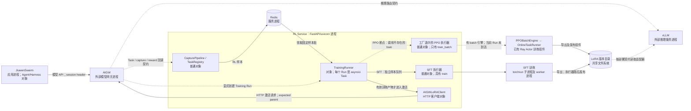

# F08：openJiuwen 在线模型适配与 Harness 协同边界

核查日期：2026-09-15。延续 [全局特性视图](OPENJIUWEN_RSI_OVERVIEW.md) 与 [F01 单 Harness 迭代](OPENJIUWEN_F01_HARNESS_ITERATION.md)。本轮分析在线任务如何成为训练样本、训练如何产出模型版本，以及发布、激活和下一轮任务的关系。

代码阅读顺序见 [F01 / F08 特性入口与 Walkthrough 计划](OPENJIUWEN_F01_F08_CODE_WALKTHROUGH.md)。

本地 agent-core 基线仍为 `13d226d91ccc1ff4c041e984fb6aa90de6c5e0ff`，Swarm 为 `f29c060cee90aef10e46b2a3646fe3628f60ea7c`。Swarm 依赖的 core commit 与本地基线不同，不能将两者视为已经联调的版本组合。[Swarm 依赖](https://gitcode.com/openJiuwen/jiuwenswarm/blob/f29c060cee90aef10e46b2a3646fe3628f60ea7c/pyproject.toml#L20)

**当前结论：在线采集、反馈、样本存储、训练执行和 LoRA 激活接口都有实现，但当前默认 PPO 服务装配缺少正确的执行器接口，不能认定这一快照的端到端链路已跑通。** Harness 优化与这条模型适配链仍是分开的控制流程。本轮没有启动 Agent、模型、Redis、训练或 GPU 测试。

## 1. 先明确参与者与数据对象

| 名称 | 在本流程中是什么 | 实体类型 |
|---|---|---|
| JiuwenSwarm / Agent | 使用现有 Harness 完成用户任务，产生多次模型调用 | 应用进程及进程内 Agent 对象 |
| Swarm Gateway | 连接 CLI/渠道与 Swarm AgentServer 的应用网关 | Swarm 服务进程 |
| AIGW | AgentBox Adapter 的模型推理网关，转发模型请求并对接在线学习服务 | 三仓之外的服务进程；本轮核查接口与部署契约 |
| vLLM | 提供基础模型及所加载 LoRA 的推理能力 | 外部推理服务进程 |
| RL Service | 接收 Task、采集、反馈和 Training Run 请求 | core 提供的 FastAPI/uvicorn 服务进程；按运维契约由 AIGW 管理 |
| CapturePipeline / TaskRegistry | 校验请求响应，记录任务策略身份，暂存和发布样本 | RL Service 内普通对象 |
| Judge | 根据交互及后续反馈给出分数；terminal 模式不要求使用 Judge | 可选外部 HTTP 评分服务 |
| TrainingRunner | 固定训练批次、记录父版本、调用训练器并推进发布/激活状态 | RL Service 内对象；一次训练编排是 asyncio Task |
| 训练执行器 | 将样本转成训练输入，调用训练后端并输出 LoRA | Python 对象；PPO 后端使用 Ray Actors，SFT 后端使用训练子进程 |
| Redis / LoRARepository | 前者保存任务/样本/run 状态；后者管理版本化适配器文件 | Redis 服务进程；LoRARepository 是文件存储封装对象 |

这里有两个不同的 Gateway，不能把 AIGW 当作 Swarm 自带渠道网关，也不能把 TrainingRunner 当作一个执行梯度计算的独立 Actor。[示例架构边界](https://gitcode.com/openJiuwen/agent-core/blob/13d226d91ccc1ff4c041e984fb6aa90de6c5e0ff/examples/jiuwenrl_online/README.md#L1)、[服务部署契约](https://gitcode.com/openJiuwen/agent-core/blob/13d226d91ccc1ff4c041e984fb6aa90de6c5e0ff/docs/dev/online-rl-service-operations.md#L1)、[服务对象装配](https://gitcode.com/openJiuwen/agent-core/blob/13d226d91ccc1ff4c041e984fb6aa90de6c5e0ff/openjiuwen/agent_evolving/agent_rl/online/service.py#L399)、[异步 run 创建](https://gitcode.com/openJiuwen/agent-core/blob/13d226d91ccc1ff4c041e984fb6aa90de6c5e0ff/openjiuwen/agent_evolving/agent_rl/online/training_runner.py#L473)

数据对象也不能混用：

- **RL Task：** 一段被追踪的 Agent 交互，包含 session、模型及策略版本身份；可产生多次模型调用。
- **Capture / sample：** 一次完整模型请求与响应的记录，包含可用于训练的 token 和概率等字段；不是完整用户任务的同义词。
- **Training Run：** 从待训练队列领取的一批固定样本；可以包含不同 Task、不同策略版本的样本。
- **LoRA 版本：** 可随基础模型加载的适配参数文件，例如 `<model_id>:v1`；它与 Task ID、Training Run ID 都是不同身份。

依据：[Task 创建](https://gitcode.com/openJiuwen/agent-core/blob/13d226d91ccc1ff4c041e984fb6aa90de6c5e0ff/openjiuwen/agent_evolving/agent_rl/online/service.py#L123)、[样本构造](https://gitcode.com/openJiuwen/agent-core/blob/13d226d91ccc1ff4c041e984fb6aa90de6c5e0ff/openjiuwen/agent_evolving/agent_rl/online/capture_pipeline.py#L252)、[Run 和 LoRA 结构](https://gitcode.com/openJiuwen/agent-core/blob/13d226d91ccc1ff4c041e984fb6aa90de6c5e0ff/openjiuwen/agent_evolving/agent_rl/online/training_runner.py#L78)。

## 2. 在线任务如何变成训练样本

### 2.1 先创建 Task，再采集模型调用

调用方通过稳定的 `X-Agent-Session-Id` 关联 Agent 请求。RL Service 的 Task 创建接口要求 AIGW 提供 Task ID、策略名和推理模型名，随后记录为该 Task 的策略身份。[请求与身份校验](https://gitcode.com/openJiuwen/agent-core/blob/13d226d91ccc1ff4c041e984fb6aa90de6c5e0ff/openjiuwen/agent_evolving/agent_rl/online/service.py#L123)

`CapturePipeline.before()` 验证请求属于该 Task，并要求返回 `logprobs`、token IDs；`after()` 校验完整响应、策略模型名以及 token 数与 usage 的一致性，然后暂存样本。生成失败或字段不完整不等于获得可训练样本。[采集前后处理](https://gitcode.com/openJiuwen/agent-core/blob/13d226d91ccc1ff4c041e984fb6aa90de6c5e0ff/openjiuwen/agent_evolving/agent_rl/online/capture_pipeline.py#L73)、[字段验证](https://gitcode.com/openJiuwen/agent-core/blob/13d226d91ccc1ff4c041e984fb6aa90de6c5e0ff/openjiuwen/agent_evolving/agent_rl/online/capture_pipeline.py#L195)

| 样本字段 | 用途 |
|---|---|
| messages、tools、assistant_message / tool_calls | 保留模型当时看到的上下文和输出动作 |
| prompt_ids、response_ids | 保留实际生成对应的 token 序列 |
| response_logprobs、response_token_mask | 保留生成概率与需参与训练的位置 |
| rl_task_id、sample_id / trajectory_id、agent_turn_id | 将记录追溯到任务和交互阶段；capture ID 用于 sample / trajectory 身份 |
| policy_version | 标识产生样本时的 LoRA 策略 |
| judge.score | 附加的奖励/评分 |

字段来源是实际 `_build_sample()`；这些数据不只是聊天文本的转存。PPO 转换器会将 token、原概率、mask 和评分组装为训练张量。[样本构造](https://gitcode.com/openJiuwen/agent-core/blob/13d226d91ccc1ff4c041e984fb6aa90de6c5e0ff/openjiuwen/agent_evolving/agent_rl/online/capture_pipeline.py#L252)、[训练张量转换](https://gitcode.com/openJiuwen/agent-core/blob/13d226d91ccc1ff4c041e984fb6aa90de6c5e0ff/openjiuwen/agent_evolving/agent_rl/rl_trainer/verl_converter.py#L112)

### 2.2 两种反馈方式

| 方式 | 谁给分 | 分数如何进入样本 |
|---|---|---|
| terminal | 调用方显式提交 `0..1` reward | Task 的样本统一写入该 reward，再进入待训练存储 |
| delayed_feedback | Judge 读取请求、响应和后续用户消息；最后一轮使用结束标记 | 对相应调用逐条评分，再发布样本 |

terminal 模式没有从任务最终奖励中自动分解出每个工具动作的独立贡献；代码给 Task 内样本投影同一个分数。它也不自动知道任务是否成功，依赖调用方或 Judge 的反馈质量。[terminal 投影](https://gitcode.com/openJiuwen/agent-core/blob/13d226d91ccc1ff4c041e984fb6aa90de6c5e0ff/openjiuwen/agent_evolving/agent_rl/online/capture_pipeline.py#L167)、[delayed Judge](https://gitcode.com/openJiuwen/agent-core/blob/13d226d91ccc1ff4c041e984fb6aa90de6c5e0ff/openjiuwen/agent_evolving/agent_rl/online/capture_pipeline.py#L302)

### 2.3 训练是显式触发的固定批次

`POST /v1/rl/training/runs` 调用 `TrainingRunner.start()`：查询当前 active LoRA 作为 parent，领取满足数量要求的一批 pending 样本，并把样本、run 和状态关联起来。后来到达的样本不自动进入这个已创建 run；存在 active run 时返回已有 run。[触发接口](https://gitcode.com/openJiuwen/agent-core/blob/13d226d91ccc1ff4c041e984fb6aa90de6c5e0ff/openjiuwen/agent_evolving/agent_rl/online/service.py#L190)、[parent 与异步执行](https://gitcode.com/openJiuwen/agent-core/blob/13d226d91ccc1ff4c041e984fb6aa90de6c5e0ff/openjiuwen/agent_evolving/agent_rl/online/training_runner.py#L473)、[领取样本的事务](https://gitcode.com/openJiuwen/agent-core/blob/13d226d91ccc1ff4c041e984fb6aa90de6c5e0ff/openjiuwen/agent_evolving/agent_rl/online/training_runner.py#L276)

**父版本与数据来源版本是两回事。** 代码记录整批样本的 `policy_versions` 计数，但领取样本时没有按 parent 版本过滤。因此不能说每批训练都只使用“当前 parent 刚产生的全新样本”。[版本计数](https://gitcode.com/openJiuwen/agent-core/blob/13d226d91ccc1ff4c041e984fb6aa90de6c5e0ff/openjiuwen/agent_evolving/agent_rl/online/training_runner.py#L382)

## 3. 训练、发布和激活：目标逻辑与当前断点

### 3.1 实现与部署边界图

下图的实线表示已找到的配置或调用关系，虚线标注当前断点或外部部署契约。组件存在不等于本轮运行过；尤其不能沿着 PPO 断点继续推导当前服务已经训练成功。

Swarm 通过 `api_base` 指向 AIGW、通过 `custom_headers` 携带 session；其渠道 Gateway 是另一条通信路径。AIGW 与 RL Service 按文档要求部署在同一主机，LoRA 的绝对路径须对相关进程可见。AIGW 的进程管理、推理路由及 vLLM 加载属于外部契约，本轮未取得其服务端源码。[Swarm 接入配置](https://gitcode.com/openJiuwen/agent-core/blob/13d226d91ccc1ff4c041e984fb6aa90de6c5e0ff/examples/jiuwenrl_online/README.md#L30)、[部署契约](https://gitcode.com/openJiuwen/agent-core/blob/13d226d91ccc1ff4c041e984fb6aa90de6c5e0ff/docs/dev/online-rl-service-operations.md#L3)、[PPO Actor 初始化](https://gitcode.com/openJiuwen/agent-core/blob/13d226d91ccc1ff4c041e984fb6aa90de6c5e0ff/openjiuwen/agent_evolving/agent_rl/online/backends/rl/ppo_engine.py#L85)、[SFT 训练入口](https://gitcode.com/openJiuwen/agent-core/blob/13d226d91ccc1ff4c041e984fb6aa90de6c5e0ff/openjiuwen/agent_evolving/agent_rl/online/backends/sft/trainer.py#L128)

### 3.2 PPO：当前缺口发生在训练入口

| 调用环节 | 当前源码行为 | 判断 |
|---|---|---|
| `online.service` | 默认后端是 PPO，将工厂返回对象传给 `TrainingRunner` | 服务实际装配入口 |
| `core.factory` | 选择 `backends/rl/trainer.PPOTrainingExecutor` | 该类及父类没有 `train()` |
| `TrainingRunner._execute()` | 执行 `await self._ppo.train(...)` | 按当前对象接口会触发属性错误，尚未进入 Ray 训练 |
| 异常处理 | 将该批样本恢复为 pending，Run 标记 failed | 存在失败收尾，不等于完成训练 |
| `scheduler/ppo_executor.PPOTrainingExecutor` | 另一同名类具有兼容的 `train()`，并将 parent 传给 batch 训练 | 当前工厂没有装配它 |

以上是**静态调用链结论**，不是本轮执行得到的异常日志。本轮没有修复源码。已有 PPO 引擎包含样本转换、远程 `train_on_batch`、LoRA 导出和发布代码，但这些部件的存在不能消除服务装配断点。[默认后端](https://gitcode.com/openJiuwen/agent-core/blob/13d226d91ccc1ff4c041e984fb6aa90de6c5e0ff/openjiuwen/agent_evolving/agent_rl/online/service.py#L342)、[服务装配](https://gitcode.com/openJiuwen/agent-core/blob/13d226d91ccc1ff4c041e984fb6aa90de6c5e0ff/openjiuwen/agent_evolving/agent_rl/online/service.py#L456)、[工厂选择](https://gitcode.com/openJiuwen/agent-core/blob/13d226d91ccc1ff4c041e984fb6aa90de6c5e0ff/openjiuwen/agent_evolving/agent_rl/online/core/factory.py#L63)、[被选执行器](https://gitcode.com/openJiuwen/agent-core/blob/13d226d91ccc1ff4c041e984fb6aa90de6c5e0ff/openjiuwen/agent_evolving/agent_rl/online/backends/rl/trainer.py#L23)、[其父类](https://gitcode.com/openJiuwen/agent-core/blob/13d226d91ccc1ff4c041e984fb6aa90de6c5e0ff/openjiuwen/agent_evolving/agent_rl/online/backends/rl/ppo_engine.py#L19)、[调用及异常处理](https://gitcode.com/openJiuwen/agent-core/blob/13d226d91ccc1ff4c041e984fb6aa90de6c5e0ff/openjiuwen/agent_evolving/agent_rl/online/training_runner.py#L597)、[兼容接口](https://gitcode.com/openJiuwen/agent-core/blob/13d226d91ccc1ff4c041e984fb6aa90de6c5e0ff/openjiuwen/agent_evolving/agent_rl/online/scheduler/ppo_executor.py#L142)、[训练与导出组件](https://gitcode.com/openJiuwen/agent-core/blob/13d226d91ccc1ff4c041e984fb6aa90de6c5e0ff/openjiuwen/agent_evolving/agent_rl/online/backends/rl/ppo_engine.py#L122)

### 3.3 SFT：有接口，不代表沿用 PPO 的数据和父权重

这里需要修正总览此前“训练执行器从父版本继续训练”的笼统描述：**Runner 传入 parent，只能证明编排层传参；还必须检查执行器是否使用。**

| 检查项 | 当前 SFT 实现 | 对分析的影响 |
|---|---|---|
| 样本来源 | 服务将训练存储切换到 `sft_store.training_sample_store`；CapturePipeline 仍写 RL trajectory store | 切换为 SFT 不会自动把普通 terminal-reward RL 样本转成可消费的 SFT 样本 |
| 父版本继承 | `train()` 未读取 `init_lora_name/path`；模型配置使用 `base_model_path`，默认关闭 resume | `v1 → v2` 的编号增长不能证明 v2 从 active v1 权重继续训练 |
| 激活前评测 | Runner 未执行任务级效果比较；SFT 默认 `val_files=None`、`test_freq=-1` | 成功产出适配器不能推出任务能力提高或没有退化 |
| 激活开关 | SFT 默认自动激活；可以关闭 | 关闭时 Run succeeded 也不表示线上 active 已切换 |

这些结论针对当前默认配置和本条服务路径；不排除调用方另行构造训练配置，但没有找到自动继承 active parent 的实现。`SFT_DRY_RUN` 只生成训练准备产物，并在 `train()` 中明确拒绝将其作为有效 LoRA 返回。[两种存储装配](https://gitcode.com/openJiuwen/agent-core/blob/13d226d91ccc1ff4c041e984fb6aa90de6c5e0ff/openjiuwen/agent_evolving/agent_rl/online/service.py#L413)、[SFT train](https://gitcode.com/openJiuwen/agent-core/blob/13d226d91ccc1ff4c041e984fb6aa90de6c5e0ff/openjiuwen/agent_evolving/agent_rl/online/backends/sft/trainer.py#L211)、[基础模型配置](https://gitcode.com/openJiuwen/agent-core/blob/13d226d91ccc1ff4c041e984fb6aa90de6c5e0ff/openjiuwen/agent_evolving/agent_rl/online/backends/sft/trainer.py#L331)、[验证与恢复配置](https://gitcode.com/openJiuwen/agent-core/blob/13d226d91ccc1ff4c041e984fb6aa90de6c5e0ff/openjiuwen/agent_evolving/agent_rl/online/backends/sft/trainer.py#L373)、[激活开关](https://gitcode.com/openJiuwen/agent-core/blob/13d226d91ccc1ff4c041e984fb6aa90de6c5e0ff/openjiuwen/agent_evolving/agent_rl/online/service.py#L374)

### 3.4 发布、激活和失败不是一个原子动作

训练执行器成功返回时，LoRARepository 已将文件复制到新 `vN` 目录，写入元数据并更新本地 `latest`。Runner 校验产物名称，记录样本已训练，随后才向 AIGW 请求激活。激活请求携带 `expected_lora_name=parent`，表达“只有 active 仍是预期父版本才切换”的条件；服务端如何实施这一条件，本轮只核实到客户端契约。[文件发布](https://gitcode.com/openJiuwen/agent-core/blob/13d226d91ccc1ff4c041e984fb6aa90de6c5e0ff/openjiuwen/agent_evolving/agent_rl/storage/lora_repo.py#L56)、[状态转移与激活](https://gitcode.com/openJiuwen/agent-core/blob/13d226d91ccc1ff4c041e984fb6aa90de6c5e0ff/openjiuwen/agent_evolving/agent_rl/online/training_runner.py#L610)、[HTTP 请求](https://gitcode.com/openJiuwen/agent-core/blob/13d226d91ccc1ff4c041e984fb6aa90de6c5e0ff/openjiuwen/agent_evolving/agent_rl/online/lora_client.py#L66)

| 发生位置 | 当前 Runner 的处理 | 不能等同于什么 |
|---|---|---|
| 训练调用或产物名称检查失败 | Run failed，样本恢复 pending | 不保证清理执行器可能已产生的文件 |
| 训练完成后激活失败 | Run failed，已发布 LoRA 和 trained 样本保留 | 没有在 Runner 中把文件 `latest`、样本和线上 active 一并回滚 |
| 服务重启恢复 | queued/training 阶段恢复样本并记失败；activating 阶段重试已有产物的激活 | 不会为了恢复 activating run 再训练一次 |

因此 **LoRARepository.latest、TrainingRun.status、AIGW.active 是三个不同状态**；尤其不能把本地 latest 当作线上模型。生产 Runner 也没有 F01 那样的目标案例与整版验收流程；其他旧 scheduler 中可选的 evaler 不能作为本条路径必经评测的证据。[异常处理与恢复](https://gitcode.com/openJiuwen/agent-core/blob/13d226d91ccc1ff4c041e984fb6aa90de6c5e0ff/openjiuwen/agent_evolving/agent_rl/online/training_runner.py#L575)、[旧 adapter 的可选评测](https://gitcode.com/openJiuwen/agent-core/blob/13d226d91ccc1ff4c041e984fb6aa90de6c5e0ff/openjiuwen/agent_evolving/agent_rl/online/backends/rl/trainer.py#L69)

## 4. 具体案例及证据性质

最具体的案例来自 JiuwenSwarm GPU 系统测试：**让 LoRA 更新后更偏好受到正奖励的输出。** 它是受控的工程验证任务，不是编码、工具使用或复杂业务能力 benchmark。

### 4.1 按测试源码逐步说明

| 步骤 | 实际任务或数据 | 这一阶段改变什么 |
|---|---|---|
| 1. 准备模型和 Agent | 默认基础模型为 `Qwen3-4B-Instruct-2507`；用 JiuwenSwarm CLI 执行任务 | 装配既有 Agent/Harness，不生成新 Harness |
| 2. 收集正样本 | 请求 `Do not call tools. Reply with exactly TRAINING_GOOD and nothing else.`，执行两次，每次提交 terminal reward `1.0` | 增加两次正奖励交互的样本 |
| 3. 收集对照样本 | 将输出标记换为 `TRAINING_BAD`，执行两次，每次提交 reward `0.0` | 增加两次零奖励交互的样本；分数由测试明确指定 |
| 4. 固定训练批次 | 每次均 start Task → Agent 执行 → stop Task → reward；随后显式创建 Training Run，最小训练样本数设为 4 | 固定待训练样本及当前 parent；首轮测试比较基准为 base |
| 5. 训练及激活 | 测试期望 PPO 产出并激活运行时返回的 `<model_id>:vN` | 更新 LoRA 参数；不会重写 Prompt/Tool/Skill 文件 |
| 6. 检查参数与概率 | 检查 LoRA 非零；用采集时的 prompt/response tokens 比较 base 和新策略的 log probability | 要求正奖励 completion 的相对概率增益高于零奖励 completion |
| 7. 验证下一任务 | 创建新 Task，要求绑定新策略，再请求输出 `TRAINING_GOOD` | 检查新模型版本被后续任务使用 |

依据：[精确任务请求](https://gitcode.com/openJiuwen/agent-core/blob/13d226d91ccc1ff4c041e984fb6aa90de6c5e0ff/tests/system_tests/agent_evolving/agent_rl/online/real_training_harness.py#L441)、[模型配置](https://gitcode.com/openJiuwen/agent-core/blob/13d226d91ccc1ff4c041e984fb6aa90de6c5e0ff/tests/system_tests/agent_evolving/agent_rl/online/real_training_harness.py#L497)、[四次采集与训练检查](https://gitcode.com/openJiuwen/agent-core/blob/13d226d91ccc1ff4c041e984fb6aa90de6c5e0ff/tests/system_tests/agent_evolving/agent_rl/online/real_training_harness.py#L550)、[Task/reward 顺序](https://gitcode.com/openJiuwen/agent-core/blob/13d226d91ccc1ff4c041e984fb6aa90de6c5e0ff/tests/system_tests/agent_evolving/agent_rl/online/real_training_harness.py#L873)、[最小批次](https://gitcode.com/openJiuwen/agent-core/blob/13d226d91ccc1ff4c041e984fb6aa90de6c5e0ff/tests/system_tests/agent_evolving/agent_rl/online/real_training_harness.py#L711)、[概率指标计算](https://gitcode.com/openJiuwen/agent-core/blob/13d226d91ccc1ff4c041e984fb6aa90de6c5e0ff/tests/system_tests/agent_evolving/agent_rl/online/real_training_harness.py#L899)。

这个例子中的“跨轮”是：现有 Harness 产生交互 → 奖励数据用于模型适配 → 后续 Task 使用新 LoRA。**测试并没有在第 5 步更新 Harness，也没有证明模型更新后应如何修改 Harness。** 测试没有硬编码首轮必须叫 v1，故不能将其他 README 的示例版本号和本测试拼成同一次运行。

### 4.2 三类证据必须分开

| 证据 | 已知内容 | 结论边界 |
|---|---|---|
| 当前仓内系统测试 | 有真实服务/GPU 路径及参数、偏好、新 Task 检查；默认需 `RUN_ONLINE_RL_TRAINING_ST=1` 才启用 | 证明测试定义存在；本轮未运行，不能据此宣布当前快照通过 |
| 官方历史 PR 的作者运行报告 | 2026-08-29 合并的 PR #982 报告使用 Qwen3-4B、四条奖励样本，JiuwenSwarm 链完成 PPO 更新、LoRA 加载及偏好检查 | 是一手历史运行报告；不是本轮独立复现，也不覆盖当前全部修改 |
| 当前代码静态核查 | 默认 PPO 工厂与 Runner 接口不匹配；SFT 没有自动继承 parent | 对当前快照必须保留这些限制，不能用历史通过覆盖 |

来源：[当前系统测试开关和断言](https://gitcode.com/openJiuwen/agent-core/blob/13d226d91ccc1ff4c041e984fb6aa90de6c5e0ff/tests/system_tests/agent_evolving/agent_rl/online/test_jiuwenswarm_training_e2e.py#L10)、[官方 PR #982：作者运行报告](https://github.com/openJiuwen-ai/agent-core/pull/982)。历史报告提供了真实参数更新的证据，但本轮没有拿到当次 LoRA 产物或原始运行日志。这里不报告业务准确率提升，因为上述受控负载没有测量它。

## 5. 与 F01 对照：哪些连接仍缺失

| 对照项 | F01：单 Harness 迭代 | F08：在线模型适配 |
|---|---|---|
| 直接更新对象 | Prompt、Skill、Tool、Rail 等插件文件 | 基础模型之上的 LoRA 参数 |
| 改进输入 | 调用方提供的案例、失败轨迹、评测与优化 journal | 在线模型调用的 token、旧策略概率、版本身份和奖励；SFT 使用自己的样本队列 |
| 谁决定更新 | 模型参与诊断和生成；程序组织候选、验收和发布 | Runner 固定批次与 parent；执行器组织参数训练，Runner 管理激活 |
| 质量接纳 | 目标案例复评、整版检查和保留/回退；仍不能当作独立泛化测试 | 当前 Runner 侧检查产物协议并推进激活；没有对应的必经任务效果比较 |
| 版本状态 | 优化过程的候选/best/published 与安装后 active 分开 | 样本 policy、Run parent、产物 vN、本地 latest、网关 active 分开 |
| 下一轮入口 | 新优化任务默认复制创建时 active Harness；旧优化任务保留已复制基线 | 新 RL Task 的策略身份由 AIGW 注入；Run 另行固定 parent；外部固定/加载行为只核实契约 |
| 当前主要边界 | 没有调用模型训练；普通运行中 turn 的热加载一致性尚不明确 | 当前 PPO 装配断点；SFT 默认不继承 active parent；没有修改 Harness |

F01 对照依据：[修改与验收](https://gitcode.com/openJiuwen/agent-core/blob/13d226d91ccc1ff4c041e984fb6aa90de6c5e0ff/openjiuwen/rsi/harness_rsi/single_harness/iterative.py#L442)、[创建时基线复制](https://gitcode.com/openJiuwen/jiuwenswarm/blob/f29c060cee90aef10e46b2a3646fe3628f60ea7c/jiuwenswarm/agents/harness/common/rsi/materializer.py#L177)、[发布后安装](https://gitcode.com/openJiuwen/jiuwenswarm/blob/f29c060cee90aef10e46b2a3646fe3628f60ea7c/jiuwenswarm/agents/harness/common/rsi/harness_activation.py#L708)、[进程内加载](https://gitcode.com/openJiuwen/jiuwenswarm/blob/f29c060cee90aef10e46b2a3646fe3628f60ea7c/jiuwenswarm/server/runtime/agent_adapter/interface_deep.py#L7312)。F08 对照依据：[Task 身份](https://gitcode.com/openJiuwen/agent-core/blob/13d226d91ccc1ff4c041e984fb6aa90de6c5e0ff/openjiuwen/agent_evolving/agent_rl/online/task_registry.py#L48)、[Run/parent 结构](https://gitcode.com/openJiuwen/agent-core/blob/13d226d91ccc1ff4c041e984fb6aa90de6c5e0ff/openjiuwen/agent_evolving/agent_rl/online/training_runner.py#L78)、[Runner 执行](https://gitcode.com/openJiuwen/agent-core/blob/13d226d91ccc1ff4c041e984fb6aa90de6c5e0ff/openjiuwen/agent_evolving/agent_rl/online/training_runner.py#L597)。

**共同点在于“记录反馈、产生候选、管理版本、供后续工作使用”，但不等于它们已经协同优化。** 当前 `rsi` 场景契约只有 harness/artifact；F08 的 Task/sample/Run 有模型策略身份，却没有显式 Harness 版本字段。消息中包含 Prompt 和 tools 不等于记录了不可变的 Harness 包版本。[RSI 场景](https://gitcode.com/openJiuwen/agent-core/blob/13d226d91ccc1ff4c041e984fb6aa90de6c5e0ff/openjiuwen/rsi/schema.py#L9)、[F08 样本身份](https://gitcode.com/openJiuwen/agent-core/blob/13d226d91ccc1ff4c041e984fb6aa90de6c5e0ff/openjiuwen/agent_evolving/agent_rl/online/capture_pipeline.py#L252)、[F01 安装身份](https://gitcode.com/openJiuwen/jiuwenswarm/blob/f29c060cee90aef10e46b2a3646fe3628f60ea7c/jiuwenswarm/agents/harness/common/rsi/harness_activation.py#L296)

据已核查入口和数据结构，**未找到**统一驱动 F01/F08 的 run、联合的 `(Harness version, model version)` 发布清单、统一质量门槛或联合回滚事务。这是当前检索范围内的实现判断，不是对整个组织未来能力的否定。后续若设计协同机制，可以围绕这些缺口展开；它们目前属于设计问题，不能画成已有调用箭头。

## 6. 尚未获得可靠答案的部分

1. **AIGW 外部实现：** 测试只给出 `AgentInfra/Adapter` 本地仓路径和 AIGW 二进制位置。本轮未确认准确公开仓 URL，未核查多 vLLM 加载、条件激活、失败补偿的服务端实现；公开的同名或近名 Gateway 不可替代它。[测试所需外部目录](https://gitcode.com/openJiuwen/agent-core/blob/13d226d91ccc1ff4c041e984fb6aa90de6c5e0ff/tests/system_tests/agent_evolving/agent_rl/online/run_aigw_system.sh#L4)
2. **当前版本的端到端可运行性：** 有历史运行报告，但当前 PPO 装配已有静态断点，Swarm 固定依赖与本地 core 版本也不一致；本轮未执行组合测试。
3. **持续参数继承：** PPO 有使用 parent 的兼容执行器，但尚未在当前服务工厂接通；SFT 默认路径没有使用 parent。不能统一声称两种后端均完成 `base → v1 → v2` 的参数递进。
4. **真实任务收益：** 受控标记输出验证参数与推理接线，不回答编码、工具使用或复杂业务任务的收益、退化、长期稳定性。没有可靠数据则不报告提升结论。
5. **Harness 与模型的协同策略：** 何时先改 Harness、何时先训模型、如何归因、如何验收组合及回滚，当前没有找到统一闭环实现。

下一项可按原清单分析 F01 + F08 + F09 的接口缺口，将“已实现组件”“缺少的连接”“可选设计”分开列出。
