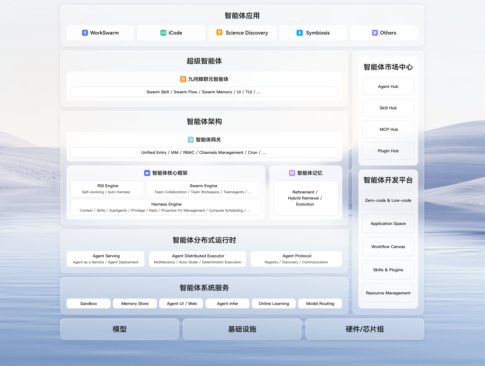
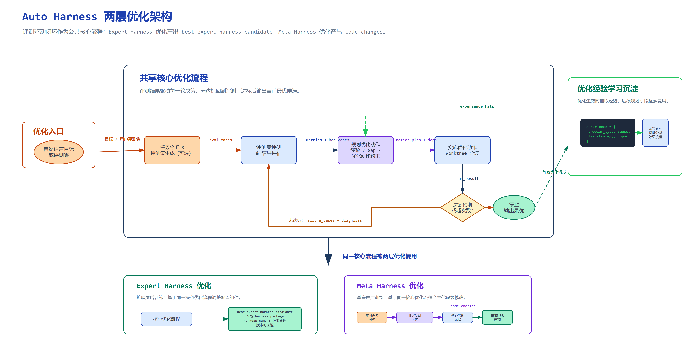
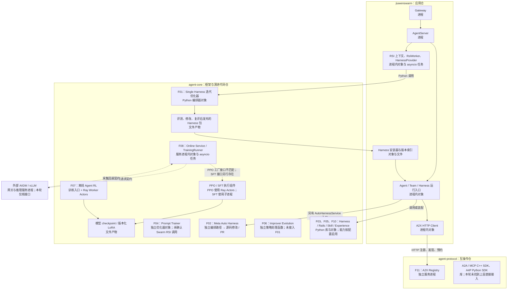

# openJiuwen：Harness RSI 与模型 RSI 全局特性实现视图

核查日期：2026-09-15。范围：`jiuwenswarm`、`agent-core`、`agent-protocol` 的本地代码快照及已访问的官方材料。本轮提供特性地图、主要实现位置和连接关系，作为后续逐项深入分析的索引。

本轮采用静态代码核查。下文“已有实现”表示找到了对应代码；“已接线”表示找到了调用或装配代码，均不等于本轮已运行验证，也不代表已证明效果提升。未找到调用关系的地方明确标注，不用模块名称补全结论。

**总体判断：已找到 Harness 优化主线、独立模型训练主线，以及协议/运行时支撑。当前不能认定三者已组成 Harness 与模型协同演进的统一 RSI 系统。** 其中，Swarm 已装配单 Harness 迭代优化入口；改进器策略演进尚未接入该入口；在线模型持续适配已有组件和控制逻辑，但当前 PPO 服务装配存在接口断点。

## 1. 核查基线与判断口径

| 仓库 | 分支 | 本次核查 commit |
|---|---|---|
| jiuwenswarm | develop | `f29c060cee90aef10e46b2a3646fe3628f60ea7c` |
| agent-core | develop | `13d226d91ccc1ff4c041e984fb6aa90de6c5e0ff` |
| agent-protocol | develop | `5097ee13d9a947a4474d2d9da0097991e20ecffb` |

这三个本地仓库的 origin 均为用户指定的 GitCode openJiuwen 组织。GitCode 组织及仓库网页本轮访问超时，因此实现结论以实际读取的本地代码为依据；官网架构图已成功访问并保存。

**版本边界：** Swarm 声明依赖的 agent-core commit 是 `564997732e22fcdd204959b79b38b4768f5220c0`，与本次本地 core 快照不同。下文是三个快照的代码实现地图，不能据此声称它们已作为同一版本组合联调通过。[依赖声明](https://gitcode.com/openJiuwen/jiuwenswarm/blob/f29c060cee90aef10e46b2a3646fe3628f60ea7c/pyproject.toml#L20)

为避免把不同层次的能力都叫作 RSI，本轮分别核查：

- **Harness 更新：** 改变模型之外的执行机制或持久化资产，例如 Prompt、Skill、工具、Rail、插件配置和运行代码。Rail 指在 Agent 执行过程插入逻辑的钩子组件，不仅指安全规则。
- **模型更新：** 实际训练模型参数；切换模型名称、服务地址、推理参数不计为模型权重更新。
- **改进器更新：** 改变“如何诊断问题、选择修改动作、生成候选”的机制或策略。存在优化器对象，不自动说明这个优化器也会演进。
- **协同闭环：** 需要找到 Harness 更新与模型训练之间的实际编排和反馈连接。两个模块同时存在，不足以证明联合迭代。

这是本报告的分析口径，不是对所有 RSI 文献作统一定义。

## 2. 找到的官方全局图

官网提供了涵盖应用、核心框架、分布式运行时、系统服务和模型的全局图。图中核心框架并列列出 **RSI Engine、Swarm Engine、Harness Engine**；分布式运行时列出 **Agent Protocol**；系统服务另列 **Online Learning**。因此，应沿这些能力分别寻找实现，不能仅凭图的位置推断它们已构成联合学习闭环。[官网](https://openjiuwen.com/)、[官方架构图原始地址](https://openjiuwen.com/img/main_page/architecture_cut.png)

Swarm 另有一张 **Auto Harness 两层架构图**：Expert Harness 面向领域扩展包，Meta Harness 面向源码修改和 PR。它描述的是 Auto Harness 子系统，不是三个仓库的整体实现图；也不能覆盖当前所有 `rsi/` 入口。[官方仓内说明](https://gitcode.com/openJiuwen/jiuwenswarm/blob/f29c060cee90aef10e46b2a3646fe3628f60ea7c/docs/zh/AutoHarness.md#L34)

## 3. 全局实现视图

三个仓库的职责首先应按下表理解，不能直接把仓库边界当作部署边界。

| 仓库 | 本轮核查到的主要职责 | 运行形态 |
|---|---|---|
| jiuwenswarm | 用户入口、Agent/Team 装配、RSI 任务管理、Skill/经验入口、Harness 安装和版本管理 | 应用可启动 Gateway、AgentServer 等进程；其中 RSI 上下文、Provider、Worker 是进程内对象/协程 |
| agent-core | Harness 执行与扩展框架、Harness 优化器、Agent 演进组件、模型训练组件 | 大部分是被上层调用的 Python 库；模型训练另有训练任务与分布式 Worker |
| agent-protocol | A2A/MCP 协议 SDK、A2X 注册发现、A4P 授权协议 | SDK 是库；A2X Registry 可独立部署为服务进程 |

Swarm 的进程划分依据是启动代码的 `subprocess.Popen`；RSI 对象归属依据是 AgentServer 的创建与装配代码。协议仓职责依据其顶层清单，A2X 部署依据 Swarm 分布式 Team 文档。[Swarm 进程启动](https://gitcode.com/openJiuwen/jiuwenswarm/blob/f29c060cee90aef10e46b2a3646fe3628f60ea7c/jiuwenswarm/app.py#L87)、[RSI 装配](https://gitcode.com/openJiuwen/jiuwenswarm/blob/f29c060cee90aef10e46b2a3646fe3628f60ea7c/jiuwenswarm/server/agent_ws_server.py#L10529)、[协议仓清单](https://gitcode.com/openJiuwen/agent-protocol/blob/5097ee13d9a947a4474d2d9da0097991e20ecffb/README_zh.md#L7)、[A2X 独立部署](https://gitcode.com/openJiuwen/jiuwenswarm/blob/f29c060cee90aef10e46b2a3646fe3628f60ea7c/docs/zh/分布式Team.md#L244)

下面是根据代码整理的实现图。**分组表示代码归属，不表示进程边界；节点分别标出进程、对象、协程或 Actor。** 实线表示找到调用、装配或数据传递代码；虚线仅表示外部接口契约、独立组件或当前未接通的路径。

图中的 F01/F02/F07/F08 是不同的编排路径，**没有画出 Harness 优化器与模型训练器的联合迭代箭头，因为本轮未找到该连接**。F09 的评测/轨迹/版本能力分布于各条路径；F12 的程序/论文产物优化作为范围边界列在特性表中。

模型侧实体类型依据：[离线/在线 TaskRunner Actor](https://gitcode.com/openJiuwen/agent-core/blob/13d226d91ccc1ff4c041e984fb6aa90de6c5e0ff/openjiuwen/agent_evolving/agent_rl/optimizer/task_runner.py#L190)、[在线任务创建](https://gitcode.com/openJiuwen/agent-core/blob/13d226d91ccc1ff4c041e984fb6aa90de6c5e0ff/openjiuwen/agent_evolving/agent_rl/online/training_runner.py#L473)、[SFT 训练执行](https://gitcode.com/openJiuwen/agent-core/blob/13d226d91ccc1ff4c041e984fb6aa90de6c5e0ff/openjiuwen/agent_evolving/agent_rl/online/backends/sft/trainer.py#L128)。AIGW 的服务所有权与部署位置是随仓运维文档披露的契约，本轮没有核查其外部仓实现。[在线服务部署边界](https://gitcode.com/openJiuwen/agent-core/blob/13d226d91ccc1ff4c041e984fb6aa90de6c5e0ff/docs/dev/online-rl-service-operations.md#L1)

## 4. 编号特性地图

F01 已完成下一层分析：[单 Harness 迭代流程、具体文件案例与跨轮继承](OPENJIUWEN_F01_HARNESS_ITERATION.md)。专题区分了模拟测试与真实运行证据，并细化目标验收、整版升级、发布和安装的边界。

F08 已完成下一层分析：[在线样本、模型训练、LoRA 发布激活与协同边界](OPENJIUWEN_F08_ONLINE_MODEL_ADAPTATION.md)。专题补充受控输出案例与官方历史运行报告，并修正“SFT 必然继承父 LoRA”的推断。

编号供后续对话引用。这里列“更新对象—场景—主实现—状态”，不展开算法和函数内部流程。

| 编号 | 特性与解决的问题 | 更新对象 / 输入 | 主要实现与证据 | 当前判断 |
|---|---|---|---|---|
| **F01** | **评测驱动的 Expert Harness 迭代**：针对任务失败，修改执行机制并复评 | 更新 Prompt 片段、Skill、Tool、Rail；输入案例集、执行轨迹和评测结果 | core `rsi/harness_rsi/single_harness`、`member_optimizer`；Swarm `common/rsi/HarnessProvider`。[允许修改表面](https://gitcode.com/openJiuwen/agent-core/blob/13d226d91ccc1ff4c041e984fb6aa90de6c5e0ff/openjiuwen/rsi/harness_rsi/single_harness/iterative.py#L83)、[迭代与验收](https://gitcode.com/openJiuwen/agent-core/blob/13d226d91ccc1ff4c041e984fb6aa90de6c5e0ff/openjiuwen/rsi/harness_rsi/single_harness/iterative.py#L442) | **闭环代码与 Swarm 接线已找到**。有目标案例验收、全量检查/回滚；没有模型训练 |
| **F02** | **Auto Harness 扩展与 Meta 源码演进**：增加领域能力、修复公共运行代码 | 扩展路径输出包；Meta 路径输出源码修改、测试及 PR | core `rsi/harness_rsi/auto_harness`；Swarm `AutoHarnessService`。[Meta 流水线](https://gitcode.com/openJiuwen/agent-core/blob/13d226d91ccc1ff4c041e984fb6aa90de6c5e0ff/openjiuwen/rsi/harness_rsi/auto_harness/pipelines/meta_evolve_pipeline/meta_evolve_pipeline.py#L47)、[Swarm 桥接](https://gitcode.com/openJiuwen/jiuwenswarm/blob/f29c060cee90aef10e46b2a3646fe3628f60ea7c/jiuwenswarm/agents/harness/common/auto_harness/service.py#L35) | **独立于 F01 的实现路径**。Meta 不等于自动 merge/deploy，编辑范围排除 AutoHarness 自身；扩展包激活也不能直接证明用后效果闭环 |
| **F03** | **在线 Skill / Team Skill 演进**：将任务中的可复用教训留给后续任务 | 执行信号 → Skill 经验记录与投影；保存/确认策略可配置 | Swarm evolution rails 桥接 core `agent_evolving/experience` 与 Skill rails。[Swarm 装配](https://gitcode.com/openJiuwen/jiuwenswarm/blob/f29c060cee90aef10e46b2a3646fe3628f60ea7c/jiuwenswarm/agents/swarm/providers/evolution_rails.py#L25)、[在线编排](https://gitcode.com/openJiuwen/agent-core/blob/13d226d91ccc1ff4c041e984fb6aa90de6c5e0ff/openjiuwen/agent_evolving/experience/online_orchestrator.py#L29)、[后续使用](https://gitcode.com/openJiuwen/agent-core/blob/13d226d91ccc1ff4c041e984fb6aa90de6c5e0ff/openjiuwen/harness/rails/skills/skill_use_rail.py#L375) | **存在持久化和后续复用路径**。默认学习经验不等于每轮重写基础 `SKILL.md`；SkillDev 另有制作/测试流程 |
| **F04** | **Prompt / 指令优化**：改善既有 Agent 的提示词效果 | 训练案例、失败轨迹 → system/user Prompt 文本参数 → 验证集选候选 | core `agent_evolving/trainer`、`optimizer/llm_call`。[Trainer](https://gitcode.com/openJiuwen/agent-core/blob/13d226d91ccc1ff4c041e984fb6aa90de6c5e0ff/openjiuwen/agent_evolving/trainer/trainer.py#L145)、[InstructionOptimizer](https://gitcode.com/openJiuwen/agent-core/blob/13d226d91ccc1ff4c041e984fb6aa90de6c5e0ff/openjiuwen/agent_evolving/optimizer/llm_call/instruction_optimizer.py#L56) | **独立优化组件已实现**；未确认由 F01 或 Swarm RSI 主入口统一调用。“Trainer”在这里不表示神经网络权重训练 |
| **F05** | **经验 / 上下文演进**：避免重复试错，将经验用于后续推理 | 任务经验、反思 → 可检索记忆或 Tip/CodeTool 资产 | Swarm `experience_learn/retrieve` → core `extensions/context_evolver`；core 另有 Metis 路径。[Swarm 持久化](https://gitcode.com/openJiuwen/jiuwenswarm/blob/f29c060cee90aef10e46b2a3646fe3628f60ea7c/jiuwenswarm/agents/harness/common/tools/task_tools.py#L309)、[依赖桥接](https://gitcode.com/openJiuwen/jiuwenswarm/blob/f29c060cee90aef10e46b2a3646fe3628f60ea7c/jiuwenswarm/agents/harness/common/tools/__init__.py#L42)、[Metis 优化器](https://gitcode.com/openJiuwen/agent-core/blob/13d226d91ccc1ff4c041e984fb6aa90de6c5e0ff/openjiuwen/agent_evolving/optimizer/context_evolve_call/metis_optimizer.py#L41) | **非参数经验更新已实现**。这些是不同实现路径，不能合并成一个统一记忆系统；不更新模型权重 |
| **F06** | **改进器策略演进**：尝试改善“如何改 Harness” | 优化反馈 → 动作排序权重、生成指令、预算策略等版本化配置 | core `rsi/harness_rsi/improver_evolution`。[策略定义/演进](https://gitcode.com/openJiuwen/agent-core/blob/13d226d91ccc1ff4c041e984fb6aa90de6c5e0ff/openjiuwen/rsi/harness_rsi/improver_evolution/policy.py#L63)、[meta-validation 边界](https://gitcode.com/openJiuwen/agent-core/blob/13d226d91ccc1ff4c041e984fb6aa90de6c5e0ff/openjiuwen/rsi/harness_rsi/improver_evolution/meta_validation.py#L3) | **有独立函数实现，未找到主流程闭环接线**；F01 明确限制该功能；配置中的 ranking weights 不是 LLM 权重 |
| **F07** | **离线 Agent RL**：用带反馈的任务训练模型在既有 Harness 下行动 | 数据集、Agent rollout、reward → 模型参数与 checkpoint | core `agent_evolving/agent_rl/offline`、`optimizer`、`rl_trainer`。[训练循环](https://gitcode.com/openJiuwen/agent-core/blob/13d226d91ccc1ff4c041e984fb6aa90de6c5e0ff/openjiuwen/agent_evolving/agent_rl/offline/main_trainer.py#L211)、[actor 参数更新](https://gitcode.com/openJiuwen/agent-core/blob/13d226d91ccc1ff4c041e984fb6aa90de6c5e0ff/openjiuwen/agent_evolving/agent_rl/rl_trainer/ppo_step.py#L94) | **权重训练循环代码已实现**；Harness 与 reward 机制未在此循环中自动演进；未找到独立生产推理发布链 |
| **F08** | **在线模型适配与版本管理**：将在线任务数据用于后续模型更新 | PPO 奖励样本 / SFT 独立样本队列 → LoRA → 激活请求；parent 由 Runner 记录和传入 | core `agent_rl/online`、`storage/lora_repo`，对接外部 AIGW。[TrainingRunner](https://gitcode.com/openJiuwen/agent-core/blob/13d226d91ccc1ff4c041e984fb6aa90de6c5e0ff/openjiuwen/agent_evolving/agent_rl/online/training_runner.py#L473)、[LoRA 客户端](https://gitcode.com/openJiuwen/agent-core/blob/13d226d91ccc1ff4c041e984fb6aa90de6c5e0ff/openjiuwen/agent_evolving/agent_rl/online/lora_client.py#L66) | **当前 PPO 服务装配有接口断点；SFT 有 train 接口但未使用 active parent**。有官方历史 PPO 运行报告；当前快照未运行验证，外部网关源码未核查 |
| **F09** | **评测、轨迹与版本支撑**：让修改有依据、结果可比较、产物可追溯 | 案例、执行轨迹、得分、检查点、版本索引 | Harness 评测/验收、Swarm Harness 安装索引、RL checkpoint/LoRA 仓库。[Harness 安装器](https://gitcode.com/openJiuwen/jiuwenswarm/blob/f29c060cee90aef10e46b2a3646fe3628f60ea7c/jiuwenswarm/agents/harness/common/rsi/harness_activation.py#L553)、[LoRA 仓库](https://gitcode.com/openJiuwen/agent-core/blob/13d226d91ccc1ff4c041e984fb6aa90de6c5e0ff/openjiuwen/agent_evolving/agent_rl/storage/lora_repo.py#L51) | **各条路径分别实现**；未找到 Harness 与模型共同接受门、共同版本事务或联合回滚 |
| **F10** | **Harness 执行与可替换宿主契约**：提供能被扩展/接管的 Agent 运行基础 | Rails、工具、Skill、运行配置；第三方 Harness 的事件、交互、checkpoint | core `harness`、`harness_protocol`、`harness_providers`，Swarm 按声明装配。[Swarm 装配设计](https://gitcode.com/openJiuwen/jiuwenswarm/blob/f29c060cee90aef10e46b2a3646fe3628f60ea7c/jiuwenswarm/agents/swarm/DESIGN.md#L21)、[Harness SPI](https://gitcode.com/openJiuwen/agent-core/blob/13d226d91ccc1ff4c041e984fb6aa90de6c5e0ff/openjiuwen/harness_protocol/README.md#L43) | **支撑能力**。有可插拔接口不等于系统自动生成并验收新实现 |
| **F11** | **分布式互操作与注册发现**：跨进程/机器找到并协调 Agent | Agent 能力/地址、注册信息、预约与 lease；协议消息 | Swarm A2X client → agent-protocol `AgentRegistry`；协议仓另含 A2A/MCP/A4P。[实际客户端装配](https://gitcode.com/openJiuwen/jiuwenswarm/blob/f29c060cee90aef10e46b2a3646fe3628f60ea7c/jiuwenswarm/agents/harness/team/a2x/a2x_registry_runtime.py#L156)、[协议仓范围](https://gitcode.com/openJiuwen/agent-protocol/blob/5097ee13d9a947a4474d2d9da0097991e20ecffb/README_zh.md#L7) | **A2X 连接已找到**；其余 SDK 不能仅凭同名协议认定被上层使用。本身不执行 Harness 或模型改进 |
| **F12** | **程序/论文产物优化〔范围边界〕** | Program / Paper 产物及优化指令 | core `rsi/artifact_rsi`；Swarm Program/Paper adapters。[实际 Provider 装配](https://gitcode.com/openJiuwen/jiuwenswarm/blob/f29c060cee90aef10e46b2a3646fe3628f60ea7c/jiuwenswarm/agents/harness/common/rsi/provider_factory.py#L71) | **真实实现入口已找到**，但不应自动计为 Harness RSI 或模型 RSI；本轮不展开 |

有明确工作负载的例子：F07 随仓提供 **Calc-X 数学题/计算器工具**和 **Spider NL2SQL/SQL 执行工具**；F08 有 JiuwenSwarm 在线任务示例。F01 是调用方提供案例集的通用优化入口，本轮没有将它对应到一个统一、已实测的标准 benchmark，也不报告性能提升数字。[计算器示例](https://gitcode.com/openJiuwen/agent-core/blob/13d226d91ccc1ff4c041e984fb6aa90de6c5e0ff/examples/rl_calculator/README.md#L7)、[NL2SQL 示例](https://gitcode.com/openJiuwen/agent-core/blob/13d226d91ccc1ff4c041e984fb6aa90de6c5e0ff/examples/rl_nl2sql/README.md#L6)、[在线任务示例](https://gitcode.com/openJiuwen/agent-core/blob/13d226d91ccc1ff4c041e984fb6aa90de6c5e0ff/examples/jiuwenrl_online/README.md#L1)

## 5. 目前可以确认的连接与边界

### Swarm 已装配的 Harness RSI 主路径

AgentServer 创建 RSI 上下文，注册真实 `HarnessProvider`；Provider 调用 core 的 `SingleHarnessIterativeOptimizationOrchestrator`。Swarm 再通过独立安装器消费优化器发布的 Harness 引用，校验发布状态，管理激活版本与回滚。优化、发布、安装是有边界的步骤，不应合并描述为“一训练完就自动替换整个系统”。[AgentServer 装配](https://gitcode.com/openJiuwen/jiuwenswarm/blob/f29c060cee90aef10e46b2a3646fe3628f60ea7c/jiuwenswarm/server/agent_ws_server.py#L10529)、[Provider 调用](https://gitcode.com/openJiuwen/jiuwenswarm/blob/f29c060cee90aef10e46b2a3646fe3628f60ea7c/jiuwenswarm/agents/harness/common/rsi/harness_provider.py#L238)、[安装与发布检查](https://gitcode.com/openJiuwen/jiuwenswarm/blob/f29c060cee90aef10e46b2a3646fe3628f60ea7c/jiuwenswarm/agents/harness/common/rsi/harness_activation.py#L708)、[版本回滚](https://gitcode.com/openJiuwen/jiuwenswarm/blob/f29c060cee90aef10e46b2a3646fe3628f60ea7c/jiuwenswarm/agents/harness/common/rsi/harness_activation.py#L617)

`RsiWorker` 是进程内对象，使用 `asyncio` 队列与任务；不能因为名字包含 Worker 就画成独立进程或 Ray Actor。`AutoHarnessService` 同样是应用内对象。[RSI Worker](https://gitcode.com/openJiuwen/jiuwenswarm/blob/f29c060cee90aef10e46b2a3646fe3628f60ea7c/jiuwenswarm/agents/harness/common/rsi/worker.py#L40)、[Auto Harness 服务对象](https://gitcode.com/openJiuwen/jiuwenswarm/blob/f29c060cee90aef10e46b2a3646fe3628f60ea7c/jiuwenswarm/agents/harness/common/auto_harness/service.py#L3)

### 改进器演进不能仅凭目录名认定已经接通

当前 single-harness 构造器明确要求 `sibling_candidate_count == 1`，并拒绝非空 `improver_policy_ref`。因此，至少这条 Swarm 已装配的路径不能被描述为“每轮同时进化 Harness 和改进器”。[明确限制](https://gitcode.com/openJiuwen/agent-core/blob/13d226d91ccc1ff4c041e984fb6aa90de6c5e0ff/openjiuwen/rsi/harness_rsi/single_harness/iterative.py#L150)

F01 会把已验收实验整理成优化 journal 等上下文，再提供给后续 MemberOptimizer。这是**改进器输入经验随轮次变化**；当前不能据此说其代码、策略版本或模型权重也被更新。[跨轮经验构建](https://gitcode.com/openJiuwen/agent-core/blob/13d226d91ccc1ff4c041e984fb6aa90de6c5e0ff/openjiuwen/rsi/harness_rsi/single_harness/iterative.py#L1853)

独立 `improver_evolution` 提供策略和验证函数，其中 meta validator 只消费已经物化的 checkpoint，不负责运行改进器、执行修改或发布。本轮在当前生产编排、示例和导出中未找到将这些函数串成完整递归改进流程的调用者。Meta Auto Harness 的源码修改范围也明确排除 AutoHarness 自身，不能把 F02 直接解释成“优化器修改自己的代码”。[meta validator 边界](https://gitcode.com/openJiuwen/agent-core/blob/13d226d91ccc1ff4c041e984fb6aa90de6c5e0ff/openjiuwen/rsi/harness_rsi/improver_evolution/meta_validation.py#L3)、[Meta 编辑范围](https://gitcode.com/openJiuwen/agent-core/blob/13d226d91ccc1ff4c041e984fb6aa90de6c5e0ff/openjiuwen/rsi/harness_rsi/auto_harness/infra/edit_scope.py#L54)

### 模型侧：训练组件、持续适配设计与当前装配缺口

模型更新位于 `agent_evolving/agent_rl`。当前 `openjiuwen.rsi` 的场景契约只有 `harness`、`artifact`，没有 `model` 场景。这不意味着仓库没有模型训练，而是两者尚不能视为统一 RSI 任务系统。[模型训练导出](https://gitcode.com/openJiuwen/agent-core/blob/13d226d91ccc1ff4c041e984fb6aa90de6c5e0ff/openjiuwen/agent_evolving/agent_rl/__init__.py#L4)、[RSI 场景定义](https://gitcode.com/openJiuwen/agent-core/blob/13d226d91ccc1ff4c041e984fb6aa90de6c5e0ff/openjiuwen/rsi/schema.py#L9)

离线链已有 `数据集 → Agent rollout → reward → veRL 参数更新 → checkpoint` 的训练循环。用于采集 rollout 的 Rail 显式关闭演进触发；本轮没有找到这条训练循环同时修改 Harness 的逻辑。[离线训练循环](https://gitcode.com/openJiuwen/agent-core/blob/13d226d91ccc1ff4c041e984fb6aa90de6c5e0ff/openjiuwen/agent_evolving/agent_rl/offline/main_trainer.py#L211)、[参数更新](https://gitcode.com/openJiuwen/agent-core/blob/13d226d91ccc1ff4c041e984fb6aa90de6c5e0ff/openjiuwen/agent_evolving/agent_rl/rl_trainer/ppo_step.py#L94)、[采集 Rail 的触发配置](https://gitcode.com/openJiuwen/agent-core/blob/13d226d91ccc1ff4c041e984fb6aa90de6c5e0ff/openjiuwen/agent_evolving/agent_rl/offline/runtime/collector.py#L34)

在线链的 **TrainingRunner 逻辑**是：创建 run 时记录当前 LoRA 父版本并固定样本批，把 parent 传给执行器；取得有效产物后，按配置向 AIGW 提交新版本及预期父版本。**传参不等于执行器已经继承父权重**，须分别核查 PPO/SFT。训练由接口显式触发；领取样本时也没有按 parent 策略版本过滤，不能描述为默认自动训练或每批数据都来自同一策略。[父版本与样本批](https://gitcode.com/openJiuwen/agent-core/blob/13d226d91ccc1ff4c041e984fb6aa90de6c5e0ff/openjiuwen/agent_evolving/agent_rl/online/training_runner.py#L473)、[训练与激活](https://gitcode.com/openJiuwen/agent-core/blob/13d226d91ccc1ff4c041e984fb6aa90de6c5e0ff/openjiuwen/agent_evolving/agent_rl/online/training_runner.py#L597)、[训练触发接口](https://gitcode.com/openJiuwen/agent-core/blob/13d226d91ccc1ff4c041e984fb6aa90de6c5e0ff/openjiuwen/agent_evolving/agent_rl/online/service.py#L190)、[样本领取](https://gitcode.com/openJiuwen/agent-core/blob/13d226d91ccc1ff4c041e984fb6aa90de6c5e0ff/openjiuwen/agent_evolving/agent_rl/online/training_runner.py#L276)

**但当前快照的在线 PPO 生产装配存在静态接口不匹配：** `online.service` 将工厂返回的 `backends/rl/trainer.PPOTrainingExecutor` 交给 TrainingRunner；前者提供 `train_batch()`，后者调用 `train()`，其父类也没有该方法。另一份 `scheduler/ppo_executor.py` 提供所需接口，却不是这个工厂装配的类。因此，本报告将在线 PPO 标为“部件与流程逻辑已有实现，当前服务装配存在断点”，不认定已跑通。SFT 分支存在所需 `train()`，不受这一相同接口缺口影响，但其端到端运行仍未验证。[服务装配](https://gitcode.com/openJiuwen/agent-core/blob/13d226d91ccc1ff4c041e984fb6aa90de6c5e0ff/openjiuwen/agent_evolving/agent_rl/online/service.py#L456)、[工厂选择](https://gitcode.com/openJiuwen/agent-core/blob/13d226d91ccc1ff4c041e984fb6aa90de6c5e0ff/openjiuwen/agent_evolving/agent_rl/online/core/factory.py#L63)、[被选执行器](https://gitcode.com/openJiuwen/agent-core/blob/13d226d91ccc1ff4c041e984fb6aa90de6c5e0ff/openjiuwen/agent_evolving/agent_rl/online/backends/rl/trainer.py#L23)、[另一个执行器的接口](https://gitcode.com/openJiuwen/agent-core/blob/13d226d91ccc1ff4c041e984fb6aa90de6c5e0ff/openjiuwen/agent_evolving/agent_rl/online/scheduler/ppo_executor.py#L142)、[SFT 接口](https://gitcode.com/openJiuwen/agent-core/blob/13d226d91ccc1ff4c041e984fb6aa90de6c5e0ff/openjiuwen/agent_evolving/agent_rl/online/backends/sft/trainer.py#L211)

AIGW 如何把 LoRA 加载到各个 vLLM 实例，属于三仓之外的实现。本轮确认的是 core 的 HTTP 激活客户端及运维契约，不能据此确认外部系统的实际加载和回滚行为。[LoRA 客户端](https://gitcode.com/openJiuwen/agent-core/blob/13d226d91ccc1ff4c041e984fb6aa90de6c5e0ff/openjiuwen/agent_evolving/agent_rl/online/lora_client.py#L66)、[外部部署契约](https://gitcode.com/openJiuwen/agent-core/blob/13d226d91ccc1ff4c041e984fb6aa90de6c5e0ff/docs/dev/online-rl-service-operations.md#L3)

SFT 服务使用独立训练样本存储；其 `train()` 没有读取 `init_lora_name/path`，默认配置使用基础模型且关闭 resume。因此不能把 SFT 的连续 vN 编号描述成从 active 父 LoRA 逐轮训练，也不能说 terminal-reward RL 样本自动进入 SFT。Runner 未提供 F01 式的必经任务质量验收。[样本存储分支](https://gitcode.com/openJiuwen/agent-core/blob/13d226d91ccc1ff4c041e984fb6aa90de6c5e0ff/openjiuwen/agent_evolving/agent_rl/online/service.py#L413)、[SFT 参数使用](https://gitcode.com/openJiuwen/agent-core/blob/13d226d91ccc1ff4c041e984fb6aa90de6c5e0ff/openjiuwen/agent_evolving/agent_rl/online/backends/sft/trainer.py#L211)、[模型初始化配置](https://gitcode.com/openJiuwen/agent-core/blob/13d226d91ccc1ff4c041e984fb6aa90de6c5e0ff/openjiuwen/agent_evolving/agent_rl/online/backends/sft/trainer.py#L331)、[默认恢复配置](https://gitcode.com/openJiuwen/agent-core/blob/13d226d91ccc1ff4c041e984fb6aa90de6c5e0ff/openjiuwen/agent_evolving/agent_rl/online/backends/sft/trainer.py#L400)

证据补充：官方已合并 PR #982 有作者报告的 JiuwenSwarm PPO/LoRA 历史 GPU 运行结果；当前系统测试使用两次正奖励、两次零奖励的受控标记输出，检查参数更新、偏好变化和新 Task 策略绑定。历史报告不能覆盖当前装配断点，受控测试也不代表业务任务收益。[官方历史运行报告](https://github.com/openJiuwen-ai/agent-core/pull/982)、[当前测试定义](https://gitcode.com/openJiuwen/agent-core/blob/13d226d91ccc1ff4c041e984fb6aa90de6c5e0ff/tests/system_tests/agent_evolving/agent_rl/online/real_training_harness.py#L550)

### agent-protocol 是互操作支撑，不是另一套训练引擎

当前确认的跨仓连接是：Swarm 的分布式 Team 使用仓内 `AsyncA2XRegistryClient`，通过配置的 `base_url` 访问独立 A2X Registry。它支撑注册、发现和预约，并不在这里训练模型或生成更优 Harness。[客户端装配](https://gitcode.com/openJiuwen/jiuwenswarm/blob/f29c060cee90aef10e46b2a3646fe3628f60ea7c/jiuwenswarm/agents/harness/team/a2x/a2x_registry_runtime.py#L156)、[服务部署说明](https://gitcode.com/openJiuwen/jiuwenswarm/blob/f29c060cee90aef10e46b2a3646fe3628f60ea7c/docs/zh/分布式Team.md#L244)

还需避免两种同名误判：

- core/Swarm 使用 A2A、MCP，不等于它们已使用 `agent-protocol` 中的 C++ SDK。当前 Python 依赖声明指向 `a2a-sdk`、`mcp`/`fastmcp`；本轮未找到上层接入协议仓 A4P 的直接依赖/调用证据。[core 依赖声明](https://gitcode.com/openJiuwen/agent-core/blob/13d226d91ccc1ff4c041e984fb6aa90de6c5e0ff/pyproject.toml#L50)、[Swarm 可选依赖](https://gitcode.com/openJiuwen/jiuwenswarm/blob/f29c060cee90aef10e46b2a3646fe3628f60ea7c/pyproject.toml#L104)
- `agent-core/openjiuwen/harness_protocol` 是第三方 Harness 的宿主 SPI，定义事件、交互和 checkpoint 等契约；它不是独立的 `agent-protocol` 仓，也不是 Harness 优化器。[Harness SPI 边界](https://gitcode.com/openJiuwen/agent-core/blob/13d226d91ccc1ff4c041e984fb6aa90de6c5e0ff/openjiuwen/harness_protocol/README.md#L1)

### 相关但不应混入模型 RSI 的能力

Swarm 的同一 RSI Provider 工厂还装配了 Program 与 Paper 两类 Artifact 优化器。这表明仓库的 RSI 功能范围还包含程序和论文产物优化；不能将 `PROGRAM` 或 `PAPER` 场景直接解释为模型参数自我改进。[Provider 工厂](https://gitcode.com/openJiuwen/jiuwenswarm/blob/f29c060cee90aef10e46b2a3646fe3628f60ea7c/jiuwenswarm/agents/harness/common/rsi/provider_factory.py#L49)

SkillDev 提供需求规划、生成、校验、测试、评估、改进和打包的工程状态机，部分阶段等待用户反馈。它可以帮助制作或修改 Skill，但需要与任务运行期间的 Skill 自演进区分。[SkillDev 状态机](https://gitcode.com/openJiuwen/jiuwenswarm/blob/f29c060cee90aef10e46b2a3646fe3628f60ea7c/jiuwenswarm/server/runtime/skill/skilldev/pipeline.py#L47)

## 6. 后续逐项分析清单

已完成：官方架构图定位、三个快照的职责拆分、12 项特性地图，以及 F01/F08 的下一层实现分析。没有运行训练或服务，也没有修改三个仓库的业务代码。下表保留原分析顺序；第 1、2 项已形成专题文档，第 3 项是后续接口对照方向。

建议按以下顺序深入，避免在全局关系尚不清楚时直接进入优化算法：

| 顺序 | 对应特性 | 下一轮要回答的具体问题 | 预期产出 |
|---|---|---|---|
| **1** | **F01** | 给定一个失败任务，谁分析、谁修改哪些 Harness 文件、谁验收、何时发布/安装？下一轮继承什么？ | 一个真实案例的前后产物对照和时序图 |
| **2** | **F08** | 在线轨迹如何形成训练样本？父 LoRA 如何固定？当前 PPO 装配断点在哪里？网关如何激活新版本？ | 样本—训练—版本—推理的实现图；分开标记当前断点与外部接口 |
| **3** | **F01 + F08 + F09** | 若要协同演进，缺少哪些连接：共同目标、样本归属、Harness/模型版本对、联合验收与回滚？ | 基于现有接口的缺口矩阵；设计建议单独标为推断 |
| **4** | **F06 + F02** | 跨轮优化经验、改进器策略演进、公共源码修改三者到底分别改变什么？如何验证“改进器变好”？ | 改进对象、控制器、验证器和接纳边界对照 |
| **5** | **F03–F05** | Skill、Prompt 和记忆各自如何生效、持久化、回滚？哪些可成为 F01/F08 的输入或更新对象？ | 三条非参数演进链的对照 |
| **6** | **F10–F11** | 分布式运行与第三方 Harness 接口对演进产物分发、版本一致性有什么约束？ | 支撑能力与演进主线的依赖图 |

**后续按问题补仓：** F08 已确认依赖外部 AgentBox Adapter AIGW，但尚未找到准确公开仓 URL，当前保留接口与部署契约边界。取得确切来源后再核查其固定版本；训练内部权重同步则需读取对应版本的 veRL/运行时实现。其他仓的内部实现目前不明确。
