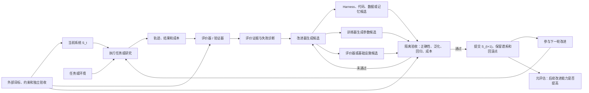

# RSI 调研笔记

## 2026-09-11：什么是 RSI，谁提出了这一思想？

### 阶段性结论

- RSI（Recursive Self-Improvement，递归自我改进）是一种让系统迭代改进自身、并使改进结果增强后续改进能力的研究思路。Wenyi Wang 的形式化研究将其描述为：程序生成后继程序，后继程序具有更强的生成优良未来程序的能力。[S1]
- 用于解释的概念示意：系统 A 改进自身得到 B，B 因而更善于改进系统，再产生 C。这是对上述定义的通俗说明，并非某个已实现系统的实验结果。[S1]
- I. J. Good 在《Speculations Concerning the First Ultraintelligent Machine》中明确提出：超智能机器能够设计更好的机器，并据此推演“智能爆炸”。已核查的原文重印件标注 ©1965，关键段落位于原文第 33 页。[S2][S3]
- 历史归属的稳妥表述：Good 1965 年的论述是 RSI 思想的经典早期出处。该证据不证明他首次使用了“Recursive Self-Improvement”这一术语，也不应将思想论述等同于成熟算法的发明。[S2][S3；归属边界为本次核查判断]
- 更早的相关设想：McCarthy、Minsky、Rochester、Shannon 于 1955 年撰写的达特茅斯研究提案已将 Self-Improvement 列为研究议题。这支持“机器自我改进思想早于 1965 年”的表述；不能仅凭该议题名称认定它已给出后来意义上的完整 RSI 论证。[S5；归属边界为本次分析]
- 不同研究对 RSI 的范围有不同表述：Wang 研究一类受限的程序改进系统；Anthropic 的官方文章讨论的是 AI 完全自主设计和开发后继 AI 的愿景。后续讨论需说明所采用的范围。[S1][S4；对比为本次分析]

### 已核查来源

以下页面或文件均于 2026-09-11 通过网页工具实际打开并读取；可达性仅代表本次访问结果。

- **S1**：Wenyi Wang，University of British Columbia，2018-05-17，arXiv 预印本《A Formulation of Recursive Self-Improvement and Its Possible Efficiency》。核查位置：第 1 节、第 2 节；本文仅研究一类 RSI 系统，不能据此推断通用 RSI 已实现。[元数据](https://arxiv.org/abs/1805.06610) · [全文](https://arxiv.org/html/1805.06610v1)
- **S2**：Irving John Good，原文署名机构为 Trinity College, Oxford 与 Atlas Computer Laboratory，©1965，《Speculations Concerning the First Ultraintelligent Machine》，Advances in Computers 第 6 卷。Virginia Tech 保存的重印节选共 3 页，对应原文第 31—33 页；本次已读取节选，未以此声称已阅读全文。[原文节选 PDF](https://vtechworks.lib.vt.edu/bitstreams/a5e423ee-54e0-4eec-aeca-32b73f851af5/download)
- **S3**：Virginia Tech 馆藏元数据。技术报告条目日期为 2005-03-05，备注明确标示重印自 ©1965 的 Advances in Computers 第 6 卷；注意区分重印时间与原文年份。[馆藏条目](https://vtechworks.lib.vt.edu/items/5085379d-b24c-424e-8861-e70a47b4b2fb/full)
- **S4**：Anthropic Institute，官方技术与研究解读《When AI builds itself》。已读取的页面未明确显示发布日期，不推测具体日期。核查位置：开篇关于完全自主设计与开发后继系统的定义，以及作者对尚未达到该状态的说明。[官方文章](https://www.anthropic.com/institute/recursive-self-improvement)
- **S5**：John McCarthy、Marvin Minsky、Nathaniel Rochester、Claude Shannon，1955，达特茅斯人工智能夏季研究项目提案。机构涉及 Dartmouth College、Harvard University、IBM、Bell Telephone Laboratories；原文由 Stanford 托管。协作核查已实际打开并确认第 5 项为 Self-Improvement。[提案原文](https://www-formal.stanford.edu/jmc/history/dartmouth/dartmouth.html)

## 2026-09-11：近期有哪些公司和高校推动，场景和需求是什么？

范围以 2025—2026 年公开进展为主；以下为代表性案例，不是机构投入或领先程度排名。所有链接已由本次主线或协作核查实际打开。论文结论与公司披露均保留其适用范围；“与 RSI 的关系”为基于机制的本次分析，不代表所有作者使用同一定义。

| 参与机构 | 工作与时间 | 场景和需求 | 改进对象及证据边界 |
| --- | --- | --- | --- |
| OpenAI | Research acceleration: The view inside OpenAI，2026-09-06，官方研究解读 | 自动化模型研发和对齐研究，减少编程、实验与分析的人工耗时 | 人类仍决定研究优先级、评判结果和是否扩大实验；自动研究员是目标，不能将内部使用量增长视为完整 RSI 已实现。[来源](https://openai.com/index/research-acceleration-view-inside-openai/) |
| Anthropic | When AI builds itself，讨论 2025—2026 年内部进展，已读正文未显示确切发布日期 | 训练代码优化、实验执行及安全研究，加快后继 AI 的研发 | 展示 AI 辅助研发和受限研究循环；官方明确表示尚未达到完全自主开发后继系统。内部代码量、主观效率和特定任务加速不能直接当作总体研发加速率。[来源](https://www.anthropic.com/institute/recursive-self-improvement) |
| Google DeepMind | AlphaEvolve，2025-05-14；2026-05-07 更新 | 数据中心调度、TPU 设计、Gemini 训练内核，降低算力消耗和人工优化成本 | 固定模型驱动程序搜索和自动评测；部分优化进入 AI 基础设施，但不代表基础模型自行反复升级。[首发](https://deepmind.google/blog/alphaevolve-a-gemini-powered-coding-agent-for-designing-advanced-algorithms/) · [2026 更新](https://deepmind.google/blog/alphaevolve-impact/) |
| Sakana AI、UBC、Vector Institute | Darwin Gödel Machine，2025-05-29 预印本，2025-05-30 博客 | 编码 Agent 自动改进工具、上下文管理与工作流，减少人工设计依赖 | 后代改写自身代码并继续参与改进；基础模型参数固定，外层版本库维护和父代选择不可自改。[论文](https://arxiv.org/html/2505.22954v1) · [博客](https://sakana.ai/dgm/) |
| Sakana AI、UC Berkeley | Recursive Harness Self-Improvement，2026-07-17 预印本 | 自动定制机器学习研究 Agent 的角色、交互和信息传递流程，降低人工维护成本 | 改进提示形式的运行框架；底模冻结，优化器外置，依赖 LLM 比较评价。实验为 30 项合成研究任务，不能称为 30 项真实企业部署。[论文](https://arxiv.org/html/2607.15524v1) |
| Weco AI | AIDE²，2026-07-14 公司技术博客；基于 2025 年 AIDE 论文 | 让外环自动改写内环研究 Agent，提升自动化机器学习、启发式算法和 Harness 研发效率 | Weco 报告 100 次无人干预外环迭代、7 个被接受版本及外部任务迁移；但这是公司自报，完整技术报告与 AIDE\_85 发布仍被写为后续工作。Ignition test 未达到统计显著，Weco 将其自评为 RSI Level 1。[AIDE² 报告](https://www.weco.ai/blog/first-evidence-of-recursive-self-improvement) · [AIDE 论文](https://arxiv.org/html/2502.13138v1) |
| Hexo Labs、牛津大学 | SIA，2026-05-26 预印本，当前 v2 | 在法律分类、自定义 CUDA 内核优化和 RNA 去噪中自动选择修改 Harness 或用 LoRA 更新模型，降低领域 Agent 适配成本 | 两类更新均有实验，但流程主要先改 Harness、停滞后改权重，尚未充分证明长期交错共进化。LawBench rollout 在 test split 上取训练奖励，不宜作为独立泛化证据。[论文](https://arxiv.org/html/2605.27276v2) |
| 小米 Darwin Agent Team | HarnessX，2026-06-12 预印本，当前 v3 | 自动组合和优化提示、工具、记忆及控制流，并让模型训练吸收多个 Harness 产生的经验 | 在 GAIA、WebShop 上共享轨迹并进行 Harness 更新与 cross-harness GRPO，是模型—Harness 跨轮联合更新的直接实验；没有独立任务集验证迁移，外部 meta-agent 固定。[论文](https://arxiv.org/html/2606.14249v3) · [代码](https://github.com/Darwin-Agent/HarnessX) · [团队负责人主页](https://shaokun91.github.io/) |
| Princeton、Google DeepMind、ARISE Foundation | Continual Harness，2026-05-11 预印本 | 在无法频繁重置的长程、部分可观察环境中在线更新提示、子 Agent、技能和记忆，并减少人工环境重置与持续纠错 | Pokémon 实验包含教师重标注和 Soft SFT 的模型—Harness 共学习；依赖更强教师，弱模型可能回退，也未证明自我改进能力会开放式复利增长。[论文](https://arxiv.org/html/2605.09998v1) |
| 香港大学 In³ Lab | HELIX，2026-08-14 预印本 | 将异构编码 Agent 拆成有类型接口的可组合组件，支持 Harness 搜索、版本追踪、审计及后训练数据生成 | 完成一轮 Harness 搜索并导出 438 条训练记录；论文明确没有训练更新后的模型，Build–Update–Rebuild 仍是待完整验证的框架愿景。[论文](https://arxiv.org/html/2608.13951v1) |
| Stanford、UC Berkeley、NVIDIA Research | LLM-as-a-Verifier，2026-07-06 预印本，当前 v2 | 为代码、机器人和医疗等长程任务提供连续评分、候选筛选、进度判断及 RL 稠密奖励，缓解 RSI 的验证和信用分配瓶颈 | 属于改进循环的验证基础设施，没有演示改进器多代增强；LLM 评分不能等同形式验证，且部分方法需要访问模型 logits。[论文](https://arxiv.org/html/2607.05391v2) |
| Southeast University、King’s College London、Qilu University of Technology、Alan Turing Institute | MC²，2026-04-19 预印本 | 将单题反思汇总成跨实例微课程和全局元知识，使 Agent 持续积累推理、监督和纠错策略 | 更新内容写入 Prompt，基础模型没有微调；反思模块接收正确性二值反馈，不能称为完全无监督。属于持久化元认知 Harness 改进，不是参数级或开放式 RSI。[论文](https://arxiv.org/html/2604.17399v1) |
| 香港中文大学、华为诺亚方舟实验室、Southeast University | Reasoning Scaffolding，2025-09-28 预印本，当前 v2 | 把教师模型轨迹中的推理阶段和话语结构蒸馏给较小学生模型，提高结构化推理能力 | 这里的 scaffolding 指被蒸馏的推理结构，不是自动改写 Agent Harness。训练依赖教师轨迹和标签器，没有形成系统自我改进闭环。[论文](https://arxiv.org/html/2509.23619v2) |
| DeepGrounding、AlphaAvatar、Illinois Institute of Technology | Recursive Self-Improvement in AI，2026-07-08 预印本，当前 v2 | 建立“改进对象 × 闭环程度”分类和验证信号层级，用于区分有界自完善、自动研究循环与开放式 RSI | 属于综述和作者提出的分析框架，不是 RSI 实现；1,250 指检索语料规模，不能解释为已验证成果数量。[论文](https://arxiv.org/html/2607.07663v2) |
| 吉林大学、KAUST、University of Alberta、IDSIA 等 | Self-Improvements in Modern Agentic Systems，2026-07-14 预印本 | 从模型参数与运行支架两个层面整理自生成数据、自评价、记忆、工具和工作流更新，提供系统工程研究地图 | 覆盖范围包括普通 Agent 自改进，并非所有方法都满足严格 RSI；属于预印本综述，不代表领域已有统一定义。[论文](https://arxiv.org/html/2607.13104v1) |
| 清华大学、BIGAI、宾夕法尼亚州立大学 | Absolute Zero，2025-05-06 预印本 | 代码推理训练及向数学推理迁移，缓解人工题目和答案供给瓶颈 | 同一模型自己出题、解题，用代码执行器校验并更新；“零数据”仅针对所研究的后训练阶段，依赖已有预训练模型、人设训练规则和环境。[论文](https://arxiv.org/html/2505.03335v1) · [后续版本](https://arxiv.org/html/2505.03335v3) |
| NVIDIA、卡内基梅隆大学、UC Berkeley | ENPIRE，2026-06-18 预印本 | 真实机器人操作；减少人工重置场景、验证结果和调试学习算法的负担 | 用物理试验反馈改策略、训练代码和基础设施，基础 LLM 未自主训练升级。官网 99% 指 pass@8，不能误写为单次成功率。[官方项目页](https://research.nvidia.com/labs/gear/enpire/) · [论文](https://arxiv.org/abs/2606.19980) |

补充线索（均已打开核查，供后续专题选取）：

- Sakana AI 已正式宣布成立 RSI Lab，目标包括用 AI 改进 AI 开发过程、提高算力与样本效率；这是组织目标，不能当作完整 RSI 已实现的证据。已读正文未显示明确发布日期。[官方公告](https://sakana.ai/rsi-lab/)
- 微软亚洲研究院 rStar-Math（2025-01-08，论文含北大、清华实习研究者）：小模型数学推理；用搜索、策略模型与过程偏好模型的多轮更新减少高质量标注和强教师依赖。训练流程仍由人设定；高校作者参与不自动意味着高校整体战略。[论文](https://arxiv.org/html/2501.04519v1) · [微软解读](https://www.microsoft.com/en-us/research/blog/new-methods-boost-reasoning-in-small-and-large-language-models/)
- Sakana AI 与牛津、剑桥的 LLM²/DiscoPOP（2024-06-13 博客，早于本次重点时段）：自动发现偏好优化损失函数，以减少人工算法试错；研究结果反馈为发现模型的上下文，不能因此宣称已完成模型代际递归升级。[官方博客](https://sakana.ai/llm-squared/)
- STOP 的微软官方页标注 2023-10，后发表于 COLM 2024；不应误列为 2025 年新作。它让调用固定 LLM 的优化程序改进自身，基础 LLM 不变。[微软论文页](https://www.microsoft.com/en-us/research/publication/self-taught-optimizer-stop-recursively-self-improving-code-generation/)

本次归纳：公开场景集中于 AI 研发提速、智能体程序和工作流优化、减少人工训练数据依赖，以及机器人学习自动化。LLM 的代码生成、工具使用与执行反馈，为局部自我改进提供了可实验的循环；上述例子并不共同证明不受限的持续能力增长。OpenAI 于 2026-09-09 的官方说明明确表示，完全自主、连续推动更强后继 AI 的 RSI 尚未发生。[官方说明](https://openai.com/index/ai-policy-window/)

## 2026-09-11：对用户提供的 RSI 笔记仓库进行原文复核

已逐项检查用户提供的 [RSI 笔记目录](https://github.com/panshaowu/study_note/tree/main/RSI)，并将笔记中的关键判断对照原论文或发布机构的一手页面。该仓库适合作为选题索引和中文导读；以下事实仍以原始材料为依据。

### 值得补入后续研究的材料

| 材料 | 可补充的技术线索 | 证据边界 |
| --- | --- | --- |
| Recursive Self-Improvement in AI（2026） | 用“改进对象 × 闭环程度”组织 RSI：改进部署行为、模型策略、评估器或研究过程，并区分不同程度的人类参与；还给出从形式验证到模型自评的验证信号层级。 | arXiv 预印本；1,250 是检索语料规模，不能理解成 1,250 个已验证的 RSI 系统。开放式 RSI 的划界是作者框架，不是领域唯一标准。[论文 v2](https://arxiv.org/html/2607.07663v2) |
| Self-Improvements in Modern Agentic Systems（2026） | 用模型参数 θ 与运行支架 Σ（提示、记忆、工具、控制流）描述 Agent，适合回答“能力写回哪里、反馈从哪里来、改进如何持久化”。 | arXiv 预印本；覆盖广义 Agent 自改进，其中许多方法并不满足严格 RSI。[论文](https://arxiv.org/html/2607.13104v1) |
| SIA（Hexo Labs、牛津大学，2026） | 将 harness 修改和 LoRA 权重更新放入同一适配流程，覆盖法律分类、自定义 CUDA 内核优化和 RNA 去噪，是“代码与参数双路径更新”的直接案例。 | 实验主要先迭代 harness，停滞后转向权重更新，没有充分展示长期、反复交错的共进化。固定 verifier 本身不排除 RSI；本实验仍需核查评价覆盖和投机风险。LawBench rollout 在 test split 上执行取奖励，因此不宜把其结果解释成独立泛化验证。[论文 v2](https://arxiv.org/html/2605.27276v2) |
| HarnessX（小米 Darwin Agent Team，2026） | 在共享轨迹缓冲区上进行 harness 更新和 cross-harness GRPO；GAIA 与 WebShop 实验报告了相对 harness-only 的联合更新收益，是仓库中模型与 harness 跨轮联合更新证据最直接的一项。 | 适配和结果报告使用同一批任务，没有独立任务集验证迁移；外部 meta-agent 保持固定。[论文 v3](https://arxiv.org/html/2606.14249v3) · [代码](https://github.com/Darwin-Agent/HarnessX) |
| Continual Harness（Princeton、Google DeepMind、ARISE，2026） | 在不重置的长程 Pokémon 环境中，在线更新提示、子 Agent、技能和记忆；扩展实验又通过教师重标注和 Soft SFT 更新开源模型，补充“持续环境中的模型—harness 共学习”。 | 仍依赖更强教师，弱模型可能回退；没有证明系统的“自我改进能力本身”会开放式复利增长。[论文](https://arxiv.org/html/2605.09998v1) |
| HELIX（香港大学 In³ Lab，2026） | 将多个编码 Agent 拆成带类型接口的可组合组件，并生成可追溯的成功/失败 sibling trajectories，适合研究 harness 版本化、审计和后训练数据接口。 | 论文明确说明没有训练更新后的模型，只完成一轮 harness 搜索和 438 条训练记录导出；Build–Update–Rebuild 是框架愿景，尚非完整实证闭环。[论文](https://arxiv.org/html/2608.13951v1) |
| LLM-as-a-Verifier（Stanford、UC Berkeley、NVIDIA，2026） | 将评分 token 的概率分布变成连续分数，并沿重复评估、标准分解等轴扩展验证计算，可作为候选选择、进度判断和 RL 奖励的基础设施。 | 它解决“怎样识别改进”，本身没有演示改进器多代增强；LLM 评分也不等于形式正确性保证。[论文](https://arxiv.org/html/2607.05391v2) |
| AIDE²（Weco AI，2026） | 外环重写内环研究 Agent 的 harness；公司报告 100 次无人干预的外环迭代、7 个被接受版本及未用于选择的外部任务测试。这一案例适合研究“改进优化器”和固定预算下的多阶泛化。 | 当前引用来源是 Weco 自己的技术博客；页面称完整技术报告和 AIDE\_85 发布将随后提供。作者也明确说 ignition test 未形成统计显著证据，因此只自评为其 RSI Level 1。[官方报告](https://www.weco.ai/blog/first-evidence-of-recursive-self-improvement) · [四级框架](https://www.weco.ai/blog/4-levels-of-recursive-self-improvement) |

辅助性材料也可保留，但优先级较低：MC² 通过跨实例反思、微课程和全局元知识持续改 prompt，适合研究元认知记忆，但没有更新模型参数；Reasoning Scaffolding 将教师推理结构蒸馏到学生模型，属于 RSI 可用的能力内化技术，并非自我改进闭环。[MC²](https://arxiv.org/html/2604.17399v1) · [Reasoning Scaffolding](https://arxiv.org/html/2509.23619v2)

### 需要修正或降级表述的地方

- [仓库总览](https://github.com/panshaowu/study_note/blob/main/RSI/RSI_Papers_Notes.md)把两篇 2026 年综述称为“权威”或近似统一定义。二者截至本次核查均是 arXiv 预印本，适合作为分类框架，不能据此声称已有统一共识。
- 总览称 HELIX 已打通 harness 演化、数据沉淀和模型后训练全闭环；原文 §9.5 明确说本研究没有训练更新后的模型。
- 总览称 RHI 产生的轨迹已直接用于 RL/DPO 微调；RHI 当前实验只优化 prompt 级 harness，基础模型冻结。轨迹用于后续训练属于作者提出的未来方向。[RHI 论文](https://arxiv.org/html/2607.15524v1)
- 总览称 MC² 把经验固化到模型参数；该论文没有微调，元知识写入并更新的是 prompt。
- 总览把 AIDE² 的双层 RSI 实验放在 arXiv:2502.13138 标题下。该论文实际介绍的是 AIDE 的任务解代码树搜索，其搜索策略是硬编码的；AIDE² 是 2026 年另一篇 Weco 公司博客，必须分开引用。[AIDE 论文](https://arxiv.org/html/2502.13138v1) · [AIDE² 博客](https://www.weco.ai/blog/first-evidence-of-recursive-self-improvement)
- 总览中的“详细笔记”链接使用作者本机的 `file:///C:/Users/...` 地址，外部读者无法访问；对外材料应改成仓库内相对链接或 GitHub HTTPS 链接。

本次新增判断：仓库最有价值的补充不是又增加若干“RSI 已实现”案例，而是显出一条快速成形的工程路线——**运行支架搜索 → 可验证轨迹沉淀 → 参数更新 → 重新适配运行支架**。目前只有少数工作执行了其中多段，尚没有一项同时证明长期跨代提升、独立任务泛化、改进器能力复利增长和验证器稳健性。

## 2026-09-11：四类技术方案的区别与联系

### 核心判断

此前归纳的四类并不是四种互斥、处于同一层级的算法：“自动化 AI 研发”描述的是系统最终要覆盖的**任务范围和发展目标**；Harness 自我改进、模型—Harness 联合更新以及验证/能力内化，描述的是实现这个目标所需的**更新对象和基础模块**。因此，OpenAI、Anthropic 的公开论述在目标范围上更前瞻，但不能据此认定其公开技术证据比后几类更成熟。[OpenAI](https://openai.com/index/research-acceleration-view-inside-openai/) · [Anthropic](https://www.anthropic.com/institute/recursive-self-improvement)

公开实证仍需与愿景分开：OpenAI 将当前系统描述为可在研究人员指导下完成明确任务的“研究实习生”阶段，人类继续设定方向并判断结果；Anthropic 的 Automated Alignment Researcher 能围绕给定的弱到强监督问题提出想法、写代码和运行实验，但没有展示 Claude 自主训练出更强 Claude、再由后者接管下一轮研发的连续闭环。[OpenAI](https://openai.com/index/research-acceleration-view-inside-openai/) · [Anthropic AAR](https://alignment.anthropic.com/2026/automated-w2s-researcher/)

| 层级 | 主要问题 | 被更新的对象 | 常用机制 | 与严格 RSI 的距离 |
| --- | --- | --- | --- | --- |
| 自动化 AI 研发 | 能否把提出假设、改代码、运行实验、判断结果、训练和发布后继系统连成闭环 | 整个 AI 研发过程，最终可能包含改进器本身 | Agent、程序搜索、实验调度、训练、评估和人工治理的组合 | 目标最接近完整 RSI；公开案例中仍有人决定方向、评判关键结果或控制发布，完整闭环尚未得到公开证明。 |
| Harness 自我改进 | 固定模型条件下，怎样让 Agent 更会使用上下文、工具和计算 | Prompt、记忆、工具、控制流、搜索策略和 Agent 源码 | 进化搜索、代码重写、局部比较、测试驱动选择；不要求 RL 或权重训练 | 无需更新基础模型权重；成本和速度取决于搜索、执行与评测预算，不能统一称为低成本。DGM 附录估算一次完整 SWE-bench 运行约 22,000 美元。[DGM](https://arxiv.org/html/2505.22954v2#A5.SS1) · [RHI](https://arxiv.org/html/2607.15524v1) |
| 模型—Harness 联合更新 | 失败应归因于模型知识不足还是外部工作流设计不佳，二者怎样协同适配 | 模型参数 θ 与 Harness Σ | LoRA、SFT、RL/GRPO，加上 Harness 搜索或重写 | 联合更新覆盖更多组件；更新范围更广本身不能证明递归性或改进器能力增强。难点包括信用分配、非平稳性和独立任务泛化。[SIA](https://arxiv.org/html/2605.27276v2) · [HarnessX](https://arxiv.org/html/2606.14249v3) · [Continual Harness](https://arxiv.org/html/2605.09998v1) |
| 验证、反馈与能力内化 | 怎样判断候选真的更好，并把运行时获得的策略沉淀成可复用能力 | 评价信号、轨迹数据、长期记忆，必要时再写入模型参数 | 单元测试、形式验证、LLM judge、过程奖励、轨迹筛选、蒸馏、SFT/RL | 是前三类共同依赖的横向基础设施。评价器固定不排除 RSI；应另行核查其评价范围、误差和被投机风险。[Verifier](https://arxiv.org/html/2607.05391v2) · [HELIX](https://arxiv.org/html/2608.13951v1) |

一个较完整的工程闭环可以表示为：先由系统设计者或治理机制明确目标和验收标准 → 评价器按标准测量候选 → 研究 Agent 使用当前模型与 Harness 运行实验 → 修改 Harness、数据、模型或其他组件 → 将通过验收的结果写回系统 → 改进后的版本参与后续优化。各类更新的频率和成本应逐项记录，不能把 Harness 固定称为快循环、把权重固定称为慢循环。OpenAI、Anthropic 描述的是这条链路最终覆盖整个模型研发流程后的愿景；后面的论文主要分别实现和测量链路中的一段或数段。

### 与传统 RL 的区别

把后三类全部概括为“现有 RL 的演进”并不准确。传统 RL 通常在给定环境、奖励、训练算法和系统边界下更新策略参数；RSI 关注的是系统能否持续改变这些边界中的更多部分，并让改进后的系统接管下一轮改进。

- 明确使用参数训练的案例包括 Absolute Zero 的可验证自生成课程与 RL、HarnessX 的 cross-harness GRPO、Continual Harness 的 Soft SFT，以及 SIA 的 LoRA 更新。[Absolute Zero](https://arxiv.org/html/2505.03335v3)
- DGM 是 Agent 源码和工具的开放式搜索，RHI 是 Prompt Harness 局部优化，HELIX 是组件组合与数据生成，MC² 更新 Prompt 元知识，LLM-as-a-Verifier 负责推理期评分；这些工作都不能简单归为 RL。[MC²](https://arxiv.org/html/2604.17399v1)
- AIDE² 更能说明两条路线可以汇合：它不靠更新底模，而是让外环改写内环研究 Agent，再测试新 Agent 是否更善于优化其他任务。Weco 的实验支持其所谓 Level 1，但改进后的 Agent 是否成为显著更强的下一代改进器，即 ignition，仍未得到统计显著支持。[Weco 报告](https://www.weco.ai/blog/first-evidence-of-recursive-self-improvement)

本次分析结论：OpenAI、Anthropic 更前瞻的是**问题定义和最终愿景**；学术界及其他公司的具体工作更像在构建可测量的局部模块。后者并非与前者竞争的较低级方案，而是实现前者所描述完整闭环所需的技术积木。当前的主要瓶颈已经不只是选择哪种 RL 算法，还包括可靠验证、跨模块信用分配、独立任务泛化、持续运行中的回退控制，以及能否真正提升下一代系统的改进能力。

## 2026-09-11：RSI 的本质、与 RL 的关系、调整对象及完整流程

### 1. 本次调研采用的操作性定义

RSI 不是一种与 PPO、DPO 并列的训练算法，而是一种**改进能力进入自身反馈回路的系统结构**。Wang 2018 的形式化要求当前程序产生后继程序，并且后继程序更善于产生优良的未来程序；这把“业务任务做得更好”和“更善于制造下一次升级”区分开来。[Wang §1—3](https://arxiv.org/html/1805.06610v1)

由于当前文献用词并不统一，本次研究采用以下三级判定：

1. **普通优化**：固定改进器不断改被优化对象，例如固定 PPO 训练策略、固定搜索器优化代码。
2. **持久自我改进**：系统自己的执行产生学习信号或修改方案，更新被写回其未来会使用的模型、Harness、记忆或代码。一次回答中的临时反思不算持久更新。[Agent 自改进综述 §3](https://arxiv.org/html/2607.13104v1#S3)
3. **递归自我改进**：改进后的系统或改进器参与后续改进；更强的实证还需证明它在相同预算、独立任务上更善于产生后续升级，而不只是当前任务分数更高。STOP 用当前 improver 改当前 improver，是直观的递归结构实例；论文同时明确其冻结基础 LM，因而不称为完整 RSI。[STOP](https://arxiv.org/abs/2310.02304)

“递归”不等于“循环运行很多轮”。普通训练也有循环；RSI 的关键是**循环产物是否回过头改变产生下一次改进的能力**。固定评价器也不排除 RSI：Wang 的形式化使用固定 score，STOP 使用固定 meta-utility。修改评价器属于更开放的一种形态，不是所有 RSI 定义的必要条件。

### 2. 先声明“自我”的系统边界

同一项工作是否算自我改进，取决于把什么算作系统：

- **模型边界**：系统仅指基础模型。权重或架构变化属于模型层修改；是否构成自我改进，还需核查模型或所属系统是否参与产生修改，以及修改是否经过验证并持久用于后续运行。
- **Agent 边界**：系统是模型 θ 加 Harness Σ；提示、记忆、工具和控制代码的持久变化也属于系统变化。相关综述将 Agent 形式化为 `A_t=(θ_t,Σ_t)`。[Agent 自改进综述 §3.1—3.2](https://arxiv.org/html/2607.13104v1#S3)
- **AI 研发系统边界**：系统还包括数据生成、训练程序、评估器、实验平台和研究 Agent。OpenAI、Anthropic 的公开愿景采用的接近这一宽边界，因此看起来比只改 Prompt 或权重的论文更前瞻。[OpenAI](https://openai.com/index/research-acceleration-view-inside-openai/) · [Anthropic](https://www.anthropic.com/institute/recursive-self-improvement)

### 3. 与强化学习的区别和联系

Sutton 与 Barto 将 RL 概括为 Agent 与不确定环境交互并最大化累计奖励的计算方法。[MIT Press 教材页](https://mitpress.mit.edu/9780262039246/reinforcement-learning/) 常见 RL 可以抽象为：

作为便于比较的一个**固定 PPO 式示例**，可写成：`θ_(t+1) = U_RL(θ_t, trajectories; fixed environment, reward, trainer)`。

这个示例更新任务策略 θ，并把环境、奖励定义、训练器和实验流程视为外部固定；这不是 RL 的必要定义，例如 RLHF 流程也可以继续收集偏好并更新奖励模型。[InstructGPT §3.1](https://arxiv.org/pdf/2203.02155) RSI 更关心：

`S_(t+1) = Improve_(S_t)(S_t, evidence, budget)`

即当前系统参与产生自身的下一版本，下一版本再被用于后续改进。二者关系如下：

| 情况 | 是 RL 吗 | 是 RSI 吗 |
| --- | --- | --- |
| 固定 PPO 训练一个游戏策略 | 是 | 通常不是；训练器没有因此变得更会改进系统。[PPO](https://arxiv.org/abs/1707.06347) |
| DGM/STOP 改写 Agent 或 improver 代码，基础模型冻结 | 否 | 具有有界递归自修改结构，但作者对“完整 RSI”有保留。[DGM](https://arxiv.org/html/2505.22954v2) · [STOP](https://arxiv.org/abs/2310.02304) |
| Absolute Zero 自己出题、解题、由执行器验证并用 RL 更新 | 是 | 实现了自生成任务与参数更新的有界循环；是否称为 RSI 取决于系统边界，任务机制、执行器和训练算法仍外置。[论文](https://arxiv.org/html/2505.03335v3) |
| HarnessX 同时搜索 Harness 并用 GRPO 更新模型 | 部分环节是 | 实现了模型参数与 Harness 的跨轮联合更新；这本身不能证明改进器递归增强，且没有独立任务集证明迁移。[论文](https://arxiv.org/html/2606.14249v3) |
| 新系统在相同预算下比旧系统更能产生下一代改进 | 可以使用也可以不使用 RL | 本次调研把它作为“较强递归证据”的操作性标准，不代表领域统一定义；AIDE² 尝试了 ignition test，但效率差异未达到统计显著。[Weco](https://www.weco.ai/blog/first-evidence-of-recursive-self-improvement) |

Gödel Machine 说明二者可以组合：初始问题求解程序可以是普通 RL，而自修改机制原则上能够重写整个程序，包括负责寻找改进的证明搜索器。这一例子不证明 RL 与 RSI 概念之间存在单向包含关系。[Gödel Machine §2.2](https://arxiv.org/html/cs/0309048v5)

### 4. RSI 可能涉及的调整对象

以下是用于核查论文披露范围的**工程检查清单**，不是互斥的数学分解；每项可能重叠，环境是否属于“系统自身”也必须另行声明：

`S_t = { θ, Σ, D, V, U, E, I }_t`，外加通常由外部固定的 `A = {G, budget, safety policy, private tests}`。

| 对象 | 包括的内容 | 当前公开证据 |
| --- | --- | --- |
| `θ` 模型参数 | 权重和 LoRA 参数；模型选择属于 Harness 或更新流程决策，不等于参数本身；架构可另列 | SIA、HarnessX 已更新参数；尚未证明基础模型架构的自主连续重设计。[SIA](https://arxiv.org/html/2605.27276v2) |
| `Σ` Harness | System Prompt、上下文装配、记忆、工具、控制流、多 Agent 协作、Agent 源码 | DGM、RHI、STOP 等已进行代码或 Prompt 层改进；多数底模冻结。[RHI](https://arxiv.org/html/2607.15524v1) |
| `D` 数据与课程 | 自生成任务、难度分布、失败样本、轨迹筛选、经验回放、技能库 | Absolute Zero 展示自生成可验证课程；HELIX 展示轨迹生成接口但未训练下一代模型。[HELIX](https://arxiv.org/html/2608.13951v1) |
| `V` 验证与奖励 | 单元测试、形式验证、奖励模型、LLM judge、rubric、回归和成本指标 | Self-Rewarding LM 更新了回答与自评分能力；这不意味着自评分就是客观真值。[Self-Rewarding LM](https://arxiv.org/html/2401.10020v1) · [LLM-as-a-Verifier](https://arxiv.org/html/2607.05391v2) |
| `U` 更新器/改进器 | SFT/RL 算法、损失函数、优化器、采样策略、代码搜索、实验规划、候选选择 | AIDE²、STOP 直接把 improver 或研究 Agent 作为修改对象；这是最靠近“改进改进器”的层面。 |
| `E` 任务与环境 | 训练任务、模拟器、工具/API、测试环境、机器人环境 | Continual Harness 在不重置环境中持续适配；任务和环境仍由外部提供。[论文](https://arxiv.org/html/2605.09998v1) |
| `I` 基础设施 | 训练/推理内核、调度、缓存、实验并行、算力分配和沙箱 | AlphaEvolve 的成果已用于数据中心调度、TPU 电路和 Gemini 训练内核；没有形成自主扩充硬件的闭环。[DeepMind](https://deepmind.google/blog/alphaevolve-a-gemini-powered-coding-agent-for-designing-advanced-algorithms/) |
| `A` 外部锚点 | 最终目标、预算、安全权限、独立验收集、发布和回滚条件 | 可以让系统调整子目标和代理奖励，但最终验收依据若随系统一起任意变化，将无法判断能力真的提高。固定外部锚点与有界 RSI 并不冲突。[RSI 综述 §2.1—2.2](https://arxiv.org/html/2607.07663v2#S2) |

### 5. 完整工程流程

以下是跨论文抽象出的理想流程，并非某一项现有工作已全部实现：

1. **定义边界和基线**：声明系统包含哪些组件，冻结最终目标、预算、安全权限和独立评测集。
2. **执行并记录**：让当前版本解决任务或开展研究，记录输出、工具调用、失败、成本和代码/模型版本。
3. **诊断与归因**：判断瓶颈属于模型、Harness、数据、验证器、改进算法还是基础设施。
4. **生成候选修改**：创建多个 Prompt/代码分支、数据课程、模型 checkpoint、评价方法或搜索策略。
5. **隔离实验**：在沙箱中运行候选；必要时进行 SFT、RL、蒸馏或程序搜索。
6. **独立验证**：同时检查正确性、未见任务泛化、成本、回归、鲁棒性和评测投机，而不是只看优化时使用的分数。
7. **选择、提交和回滚**：接受有效版本，保存修改、证据及谱系；拒绝或回滚退化版本。
8. **能力沉淀**：把有效修改写入 Harness、记忆、技能、数据、模型、评价器、训练或研究流程；分别记录对象、频率、成本和持久性。
9. **后继版本参与后续改进**：`S_(t+1)` 参与下一轮诊断、方案生成、实验或更新；版本档案式系统不要求最新版本立即全面替代旧版本。
10. **元评估**：让新旧版本从相同起点、在相同预算和独立改进任务上竞争，判断新版本是否更善于制造后续升级。

现有工作的实证覆盖不同片段：RHI/DGM 修改 Harness 或 Agent 代码；Absolute Zero、SIA、HarnessX 和 Continual Harness 的特定实验更新参数；AIDE²/STOP 把研究 Agent 或改进器列为修改对象；OpenAI、Anthropic 描述的是把这些环节扩展到下一代 AI 研发的愿景。更新频率和成本因项目而异。本次核查尚未找到同时证明上述十步长期稳定运行的公开工作。

## 2026-09-11：术语、流程、场景与工作负载复核版

本节按“知之为知之，不知为不知”重新核查前述回答。下列术语是**本次调研采用的工作定义**，不是声称业界已有统一词典；工作负载只写入论文或机构一手材料直接披露的内容。文中“未公开”表示来源明确未给出，“不明确”表示本次核查的一手材料不足以得出可靠结论。

### 1. 术语及职责边界

| 术语 | 本次调研的工作定义 | 容易混淆的边界 |
| --- | --- | --- |
| **系统** | 分析时选定的“自我”边界，可以只是基础模型，也可以包含模型、Harness、数据、训练与实验设施。Gödel Machine 把任务策略和改进搜索程序纳入同一软件整体。[Gödel Machine §2.1—2.2](https://arxiv.org/html/cs/0309048v5) | 不先声明系统边界，就无法判断某次外部优化算不算“自我”改进。 |
| **模型** | 执行预测或生成的参数化计算机制；参数常记为 \(\theta\)。[Agent 自改进综述 §3.1](https://arxiv.org/html/2607.13104v1#S3.SS1) | Prompt、工具、工作流和 Agent 源码不等于模型权重。DGM 就冻结基础模型而修改 Agent 代码。[DGM §3](https://arxiv.org/html/2505.22954v2#S3) |
| **Agent** | 为完成任务而观察、采取动作并与环境交互的系统；在 LLM Agent 中，行为通常由模型和周边运行结构共同决定。[Agent 自改进综述 §3.1](https://arxiv.org/html/2607.13104v1#S3.SS1) | Agent 不必等于单个模型调用。 |
| **Harness／运行支架** | 组织模型执行任务的周边结构，例如提示、上下文装配、工具接口、记忆、路由和控制逻辑；各论文包含范围不同。[Agent 自改进综述 §3.1](https://arxiv.org/html/2607.13104v1#S3.SS1) | “Reasoning Scaffolding”论文中的 scaffolding 是被蒸馏的推理结构信号，不是 Harness。[论文](https://arxiv.org/html/2509.23619v1) |
| **改进器（improver）** | 接收待改进对象、评价目标和已有证据，提出或生成候选修改的程序或流程。STOP 的 improver 调用冻结 LM 和效用函数来优化代码。[STOP §3、Algorithm 1](https://arxiv.org/pdf/2310.02304) | 改进器不是基础模型的同义词，也不必通过梯度训练。 |
| **训练器（trainer）** | 组织训练数据或轨迹、计算学习目标或梯度并更新参数的程序。PPO 的采样、优势估计和策略参数优化是一个典型例子。[PPO Algorithm 1](https://arxiv.org/pdf/1707.06347) | 训练器可以是改进器调用的一个执行模块；程序搜索、Prompt 重写未必需要训练器。 |
| **评价器（evaluator）** | 按给定标准对输出、轨迹或候选版本产生质量信号，用于排序、筛选、训练或验收。STOP 区分下游任务效用和评价 improver 的元效用。[STOP](https://arxiv.org/pdf/2310.02304) | 评价器执行标准，不自动等于目标制定者，也不保证标准完整。 |
| **验证器（verifier）** | 本次分析中指重点检查正确性、成功条件或约束是否满足的评价机制。[LLM-as-a-Verifier §2—3](https://arxiv.org/html/2607.05391v2) | “验证器”这个名字不保证形式正确性：Gödel Machine 使用证明检查，而 LLM verifier 给出概率性评分，证据强度不同。[Gödel Machine §3.2](https://arxiv.org/html/cs/0309048v5) |
| **奖励函数／奖励模型** | 奖励函数直接给出学习信号；奖励模型从数据学习如何给分。InstructGPT 的奖励模型从人类比较数据学习偏好，再向 PPO 提供标量奖励。[InstructGPT §3](https://arxiv.org/pdf/2203.02155) | 奖励模型是评价机制的一种实现，不等于客观真值或完整人类目标。 |
| **环境** | Agent 动作作用于其中并从中得到观察和反馈的对象及状态转移机制，可以是软件、模拟器或物理世界。[LLM-as-a-Verifier §2](https://arxiv.org/html/2607.05391v2#S2) | 环境不等于奖励模型；环境是否属于可修改系统边界要单独说明。 |
| **轨迹** | 一次执行中按顺序记录的观察、动作及可选反馈或奖励。[LLM-as-a-Verifier §2](https://arxiv.org/html/2607.05391v2#S2) | 轨迹首先是运行记录，只有被筛选并送入学习流程后才成为训练材料。 |
| **候选版本／选择器** | 候选版本是尚待评测的新代码、Prompt、数据配置或模型 checkpoint；选择器依据评价证据决定接受、保留、拒绝或回滚。DGM 使用版本档案而非只保留最新版本。[DGM §3](https://arxiv.org/html/2505.22954v2#S3) | “发生修改”不等于“已经改进”；必须说明验收标准和比较对象。 |
| **外部锚点** | 本次调研的工作用语，指相对被更新部分保持独立的目标、预算、安全权限或验收依据。STOP 的任务效用和元效用就是一种有界例子。[STOP Algorithm 1](https://arxiv.org/pdf/2310.02304) | “外部”是相对系统边界而言，不意味着必须由另一家公司提供。固定评价器与有界 RSI 可以共存。 |
| **元循环／元评估** | 元循环更新学习器、改进器或改进方法；元评估则比较新旧版本在相同预算和独立改进任务上制造后续升级的能力。[Learned Optimizers，Figure 1](https://arxiv.org/pdf/2101.07367) | 多嵌套一层或多运行几轮，不自动证明递归自我改进。 |

术语间最简关系是：**Agent 执行任务形成轨迹；评价器或验证器把轨迹变成证据；改进器依据证据提出候选；需要更新参数时调用训练器；选择器只提交通过验收的版本。改进后的系统或改进器继续参与后续改进，才进一步讨论递归性。**

### 2. RSI 的本质、与 RL 的关系及完整流程

RSI 描述的是**改进能力进入自身后续改进回路的系统性质**；RL 描述的是 Agent 通过交互信号学习、以提高累计奖励的一类优化方法。[Wang 2018](https://arxiv.org/html/1805.06610v1) · [Sutton 与 Barto](https://mitpress.mit.edu/9780262039246/reinforcement-learning/) 因此：

- 不是所有 RL 都是 RSI：固定 PPO 训练任务策略，并未因此更新训练器或后续改进能力。
- 不是所有 RSI 式循环都用 RL：STOP、DGM、RHI 主要改代码或 Prompt。
- RL 可以作为 RSI 系统中的**训练器**：Absolute Zero、SIA 和 HarnessX 的部分实验就是这种组合。
- 本次调研把“新版本在相同预算、独立改进任务上更善于制造下一次升级”作为较强递归证据；这是操作性标准，不是领域统一定义。[Wang 2018](https://arxiv.org/html/1805.06610v1) · [AIDE² ignition test](https://www.weco.ai/blog/first-evidence-of-recursive-self-improvement)

#### 2.1 “模型级、Agent 级、AI 研发系统级”的维度澄清

“RL 属于模型级、Agentic RL 数据属于 Agent 级、RSI 属于 AI 研发系统级”可以帮助形成初步直觉，但它混合了**优化方法、数据粒度、更新对象和递归层级**，不能作为严格的一一对应。

| 概念 | 它首先描述什么 | 数据通常来自哪里 | 通常更新什么 | 是否要求递归 |
| --- | --- | --- | --- | --- |
| **RL** | 根据交互和奖励优化行为的学习方法 | 状态、动作、奖励或轨迹 | 常见是策略模型参数，也可以是其他可学习策略或控制器 | 不要求 |
| **Agentic RL** | RL 在多轮 Agent 执行流程中的应用 | Agent 级长程轨迹，包括多次模型调用、工具使用和环境反馈 | 当前主流做法主要更新 LLM 参数，部署 Harness 通常保持固定 | 不要求 |
| **RSI** | 改进结果进入后续自我改进回路的系统性质 | 可以来自任务执行、Agent 运行、训练实验或完整研发流程 | 取决于“自我”的边界，可以是模型、Harness、改进器或 AI 研发系统 | 要求改进后的系统或改进器参与后续改进；更强证据还需显示后续改进能力提高 |

典型流程可以分别写成：

- 普通 RL：\(\theta_{t+1}=RL(\theta_t,\tau,r)\)。
- 当前常见 Agentic RL：\(\tau=Agent(\theta_t,H,E)\)，再由 \(RL\) 更新 \(\theta_t\)，而 \(H_{t+1}=H_t\)。
- RSI：\(S_{t+1}=Improve_{S_t}(S_t,evidence)\)，随后让 \(S_{t+1}\) 参与后续改进。

因此更准确的表述是：**RL 是优化方法；Agentic RL 使用 Agent 级轨迹，但当前通常仍执行模型级参数更新；完整 RSI 愿景才对应 AI 研发系统级递归闭环。**局部 RSI 也可能只发生在模型或 Agent/Harness 边界内，不能把所有 RSI 都限定成完整研发系统。

Agent Lightning v1.0 为上述 Agentic RL 边界提供了清楚实例：部署时的 Harness 负责上下文构造、工具执行、控制流和环境交互，训练器只观察模型请求—响应并更新模型；把真实 Harness 接入训练不表示 Harness 自身也被优化。[Agent Lightning v1.0 §1](https://arxiv.org/abs/2608.17528) 这一区分可以概括为：

- **Agent 级数据、模型级更新**：固定 Harness 产生长程轨迹，RL 让 LLM 适应该 Harness 定义的观察、动作和工具协议。
- **Harness 级更新**：修改 Prompt、上下文策略、工具接口、中间件、状态管理、恢复逻辑或控制流，模型参数可以保持固定。[Harness 优化研究](https://arxiv.org/abs/2609.05736)
- **模型—Harness 联合更新**：两类对象跨轮共同变化，例如 HarnessX 的特定共同演化实验和 SIA 的 Harness／LoRA 双路径实验。[HarnessX](https://arxiv.org/html/2606.14249v3) · [SIA](https://arxiv.org/html/2605.27276v2)

RL 也可以直接训练 Harness 中的可学习控制器，因此“Agentic RL 一定不改变 Harness”不是普遍成立的定义。[Offline RL for Harness Control](https://arxiv.org/abs/2607.05458) 判断具体工作时应分别记录：轨迹在哪一层产生、哪些参数或代码被更新、更新后是否持久生效，以及新版本是否参与下一轮改进。

#### 2.2 完整工程流程

以下流程是跨论文抽象出的工程参考，不代表某一现有项目已完整实现：

若评价器自身也是候选更新对象，就要再用相对独立的测试、证明检查、人类复核或其他验收信号校准它；否则分数提高可能只是评价标准漂移。这是工程风险判断，不是说评价器必须永远固定。

### 3. 已核查工作的统一多维对照

以下不再把工作强制分成互斥类别，而是分别记录其**应用场景、工作负载、更新对象、更新机制和闭环证据**。更新对象沿用前文工程检查清单中的标签：\(\theta\) 为模型或策略参数，\(\Sigma\) 为 Harness，\(D\) 为数据与课程，\(V\) 为评价器，\(U\) 为改进器或更新流程，\(E\) 为任务环境，\(I\) 为基础设施。标签可以重叠，不代表这些对象构成互斥分解。

| 工作 | 应用场景 | 具体问题与实际负载／数据集 | 更新对象 | 更新机制 | 闭环事实与证据边界 |
| --- | --- | --- | --- | --- | --- |
| [**OpenAI Research acceleration**](https://openai.com/index/research-acceleration-view-inside-openai/) | AI 研发 | 减少前沿模型研究中的编码、实验执行、基础设施排障和监控负担；材料来自内部 coding-agent 会话、提交和实验记录。**具体任务、原始会话、数据集和训练配方未公开。** | 研究／工程代码、\(I\)；是否更新具体 \(\theta,\Sigma,U\) 不明确 | Coding Agent 辅助设计、实现、运行和分析实验；具体自动更新算法未公开 | 当前是人指导下的研发自动化，人仍定方向和判结果；未证明自主训练后继模型的连续闭环 |
| [**Anthropic：When AI builds itself**](https://www.anthropic.com/institute/recursive-self-improvement) | AI 研发 | 训练设施排障、代码审查、小模型训练代码优化和研究下一步选择；训练加速案例的模型、数据集和完整代码**未说明** | 研究／工程代码和实验方案；具体 \(\theta,\Sigma,U\) 不明确 | Claude 调试、优化代码、分析研究会话；完整研发算法未公开 | 约 52× 只适用于所测代码，不能解释成整体训练提速；未展示 Claude 自主训练后继 Claude |
| [**Anthropic 自动化 weak-to-strong 研究实验**](https://alignment.anthropic.com/2026/automated-w2s-researcher/) | 对齐研究自动化 | 主搜索为 HelpSteer2/3 聊天偏好二分类，OOD 测试 RM-Bench、RewardBench 2；另分别验证 DAPO-Math-17K→AIME 2024/2025、TACO 易题→难题迁移 | \(D,U,\theta_{student}\) | Claude Opus 4.6 生成研究方案、处理数据、修改训练算法并训练 Qwen3-4B-Base | 学生模型和训练方案更新，研究 Agent Claude 固定；评测 API 可重复访问，存在验证集使用和投机问题；生产迁移收益在噪声范围 |
| [**AlphaEvolve**](https://arxiv.org/html/2506.13131v1) | AI 基础设施与算法工程 | Borg 历史及近期未见负载快照；真实 TPU 输入形状；Verilog 功能等价验证；GPU 推理随机输入对照。内部完整数据**未公开** | 算法代码、\(I\) | LLM 生成程序、进化搜索、自动评测和候选选择 | 证明调度、分块、Verilog 和 XLA IR 可被自动优化；外层搜索系统及基础模型固定，没有模型代际 RSI |
| [**AIDE²**](https://www.weco.ai/blog/first-evidence-of-recursive-self-improvement) | 自动化研究 Agent | ML 工程、组合启发式和 Harness 工程；外测 MLE-Bench Lite、ALE-Bench Lite、WeatherBench 2、KernelBench。内部完整任务清单**未给出** | \(U,\Sigma,V\)；基础模型 \(\theta\) 固定 | 外层 Opus 4.7 改写内层 Gemini 3 Flash Agent 的搜索、Prompt、上下文、评测和防投机代码 | 100 次改写接受 7 次，形成外层改内层的递归结构；改进器增强的 ignition test 没有显著结论，完整技术报告未发布 |
| [**STOP**](https://arxiv.org/pdf/2310.02304) | 算法优化器 | 10-bit Learning Parity with Noise；迁移至 String Grid Distance、修改版二次分配、3SAT、MaxCut 和无噪声 parity | \(U\)；基础模型 \(\theta\) 固定 | LLM 按任务 utility 重写优化器自身 Python 代码 | 改进后的 improver 再参与自改，具有递归结构；作者明确不称其为完整 RSI，且没有生产软件负载证据。[代码](https://github.com/microsoft/stop) |
| [**Darwin Gödel Machine**](https://arxiv.org/html/2505.22954v2) | 软件工程 Agent | SWE-bench Verified 和 Aider Polyglot，演化 80 轮；SWE 搜索最高使用 200 题子集，20%→50% 不是全量 500 题结果 | \(\Sigma\)：Agent 代码、工具和上下文流程；基础模型 \(\theta\) 固定 | 开放式代码改写、任务执行评测、候选档案和父代选择 | 候选档案中的 Agent 产生后代，形成有界代码层递归；外层档案和父代选择固定。完整 SWE-bench 运行估算约 22,000 美元。[代码](https://github.com/jennyzzt/dgm) |
| [**RHI**](https://arxiv.org/html/2607.15524v1) | ML 研究 Agent | 30 个由招聘岗位描述改写的合成任务：量化金融、机器人、药物相关 ML 各 10 个；生成代码、实验和报告 | \(\Sigma\)；基础模型 \(\theta\) 固定 | 根据历轮结果和 LLM 成对偏好更新角色、协作流程、信息传递及停止／回退 Prompt | 多轮持久 Harness 优化；外部优化器和评价器固定，没有权重更新。任务不是相关公司的真实生产实验；完整题集和官方代码本次未找到 |
| [**HarnessX**](https://arxiv.org/html/2606.14249v3) | 通用工具 Agent | GAIA 103、ALFWorld 134、WebShop 100、τ³-Bench 三领域、SWE-bench Verified 55；共同演化子实验使用 Qwen3.5-9B＋GAIA／WebShop | 主实验 \(\Sigma,D\)；共同演化子实验再更新 \(\theta\) | 模块化 Harness 演化、跨轮轨迹池、cross-harness GRPO | 主实验为 Harness 持久更新；特定子实验实现模型—Harness 跨轮更新。演化和成绩评估使用同组任务，没有独立留出任务；外层 meta-agent 固定。[代码](https://github.com/Darwin-Agent/HarnessX) |
| [**HELIX**](https://arxiv.org/html/2608.13951v1) | 编码 Agent 组合与数据生产 | 100 个 LiveCodeBench 衍生修复任务、65 个组合、6,500 个执行槽位；另有 55 个 SWE-bench 实例 | \(\Sigma,D\)；未更新 \(\theta\) | 带类型接口的组件重组、执行测试、成功与失败轨迹导出 | 只完成一轮 Harness 搜索和训练记录导出，没有实际模型训练或多轮共同演化；79/100 是事后覆盖并集，不是单 Agent 成绩。[代码](https://github.com/HKUDS/HELIX) |
| [**SIA**](https://arxiv.org/html/2605.27276v2) | 跨领域 Agent 适配 | LawBench 191 类、5,332 训练／913 测试；H100 上一个固定输入形状的 CUDA 内核；Baron pancreas 单细胞 RNA 去噪。RNA 精确样本数在已核查位置**不明确** | \(\Sigma,\theta\) | Meta／Feedback Agent 搜索 Harness；停滞后用 LoRA 及 PPO+GAE、entropic advantage weighting 或 GRPO 更新参数 | 两种对象均有更新，但主要是先 Harness、后权重，未充分证明长期交错共进化；LawBench test split 被用于 rollout 奖励，不能当独立泛化测试 |
| [**Continual Harness**](https://arxiv.org/html/2605.09998v1) | 长程、部分可观察游戏 Agent | Pokémon Red／Emerald，按里程碑和按钮次数评估；共学习每轮 256 步，使用 Gemma-4 和更强 Gemini 教师，另测 20 个留出 transition | \(\Sigma,D\)；扩展实验更新 \(\theta\)；\(E\) 固定 | 在线 Harness 适配、过程奖励、教师重标注和 Soft SFT | 持续环境中实现 Harness 更新和部分参数学习；依赖更强教师，弱模型可能退化，未建立收敛点或开放式递归增强 |
| [**Absolute Zero**](https://arxiv.org/html/2505.03335v3) | 代码与数学推理后训练 | 自生成 deduction、abduction、induction 代码任务；评测 CruxEval、LiveCodeBench、HumanEval+、MBPP+，并迁移到 AIME、MATH500 等 | \(D,\theta\)；代码执行器和训练规则固定 | 同一模型提出并解决任务，Python 执行器验证，再以 RL 更新参数 | 实现自生成课程与参数更新循环；是否称为 RSI 取决于系统边界。“零数据”只指该后训练阶段无需人工题目和答案 |
| [**Self-Rewarding Language Models**](https://arxiv.org/html/2401.10020v1) | 指令对齐 | Llama 2 70B；Open Assistant 3,200 条 IFT、1,775／531 条 EFT；后续产生 3,964、6,942 条偏好对；评测 AlpacaEval 2.0 | \(D,\theta\) | 演化模型生成回答并自评，再用 DPO 更新参数 | 形成多轮自生成偏好和参数更新；仍依赖人工种子、固定 Llama 2-Chat Prompt 生成器、外部验证和 Claude 2 checkpoint 选择 |
| [**LLM-as-a-Verifier**](https://arxiv.org/html/2607.05391v2) | Agent 评价基础设施 | Terminal-Bench V2、SWE-bench Verified、RoboRewardBench 500 对轨迹、MedAgentBench、LIBERO-90；MedAgentBench 精确任务数在本次核查位置**不明确** | \(V\) | 利用评分 token 的概率分布、重复评分和标准分解生成连续分数，并可作为 RL 奖励 | 改善候选选择、进度判断和信用分配；没有演示改进器跨代增强。依赖 logits，LLM 判断可能出错，不能等同形式证明 |
| [**MC²**](https://arxiv.org/html/2604.17399v1) | 数学与符号推理 | GSM8K 1,319、MATH500 500、TheoremQA 800、Game of 24 100；长期实验把同一 MATH500 处理五遍 | \(\Sigma\)：角色 Prompt、微经验和全局元知识；\(\theta\) 固定 | Reasoner、Monitor、Controller 反思并跨批次写回元知识 | 形成持久 Prompt／记忆更新；使用正确性二值反馈，不能称完全无监督。重复同一测试集的提升不能直接证明未知任务泛化 |
| [**Reasoning Scaffolding**](https://arxiv.org/html/2509.23619v1) | 小模型推理蒸馏 | StrategyQA、CommonsenseQA、TruthfulQA、GSM8K、MATH500；DeepSeek-R1 教师，GPT-4.1 辅助标注 | \(D,\theta_{student}\) | 教师语义阶段标注、LoRA 和新增信号嵌入／预测头的监督训练 | 是一次监督蒸馏组件，没有递归自改进闭环；此处 scaffolding 是推理结构，不是 Agent Harness。匿名代码链接本次访问失败 |
| [**ENPIRE**](https://arxiv.org/html/2606.19980) | 真实机器人策略研发 | 双臂 6-DoF YAM；真实 Push-T、4 mm 插针、GPU 插入、扎带切割；模拟 Gym-PushT、RoboCasa365。总体 99% 是 pass@8 | 机器人策略参数、\(U,I\)；基础 LLM \(\theta_{LLM}\) 固定 | Coding Agent 根据物理试验反馈修改策略、训练／算法代码和实验设施 | Stage 1 的 API、安全、重置和奖励由人参与构建后冻结；Stage 2 自动迭代机器人策略，但没有基础 LLM 自主升级。[项目页](https://research.nvidia.com/labs/gear/enpire/) |

综述和理论材料的“工作负载”应另行处理：Good 1965、Wang 2018 和 Gödel Machine 主要给出思想或形式化框架；两篇 2026 年 RSI／Agent 自改进综述是文献分类工作。对这些材料写“数据集不适用”，不能因为没有 benchmark 就推断其结论无效，也不能把综述收录数量当成 RSI 系统的验证数量。[Good 原文节选](https://vtechworks.lib.vt.edu/bitstreams/a5e423ee-54e0-4eec-aeca-32b73f851af5/download) · [Wang](https://arxiv.org/html/1805.06610v1) · [Gödel Machine](https://arxiv.org/html/cs/0309048v5) · [RSI 综述](https://arxiv.org/html/2607.07663v2) · [Agent 自改进综述](https://arxiv.org/html/2607.13104v1)

### 4. 对历史分析的统一降级与修正

- **提出者问题**：Good 1965 是 RSI 思想的经典早期出处；现有证据不足以断言他首次创造了“Recursive Self-Improvement”术语或发明了成熟算法。1955 年达特茅斯提案已列出 Self-Improvement，但没有给出后来意义上的完整 RSI 机制。[Good](https://vtechworks.lib.vt.edu/items/5085379d-b24c-424e-8861-e70a47b4b2fb/full) · [达特茅斯提案](https://www-formal.stanford.edu/jmc/history/dartmouth/dartmouth.html)
- **愿景与实证**：OpenAI、Anthropic 的公开文章覆盖更广的自动化 AI 研发愿景；当前公开案例没有证明自主、长期地设计并训练后继基础模型。不能因愿景更前瞻，就判定其公开 RSI 实证更成熟。
- **RSI 分级**：本笔记中的“普通优化／持久自我改进／递归自我改进”和“较强递归证据”是分析用标准；两篇 2026 年综述也是作者框架，当前没有找到领域统一分级。
- **固定评价器**：固定评价器不排除有界 RSI，也不必然是错误代理；应逐项说明它测量什么、遗漏什么、是否能被投机。
- **修改范围与递归性**：联合更新模型与 Harness 覆盖面更广，但不自动比只改代码的 STOP 更“递归”；递归性要看改进后的改进器或系统是否参与并增强后续改进。
- **成本与循环速度**：Harness 改写无需训练基础模型，但搜索和评测仍可能昂贵；“快循环／慢循环”没有统一阈值，应按具体工作记录频率、预算和持久性。
- **仓库补充材料**：RHI 没有把轨迹用于实际 RL／DPO；HELIX 没有训练更新后的模型；MC² 把元知识写入 Prompt 而非参数；AIDE 论文和 AIDE² 公司实验是两项不同工作。
- **缺失信息**：只有来源明确没给出时写“未公开”；本次核查位置不足时写“不明确”；没有论文复现或独立第三方验证时，不把作者自报写成已独立证实。
