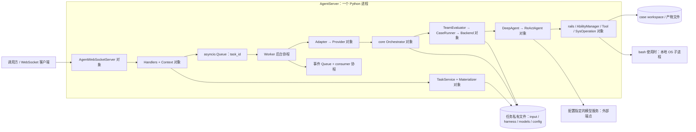
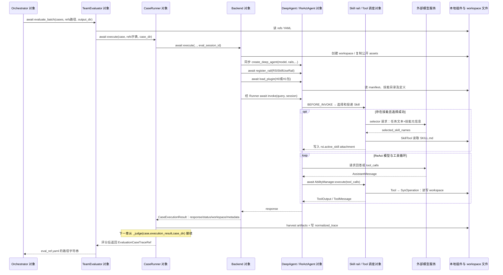

# F01 深读第一轮：请求怎样穿过各组件，成为一次 Harness 任务执行

核查日期：2026-09-16。范围对应原 walkthrough 的 A1、A2 和 A3 宿主执行部分；评分、诊断、改写和发布由后续章节展开。本章依据本地源码做静态追踪，未启动 AgentServer、未调用模型、未运行现有 pytest。

源码基线仍为 agent-core `13d226d91ccc1ff4c041e984fb6aa90de6c5e0ff`、jiuwenswarm `f29c060cee90aef10e46b2a3646fe3628f60ea7c`。Swarm 固定依赖的是 core `564997732e22fcdd204959b79b38b4768f5220c0`，因此下面是两个本地快照之间的静态接口映射，不能称为这个组合已联调通过。[依赖声明](https://gitcode.com/openJiuwen/jiuwenswarm/blob/f29c060cee90aef10e46b2a3646fe3628f60ea7c/pyproject.toml#L20)

## 1. 先固定本章要跟踪的任务

贯穿教学任务是“读取销售数据，生成 `report.json`，必填字段包含 `currency`”。假设 H0 生成的报告缺 `currency`，之后尝试新增 `schema_check` Skill。`currency`、销售数据、具体工具轨迹不是仓库内一次真实演进的运行结果。真实 handoff 测试使用 `case_a` / `Create a structured report`，预设的要求是生成结构化产物后重新打开并对照 schema；其计划确实指向 `skills/schema_check/SKILL.md`。这提供机制原型，不提供端到端效果证明。[handoff 测试](https://gitcode.com/openJiuwen/agent-core/blob/13d226d91ccc1ff4c041e984fb6aa90de6c5e0ff/tests/unit_tests/rsi/test_analyzer_optimizer_handoff.py#L32)

为了让调用链具体，本章使用如下**教学请求轮廓**；数据文件和模型 ID 需由真实环境提供，不能直接当作已运行的命令：

```json
{
  "req_method": "rsi.task.create",
  "params": {
    "scenario": "HARNESS",
    "name": "report-schema-check",
    "input_file": "<已准备的数据集路径>",
    "model_refs": {
      "tester": "<models.list 中的被评测模型引用>",
      "optimizer": "<models.list 中的分析和改写模型引用>"
    },
    "max_iterations": 1,
    "training_options": {
      "evaluation_method": "llm_as_judge",
      "batch_size": 1
    }
  }
}
```

`rsi.task.create` 要求 HARNESS 场景同时提供 tester、optimizer 和数据集，且不接受 `optimization_instruction`。本例显式选 `llm_as_judge`；真实 API 默认是 `script-based`。`training_options` 中字段也可以放在顶层，同名时顶层优先。`execution_mode` 默认 local，当前适配拒绝其他模式。[请求校验](https://gitcode.com/openJiuwen/jiuwenswarm/blob/f29c060cee90aef10e46b2a3646fe3628f60ea7c/jiuwenswarm/agents/harness/common/rsi/services.py#L124)、[参数优先级与默认值](https://gitcode.com/openJiuwen/jiuwenswarm/blob/f29c060cee90aef10e46b2a3646fe3628f60ea7c/jiuwenswarm/agents/harness/common/rsi/services.py#L843)

## 2. 这些组件是什么运行实体，谁装配它们

本例从 AgentServer 开始，到优化编排器、Evaluator、DeepAgent 都是**同一 Python 进程中的对象**。Worker 中的 Task 指 `asyncio.Task`，不是独立 OS 进程、远程 actor 或 Ray actor。模型端点是进程外依赖；只有调用 shell 工具时才可能创建本地子进程。generic local 路径不要求 Docker；SWE-bench 的容器分支是另一路，本例不经过它。[Worker 创建 Task](https://gitcode.com/openJiuwen/jiuwenswarm/blob/f29c060cee90aef10e46b2a3646fe3628f60ea7c/jiuwenswarm/agents/harness/common/rsi/worker.py#L198)、[local backend 分支](https://gitcode.com/openJiuwen/agent-core/blob/13d226d91ccc1ff4c041e984fb6aa90de6c5e0ff/openjiuwen/rsi/harness_rsi/evaluator/case_backend.py#L140)、[本地 shell 创建子进程](https://gitcode.com/openJiuwen/agent-core/blob/13d226d91ccc1ff4c041e984fb6aa90de6c5e0ff/openjiuwen/core/sys_operation/local/shell_operation.py#L333)

| 对象或运行实体 | 谁创建、何时创建 | 实際持有和传给谁 |
|---|---|---|
| `RsiServiceContext` 对象 | `AgentWebSocketServer._get_rsi_handlers()` 首次收到 RSI 请求时懒创建，后续复用 | 创建 store、worker、projector、artifact service、task service；把同一个 store 交给 Worker 和 TaskService。`context.adapters` 就是 `worker.adapters` 的同一个字典。[装配](https://gitcode.com/openJiuwen/jiuwenswarm/blob/f29c060cee90aef10e46b2a3646fe3628f60ea7c/jiuwenswarm/agents/harness/common/rsi/context.py#L49) |
| `RsiTaskMaterializer`、`RsiModelConfigResolver` 对象 | `build_rsi_service_context(...enable_harness_materialization=True)` 创建 | 注入 TaskService；ModelResolver 同实例也传给 Provider。任务输入固定发生在 create 中。[组合根](https://gitcode.com/openJiuwen/jiuwenswarm/blob/f29c060cee90aef10e46b2a3646fe3628f60ea7c/jiuwenswarm/agents/harness/common/rsi/context.py#L270) |
| `HarnessProvider` 与 `HarnessEngineAdapter` 对象 | real 模式下 AgentServer 创建 Provider；Context 用 Adapter 包装并注册为 `HARNESS` | Adapter 持有 `provider`；Worker 按 task.scenario 从字典拿同一个 Adapter。默认模式 real，环境可显式选择 mock。[模式与注册](https://gitcode.com/openJiuwen/jiuwenswarm/blob/f29c060cee90aef10e46b2a3646fe3628f60ea7c/jiuwenswarm/server/agent_ws_server.py#L10536)、[包装](https://gitcode.com/openJiuwen/jiuwenswarm/blob/f29c060cee90aef10e46b2a3646fe3628f60ea7c/jiuwenswarm/agents/harness/common/rsi/context.py#L219) |
| `RsiAgentServerHandlers` 对象 | 同一懒创建过程 | 持有 Context；绑定 `harness_refs_provider` 回调到 TaskService、状态与进度推送回调；执行 workspace 恢复，但恢复不自动重新入队。[构造](https://gitcode.com/openJiuwen/jiuwenswarm/blob/f29c060cee90aef10e46b2a3646fe3628f60ea7c/jiuwenswarm/server/rsi/rsi_handlers.py#L52) |
| `SingleHarnessIterativeOptimizationOrchestrator` 对象 | Provider 每次 `_resolve_orchestrator(request)` 根据 task profile 创建；测试可直接注入对象 | 构造 `TeamEvaluator`、`EvaluationResultAnalyzer`、`MemberOptimizer`、`DataLoader`。这些名字都是对象，不对应四个服务进程。[Provider 工厂](https://gitcode.com/openJiuwen/jiuwenswarm/blob/f29c060cee90aef10e46b2a3646fe3628f60ea7c/jiuwenswarm/agents/harness/common/rsi/harness_provider.py#L396)、[core 构造](https://gitcode.com/openJiuwen/agent-core/blob/13d226d91ccc1ff4c041e984fb6aa90de6c5e0ff/openjiuwen/rsi/harness_rsi/single_harness/iterative.py#L141) |
| `CaseRunner`、`SingleHarnessExecutionBackend` 对象 | `TeamEvaluator._make_case_runner()` 调用 backend 工厂，再把 backend 和 judger 注入 CaseRunner | backend 执行，CaseRunner 收集产物并评分。`TeamEvaluator` 的历史名字不表示本例运行多 Agent Team，当前 backend registry 只有 single_harness。[创建](https://gitcode.com/openJiuwen/agent-core/blob/13d226d91ccc1ff4c041e984fb6aa90de6c5e0ff/openjiuwen/rsi/harness_rsi/evaluator/team_evaluator.py#L67)、[registry](https://gitcode.com/openJiuwen/agent-core/blob/13d226d91ccc1ff4c041e984fb6aa90de6c5e0ff/openjiuwen/rsi/harness_rsi/evaluator/case_backend.py#L694) |
| `DeepAgent`、内部 `ReActAgent`、rails、tools 对象 | backend 每次执行 case 创建 DeepAgent；工厂装配其运行组件 | DeepAgent 持有内部 ReActAgent；rails 在生命周期/工具调用前后介入；AbilityManager 通过进程全局 `Runner.resource_mgr` 找实际 Tool 实例。[创建 Agent](https://gitcode.com/openJiuwen/agent-core/blob/13d226d91ccc1ff4c041e984fb6aa90de6c5e0ff/openjiuwen/rsi/harness_rsi/evaluator/case_backend.py#L185)、[工具调度](https://gitcode.com/openJiuwen/agent-core/blob/13d226d91ccc1ff4c041e984fb6aa90de6c5e0ff/openjiuwen/core/single_agent/ability_manager.py#L1386) |



## 3. A1：create 固定输入，start 交给后台执行

### 3.1 WebSocket 请求怎样到 TaskService

AgentServer 的 `_handle_rsi_request` 先拿 handlers，再调用并 `await handle_async(request)`。后者根据 `_METHOD_DISPATCH` 找 `_do_task_create`；它先执行普通同步调用 `context.task_service.create(params)`。所以“外层 handler 是 async”不等于物化工作已经卸载到线程：这里没有 `to_thread`；文件复制和 YAML/JSON 写入直接在当前调用中执行。返回值是 `{ok:true,payload:{task_id,status:"CREATED"}}`，AgentServer 把它包装为 `AgentResponse` 后在 send lock 内发送。[传输入口](https://gitcode.com/openJiuwen/jiuwenswarm/blob/f29c060cee90aef10e46b2a3646fe3628f60ea7c/jiuwenswarm/server/agent_ws_server.py#L10476)、[实际 dispatch](https://gitcode.com/openJiuwen/jiuwenswarm/blob/f29c060cee90aef10e46b2a3646fe3628f60ea7c/jiuwenswarm/server/rsi/rsi_handlers.py#L104)、[create handler](https://gitcode.com/openJiuwen/jiuwenswarm/blob/f29c060cee90aef10e46b2a3646fe3628f60ea7c/jiuwenswarm/server/rsi/rsi_handlers.py#L146)

`request_id` 用于这次传输响应；`task_id` 是长期优化任务身份；`request.session_id` 被放入 `_rsi_session_id`，持久化为 `task.config.rsi_session_id`，用于后续事件推送路由。它不是后面每次评测产生的 `eval_<case_id>_<uuid>` 会话。[会话转存](https://gitcode.com/openJiuwen/jiuwenswarm/blob/f29c060cee90aef10e46b2a3646fe3628f60ea7c/jiuwenswarm/server/rsi/rsi_handlers.py#L120)、[持久化](https://gitcode.com/openJiuwen/jiuwenswarm/blob/f29c060cee90aef10e46b2a3646fe3628f60ea7c/jiuwenswarm/agents/harness/common/rsi/services.py#L296)

### 3.2 源 Harness 何时选定，复制了哪些内容

TaskService 先解析 source，再调用 materializer；不是到第一次 Agent 执行时才读取全局 active 指针。正常浏览器可用 `package_id` 选已安装插件；未指定时，AgentServer 的 provider 依次尝试 RSI active runtime、`initial_harness_refs.yaml`、generic registry（含 legacy harness_id 路径）和 native baseline。显式 package_id 不会静默改用 H0，并拒绝带 MCP 依赖的插件。TaskService 还允许受控调用/测试传 `harness_path`，这不等于普通 UI 暴露任意路径选择器。[源选择](https://gitcode.com/openJiuwen/jiuwenswarm/blob/f29c060cee90aef10e46b2a3646fe3628f60ea7c/jiuwenswarm/agents/harness/common/rsi/services.py#L333)、[package/active](https://gitcode.com/openJiuwen/jiuwenswarm/blob/f29c060cee90aef10e46b2a3646fe3628f60ea7c/jiuwenswarm/server/agent_ws_server.py#L10594)、[fallback](https://gitcode.com/openJiuwen/jiuwenswarm/blob/f29c060cee90aef10e46b2a3646fe3628f60ea7c/jiuwenswarm/server/agent_ws_server.py#L10634)

令 `T = <用户 workspace>/rsi/tasks/<task_id>`。源码定义的物化与消费者如下；路径中的 `<...>` 是占位符：

| 创建阶段写出的文件 | 写入者与内容 | 后续谁读 |
|---|---|---|
| `T/input/cases.json`，或保留源文件名的数据集 | `materialize_dataset` 规范化或 copy2 数据集，并通过 `copy_dataset_files` 复制引用附件，再验证 task-local 数据。[实现](https://gitcode.com/openJiuwen/jiuwenswarm/blob/f29c060cee90aef10e46b2a3646fe3628f60ea7c/jiuwenswarm/agents/harness/common/rsi/materializer.py#L108) | Adapter 把此路径放入 `dataset_files`；core load_cases/DataLoader 读取。 |
| `T/harness/versions/baseline-<hash16>/<包目录>` | `materialize_harness_refs` 验证源包并复制；目录源校验复制后的 hash。[实现](https://gitcode.com/openJiuwen/jiuwenswarm/blob/f29c060cee90aef10e46b2a3646fe3628f60ea7c/jiuwenswarm/agents/harness/common/rsi/materializer.py#L177) | 后续 backend 的 `agent.load_plugin(harness_path)` 读取这份包，而不是全局 active 原目录。 |
| `T/harness/harness_refs.yaml` | 写 `harness_refs: {validation_harness: <任务私有包绝对路径>}`；这是引用包装文件，不是 Skill 内容。[写入](https://gitcode.com/openJiuwen/jiuwenswarm/blob/f29c060cee90aef10e46b2a3646fe3628f60ea7c/jiuwenswarm/agents/harness/common/rsi/materializer.py#L231) | TeamEvaluator 读 YAML 为 `dict[str,str]`，backend 取唯一 role/path。 |
| `T/models/evaluation.yaml`、`analysis.yaml`、`member_optimization.yaml` | Resolver 按配置模型 ID 输出 core 可读配置；tester→evaluation，optimizer→另外两份。这是推理配置文件，没有权重更新。[映射](https://gitcode.com/openJiuwen/jiuwenswarm/blob/f29c060cee90aef10e46b2a3646fe3628f60ea7c/jiuwenswarm/agents/harness/common/rsi/materializer.py#L396)、[resolver](https://gitcode.com/openJiuwen/jiuwenswarm/blob/f29c060cee90aef10e46b2a3646fe3628f60ea7c/jiuwenswarm/agents/harness/common/rsi/model_resolver.py#L147) | 被评测 Agent 用 evaluation；分析/改写组件读各自配置；本例 LLM Judge 明确用 analysis。 |
| `T/config/harness_orchestrator.yaml` | 写 backend、评分方法、模型配置路径、batch/epoch 和优化约束，立即调用安装环境中的 core 配置加载器校验。[profile](https://gitcode.com/openJiuwen/jiuwenswarm/blob/f29c060cee90aef10e46b2a3646fe3628f60ea7c/jiuwenswarm/agents/harness/common/rsi/materializer.py#L278) | Provider `_build_config` 加载成 `AutoCoordinatingHarnessConfig`。 |
| `T/task.json` 及 `T/run/` | 上述步骤成功后 TaskService 才提交 `RsiTask`，配置内保存 `rsi_materials` manifest/hash 等。[提交](https://gitcode.com/openJiuwen/jiuwenswarm/blob/f29c060cee90aef10e46b2a3646fe3628f60ea7c/jiuwenswarm/agents/harness/common/rsi/services.py#L283) | Worker 从 store 读 RsiTaskView；run 是编排器产物根目录。 |

物化失败发生在 `task.json` 提交之前，TaskService 会移除未提交任务目录后重抛。运行前 Provider 再验证材料路径和 hash；因此“创建后换掉原始数据/active Harness”与“篡改任务私有输入”是不同情况，前者不会自动替换任务基线，后者可能被一致性校验拒绝。[失败清理](https://gitcode.com/openJiuwen/jiuwenswarm/blob/f29c060cee90aef10e46b2a3646fe3628f60ea7c/jiuwenswarm/agents/harness/common/rsi/services.py#L235)、[运行前检查](https://gitcode.com/openJiuwen/jiuwenswarm/blob/f29c060cee90aef10e46b2a3646fe3628f60ea7c/jiuwenswarm/agents/harness/common/rsi/harness_provider.py#L210)

### 3.3 start 返回时，优化还没有完成

另一条 `rsi.training.start` 请求只带 `task_id`。TaskService 同步调用 `worker.enqueue`，将 CREATED 改为 QUEUED、`put_nowait(task_id)`，创建或复用 `_run_loop` 后立即返回 QUEUED。队列循环取得 ID 后才改为 RUNNING，并创建 `_run_until_slot_free` Task；该 Task 再创建 `_execute_task` Task。[start](https://gitcode.com/openJiuwen/jiuwenswarm/blob/f29c060cee90aef10e46b2a3646fe3628f60ea7c/jiuwenswarm/agents/harness/common/rsi/services.py#L458)、[入队](https://gitcode.com/openJiuwen/jiuwenswarm/blob/f29c060cee90aef10e46b2a3646fe3628f60ea7c/jiuwenswarm/agents/harness/common/rsi/worker.py#L91)、[两层 Task](https://gitcode.com/openJiuwen/jiuwenswarm/blob/f29c060cee90aef10e46b2a3646fe3628f60ea7c/jiuwenswarm/agents/harness/common/rsi/worker.py#L212)

`_execute_task` 创建另一条容量 128 的**事件队列**及 `consume_queue` Task，将 `_sink(queue)` 作为 `on_event` 回调传给 Adapter。不要把它与保存 task_id 的任务队列混淆：前者装 `EngineEvent`，用于 usage/tree/progress；后者安排优化任务。最终结果在 Adapter await 返回后被转成任务状态，再持久化。[事件与执行装配](https://gitcode.com/openJiuwen/jiuwenswarm/blob/f29c060cee90aef10e46b2a3646fe3628f60ea7c/jiuwenswarm/agents/harness/common/rsi/worker.py#L288)、[事件 sink](https://gitcode.com/openJiuwen/jiuwenswarm/blob/f29c060cee90aef10e46b2a3646fe3628f60ea7c/jiuwenswarm/agents/harness/common/rsi/worker.py#L810)

## 4. A2：三种请求/配置对象如何交接

| 调用边 | 方式 | 输入→输出/下一层 |
|---|---|---|
| Worker→`adapter.build_request(task_view)` | 普通同步方法 | `RsiTaskView`→冻结 dataclass `HarnessEngineRequest`。`input_file`→单元素 tuple `dataset_files`；config refs/profile→对应字段；run_dir→output_dir；保留 task_id/model_refs/max_iterations。[定义与转换](https://gitcode.com/openJiuwen/jiuwenswarm/blob/f29c060cee90aef10e46b2a3646fe3628f60ea7c/jiuwenswarm/agents/harness/common/rsi/harness_adapter.py#L27) |
| Worker→`adapter.run(request,on_event)`→`provider.run` | 两层 `await`，同进程 | Adapter 不执行算法，仅转发同一个 request 和回调。[转发](https://gitcode.com/openJiuwen/jiuwenswarm/blob/f29c060cee90aef10e46b2a3646fe3628f60ea7c/jiuwenswarm/agents/harness/common/rsi/harness_adapter.py#L137) |
| Provider→`_build_config`→Orchestrator 构造 | 同步装配 | task profile 优先；已物化 profile 不再用公共模型 ID 覆写。`max_iterations` 已在 profile 映射为 `max_epochs`，不是靠 engine request 的 Agent step 参数传入。[加载](https://gitcode.com/openJiuwen/jiuwenswarm/blob/f29c060cee90aef10e46b2a3646fe3628f60ea7c/jiuwenswarm/agents/harness/common/rsi/harness_provider.py#L402)、[epoch 写入](https://gitcode.com/openJiuwen/jiuwenswarm/blob/f29c060cee90aef10e46b2a3646fe3628f60ea7c/jiuwenswarm/agents/harness/common/rsi/materializer.py#L410) |
| Provider→`orchestrator.run(engine_request)` | `await` | 把 tuple 转 list，构造 `IterativeSingleHarnessRequest(dataset_files,harness_refs_path,output_dir,dataset_id,resume,auto_full_baseline,task_id)`。新任务将 auto_full_baseline 设 True；core dataclass 自身默认 False，不能混用这两个入口的默认行为。[转换](https://gitcode.com/openJiuwen/jiuwenswarm/blob/f29c060cee90aef10e46b2a3646fe3628f60ea7c/jiuwenswarm/agents/harness/common/rsi/harness_provider.py#L203)、[core 定义](https://gitcode.com/openJiuwen/agent-core/blob/13d226d91ccc1ff4c041e984fb6aa90de6c5e0ff/openjiuwen/rsi/harness_rsi/single_harness/iterative.py#L94) |
| Orchestrator→Provider→Worker | await 返回后读取状态文件 | core 返回 `IterativeSingleHarnessResult`；当前 Provider 没使用其返回对象，而是 `_result_from_state(task_id)` 从 run 状态重建 `EngineResult`，Worker `_apply_result_status` 将其映射为任务终态。[Provider 返回](https://gitcode.com/openJiuwen/jiuwenswarm/blob/f29c060cee90aef10e46b2a3646fe3628f60ea7c/jiuwenswarm/agents/harness/common/rsi/harness_provider.py#L237)、[状态映射](https://gitcode.com/openJiuwen/jiuwenswarm/blob/f29c060cee90aef10e46b2a3646fe3628f60ea7c/jiuwenswarm/agents/harness/common/rsi/worker.py#L451) |

在教学任务中 tester 是写报告的模型；optimizer 是诊断/规划/生成 Skill 的模型。名称 tester 很容易被误读为专门“打分的模型”，实际不是：backend 从 `evaluator.model_config_ref` 加载它创建 DeepAgent。选 `llm_as_judge` 时，profile 将 `judge_model_config_ref` 指向 analysis，也就是 optimizer 对应配置，并将 judge_success_score 设为 0.8。[执行模型加载](https://gitcode.com/openJiuwen/agent-core/blob/13d226d91ccc1ff4c041e984fb6aa90de6c5e0ff/openjiuwen/rsi/harness_rsi/evaluator/case_backend.py#L173)、[Judge 配置](https://gitcode.com/openJiuwen/jiuwenswarm/blob/f29c060cee90aef10e46b2a3646fe3628f60ea7c/jiuwenswarm/agents/harness/common/rsi/materializer.py#L332)

### 4.1 run、epoch、batch、Agent iteration 是四种粒度

**run** 是 task 的一次完整优化执行，状态文件为 `run/single_harness_state.yaml`。它先读全部 cases，核对协议/fingerprint，并按生产入口要求全量执行一次 H0，输出到 `run/evaluations/frozen_baseline`。[初始化与 H0](https://gitcode.com/openJiuwen/agent-core/blob/13d226d91ccc1ff4c041e984fb6aa90de6c5e0ff/openjiuwen/rsi/harness_rsi/single_harness/iterative.py#L216)

**epoch** 是一整轮优化；请求的公共 max_iterations 控制它，代码明确一轮不是模型的一步。每个 epoch 从 best refs 起步，DataLoader 的 `load_files(...epoch=epoch)` 计划 batch；**batch** 是本轮一组案例，可能先过滤已有匹配版本证据中的通过项，过滤后为空则记 skipped。非空 batch 使用 `run/evaluations/e001/b001/source` 一类路径进行源评测/复用，再进入分析和改写。epoch 结束的全量检查不等同于这个 batch 的检查。[epoch/batch](https://gitcode.com/openJiuwen/agent-core/blob/13d226d91ccc1ff4c041e984fb6aa90de6c5e0ff/openjiuwen/rsi/harness_rsi/single_harness/iterative.py#L310)、[source 路径](https://gitcode.com/openJiuwen/agent-core/blob/13d226d91ccc1ff4c041e984fb6aa90de6c5e0ff/openjiuwen/rsi/harness_rsi/single_harness/iterative.py#L396)

**Agent iteration** 是一次 case 内部的 ReAct 循环步。backend 对 DeepAgent 显式设置 `enable_task_loop=False,max_iterations=100`；关闭的是 DeepAgent 外层 task loop，不是关闭内部“模型→工具→模型”循环。本例 max_iterations=1 的 RSI run 仍可让被评测 Agent 执行多次模型/工具调用。[backend 参数](https://gitcode.com/openJiuwen/agent-core/blob/13d226d91ccc1ff4c041e984fb6aa90de6c5e0ff/openjiuwen/rsi/harness_rsi/evaluator/case_backend.py#L185)、[DeepAgent 单轮分支](https://gitcode.com/openJiuwen/agent-core/blob/13d226d91ccc1ff4c041e984fb6aa90de6c5e0ff/openjiuwen/harness/deep_agent.py#L3045)、[内部 ReAct 循环](https://gitcode.com/openJiuwen/agent-core/blob/13d226d91ccc1ff4c041e984fb6aa90de6c5e0ff/openjiuwen/core/single_agent/agents/react_agent.py#L2766)

## 5. A3：Harness 文件怎样接到真实 Agent 和工具

### 5.1 Orchestrator 并不直接调用 DeepAgent

`Orchestrator._evaluate` 把 cases、当前 refs 文件、output_dir 交给 `TeamEvaluator.evaluate_batch`，并明确 `team_skill_ref_path=""`。Evaluator 先加载 refs 文件为字典，逐个把深拷贝 case/refs 交给 `CaseRunner.execute`。CaseRunner 生成评测专用 session_id、绑定 case-local home，然后调用 backend。接口调用不是靠文件轮询触发；文件承载的是输入包和持久化结果。[编排器交接](https://gitcode.com/openJiuwen/agent-core/blob/13d226d91ccc1ff4c041e984fb6aa90de6c5e0ff/openjiuwen/rsi/harness_rsi/single_harness/iterative.py#L1115)、[Evaluator 交接](https://gitcode.com/openJiuwen/agent-core/blob/13d226d91ccc1ff4c041e984fb6aa90de6c5e0ff/openjiuwen/rsi/harness_rsi/evaluator/team_evaluator.py#L138)、[CaseRunner 交接](https://gitcode.com/openJiuwen/agent-core/blob/13d226d91ccc1ff4c041e984fb6aa90de6c5e0ff/openjiuwen/rsi/harness_rsi/evaluator/case_runner.py#L92)

Evaluator 默认一次评测 case_concurrency=1；调用方指定大于 1 时，它创建多个 asyncio Task，用 Semaphore 限流，并按输入顺序 gather 结果。并发分支会创建相应 CaseRunner/backend 对象，共享 context-isolated trajectory processor；没有因此创建进程池。短暂基础设施/网络错误可按 transient_case_retry_limit 重跑，profile 默认该值为 2。[并发和重试](https://gitcode.com/openJiuwen/agent-core/blob/13d226d91ccc1ff4c041e984fb6aa90de6c5e0ff/openjiuwen/rsi/harness_rsi/evaluator/team_evaluator.py#L162)

### 5.2 backend 依次准备 workspace、模型、rails、插件

以下顺序很关键：**先有能使用技能的宿主 rail，再加载 H0/H1 中的技能文件**。

1. backend 从唯一 refs 项取 `role_name=validation_harness` 和包路径；普通任务创建 `<case_dir>/workspace`，有 `workspace_source_dir` 时复制源 workspace，再复制公开 assets。实际输入通过 `task_input(case)` 派生为 query。[准备](https://gitcode.com/openJiuwen/agent-core/blob/13d226d91ccc1ff4c041e984fb6aa90de6c5e0ff/openjiuwen/rsi/harness_rsi/evaluator/case_backend.py#L133)、[workspace 分支](https://gitcode.com/openJiuwen/agent-core/blob/13d226d91ccc1ff4c041e984fb6aa90de6c5e0ff/openjiuwen/rsi/harness_rsi/evaluator/case_backend.py#L455)
2. `_single_harness_rails` 创建 `RSISysOperationRail`、reliability rail、`HarnessInputRail`、`RSISkillUseRail`。普通路径没有 controlled-skill 配置时不注入指定 Skill；空 H0 也有 SkillUseRail，但它本身不凭空增加 schema_check。[rails](https://gitcode.com/openJiuwen/agent-core/blob/13d226d91ccc1ff4c041e984fb6aa90de6c5e0ff/openjiuwen/rsi/harness_rsi/evaluator/case_backend.py#L331)
3. 同步 `create_deep_agent` 创建对象。RSISkillUseRail 先从 factory 的 rails 参数排除，然后 backend 显式 `await agent.register_rail(rail)`，使它在 plugin discovery 前获得 SysOperation 等依赖。`register_rail` 将 deep_config 中的 operation/workspace 设置到 rail，执行 init 后注册回调。[注册顺序](https://gitcode.com/openJiuwen/agent-core/blob/13d226d91ccc1ff4c041e984fb6aa90de6c5e0ff/openjiuwen/rsi/harness_rsi/evaluator/case_backend.py#L204)、[注册内部](https://gitcode.com/openJiuwen/agent-core/blob/13d226d91ccc1ff4c041e984fb6aa90de6c5e0ff/openjiuwen/harness/deep_agent.py#L1929)
4. `await agent.load_plugin(harness_path)` 依次 `find_plugin_manifest`→`load_plugin_package`→`resolve_plugin_parts`→`_apply_extension_parts`。支持 manifest.json 及 legacy harness YAML；resolver 生成实际工具、rails、prompt sections、skills，不生成 subagent。[load_plugin](https://gitcode.com/openJiuwen/agent-core/blob/13d226d91ccc1ff4c041e984fb6aa90de6c5e0ff/openjiuwen/harness/deep_agent.py#L1986)、[resolver](https://gitcode.com/openJiuwen/agent-core/blob/13d226d91ccc1ff4c041e984fb6aa90de6c5e0ff/openjiuwen/harness/resources/extension_resolver.py#L103)
5. `apply_extension_hot` 按 tools、MCP、rails、prompt sections、skills 的顺序绑定；失败会反向撤销本次已绑定资源。Skill `_bind_skill` 找已有 SkillUseRail，更新技能 roots、清缓存并 `await reload_skills()`，成功后才提交 config.skills；找不到 rail 会抛错。[binder 顺序](https://gitcode.com/openJiuwen/agent-core/blob/13d226d91ccc1ff4c041e984fb6aa90de6c5e0ff/openjiuwen/harness/extension_binder.py#L27)、[skill binder](https://gitcode.com/openJiuwen/agent-core/blob/13d226d91ccc1ff4c041e984fb6aa90de6c5e0ff/openjiuwen/harness/extension_binder.py#L210)
6. backend 设置 Skill rail 的 selector 模型为同一个被评测 model，开启 task-start trigger，挂 TrajectoryRail，再 `await run_agent_with_empty_response_recovery(agent,{"query":...},session_id)`。[启动前装配](https://gitcode.com/openJiuwen/agent-core/blob/13d226d91ccc1ff4c041e984fb6aa90de6c5e0ff/openjiuwen/rsi/harness_rsi/evaluator/case_backend.py#L217)

`HarnessInputRail` 拦截已识别的向当前插件包写入的工具操作，提示把交付物写到 workspace；编排器评测前后还比较材料身份。这解释了两个写操作的区别：Agent 写的是本次报告产物；后续优化器写的是另一份 candidate Harness 文件，不能把 report.json 的修复当成持久改进已经完成。[输入包保护](https://gitcode.com/openJiuwen/agent-core/blob/13d226d91ccc1ff4c041e984fb6aa90de6c5e0ff/openjiuwen/rsi/harness_rsi/evaluator/harness_input_rail.py#L14)、[评测前后检查](https://gitcode.com/openJiuwen/agent-core/blob/13d226d91ccc1ff4c041e984fb6aa90de6c5e0ff/openjiuwen/rsi/harness_rsi/single_harness/iterative.py#L1123)

### 5.3 空 H0 为什么也能读写文件，H1 的新 Skill 如何生效

`read_file`、`write_file`、`edit_file`、glob、list_dir、grep、bash 来自 **RSISysOperationRail 对宿主工具的注册**，不要求 H0 包里定义这些工具。rail 创建对应 Tool 对象，调用 `agent.ability_manager.add_ability(tool.card,tool)`；工厂默认以 LOCAL 模式创建 SysOperation，并注册在进程全局 Runner.resource_mgr。普通评测显式 `restrict_to_work_dir=False`，所以 workspace 是工作位置，不等于 OS 沙箱。[工具列表](https://gitcode.com/openJiuwen/agent-core/blob/13d226d91ccc1ff4c041e984fb6aa90de6c5e0ff/openjiuwen/rsi/harness_rsi/evaluator/runtime_adapters.py#L73)、[LOCAL operation](https://gitcode.com/openJiuwen/agent-core/blob/13d226d91ccc1ff4c041e984fb6aa90de6c5e0ff/openjiuwen/harness/factory.py#L269)

当 H1 真正包含 schema_check 时，执行并不是 Python 编排器硬编码“每次写完 report.json 后必须运行 schema_check”。在本条 RSI 评测链，`DeepAgent.invoke` 的 BEFORE_INVOKE 生命周期触发 `RSISkillUseRail.before_invoke`：

| 实际衔接 | 输入与输出 | 对本例的含义 |
|---|---|---|
| `_trigger_relevant_skill`→`ListSkillTool.invoke` | query + 可用 Skill 元信息→`selected_skill_names` | 选择器可能选 schema_check，也可能没有相关技能；不是保证选择。[选择](https://gitcode.com/openJiuwen/agent-core/blob/13d226d91ccc1ff4c041e984fb6aa90de6c5e0ff/openjiuwen/rsi/harness_rsi/evaluator/runtime_adapters.py#L237) |
| rail→`SkillTool.invoke` | `{skill_name:首个选中项,relative_file_path:"SKILL.md"}`→`skill_content` | 读候选包中的文件；这个 task-start 调用是 rail 主动调用 Tool 对象，不是 Agent 模型发出的普通 tool_call。[读取](https://gitcode.com/openJiuwen/agent-core/blob/13d226d91ccc1ff4c041e984fb6aa90de6c5e0ff/openjiuwen/rsi/harness_rsi/evaluator/runtime_adapters.py#L285) |
| rail→`after_tool_call`→attachment writer | 从 Skill 正文提取 decision capsule；没有则用全正文；加 `rsi.active_skill` prompt attachment | 把“重读产物→对照 schema→修复”的约束加入本次推理上下文；记录内容 hash 和投递方式，AFTER_INVOKE 清除本次 attachment。[附件写入](https://gitcode.com/openJiuwen/agent-core/blob/13d226d91ccc1ff4c041e984fb6aa90de6c5e0ff/openjiuwen/rsi/harness_rsi/evaluator/runtime_adapters.py#L158) |
| DeepAgent→内部 ReActAgent | await 内部 invoke | 由模型继续决定 read/write/bash 的实际调用；Skill 已加载/已投递不等于模型执行正确，更不等于评分通过。[单轮调用](https://gitcode.com/openJiuwen/agent-core/blob/13d226d91ccc1ff4c041e984fb6aa90de6c5e0ff/openjiuwen/harness/deep_agent.py#L2258) |

真实测试 `test_empty_baseline_supports_candidate_skill_through_native_plugin_loader` 创建空 H0 与带 verify_patch 的 H1，使用真实 plugin binder/SkillTool 检查加载与正文读取；模型是 MagicMock，没有完成报告、补 currency 或证明 schema_check 提升效果。这个测试可以用于定位“文件→可用技能”的边，但不能替代本例的实际 Agent 轨迹。[测试](https://gitcode.com/openJiuwen/agent-core/blob/13d226d91ccc1ff4c041e984fb6aa90de6c5e0ff/tests/unit_tests/rsi/test_runtime_adapters.py#L24)

### 5.4 以一次 write_file 为例，完整穿过调度层

下面是**教学工具调用**，用于对齐真实接口；不是抓取的模型输出：

```text
模型返回 tool_call:
  name = write_file
  arguments = {"file_path":"report.json","content":"{\"total\":30}"}

ReActAgent._execute_tool_call(ctx, tool_calls, session, context)
  await AbilityManager.execute(...)
    解析工具参数，按 tool name 找 ToolCard
    → Runner.resource_mgr.get_tool(tool_id,tag,session)
    → await WriteFileTool.invoke(tool_args,session=session)
       → 解析相对路径和覆盖条件
       → await SysOperation.fs().write_file(path,content,...)
       → ToolOutput(success/data/error)
  → 将 ToolMessage 加到模型上下文
下一次模型调用看到写入结果；可能结束，也可能重读/改写。
```

对应真实入口为 [ReAct 工具调用](https://gitcode.com/openJiuwen/agent-core/blob/13d226d91ccc1ff4c041e984fb6aa90de6c5e0ff/openjiuwen/core/single_agent/agents/react_agent.py#L2089)、[AbilityManager 定位实例并 await invoke](https://gitcode.com/openJiuwen/agent-core/blob/13d226d91ccc1ff4c041e984fb6aa90de6c5e0ff/openjiuwen/core/single_agent/ability_manager.py#L1377)、[WriteFile 参数](https://gitcode.com/openJiuwen/agent-core/blob/13d226d91ccc1ff4c041e984fb6aa90de6c5e0ff/openjiuwen/harness/tools/filesystem.py#L1252)、[底层文件写入](https://gitcode.com/openJiuwen/agent-core/blob/13d226d91ccc1ff4c041e984fb6aa90de6c5e0ff/openjiuwen/harness/tools/filesystem.py#L1374)。写已有文件存在先读/过期检查，不能假设任何 overwrite 都成功。read_file 同样调用 SysOperation.fs；bash 则调用 SysOperation.shell，再由 local shell 实现创建子进程。[ReadFile 读取](https://gitcode.com/openJiuwen/agent-core/blob/13d226d91ccc1ff4c041e984fb6aa90de6c5e0ff/openjiuwen/harness/tools/filesystem.py#L795)、[bash 调 shell](https://gitcode.com/openJiuwen/agent-core/blob/13d226d91ccc1ff4c041e984fb6aa90de6c5e0ff/openjiuwen/harness/tools/shell/bash/_tool.py#L206)

若 H0 在写入后直接给最终回答，代码没有自动证明 currency 存在。若 H1 的 Skill 被选中并且模型遵循它，模型可能随后 `read_file(report.json)`，发现缺字段后 `write_file` 或 `edit_file` 修复。两条是要通过后续评测验证的行为路径；源码本身不能确定真实模型会选哪条。



此图工具循环画的是发生 tool_calls 的轮次。模型无工具调用且没有继续请求时会直接返回最终答案。[结束条件](https://gitcode.com/openJiuwen/agent-core/blob/13d226d91ccc1ff4c041e984fb6aa90de6c5e0ff/openjiuwen/core/single_agent/agents/react_agent.py#L2793)

## 6. 从 backend 返回到评分：明确交接材料

backend 返回的是 `CaseExecutionResult`，不是总分。它含 `response`、`execution_status`、`error`、`workspace_dir` 和 `metadata`；single_harness 固定 `judge_result=None`。其中 `execution_status="passed"` 首先表示执行代码没有走异常失败分支，不表示报告满足 schema。[结果类型](https://gitcode.com/openJiuwen/agent-core/blob/13d226d91ccc1ff4c041e984fb6aa90de6c5e0ff/openjiuwen/rsi/harness_rsi/evaluator/case_backend.py#L56)、[返回](https://gitcode.com/openJiuwen/agent-core/blob/13d226d91ccc1ff4c041e984fb6aa90de6c5e0ff/openjiuwen/rsi/harness_rsi/evaluator/case_backend.py#L273)

CaseRunner 收到该对象后才进入以下连接链；这就是后续评分章节的输入边界：

| 位置/对象 | 谁写、从什么得来 | 谁接着使用 |
|---|---|---|
| `<case_dir>/workspace/report.json`（教学产物名） | Agent 的工具写入；H0/H1 每次评测有独立 case workspace | CaseRunner 收集 expected artifacts，必要时收集 changed workspace files。[harvest](https://gitcode.com/openJiuwen/agent-core/blob/13d226d91ccc1ff4c041e984fb6aa90de6c5e0ff/openjiuwen/rsi/harness_rsi/evaluator/case_runner.py#L120) |
| `<case_dir>/artifacts/...` | `_harvest_artifacts` / fallback 把稳定产物复制到评分目录 | Judge 和后续诊断读取产物证据；不是从最终自然语言“已完成”推断文件内容。 |
| `<case_dir>/tr/...` | backend 绑定 TrajectoryRail 和 RoleFileTrajectoryStore；CaseRunner 写 `trajectory_events.jsonl` | 保存模型/工具相关执行证据，供归一化轨迹和分析使用。[轨迹绑定](https://gitcode.com/openJiuwen/agent-core/blob/13d226d91ccc1ff4c041e984fb6aa90de6c5e0ff/openjiuwen/rsi/harness_rsi/evaluator/case_backend.py#L309) |
| `<case_dir>/judge/normalized_trace.json` | CaseRunner 从 execution metadata、response、role traces 形成，评分前先写一版 | `_judge(case,execution_result,output_dir)` 开始使用这些已经稳定的输入。评分后补入结果再写。[评分前写入与调用](https://gitcode.com/openJiuwen/agent-core/blob/13d226d91ccc1ff4c041e984fb6aa90de6c5e0ff/openjiuwen/rsi/harness_rsi/evaluator/case_runner.py#L135) |
| `EvaluationCaseTraceRef` | CaseRunner 最后写 result.json/trace.json，再返回带路径、status、score 的对象 | Evaluator 收集所有 case refs，MetricsCollector 写 summary.json，最终返回 eval_ref.yaml 字符串。[CaseRunner 返回](https://gitcode.com/openJiuwen/agent-core/blob/13d226d91ccc1ff4c041e984fb6aa90de6c5e0ff/openjiuwen/rsi/harness_rsi/evaluator/case_runner.py#L252)、[Evaluator 返回](https://gitcode.com/openJiuwen/agent-core/blob/13d226d91ccc1ff4c041e984fb6aa90de6c5e0ff/openjiuwen/rsi/harness_rsi/evaluator/team_evaluator.py#L239) |

在 H0 评测中，case_dir 位于 `run/evaluations/frozen_baseline/cases/<case目录名>`；批次和候选评测使用各自 output_dir。引用都是绝对/可定位路径，因此分析器接到的是“某一次、某个 Harness 版本、某个 case 的证据”，不是全局单个 report.json。

## 7. 失败、清理与取消：哪些边已经接好，哪些不能直接保证

正常结束及一般错误都需要释放 case 自己的资源。backend 的 finally 调 `agent.cleanup_task_resources()`、`ability_manager.teardown_tools()`，移除本 Agent 的 sys_operation；没有关闭进程全局 Runner，因为别的 case/Judge 可能正在使用它。CaseRunner finally 做 backend cleanup、scratch 清理和 task-local home 恢复。单 case 不通过与基础设施故障分开：`EvaluationInfrastructureError` 重抛并由上层决定重试；一般异常可转换成错误 case artifact。[backend 清理](https://gitcode.com/openJiuwen/agent-core/blob/13d226d91ccc1ff4c041e984fb6aa90de6c5e0ff/openjiuwen/rsi/harness_rsi/evaluator/case_backend.py#L243)、[CaseRunner 错误分支](https://gitcode.com/openJiuwen/agent-core/blob/13d226d91ccc1ff4c041e984fb6aa90de6c5e0ff/openjiuwen/rsi/harness_rsi/evaluator/case_runner.py#L270)

空响应有单独的一次恢复：`run_agent_with_empty_response_recovery` 用同一个 Agent 和 session 再调用 Runner，追加 `[RECOVERY]` 提示；它不是从头创建一个新 Harness，也不是优化循环新增一轮。[空响应恢复](https://gitcode.com/openJiuwen/agent-core/blob/13d226d91ccc1ff4c041e984fb6aa90de6c5e0ff/openjiuwen/rsi/harness_rsi/evaluator/runtime_adapters.py#L379)

生产 HarnessProvider 明确 `supports_pause=False,supports_resume=True,supports_terminate=False`。Provider 的 pause/terminate 方法直接报 not-ready；Worker 对不支持 terminate hook 的 provider 尝试 cancel 运行协程。这里必须进一步区分**设计意图**与**当前 Task 链实际传播**：[支持标志](https://gitcode.com/openJiuwen/jiuwenswarm/blob/f29c060cee90aef10e46b2a3646fe3628f60ea7c/jiuwenswarm/agents/harness/common/rsi/harness_provider.py#L168)

- `_execution_tasks[task_id]` 保存的是 `_run_until_slot_free` 的外层 Task。
- `_run_until_slot_free` 再创建 `_execute_task` 内层 runner，并用 `asyncio.wait` 等待；其 finally 只取消 slot Future。
- terminate 分支取消外层 Task 并先落公开 TERMINATED 状态；源码没有在这一分支显式 cancel 内层 runner。

因此不能仅根据公开 TERMINATED 断言 Agent/model/tool 的内层执行已停。本轮使用 AST 原样提取 `_run_until_slot_free`，仅将其内部 `_execute_task` 换成等待 Event 的受控协程：取消外层后，内层既未完成也未取消，slot 引用已移除，且未进入 `_winding_down`；最后显式放行并 await 完成清理。这个局部检查验证了实际方法的取消传播缺口，但没有执行完整 cancel/store/provider 服务链，更没有观测远端模型请求。外层取消还可能传播到 `_run_loop` 的 await；该处仅捕获 Exception，队列循环退出是静态推断，未被上述局部检查覆盖。core 的 `run` 确实有收到取消后写 terminated 的 finally，但前提是取消传到了那个协程。[外层取消](https://gitcode.com/openJiuwen/jiuwenswarm/blob/f29c060cee90aef10e46b2a3646fe3628f60ea7c/jiuwenswarm/agents/harness/common/rsi/worker.py#L161)、[实际嵌套](https://gitcode.com/openJiuwen/jiuwenswarm/blob/f29c060cee90aef10e46b2a3646fe3628f60ea7c/jiuwenswarm/agents/harness/common/rsi/worker.py#L247)、[core 取消处理](https://gitcode.com/openJiuwen/agent-core/blob/13d226d91ccc1ff4c041e984fb6aa90de6c5e0ff/openjiuwen/rsi/harness_rsi/single_harness/iterative.py#L181)、[检查脚本](verify_local_contracts.py)、[局部检查结果](evidence/local_contract_checks.json)

## 8. 本轮代码阅读顺序与检查点

建议按下列顺序读，每步先看调用行，再点开实际实现；不需要从整个 AgentServer 文件顶部读起。

| 顺序 | 打开的入口 | 读完应能自己回答 |
|---|---|---|
| 1 | [AgentServer 懒装配](https://gitcode.com/openJiuwen/jiuwenswarm/blob/f29c060cee90aef10e46b2a3646fe3628f60ea7c/jiuwenswarm/server/agent_ws_server.py#L10529)→[Context](https://gitcode.com/openJiuwen/jiuwenswarm/blob/f29c060cee90aef10e46b2a3646fe3628f60ea7c/jiuwenswarm/agents/harness/common/rsi/context.py#L49) | 哪些对象只建一次，哪个 adapter 字典与 Worker 共享？ |
| 2 | [TaskService.create](https://gitcode.com/openJiuwen/jiuwenswarm/blob/f29c060cee90aef10e46b2a3646fe3628f60ea7c/jiuwenswarm/agents/harness/common/rsi/services.py#L213)→[materialize](https://gitcode.com/openJiuwen/jiuwenswarm/blob/f29c060cee90aef10e46b2a3646fe3628f60ea7c/jiuwenswarm/agents/harness/common/rsi/materializer.py#L357) | 把 T/input、T/harness、T/models、T/config 四条真实路径写在纸上；源包在哪一步固定？ |
| 3 | [enqueue](https://gitcode.com/openJiuwen/jiuwenswarm/blob/f29c060cee90aef10e46b2a3646fe3628f60ea7c/jiuwenswarm/agents/harness/common/rsi/worker.py#L91)→[_run_loop](https://gitcode.com/openJiuwen/jiuwenswarm/blob/f29c060cee90aef10e46b2a3646fe3628f60ea7c/jiuwenswarm/agents/harness/common/rsi/worker.py#L212)→[_execute_task](https://gitcode.com/openJiuwen/jiuwenswarm/blob/f29c060cee90aef10e46b2a3646fe3628f60ea7c/jiuwenswarm/agents/harness/common/rsi/worker.py#L288) | 两条 Queue、两层执行 Task 和事件 consumer 分别负责什么？ |
| 4 | [Adapter.build_request](https://gitcode.com/openJiuwen/jiuwenswarm/blob/f29c060cee90aef10e46b2a3646fe3628f60ea7c/jiuwenswarm/agents/harness/common/rsi/harness_adapter.py#L97)→[Provider._run](https://gitcode.com/openJiuwen/jiuwenswarm/blob/f29c060cee90aef10e46b2a3646fe3628f60ea7c/jiuwenswarm/agents/harness/common/rsi/harness_provider.py#L203)→[core._run](https://gitcode.com/openJiuwen/agent-core/blob/13d226d91ccc1ff4c041e984fb6aa90de6c5e0ff/openjiuwen/rsi/harness_rsi/single_harness/iterative.py#L216) | max_iterations 去了哪一层？哪个入口决定测 H0？ |
| 5 | [_evaluate](https://gitcode.com/openJiuwen/agent-core/blob/13d226d91ccc1ff4c041e984fb6aa90de6c5e0ff/openjiuwen/rsi/harness_rsi/single_harness/iterative.py#L1063)→[Evaluator.run_case](https://gitcode.com/openJiuwen/agent-core/blob/13d226d91ccc1ff4c041e984fb6aa90de6c5e0ff/openjiuwen/rsi/harness_rsi/evaluator/team_evaluator.py#L162)→[CaseRunner.execute](https://gitcode.com/openJiuwen/agent-core/blob/13d226d91ccc1ff4c041e984fb6aa90de6c5e0ff/openjiuwen/rsi/harness_rsi/evaluator/case_runner.py#L66)→[backend.execute](https://gitcode.com/openJiuwen/agent-core/blob/13d226d91ccc1ff4c041e984fb6aa90de6c5e0ff/openjiuwen/rsi/harness_rsi/evaluator/case_backend.py#L108) | refs 文件在哪变字典？case session/workspace 在哪创建？ |
| 6 | [load_plugin](https://gitcode.com/openJiuwen/agent-core/blob/13d226d91ccc1ff4c041e984fb6aa90de6c5e0ff/openjiuwen/harness/deep_agent.py#L1986)→[bind_skill](https://gitcode.com/openJiuwen/agent-core/blob/13d226d91ccc1ff4c041e984fb6aa90de6c5e0ff/openjiuwen/harness/extension_binder.py#L210)→[trigger](https://gitcode.com/openJiuwen/agent-core/blob/13d226d91ccc1ff4c041e984fb6aa90de6c5e0ff/openjiuwen/rsi/harness_rsi/evaluator/runtime_adapters.py#L237) | schema_check 文件怎样从磁盘变成这次模型上下文里的约束？失败会在哪返回？ |
| 7 | [ReAct 工具调用](https://gitcode.com/openJiuwen/agent-core/blob/13d226d91ccc1ff4c041e984fb6aa90de6c5e0ff/openjiuwen/core/single_agent/agents/react_agent.py#L2089)→[AbilityManager](https://gitcode.com/openJiuwen/agent-core/blob/13d226d91ccc1ff4c041e984fb6aa90de6c5e0ff/openjiuwen/core/single_agent/ability_manager.py#L1386)→[WriteFile](https://gitcode.com/openJiuwen/agent-core/blob/13d226d91ccc1ff4c041e984fb6aa90de6c5e0ff/openjiuwen/harness/tools/filesystem.py#L1252) | 模型只返回 tool_call，究竟是谁写出了 report.json？ |
| 8 | [CaseRunner 评分前收集](https://gitcode.com/openJiuwen/agent-core/blob/13d226d91ccc1ff4c041e984fb6aa90de6c5e0ff/openjiuwen/rsi/harness_rsi/evaluator/case_runner.py#L120) | 区分 response、workspace 文件、artifacts 副本、trace 和 score；接着进入下一轮评分分析。 |

本章形成的主线是：**传输请求→任务私有材料→后台协程→两层请求转换→H0/当前版本评测→新建 DeepAgent→加载插件→Skill 投递→模型工具循环→稳定证据→评分**。其中模型实际采取的行为和完整生产效果仍需运行证据验证。
