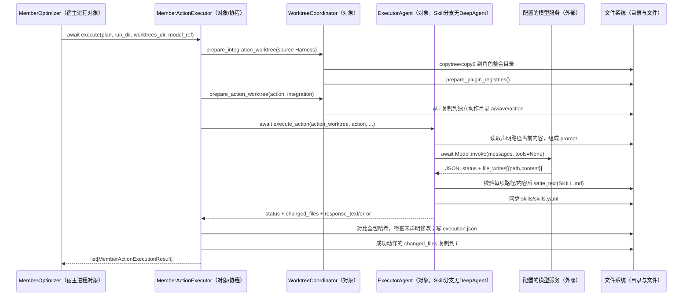

# F01 深入阅读：A4 诊断到 A5 文件候选的逐段交接

本章基于 agent-core `13d226d91ccc1ff4c041e984fb6aa90de6c5e0ff` 的静态源码与已有测试，核查日期 2026-09-16。本轮未调用模型、运行测试或启动服务。只分析 `single_harness=True` 路径。

## 1. 先固定案例事实，避免把三个层次混在一起

本章沿“结构化报告未做字段校验 → 新增 `schema_check` Skill”阅读。

| 层次 | 有源码依据的事实 | 不能据此声称什么 |
|---|---|---|
| 交接测试 | `case_a` 的输入是 `Create a structured report`；测试预设根因是遗漏字段后，把成功写入当成已经验证；预设 `target_ref=member_harness.solver.skill`、`skill/add`、`skills/schema_check/SKILL.md` | 测试没有 `currency`、销售数据或实际 `report.json`，没有真实诊断模型/规划模型调用 |
| 文件执行测试 | 另一个测试预设完整 `enum_contract_verify/SKILL.md`，替换模型返回；真实 `execute_action()` 写文件并登记 `skills/skills.yaml` | 它不是前一个 `schema_check` 测试的后半程，也没有验证任务效果 |
| 教学串联 | 为解释相同实现如何处理报告，假设报告缺 `currency`，展示 `schema_check` 候选正文和文件变化 | 不能当成项目真实生成记录或已完成的端到端实验 |

来源：[报告交接测试](https://gitcode.com/openJiuwen/agent-core/blob/13d226d91ccc1ff4c041e984fb6aa90de6c5e0ff/tests/unit_tests/rsi/test_analyzer_optimizer_handoff.py#L32)、[独立写入测试](https://gitcode.com/openJiuwen/agent-core/blob/13d226d91ccc1ff4c041e984fb6aa90de6c5e0ff/tests/unit_tests/rsi/test_member_optimizer.py#L3824)。

**本段链路的结果是一个可加载、带来源信息的候选插件包；它是否修好报告，须交回 A6 重跑任务判断。** Analyzer 不重新打任务分数，Verifier 也不承担报告的正确性评分。

## 2. 组件在哪里创建，实际以什么方式相连

以下所有控制组件都是宿主 Python 进程中的对象。`await` 和 `asyncio.gather` 调度协程；Verifier 的 `asyncio.to_thread` 在本进程线程池工作；worktree 是文件夹副本。调用所配置的模型服务有进程/服务边界，不能把每个带 Agent 后缀的类都画成一个独立进程。

| 创建方 → 被创建对象 | 注入内容及实际实现 | 对应源码 |
|---|---|---|
| `EvaluationResultAnalyzer.__init__` → `DiagnosisAgentStrategy` | Analyzer config；策略持有 `CaseReader` 与 `DiagnosisAgentRuntime` | [Facade](https://gitcode.com/openJiuwen/agent-core/blob/13d226d91ccc1ff4c041e984fb6aa90de6c5e0ff/openjiuwen/rsi/harness_rsi/evaluation_result_analyzer/analyzer.py#L2931)、[策略构造](https://gitcode.com/openJiuwen/agent-core/blob/13d226d91ccc1ff4c041e984fb6aa90de6c5e0ff/openjiuwen/rsi/harness_rsi/evaluation_result_analyzer/analyzer.py#L2403) |
| `DiagnosisAgentRuntime.build_agent` → 每个案例的 `DeepAgent` | 模型配置、诊断提示、隔离证据目录、只读 `RSISysOperationRail`、迭代预算 Rail | [诊断 Agent 创建](https://gitcode.com/openJiuwen/agent-core/blob/13d226d91ccc1ff4c041e984fb6aa90de6c5e0ff/openjiuwen/rsi/harness_rsi/evaluation_result_analyzer/agent_runtime.py#L74) |
| `MemberOptimizer.__init__` → Planner / Executor / Verifier | 可显式注入测试替身；未传时创建正式对象。Executor 同时持有 coordinator 与三个并发 semaphore | [Optimizer 构造](https://gitcode.com/openJiuwen/agent-core/blob/13d226d91ccc1ff4c041e984fb6aa90de6c5e0ff/openjiuwen/rsi/harness_rsi/member_optimizer/optimizer.py#L122)、[Executor 构造](https://gitcode.com/openJiuwen/agent-core/blob/13d226d91ccc1ff4c041e984fb6aa90de6c5e0ff/openjiuwen/rsi/harness_rsi/member_optimizer/action_executor.py#L1115) |
| `MemberActionPlanner.plan` → `MemberActionPlannerAgent` → `DeepAgent` | 模型引用、规划工作目录、动作定义、Harness 结构 Rail；通过 `agent.invoke` 获取结构化计划 | [计划包装层](https://gitcode.com/openJiuwen/agent-core/blob/13d226d91ccc1ff4c041e984fb6aa90de6c5e0ff/openjiuwen/rsi/harness_rsi/member_optimizer/action_planner.py#L1428)、[实际创建](https://gitcode.com/openJiuwen/agent-core/blob/13d226d91ccc1ff4c041e984fb6aa90de6c5e0ff/openjiuwen/rsi/harness_rsi/member_optimizer/action_planner.py#L647) |
| `MemberActionExecutor._get_executor_agent` → `MemberActionExecutorAgent` | 模型引用；本例 `skill/add` 直调 `Model.invoke(tools=None)`，并不创建执行 DeepAgent | [选对象](https://gitcode.com/openJiuwen/agent-core/blob/13d226d91ccc1ff4c041e984fb6aa90de6c5e0ff/openjiuwen/rsi/harness_rsi/member_optimizer/action_executor.py#L1131)、[直接调用模型](https://gitcode.com/openJiuwen/agent-core/blob/13d226d91ccc1ff4c041e984fb6aa90de6c5e0ff/openjiuwen/rsi/harness_rsi/member_optimizer/action_executor.py#L821) |
| `HarnessChangeVerifier.repair` → `HarnessRepairAgent` → `DeepAgent` | 只在有可修复失败时使用；工作目录是整合副本，输入是失败检查列表 | [修复调用](https://gitcode.com/openJiuwen/agent-core/blob/13d226d91ccc1ff4c041e984fb6aa90de6c5e0ff/openjiuwen/rsi/harness_rsi/member_optimizer/verification.py#L1286)、[修复 Agent 创建和调用](https://gitcode.com/openJiuwen/agent-core/blob/13d226d91ccc1ff4c041e984fb6aa90de6c5e0ff/openjiuwen/rsi/harness_rsi/member_optimizer/verification.py#L1034) |

`MemberOptimizer` 虽然还创建了 RoleAttributor / MechanismAttributor / MemberSelector，但 **F01 不经它们重新做模型归因和成员选择**。`single_harness=True` 要求恰好一个候选角色，直接根据不可变假设生成三份报告，归因置信度中的 `1.0` 是程序赋值，不是模型校准过的因果置信度。[直接编译](https://gitcode.com/openJiuwen/agent-core/blob/13d226d91ccc1ff4c041e984fb6aa90de6c5e0ff/openjiuwen/rsi/harness_rsi/member_optimizer/optimizer.py#L826)

## 3. A4：分数、证据怎样变成一个有来源的修改要求

### 3.1 逐条追踪调用与返回

| 次序：调用方 → 方法 | 传入与内部处理 | 返回、写入和下一位读取者 |
|---|---|---|
| 1. 单 Harness 编排器 → `_analyze(...)` | 当前 `attempt_source_eval_ref`、`repair_refs`、analysis 输出目录、此前候选反馈 | Analyzer 使用的是当前评测及对应 Harness；不是一直分析最初 H0。[调用点](https://gitcode.com/openJiuwen/agent-core/blob/13d226d91ccc1ff4c041e984fb6aa90de6c5e0ff/openjiuwen/rsi/harness_rsi/single_harness/iterative.py#L450) |
| 2. Analyzer → `DiagnosisAgentStrategy.analyze(invocation)` | `CaseReader` 读取 `eval_ref.yaml`、summary、每个 `*/result.json`；按评测方法选择 SignalExtractor | `CaseAnalysisInput` 携带原有 `score`、`evaluation_passed`、judge 元数据、trace/result 路径，确定性信号只是整理已有事实。[读取](https://gitcode.com/openJiuwen/agent-core/blob/13d226d91ccc1ff4c041e984fb6aa90de6c5e0ff/openjiuwen/rsi/harness_rsi/evaluation_result_analyzer/analyzer.py#L2432)、[字段来源](https://gitcode.com/openJiuwen/agent-core/blob/13d226d91ccc1ff4c041e984fb6aa90de6c5e0ff/openjiuwen/rsi/harness_rsi/evaluation_result_analyzer/case_reader.py#L110) |
| 3. 策略 → `_per_case_diagnosis(...)` | 选择未通过案例；另包含非 `llm_as_judge` 且 `score<1.0` 的案例。为每个 case 创建隔离证据目录 | 写 `execution_history.json`、`evidence_summary.md`，准备可用的 evaluated repository snapshot 与当前 Harness 上下文；原评测 case 目录不直接暴露给诊断 Agent。[筛选](https://gitcode.com/openJiuwen/agent-core/blob/13d226d91ccc1ff4c041e984fb6aa90de6c5e0ff/openjiuwen/rsi/harness_rsi/evaluation_result_analyzer/analyzer.py#L2459)、[证据投递](https://gitcode.com/openJiuwen/agent-core/blob/13d226d91ccc1ff4c041e984fb6aa90de6c5e0ff/openjiuwen/rsi/harness_rsi/evaluation_result_analyzer/analyzer.py#L1648)、[Harness 上下文](https://gitcode.com/openJiuwen/agent-core/blob/13d226d91ccc1ff4c041e984fb6aa90de6c5e0ff/openjiuwen/rsi/harness_rsi/evaluation_result_analyzer/analyzer.py#L2560) |
| 4. 策略 → `_build_diagnosis_input_json` → 诊断 Agent | 完整 `case.input`、current_harness、case_facts、judge_breakdown、确定性验证清单与证据摘要进入 prompt | `Runner.run_agent(agent, inputs={query:prompt}, session=...)`，返回文本，再提取 JSON。不是“Analyzer 接收一个分数直接映射到动作”。[输入 JSON](https://gitcode.com/openJiuwen/agent-core/blob/13d226d91ccc1ff4c041e984fb6aa90de6c5e0ff/openjiuwen/rsi/harness_rsi/evaluation_result_analyzer/analyzer.py#L509)、[执行](https://gitcode.com/openJiuwen/agent-core/blob/13d226d91ccc1ff4c041e984fb6aa90de6c5e0ff/openjiuwen/rsi/harness_rsi/evaluation_result_analyzer/agent_runtime.py#L120) |
| 5. 策略 → JSON 规范化和证据冲突检查 | 模型判断 `root_cause`、`target_ref`、`general_mechanism`、`decision_contract` 等。无有效 JSON 时给一次内容修复机会；与确定性验证清单冲突时另给一次冲突修复机会 | 冲突仍存在或诊断不可用，写失败诊断记录；不能伪造一个可执行 issue。[输出及修复](https://gitcode.com/openJiuwen/agent-core/blob/13d226d91ccc1ff4c041e984fb6aa90de6c5e0ff/openjiuwen/rsi/harness_rsi/evaluation_result_analyzer/analyzer.py#L2584)、[仍冲突的分支](https://gitcode.com/openJiuwen/agent-core/blob/13d226d91ccc1ff4c041e984fb6aa90de6c5e0ff/openjiuwen/rsi/harness_rsi/evaluation_result_analyzer/analyzer.py#L2664) |
| 6. 策略 → `_aggregate_structured_diagnoses` | 丢弃 `analysis_failed` 与 `unassigned`；通常按 `target_ref + failure_mode` 分组，同 case 同机制多诊断时加 discriminator；按 severity/confidence 排序 | 产生 `TeamIssue(issue_001, ...)`；这一步是 Python 确定性聚合，**没有第二次聚合模型调用**。[聚合实现](https://gitcode.com/openJiuwen/agent-core/blob/13d226d91ccc1ff4c041e984fb6aa90de6c5e0ff/openjiuwen/rsi/harness_rsi/evaluation_result_analyzer/analyzer.py#L1212) |
| 7. 策略 → Analyzer facade → 编排器 | 策略返回 `EvaluationResultAnalysisArtifact`，Facade 将 issue 限定到当前可改范围，并补全缺少的证据路径 | 写问题文件与 `analysis_ref.yaml`；返回后者的路径。逐 case 诊断另存 `per_case_diagnoses.json`。[写分析引用](https://gitcode.com/openJiuwen/agent-core/blob/13d226d91ccc1ff4c041e984fb6aa90de6c5e0ff/openjiuwen/rsi/harness_rsi/evaluation_result_analyzer/analyzer.py#L2938) |
| 8. 编排器 → `compile_optimization_hypotheses` | `analysis_ref_path` + 本次 `active_cases`；取 issue 的语义、来源和 case 集合，构造 lever policy | 写 `optimization_hypotheses.yaml`；计算 `content_sha256`、`hypothesis_id= hyp_<摘要前12位>`，后续读取校验摘要。[调用](https://gitcode.com/openJiuwen/agent-core/blob/13d226d91ccc1ff4c041e984fb6aa90de6c5e0ff/openjiuwen/rsi/harness_rsi/single_harness/iterative.py#L464)、[编译](https://gitcode.com/openJiuwen/agent-core/blob/13d226d91ccc1ff4c041e984fb6aa90de6c5e0ff/openjiuwen/rsi/harness_rsi/member_optimizer/hypothesis.py#L25)、[摘要校验](https://gitcode.com/openJiuwen/agent-core/blob/13d226d91ccc1ff4c041e984fb6aa90de6c5e0ff/openjiuwen/rsi/harness_rsi/member_optimizer/hypothesis.py#L118) |

### 3.2 用交接测试的具体值看语义如何保留

下面是交接测试中预设的诊断及真实函数形成的字段关系；省略不影响关系的字段，不伪造一次模型响应。

```text
预设诊断：
  case_id: case_a
  target_ref: member_harness.solver.skill
  failure_mode: unchecked_serialization
  wrong_decision: submit the output without reopening it
  causal_distinction: a successful write is not schema conformance
  required_action: After writing a structured artifact, reopen it
                   and compare its fields with the declared schema.
  acceptance_observable: reopened fields match the declared schema
  activation_phase: pre_submission
  scope_boundary: [do not alter unrelated fields]
              ↓ 确定性聚合
issue_001：affected_cases=[case_a]，metadata.attribution 保留上述语义
              ↓ compile_optimization_hypotheses
hyp_<digest>：source_issue_id=issue_001，target_case_ids=[case_a]
              required_behavior=上述 required_action
              public_trigger=[{case_id:case_a, task:Create a structured report}]
              decision_contract=上述决策契约
              ↓ Planner 产出动作后，程序 _bind_immutable_hypotheses
action add_check：expected_effect 被设置为 required_behavior
                  constraints.optimization_contracts 保留源契约与摘要
```

另一条 `case_b: Missing task input / target_ref=unassigned` 不进入 issue 集合。`activation_phase=pre_submission` 在这里是后续 Skill 应表达的语义要求，**还不是代码生成了一个“提交前强制执行”的调度钩子**；实际 Skill 能否被投递和遵守，要看 A3 的运行机制与 A6 的轨迹。[测试断言](https://gitcode.com/openJiuwen/agent-core/blob/13d226d91ccc1ff4c041e984fb6aa90de6c5e0ff/tests/unit_tests/rsi/test_analyzer_optimizer_handoff.py#L72)、[契约绑定](https://gitcode.com/openJiuwen/agent-core/blob/13d226d91ccc1ff4c041e984fb6aa90de6c5e0ff/openjiuwen/rsi/harness_rsi/member_optimizer/action_planner.py#L939)

摘要保障的是假设文件内容没有悄悄变化；它不能证明模型根因正确，也不能证明新 Skill 符合假设。另须区分证据位置：逐诊断的 `evidence_refs` 进入 issue 的 attribution metadata，假设顶层 `evidence_refs` 从聚合后的 `issue.evidence` 提取，不能假定所有原始 `step_pointer` 原样进入所有下游字段。[聚合证据](https://gitcode.com/openJiuwen/agent-core/blob/13d226d91ccc1ff4c041e984fb6aa90de6c5e0ff/openjiuwen/rsi/harness_rsi/evaluation_result_analyzer/analyzer.py#L1266)、[假设字段](https://gitcode.com/openJiuwen/agent-core/blob/13d226d91ccc1ff4c041e984fb6aa90de6c5e0ff/openjiuwen/rsi/harness_rsi/member_optimizer/hypothesis.py#L68)

## 4. A5 前半段：改进器如何把假设变成可执行动作

编排器调用 `MemberOptimizer.optimize` 时，明确传 `single_harness=True`、`defer_publish=True`、假设路径，以及本次选择的 `optimization_issue_ids`。它同时传已有实验 journal 和 lever scoreboard，供规划参考。返回值仍是文件路径，不是 H1 对象。[生产调用点](https://gitcode.com/openJiuwen/agent-core/blob/13d226d91ccc1ff4c041e984fb6aa90de6c5e0ff/openjiuwen/rsi/harness_rsi/single_harness/iterative.py#L522)

1. **Optimizer 读输入并绑定唯一角色。** 读取评测、分析、Harness refs、假设；验证每个 issue 都有假设，只保留本次 issue scope。`_compile_single_harness_planning_inputs` 根据 diagnosed lever 与允许 action groups 计算可执行 surface，生成 `role_attribution.yaml`、`mechanism_attribution.yaml`、`member_selection.yaml`。没有可执行 surface 则记录 deferred，不擅自换成另一类改法。[读入和分流](https://gitcode.com/openJiuwen/agent-core/blob/13d226d91ccc1ff4c041e984fb6aa90de6c5e0ff/openjiuwen/rsi/harness_rsi/member_optimizer/optimizer.py#L207)、[surface 选择](https://gitcode.com/openJiuwen/agent-core/blob/13d226d91ccc1ff4c041e984fb6aa90de6c5e0ff/openjiuwen/rsi/harness_rsi/member_optimizer/optimizer.py#L860)
2. **Optimizer → Planner。** 传 targets、上述 reports、动作定义、假设、模型引用、规划工作目录与限制。PlannerAgent 使用当前 Harness 结构摘要和模型提出动作草稿；返回 YAML/JSON 字典。[调用参数](https://gitcode.com/openJiuwen/agent-core/blob/13d226d91ccc1ff4c041e984fb6aa90de6c5e0ff/openjiuwen/rsi/harness_rsi/member_optimizer/optimizer.py#L372)、[模型调用与解析](https://gitcode.com/openJiuwen/agent-core/blob/13d226d91ccc1ff4c041e984fb6aa90de6c5e0ff/openjiuwen/rsi/harness_rsi/member_optimizer/action_planner.py#L628)
3. **Planner 程序校验草稿。** 补全隐含注册清单路径，检查角色、动作定义、issue 归属、surface、依赖、动作数量等。最多三轮计划校验，错误返回给 PlannerAgent 重新规划；每轮的 Agent 输出解析另有 `stage_retry_limit+1` 次尝试。不能把它们合并成“总共三次模型调用”。[计划校验循环](https://gitcode.com/openJiuwen/agent-core/blob/13d226d91ccc1ff4c041e984fb6aa90de6c5e0ff/openjiuwen/rsi/harness_rsi/member_optimizer/action_planner.py#L1454)、[Agent 解析重试](https://gitcode.com/openJiuwen/agent-core/blob/13d226d91ccc1ff4c041e984fb6aa90de6c5e0ff/openjiuwen/rsi/harness_rsi/member_optimizer/agents/output.py#L73)
4. **程序恢复源语义并安排执行。** `_bind_immutable_hypotheses` 写入 source contracts、覆盖 `expected_effect`，检查修改 lever 是否匹配诊断；动作顺序从 `depends_on` 拓扑排序重建，不信任模型自报的 wave 顺序。写 `plan.yaml`、`candidate_manifest.yaml`，后者记录假设和动作来源，并非运行时插件 manifest。[绑定及排序](https://gitcode.com/openJiuwen/agent-core/blob/13d226d91ccc1ff4c041e984fb6aa90de6c5e0ff/openjiuwen/rsi/harness_rsi/member_optimizer/action_planner.py#L1503)、[来源文件](https://gitcode.com/openJiuwen/agent-core/blob/13d226d91ccc1ff4c041e984fb6aa90de6c5e0ff/openjiuwen/rsi/harness_rsi/member_optimizer/hypothesis.py#L141)

对于本例，交接测试只提供了动作的最小草稿。下面补齐生产链路所需字段作**教学示意**；`role`、`declared_write_paths` 等不能说成该测试实际返回的完整计划。

```yaml
action_id: add_check
role: validation_harness
action_group: skill
operation: add
action_type: skill_creation
target_path: skills/schema_check/SKILL.md
attributed_issue_ids: [issue_001]
declared_write_paths:
  - skills/schema_check/SKILL.md
  - skills/skills.yaml
depends_on: []
# expected_effect / constraints.optimization_contracts 由绑定函数补入
```

这里按 Swarm 默认物化入口使用 `validation_harness`，对应诊断目标应为 `member_harness.validation_harness.skill`。上节单测中的 `solver` 是该测试输入的角色名；生产没有自动把实际角色改名为 solver。角色来自 Harness refs 的键，Analyzer 上下文和 Optimizer 都沿用它。因此不能把单测预设 JSON 不经调整直接视作本次生产请求的实际输出。[默认角色](https://gitcode.com/openJiuwen/jiuwenswarm/blob/f29c060cee90aef10e46b2a3646fe3628f60ea7c/jiuwenswarm/agents/harness/common/rsi/materializer.py#L182)、[读取角色](https://gitcode.com/openJiuwen/agent-core/blob/13d226d91ccc1ff4c041e984fb6aa90de6c5e0ff/openjiuwen/rsi/harness_rsi/member_optimizer/loader.py#L282)、[诊断上下文](https://gitcode.com/openJiuwen/agent-core/blob/13d226d91ccc1ff4c041e984fb6aa90de6c5e0ff/openjiuwen/rsi/harness_rsi/evaluation_result_analyzer/harness_context.py#L143)

`declared_write_paths` 确实是**列表**。Planner 机械补上目标文件和 `skills/skills.yaml`，Executor 的动作策略还会要求两者都显式包含；目标须符合 `skills/<snake_name>/SKILL.md`。需要额外脚本时，也要在计划中声明对应路径，不能让生成模型随意新增。[路径补齐](https://gitcode.com/openJiuwen/agent-core/blob/13d226d91ccc1ff4c041e984fb6aa90de6c5e0ff/openjiuwen/rsi/harness_rsi/member_optimizer/action_planner.py#L424)、[Skill/add 策略](https://gitcode.com/openJiuwen/agent-core/blob/13d226d91ccc1ff4c041e984fb6aa90de6c5e0ff/openjiuwen/rsi/harness_rsi/member_optimizer/action_groups/policy.py#L233)

## 5. A5 中段：哪个模型产出什么，谁实际修改磁盘

### 5.1 一次 skill/add 的调用时序



箭头依据：[整合副本和执行 waves](https://gitcode.com/openJiuwen/agent-core/blob/13d226d91ccc1ff4c041e984fb6aa90de6c5e0ff/openjiuwen/rsi/harness_rsi/member_optimizer/action_executor.py#L1139)、[动作副本及调用](https://gitcode.com/openJiuwen/agent-core/blob/13d226d91ccc1ff4c041e984fb6aa90de6c5e0ff/openjiuwen/rsi/harness_rsi/member_optimizer/action_executor.py#L1346)、[直调模型和写入](https://gitcode.com/openJiuwen/agent-core/blob/13d226d91ccc1ff4c041e984fb6aa90de6c5e0ff/openjiuwen/rsi/harness_rsi/member_optimizer/action_executor.py#L704)、[文件合并](https://gitcode.com/openJiuwen/agent-core/blob/13d226d91ccc1ff4c041e984fb6aa90de6c5e0ff/openjiuwen/rsi/harness_rsi/member_optimizer/action_executor.py#L1578)。

这里有三处容易误读的细节：

- **worktree 的真实布局**是短路径 `.../wt/<角色SHA1前8位>/i` 和 `.../wt/<角色SHA1前8位>/a/<wave十六进制>/<动作SHA1前8位>`，`roles.yaml` 提供映射；源码旧类注释中的 `worktrees/{role}/integration` 不是当前新建路径。运行副本根目录由 PathLayout 推导为短 `mh` 目录，审计文档仍在 `member_optimizations/member_optimization_N`。[路径算法](https://gitcode.com/openJiuwen/agent-core/blob/13d226d91ccc1ff4c041e984fb6aa90de6c5e0ff/openjiuwen/rsi/harness_rsi/member_optimizer/worktree_coordinator.py#L48)、[复制入口](https://gitcode.com/openJiuwen/agent-core/blob/13d226d91ccc1ff4c041e984fb6aa90de6c5e0ff/openjiuwen/rsi/harness_rsi/member_optimizer/worktree_coordinator.py#L123)、[运行目录分离](https://gitcode.com/openJiuwen/agent-core/blob/13d226d91ccc1ff4c041e984fb6aa90de6c5e0ff/openjiuwen/rsi/harness_rsi/member_optimizer/path_layout.py#L53)
- **Skill 编写模型没有 read/write/edit tools。** Python 先读取已声明文件，把其内容、所需行为和输出格式放进 prompt，再以 `tools=None` 调模型。存在假设契约时，仅投递公共任务文字、generalized required behavior 与净化后的 decision contract；不把 case ID、trace pointer 或优化器依据直接写成 Skill 指令。[上下文投影](https://gitcode.com/openJiuwen/agent-core/blob/13d226d91ccc1ff4c041e984fb6aa90de6c5e0ff/openjiuwen/rsi/harness_rsi/member_optimizer/action_executor.py#L480)、[构建 prompt](https://gitcode.com/openJiuwen/agent-core/blob/13d226d91ccc1ff4c041e984fb6aa90de6c5e0ff/openjiuwen/rsi/harness_rsi/member_optimizer/action_executor.py#L1005)
- **合并不是 Git 三方合并。** 程序按依赖 waves 和声明路径冲突拆 subwaves；不重叠动作可 `asyncio.gather` 并发。成功动作按 action_id 排序，把实际变更文件 `copy2` 到整合副本。两个 Skill 都写 `skills/skills.yaml`，会因路径重叠分开执行，后一个从已更新的整合副本开始。[冲突分波](https://gitcode.com/openJiuwen/agent-core/blob/13d226d91ccc1ff4c041e984fb6aa90de6c5e0ff/openjiuwen/rsi/harness_rsi/member_optimizer/action_groups/scheduling.py#L61)、[实际 merge](https://gitcode.com/openJiuwen/agent-core/blob/13d226d91ccc1ff4c041e984fb6aa90de6c5e0ff/openjiuwen/rsi/harness_rsi/member_optimizer/action_executor.py#L1589)

### 5.2 把 file_writes 展开到可见文件

下面是**教学模型输出**，用于说明字段形状与 Python 写入逻辑，不是仓内实际生成记录，也不是完整生产效果已经验证的 Skill：

```json
{
  "action_id": "add_check",
  "status": "succeeded",
  "file_writes": [{
    "path": "skills/schema_check/SKILL.md",
    "content": "---\nname: schema_check\ndescription: Validate a structured artifact against its declared schema before submission.\n---\n\n# Schema check\n\nAfter writing an artifact, reopen the written file. Compare its required fields and types with the current task schema. Repair mismatches using current task inputs, reopen it, and verify again. Do not alter unrelated fields. Report unresolved failures instead of submitting an unchecked artifact.\n"
  }],
  "errors": []
}
```

模型没有提供 `skills/skills.yaml` 仍可成功，因为下面这段交接是确定性的：

1. `_parse_action_response` 要求 JSON 有 `status` 与 `file_writes`；自报 succeeded 时写列表必须非空。
2. `_apply_structured_file_writes` 逐项检查相对路径、`..`、声明范围、字符串 content、解析后的根目录边界。Skill frontmatter 中 `name` 依据目录名规范化，缺 description 可从动作补；`skill/add` 要求有非空运行指令正文。随后 `write_text(content)` 写入动作副本。
3. `_sync_action_registries` → `_sync_skill_registry_for_written_files` 从已写的 `skills/schema_check/SKILL.md` 推导父目录 `skills/schema_check`；读取现有 registry，去重后追加，写成 `skills: [...]`，把 registry 路径加入返回的 changed_files。
4. 外层 Executor 不只信模型返回的文件列表，而是比较写前/写后文件哈希，验证实际变更没有越过声明范围；模型说成功但声明文件没有变更也判失败。

来源：[解析](https://gitcode.com/openJiuwen/agent-core/blob/13d226d91ccc1ff4c041e984fb6aa90de6c5e0ff/openjiuwen/rsi/harness_rsi/member_optimizer/action_executor.py#L855)、[逐项写入](https://gitcode.com/openJiuwen/agent-core/blob/13d226d91ccc1ff4c041e984fb6aa90de6c5e0ff/openjiuwen/rsi/harness_rsi/member_optimizer/action_executor.py#L868)、[Skill frontmatter 与正文检查](https://gitcode.com/openJiuwen/agent-core/blob/13d226d91ccc1ff4c041e984fb6aa90de6c5e0ff/openjiuwen/rsi/harness_rsi/member_optimizer/action_executor.py#L223)、[自动登记](https://gitcode.com/openJiuwen/agent-core/blob/13d226d91ccc1ff4c041e984fb6aa90de6c5e0ff/openjiuwen/rsi/harness_rsi/member_optimizer/action_executor.py#L149)、[实际哈希与边界检查](https://gitcode.com/openJiuwen/agent-core/blob/13d226d91ccc1ff4c041e984fb6aa90de6c5e0ff/openjiuwen/rsi/harness_rsi/member_optimizer/action_executor.py#L1440)。

教学 H0 假定无技能，则这次文件变化如下：

| 文件 | 写前 | 写后 | 实际写入者 |
|---|---|---|---|
| `skills/schema_check/SKILL.md` | 不存在 | 完整规程正文 | Python Executor 消费模型返回的 content |
| `skills/skills.yaml` | `skills: []` | `skills: [skills/schema_check]` | registry 同步函数；可不由模型生成 |
| `manifest.json`（仅 JSON 插件格式） | `"skills": []` | `"skills": ["skills/schema_check"]` | 后续 Verifier 加载前同步；不是本次模型的 file_writes |
| 用户任务目录的 `report.json` | 假定缺 currency | **本阶段不改它** | 下一次评测的任务 Agent 才可能补字段 |

仓内实际写入测试使用的是 `enum_contract_verify`。测试在替身模型被调用时先断言目标文件尚不存在，再返回完整正文；最终断言调用一次、正文保留、frontmatter name 正确、registry 含新目录。这证明执行器行为的测试预期，不能证明模型会自主产出有效规程；本轮未执行该测试。[完整测试](https://gitcode.com/openJiuwen/agent-core/blob/13d226d91ccc1ff4c041e984fb6aa90de6c5e0ff/tests/unit_tests/rsi/test_member_optimizer.py#L3824)

### 5.3 root manifest 和 sidecar 如何衔接

初次复制 H0 到整合目录时，`prepare_plugin_registries` 从原生 JSON manifest 或 `expert_harness.v1` YAML 声明中创建可编辑的四类 sidecar。若是该旧 YAML schema，它会在私有副本中改为 `schema_version: 1.0` 并移除根部资源声明，使 sidecar 成为唯一资源声明来源。[准备 registry](https://gitcode.com/openJiuwen/agent-core/blob/13d226d91ccc1ff4c041e984fb6aa90de6c5e0ff/openjiuwen/rsi/harness_rsi/member_optimizer/plugin_manifest.py#L22)

Executor 改完 sidecar 后，Verifier 调 `_load_harness_plugin(integration)`，先 `synchronize_plugin_manifest(integration)`，再用实际运行时 `load_plugin_package(find_plugin_manifest(...))` 加载。同步函数只对根 `manifest.json` 生效，逐资源集**替换**根声明而非追加。因此不能把它写成“所有 YAML Harness 都必然写回 manifest.json”。[加载前同步](https://gitcode.com/openJiuwen/agent-core/blob/13d226d91ccc1ff4c041e984fb6aa90de6c5e0ff/openjiuwen/rsi/harness_rsi/member_optimizer/verification.py#L538)、[JSON 同步范围](https://gitcode.com/openJiuwen/agent-core/blob/13d226d91ccc1ff4c041e984fb6aa90de6c5e0ff/openjiuwen/rsi/harness_rsi/member_optimizer/plugin_manifest.py#L55)

## 6. A5 后半段：校验、有限修复、向 A6 交付

Optimizer 将 `execution_results.json` 与 `plan.yaml` 同时放到短运行目录的 `wt` 父目录，因 Verifier 正是从 `worktrees_dir.parent` 找这两份文件；不是靠 Verifier 内部持有 Executor 的 Python 对象结果。[写副本](https://gitcode.com/openJiuwen/agent-core/blob/13d226d91ccc1ff4c041e984fb6aa90de6c5e0ff/openjiuwen/rsi/harness_rsi/member_optimizer/optimizer.py#L494)、[Verifier 读取](https://gitcode.com/openJiuwen/agent-core/blob/13d226d91ccc1ff4c041e984fb6aa90de6c5e0ff/openjiuwen/rsi/harness_rsi/member_optimizer/verification.py#L1152)

| 交接 | 判断与状态 | 后续动作 |
|---|---|---|
| Optimizer → `Verifier.verify(plan, worktrees_dir)` | 校验计划/执行结果、每个角色的实际整合副本。检查注册指向存在、Skill 扫描与挂载、插件加载及资源解析、工具 schema、Python 编译、YAML/JSON 解析 | 返回 `MemberVerificationResult` 并写 `verification.json`；`status=passed` 只说明这些包级检查通过。[实际检查集](https://gitcode.com/openJiuwen/agent-core/blob/13d226d91ccc1ff4c041e984fb6aa90de6c5e0ff/openjiuwen/rsi/harness_rsi/member_optimizer/verification.py#L553) |
| Optimizer → `Verifier.repair(...)` | 已通过则写 `fix_result.status=not_needed`；只有被列为可修复的失败才进入 RepairAgent | YAML、Skill ref、资源加载等可修复；action policy、action result、merge、执行记录缺失等不能靠改包“修成成功”。[分类](https://gitcode.com/openJiuwen/agent-core/blob/13d226d91ccc1ff4c041e984fb6aa90de6c5e0ff/openjiuwen/rsi/harness_rsi/member_optimizer/verification.py#L54)、[分支](https://gitcode.com/openJiuwen/agent-core/blob/13d226d91ccc1ff4c041e984fb6aa90de6c5e0ff/openjiuwen/rsi/harness_rsi/member_optimizer/verification.py#L1252) |
| RepairAgent → integration 副本 | 使用 DeepAgent 的文件修改能力，输入失败检查和相关文件上下文；不复用 Skill 编写的 `file_writes` 直调协议 | 每个角色最多 `stage_retry_limit` 次；每次后重新运行包级检查，而非信其“修好了”。[Agent 调用](https://gitcode.com/openJiuwen/agent-core/blob/13d226d91ccc1ff4c041e984fb6aa90de6c5e0ff/openjiuwen/rsi/harness_rsi/member_optimizer/verification.py#L1011)、[重新检查](https://gitcode.com/openJiuwen/agent-core/blob/13d226d91ccc1ff4c041e984fb6aa90de6c5e0ff/openjiuwen/rsi/harness_rsi/member_optimizer/verification.py#L1294) |
| Optimizer → 再次 verify | 初次未通过时，repair 返回后再跑完整 verify，包含计划和执行记录约束 | 确认最终状态后进入 `_publish`；`fix_result.status=completed` 不能单独作为放行条件。[次序](https://gitcode.com/openJiuwen/agent-core/blob/13d226d91ccc1ff4c041e984fb6aa90de6c5e0ff/openjiuwen/rsi/harness_rsi/member_optimizer/optimizer.py#L502) |
| Optimizer `_publish` → candidate 目录 | F01 `defer_publish=True`：仅当角色验证通过且 `role_execution_errors` 为空，复制整合副本到本次 candidate 目录 | 写 `candidate_harness_refs.yaml`、`member_optimization_ref.yaml`，角色状态 `candidate_ready`；失败角色 `after_ref=before_ref`。返回 member ref 路径给外层编排器，再由 A6 评测。[候选写入](https://gitcode.com/openJiuwen/agent-core/blob/13d226d91ccc1ff4c041e984fb6aa90de6c5e0ff/openjiuwen/rsi/harness_rsi/member_optimizer/optimizer.py#L681)、[返回](https://gitcode.com/openJiuwen/agent-core/blob/13d226d91ccc1ff4c041e984fb6aa90de6c5e0ff/openjiuwen/rsi/harness_rsi/member_optimizer/optimizer.py#L552) |

这里的 `_publish` 是 Optimizer 内部命名；在 F01 此次调用中只产生 candidate。不要据这个函数名把它误记为“已发布到 Swarm 并热加载”。

## 7. 失败具体停在哪里，哪些副本会保留

| 失败点 | 实际处理 | 边界 |
|---|---|---|
| 无可靠诊断 / unassigned | 不进入可优化 issue；没有 issues/hypotheses 时外层结束本次修复链 | 不应为凑修改而虚构根因。[停止条件](https://gitcode.com/openJiuwen/agent-core/blob/13d226d91ccc1ff4c041e984fb6aa90de6c5e0ff/openjiuwen/rsi/harness_rsi/single_harness/iterative.py#L476) |
| Planner 计划不合法 | 有限重生成；特定计划拒绝返回 `planning_rejected` 的 no-op artifact，其余异常外抛供编排器记录 | 不直接进入写文件。[拒绝分支](https://gitcode.com/openJiuwen/agent-core/blob/13d226d91ccc1ff4c041e984fb6aa90de6c5e0ff/openjiuwen/rsi/harness_rsi/member_optimizer/optimizer.py#L402) |
| Skill 输出不是合法 JSON、路径/内容检查抛 ValueError | 最多三个结构生成尝试，前次错误和输出进入下一次 prompt | 不是所有异常都重试；模型明确 `status!=succeeded` 或普通非 ValueError 异常会直接失败。[执行重试](https://gitcode.com/openJiuwen/agent-core/blob/13d226d91ccc1ff4c041e984fb6aa90de6c5e0ff/openjiuwen/rsi/harness_rsi/member_optimizer/action_executor.py#L742) |
| Skill 作者完全没产出 | 不会自动把诊断拼成一份兜底 Skill | `_is_add_like_scaffold_action` 仅允许 Tool/Rail；即便外层存在 prompt/skill scaffold 调用，实际返回 skipped。[真实适用范围](https://gitcode.com/openJiuwen/agent-core/blob/13d226d91ccc1ff4c041e984fb6aa90de6c5e0ff/openjiuwen/rsi/harness_rsi/member_optimizer/action_executor.py#L1939) |
| 一次 file_writes 中前几个文件已写，后一个检查失败 | 已写内容可能留在动作副本，再次尝试沿用此副本 | 写入是逐项进行，没有每次尝试全事务撤销；最终失败不会作为成功结果合并到 integration。[逐项写入](https://gitcode.com/openJiuwen/agent-core/blob/13d226d91ccc1ff4c041e984fb6aa90de6c5e0ff/openjiuwen/rsi/harness_rsi/member_optimizer/action_executor.py#L879)、[成功过滤](https://gitcode.com/openJiuwen/agent-core/blob/13d226d91ccc1ff4c041e984fb6aa90de6c5e0ff/openjiuwen/rsi/harness_rsi/member_optimizer/action_executor.py#L1289) |
| 动作声称成功但没有实际变更 / 有未声明变更 | 外层比较哈希后判失败并写 execution artifact | `response.status=succeeded` 不是最终成功条件。[强制检查](https://gitcode.com/openJiuwen/agent-core/blob/13d226d91ccc1ff4c041e984fb6aa90de6c5e0ff/openjiuwen/rsi/harness_rsi/member_optimizer/action_executor.py#L1485) |
| 有可修复包错误，但修复未通过 | 保留检查及修复记录；该角色不给新 candidate ref | 修复影响私有 integration，不等于已改动 active Harness。[输出引用保留](https://gitcode.com/openJiuwen/agent-core/blob/13d226d91ccc1ff4c041e984fb6aa90de6c5e0ff/openjiuwen/rsi/harness_rsi/member_optimizer/optimizer.py#L735) |

## 8. 阅读时沿这条数据身份链核对

```text
eval_ref + case_a/result.json + 当前 harness_refs
  → analysis/per_case_diagnoses.json
  → analysis_ref.yaml: issue_001、affected_cases、attribution.decision_contract
  → optimization_hypotheses.yaml: hyp_<digest>、source_issue_id、target_case_ids
  → plan.yaml: add_check、role=validation_harness、declared_write_paths、optimization_contracts
  → candidate_manifest.yaml: 来源 Harness + hypothesis_ids + action 列表
  → 动作副本: skills/schema_check/SKILL.md + skills/skills.yaml
  → act/<角色hash>/<动作hash>/execution.json: actual_changed_files、status/error
  → integration: 成功动作文件；JSON 插件在加载前同步 root manifest
  → verification.json / fix_result.json
  → candidate_harness_refs.yaml + member_optimization_ref.yaml
  → 外层 A6 读取候选引用，重跑 case_a，再做整版筛选
```

读代码时最值得停下来确认的三个问题：**case_a 为什么变成这个 issue；这个 issue 的 required behavior 有没有被改写；新文件究竟在哪个副本里被哪个后续组件读取。**这些问题分别落在假设摘要/约束绑定、Executor 写入与 registry 同步、Verifier/candidate 引用三段，不能只通过类名推断闭环已经成立。
