# HarnessX 源码架构分析

> 审计基线：Git commit `bf5f199ee65034d55db0c536e582f1e7c8abf669`
>
> 分析范围：`harnessx/`、`gateway/`、`recipe/` 和与运行链路直接相关的 benchmark 适配代码。
>
> 证据规则：正文中的结构和行为以当前检出源码为准；README、注释或配置只能证明声明或配置意图，不能单独证明运行时拓扑。无法从当前源码确认的内容明确标为“不明确”。

## 1. 结论先行

HarnessX 的核心是一个**单进程内、事件驱动、可组合的 Agent 运行库**。它不是一个常驻的微服务集群，也不是一个 Actor 框架。核心对象关系是：

```text
ModelConfig + HarnessConfig
            ↓ agentic()
      Harness（Agent 门面对象）
            ↓ run()
      run_loop（异步循环）
            ↓
HarnessResult = TaskEndEvent + StatefulTrajectory + resume_state
```

这条主链由 [`ModelConfig.agentic()`](https://github.com/Darwin-Agent/HarnessX/blob/bf5f199ee65034d55db0c536e582f1e7c8abf669/harnessx/core/model_config.py#L73-L86)、[`HarnessResult`](https://github.com/Darwin-Agent/HarnessX/blob/bf5f199ee65034d55db0c536e582f1e7c8abf669/harnessx/core/harness.py#L715-L736)、[`Harness`](https://github.com/Darwin-Agent/HarnessX/blob/bf5f199ee65034d55db0c536e582f1e7c8abf669/harnessx/core/harness.py#L969-L999)、[`Harness.run()`](https://github.com/Darwin-Agent/HarnessX/blob/bf5f199ee65034d55db0c536e582f1e7c8abf669/harnessx/core/harness.py#L1066-L1333) 和 [`run_loop()`](https://github.com/Darwin-Agent/HarnessX/blob/bf5f199ee65034d55db0c536e582f1e7c8abf669/harnessx/core/runloop.py#L116-L146) 直接确定。

代码中实际存在三条相互关联、但没有合成一个自动闭环的路径：

| 路径 | 实际入口 | 是否使用核心 `Harness.run()` | 更新对象 |
|---|---|---:|---|
| 普通 Agent 执行 | SDK、`hx`、Lab、Gateway、benchmark | 是 | 运行态 `State`、轨迹和会话文件；不更新模型权重 |
| Harness 演化 | `recipe/*_evolver` + `MetaAgent` | 是 | `HarnessConfig`、Processor、Tool、模板及跨轮 memo |
| 模型训练 | Slime recipe | 是 | 配置外部 Slime/Megatron 承担权重训练；HarnessX 提供 rollout 和 reward 回调；外部训练实现未检出 |
| 模型训练 | veRL recipe | 否，使用独立的 `HarnessXAgentLoop` | 配置外部 veRL 承担 GRPO 训练；HarnessX 提供工具循环和 reward 函数；veRL 子模块未检出 |

Slime 调用核心 `Harness.run()` 的证据在 [`harness_rollout.py:42-64, 93-174`](https://github.com/Darwin-Agent/HarnessX/blob/bf5f199ee65034d55db0c536e582f1e7c8abf669/recipe/slime/harness_rollout.py#L42-L174)。veRL 路径自己实现 `AgentState` 状态机，证据在 [`agent_loop.py:194-257`](https://github.com/Darwin-Agent/HarnessX/blob/bf5f199ee65034d55db0c536e582f1e7c8abf669/recipe/verl_harnessX/agent_loop.py#L194-L257)，其中没有调用核心 `Harness` 或 `run_loop`。

## 2. 图中运行实体标记

后续图统一使用以下标记，避免把逻辑角色画成物理部署实体：

| 标记 | 含义 |
|---|---|
| `[人/调用方]` | 人或上游系统 |
| `[OS进程]` | 有独立 PID 的进程 |
| `[OS线程]` | 进程内线程；与宿主进程共享内存和 PID |
| `[Ray节点/多OS进程]` | `ray start` 建立的节点级运行时；内部通常含多个系统进程，当前脚本不能给出精确数量 |
| `[Ray ActorClass句柄]` | 源码明确通过 `ray.remote` 包装出的 Actor 类句柄；只有出现 `.remote()` 实例化才能进一步确认 Actor 实例 |
| `[Ray运行实体：不明确]` | 当前仓库只提交任务或传配置；具体 Ray Actor/进程由外部框架定义 |
| `[asyncio Task]` | 同一 Python 进程、同一事件循环中的并发任务 |
| `[Python对象]` | 普通进程内实例，不是进程或 Actor |
| `[协程/函数]` | 在调用线程或事件循环中执行的函数 |
| `[代码模块]` | 静态代码边界，本身不是运行实体 |
| `[外部服务]` | 通过网络调用的模型、MCP 或 SaaS 服务 |
| `[容器/远程VM]` | Docker 容器或 E2B microVM 等隔离边界 |
| `[文件/数据]` | 文件系统中的持久化数据 |

特别说明：RL 配置中的 `actor_rollout_ref.actor` 是“策略模型/训练角色”名称，不能据此判定它是 Ray Actor。当前仓库唯一可直接确认的 veRL Ray **ActorClass 声明**是 [`ray.remote(num_cpus=1)(TaskRunner)`](https://github.com/Darwin-Agent/HarnessX/blob/bf5f199ee65034d55db0c536e582f1e7c8abf669/recipe/verl_harnessX/main.py#L13-L19)，它在当前文件中只产生 ActorClass 句柄；Actor 实例的创建点和数量位于未检出的 veRL 实现中。

## 3. 总体架构视图

图中的核心对象会在每个承载它的 Python 进程内分别实例化；不存在一个被 CLI、Lab、Gateway 和 recipe 共同访问的中央 Harness 服务。

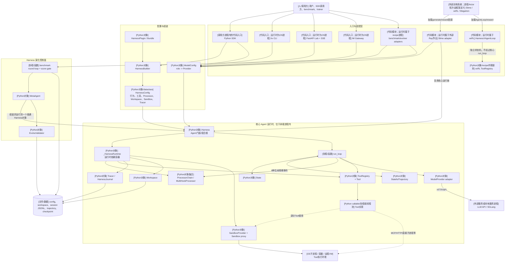

架构上最重要的分层是：

1. `HarnessBuilder` 和插件负责**描述行为组合**。Builder 的修改方法返回新 Builder，并在 `build()` 时排序 Processor、合并 Tool 和生成 `HarnessConfig`，见 [`builder.py:73-188`](https://github.com/Darwin-Agent/HarnessX/blob/bf5f199ee65034d55db0c536e582f1e7c8abf669/harnessx/core/builder.py#L73-L188) 与 [`builder.py:190-334`](https://github.com/Darwin-Agent/HarnessX/blob/bf5f199ee65034d55db0c536e582f1e7c8abf669/harnessx/core/builder.py#L190-L334)。
2. `ModelConfig` 负责**模型角色到 Provider 的绑定**；`HarnessConfig` 负责**行为管线**，源码明确说明其不包含模型，见 [`model_config.py:11-57`](https://github.com/Darwin-Agent/HarnessX/blob/bf5f199ee65034d55db0c536e582f1e7c8abf669/harnessx/core/model_config.py#L11-L57) 和 [`harness.py:743-779`](https://github.com/Darwin-Agent/HarnessX/blob/bf5f199ee65034d55db0c536e582f1e7c8abf669/harnessx/core/harness.py#L743-L779)。
3. `Harness` 是组合根和运行门面。构造时把描述配置实例化为 `_HarnessRuntime`，运行时负责会话恢复、Workspace 初始化、Sandbox 获取和调用 `run_loop`，见 [`harness.py:341-350`](https://github.com/Darwin-Agent/HarnessX/blob/bf5f199ee65034d55db0c536e582f1e7c8abf669/harnessx/core/harness.py#L341-L350)、[`harness.py:545-684`](https://github.com/Darwin-Agent/HarnessX/blob/bf5f199ee65034d55db0c536e582f1e7c8abf669/harnessx/core/harness.py#L545-L684) 和 [`harness.py:1187-1307`](https://github.com/Darwin-Agent/HarnessX/blob/bf5f199ee65034d55db0c536e582f1e7c8abf669/harnessx/core/harness.py#L1187-L1307)。
4. `run_loop` 只保留循环骨架，把上下文、记忆、控制和评价交给 Processor，因此 Processor 是主要的 Harness 行为调整面，见 [`runloop.py:116-146`](https://github.com/Darwin-Agent/HarnessX/blob/bf5f199ee65034d55db0c536e582f1e7c8abf669/harnessx/core/runloop.py#L116-L146)。
5. `StatefulTrajectory` 是核心返回值的一部分，不是事后从日志推导的附属物；每一步记录状态快照/增量、模型动作、工具观察、事件和奖励，见 [`trajectory.py:243-304`](https://github.com/Darwin-Agent/HarnessX/blob/bf5f199ee65034d55db0c536e582f1e7c8abf669/harnessx/core/trajectory.py#L243-L304)。

## 4. 核心组件逻辑视图

### 4.1 对象关系

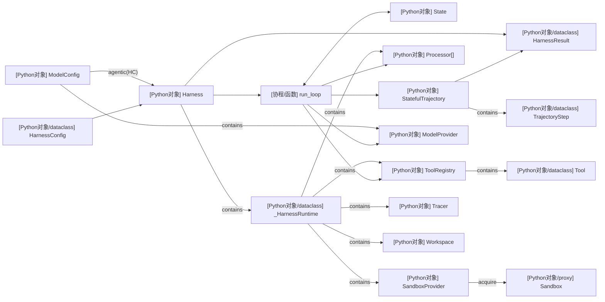

`ModelConfig` 中除 `main` 外的模型角色会被包装为**同一进程内的辅助 `Harness` 对象**，再绑定到 `MultiHookProcessor`；它们不是外部 Agent 服务或 Actor，见 [`harness.py:1023-1047`](https://github.com/Darwin-Agent/HarnessX/blob/bf5f199ee65034d55db0c536e582f1e7c8abf669/harnessx/core/harness.py#L1023-L1047)。

### 4.2 生命周期事件和 Processor 链

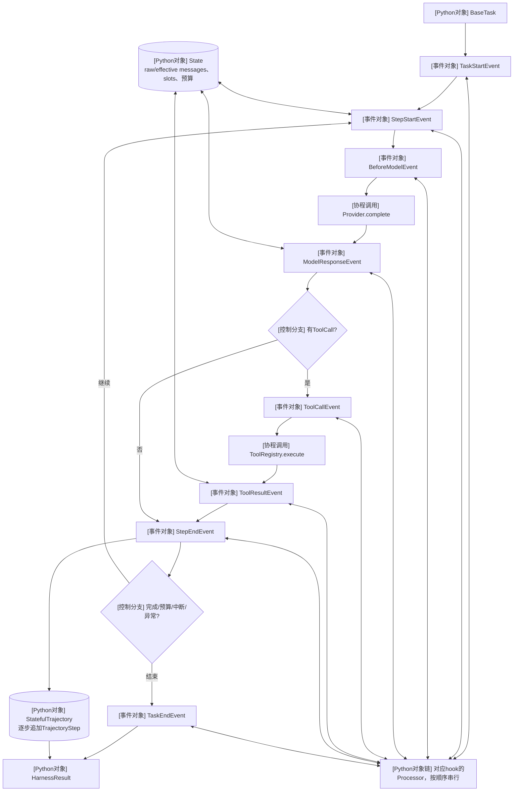

固定的八个 hook 是 `task_start`、`step_start`、`before_model`、`after_model`、`before_tool`、`after_tool`、`step_end` 和 `task_end`，映射见 [`processor.py:558-569`](https://github.com/Darwin-Agent/HarnessX/blob/bf5f199ee65034d55db0c536e582f1e7c8abf669/harnessx/core/processor.py#L558-L569)。这些是可用生命周期点，不代表每个控制分支都会触发全部 hook；`skip_model` 和 Tool 硬拒绝的例外见 6.1。`Processor` 可以透传、替换、拆分或拦截事件，也能用异常中止控制流，见 [`processor.py:342-353`](https://github.com/Darwin-Agent/HarnessX/blob/bf5f199ee65034d55db0c536e582f1e7c8abf669/harnessx/core/processor.py#L342-L353)。`ProcessorChain` 对每个事件按顺序执行；某个 Processor 不再产出事件时，链路停止，见 [`processor.py:372-439`](https://github.com/Darwin-Agent/HarnessX/blob/bf5f199ee65034d55db0c536e582f1e7c8abf669/harnessx/core/processor.py#L372-L439)。

### 4.3 主要组件职责及运行类型

| 组件 | 运行类型 | 源码职责 | 直接证据 |
|---|---|---|---|
| `HarnessBuilder` | Python 对象 | 组合 Processor、Tool、Plugin 和配置 slot；冲突检测与排序 | [`builder.py:73-188`](https://github.com/Darwin-Agent/HarnessX/blob/bf5f199ee65034d55db0c536e582f1e7c8abf669/harnessx/core/builder.py#L73-L188) |
| `HarnessConfig` | Python dataclass | 可序列化的行为描述；私有属性可暂存不能序列化的运行时对象 | [`harness.py:743-828`](https://github.com/Darwin-Agent/HarnessX/blob/bf5f199ee65034d55db0c536e582f1e7c8abf669/harnessx/core/harness.py#L743-L828) |
| `ModelConfig` | Python 对象 | `role -> provider` 映射和 fallback；与 HarnessConfig 合成 Agent | [`model_config.py:11-86`](https://github.com/Darwin-Agent/HarnessX/blob/bf5f199ee65034d55db0c536e582f1e7c8abf669/harnessx/core/model_config.py#L11-L86) |
| `Harness` | Python 对象 | Agent 门面、组合根、会话恢复、Sandbox 生命周期和结果收尾 | [`harness.py:969-1075`](https://github.com/Darwin-Agent/HarnessX/blob/bf5f199ee65034d55db0c536e582f1e7c8abf669/harnessx/core/harness.py#L969-L1075) |
| `_HarnessRuntime` | Python dataclass | 保存 live ToolRegistry、Tracer、Processor、Workspace、SandboxProvider、Plugin | [`harness.py:341-350`](https://github.com/Darwin-Agent/HarnessX/blob/bf5f199ee65034d55db0c536e582f1e7c8abf669/harnessx/core/harness.py#L341-L350) |
| `run_loop` | async 函数 | 生成事件、调用模型/工具、推进状态、构造轨迹、决定终止 | [`runloop.py:116-159`](https://github.com/Darwin-Agent/HarnessX/blob/bf5f199ee65034d55db0c536e582f1e7c8abf669/harnessx/core/runloop.py#L116-L159) |
| `State` | Python 对象 | 持有 raw/effective message、预算、slot、工具结果和子 Agent 状态 | [`state.py:120-159`](https://github.com/Darwin-Agent/HarnessX/blob/bf5f199ee65034d55db0c536e582f1e7c8abf669/harnessx/core/state.py#L120-L159) |
| `StatefulTrajectory` | Python dataclass | 一等执行产物；回填奖励并导出 SFT/GRPO 记录 | [`trajectory.py:275-356`](https://github.com/Darwin-Agent/HarnessX/blob/bf5f199ee65034d55db0c536e582f1e7c8abf669/harnessx/core/trajectory.py#L275-L356) |
| `Processor` | Python 对象 | 在八个 hook 上修改或拦截事件，实现上下文、记忆、控制、评价和观测行为 | [`processor.py:342-353`](https://github.com/Darwin-Agent/HarnessX/blob/bf5f199ee65034d55db0c536e582f1e7c8abf669/harnessx/core/processor.py#L342-L353) |
| `InMemoryToolRegistry` | Python 对象 | 进程内字典注册表，按名称调用 Tool | [`inmemory.py:9-16`](https://github.com/Darwin-Agent/HarnessX/blob/bf5f199ee65034d55db0c536e582f1e7c8abf669/harnessx/tools/inmemory.py#L9-L16) |
| `Tool` | Python dataclass | JSON Schema + Python callable；同步 callable 被送入线程执行 | [`base.py:27-76`](https://github.com/Darwin-Agent/HarnessX/blob/bf5f199ee65034d55db0c536e582f1e7c8abf669/harnessx/tools/base.py#L27-L76) |
| `Workspace` | Python 对象 | 文件根目录和路径访问边界；为子 Agent 创建子目录 | [`workspace.py:42-82`](https://github.com/Darwin-Agent/HarnessX/blob/bf5f199ee65034d55db0c536e582f1e7c8abf669/harnessx/workspace/workspace.py#L42-L82)、[`workspace.py:139-150`](https://github.com/Darwin-Agent/HarnessX/blob/bf5f199ee65034d55db0c536e582f1e7c8abf669/harnessx/workspace/workspace.py#L139-L150) |
| `SandboxProvider` / `Sandbox` | Python 对象/代理 | 获取执行环境；统一 local、Docker、E2B 的命令及文件接口 | [`base.py:38-63`](https://github.com/Darwin-Agent/HarnessX/blob/bf5f199ee65034d55db0c536e582f1e7c8abf669/harnessx/sandbox/base.py#L38-L63)、[`base.py:145-178`](https://github.com/Darwin-Agent/HarnessX/blob/bf5f199ee65034d55db0c536e582f1e7c8abf669/harnessx/sandbox/base.py#L145-L178) |
| `HarnessJournal` | Python 对象 | 将会话、trace、状态快照立即刷入文件并支持恢复 | [`journal.py:44-64`](https://github.com/Darwin-Agent/HarnessX/blob/bf5f199ee65034d55db0c536e582f1e7c8abf669/harnessx/tracing/journal.py#L44-L64) |

## 5. 部署视图

### 5.1 CLI、Lab 与 Gateway

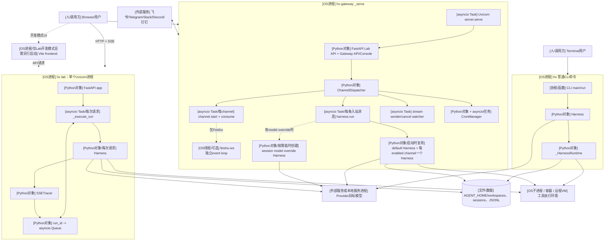

`hx lab` 直接创建 `uvicorn.Server` 并通过 `asyncio.run()` 启动，没有在该入口配置多 worker，见 [`cli.py:1957-2002`](https://github.com/Darwin-Agent/HarnessX/blob/bf5f199ee65034d55db0c536e582f1e7c8abf669/harnessx/cli.py#L1957-L2002)。每个 Lab run 是 `_run_tasks` 中的 `asyncio.Task`，事件通过同进程的 `asyncio.Queue` 送到 SSE，见 [`api/routes/run.py:22-65`](https://github.com/Darwin-Agent/HarnessX/blob/bf5f199ee65034d55db0c536e582f1e7c8abf669/harnessx/api/routes/run.py#L22-L65) 和 [`api/routes/run.py:90-136`](https://github.com/Darwin-Agent/HarnessX/blob/bf5f199ee65034d55db0c536e582f1e7c8abf669/harnessx/api/routes/run.py#L90-L136)。`run_in_executor()` 只把同步的配置构建放入线程池，不会为 Agent 建立新进程。`--dev` 仅关闭静态资源托管并提示另行运行 `npm run dev`，CLI 自身不会拉起 Vite 进程，见 [`cli.py:1969-1984`](https://github.com/Darwin-Agent/HarnessX/blob/bf5f199ee65034d55db0c536e582f1e7c8abf669/harnessx/cli.py#L1969-L1984)。

`hx-gateway start` 用 `subprocess.Popen(..., start_new_session=True)` 启动一个后台 OS 进程，见 [`gateway/main.py:486-508`](https://github.com/Darwin-Agent/HarnessX/blob/bf5f199ee65034d55db0c536e582f1e7c8abf669/gateway/main.py#L486-L508)。这个进程内部同时启动 channel consumer、每条入站消息对应的 Harness run、stream sender、cancel watcher、Cron 和 Uvicorn 的 `asyncio.Task`，见 [`gateway/main.py:322-450`](https://github.com/Darwin-Agent/HarnessX/blob/bf5f199ee65034d55db0c536e582f1e7c8abf669/gateway/main.py#L322-L450) 与 [`gateway/core/dispatch.py:409-483`](https://github.com/Darwin-Agent/HarnessX/blob/bf5f199ee65034d55db0c536e582f1e7c8abf669/gateway/core/dispatch.py#L409-L483)。默认 Harness 和每个 enabled channel 的 Harness 在启动时创建并复用；只有 session 指定 model override 时才临时构造新 Harness，见 [`gateway/main.py:340-407`](https://github.com/Darwin-Agent/HarnessX/blob/bf5f199ee65034d55db0c536e582f1e7c8abf669/gateway/main.py#L340-L407) 和 [`dispatch.py:888-927`](https://github.com/Darwin-Agent/HarnessX/blob/bf5f199ee65034d55db0c536e582f1e7c8abf669/gateway/core/dispatch.py#L888-L927)。会话锁是 `asyncio.Lock`，作用是让同一 session 串行运行，并不是分布式锁，见 [`dispatch.py:627-734`](https://github.com/Darwin-Agent/HarnessX/blob/bf5f199ee65034d55db0c536e582f1e7c8abf669/gateway/core/dispatch.py#L627-L734)。Gateway 的 FastAPI app 还复用了 Lab API；Feishu adapter 因 SDK 的阻塞式 WebSocket 另建一个 `feishu-ws` daemon 线程和线程内事件循环，它仍不是独立进程，见 [`gateway/server.py:993-1011`](https://github.com/Darwin-Agent/HarnessX/blob/bf5f199ee65034d55db0c536e582f1e7c8abf669/gateway/server.py#L993-L1011) 和 [`channel.py:231-265`](https://github.com/Darwin-Agent/HarnessX/blob/bf5f199ee65034d55db0c536e582f1e7c8abf669/gateway/channels/feishu/channel.py#L231-L265)。

### 5.2 Tool、MCP 与 Sandbox 的物理边界

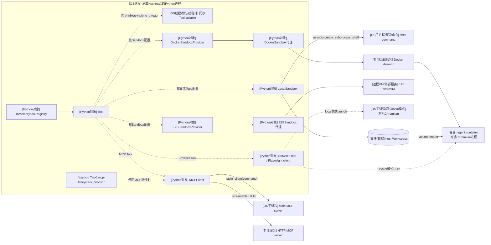

- `LocalSandbox` 本身只是 Python 对象；只有执行 shell 命令时才调用 `asyncio.create_subprocess_shell`，见 [`local.py:17-88`](https://github.com/Darwin-Agent/HarnessX/blob/bf5f199ee65034d55db0c536e582f1e7c8abf669/harnessx/sandbox/local.py#L17-L88)。Read/Write 等本地文件操作可以直接在当前进程访问文件。
- `DockerSandboxProvider` 是当前进程内的管理对象，经 docker-py 调用 Docker daemon，再由 daemon 创建容器；容器可以挂载 Workspace，并可在其中启动 Chromium，见 [`docker.py:208-263`](https://github.com/Darwin-Agent/HarnessX/blob/bf5f199ee65034d55db0c536e582f1e7c8abf669/harnessx/sandbox/docker.py#L208-L263) 和 [`docker.py:282-331`](https://github.com/Darwin-Agent/HarnessX/blob/bf5f199ee65034d55db0c536e582f1e7c8abf669/harnessx/sandbox/docker.py#L282-L331)。
- `E2BSandboxProvider` 返回远程 microVM 的代理对象；`AsyncSandbox.create/connect` 才是远端隔离边界，见 [`e2b.py:170-204`](https://github.com/Darwin-Agent/HarnessX/blob/bf5f199ee65034d55db0c536e582f1e7c8abf669/harnessx/sandbox/e2b.py#L170-L204)。
- `MCPClient` 是普通对象。stdio transport 会启动外部 MCP server 进程，HTTP transport 连接外部服务，见 [`mcp.py:175-237`](https://github.com/Darwin-Agent/HarnessX/blob/bf5f199ee65034d55db0c536e582f1e7c8abf669/harnessx/tools/mcp.py#L175-L237) 和 [`mcp.py:405-429`](https://github.com/Darwin-Agent/HarnessX/blob/bf5f199ee65034d55db0c536e582f1e7c8abf669/harnessx/tools/mcp.py#L405-L429)。
- 普通同步 Tool callable 通过 `asyncio.to_thread()` 进入宿主进程的默认线程池；异步 Tool 则直接在当前事件循环中 await，见 [`tools/base.py:56-76`](https://github.com/Darwin-Agent/HarnessX/blob/bf5f199ee65034d55db0c536e582f1e7c8abf669/harnessx/tools/base.py#L56-L76)。MCP 插件另用一个进程内 `mcp-lifecycle-supervisor` Task 串行管理 connect/disconnect，见 [`mcp_runtime/plugin.py:36-73`](https://github.com/Darwin-Agent/HarnessX/blob/bf5f199ee65034d55db0c536e582f1e7c8abf669/harnessx/plugins/dimensions/mcp_runtime/plugin.py#L36-L73)。
- Browser Tool 在默认 local 模式首次调用时由 Playwright 拉起本机 Chromium 子进程；有 Docker sandbox 的 `cdp_url` 时连接容器内 Chromium，见 [`browser.py:29-50`](https://github.com/Darwin-Agent/HarnessX/blob/bf5f199ee65034d55db0c536e582f1e7c8abf669/harnessx/tools/builtin/browser.py#L29-L50) 和 [`browser.py:53-105`](https://github.com/Darwin-Agent/HarnessX/blob/bf5f199ee65034d55db0c536e582f1e7c8abf669/harnessx/tools/builtin/browser.py#L53-L105)。

### 5.3 Harness 演化部署（GAIA 主路径及变体）

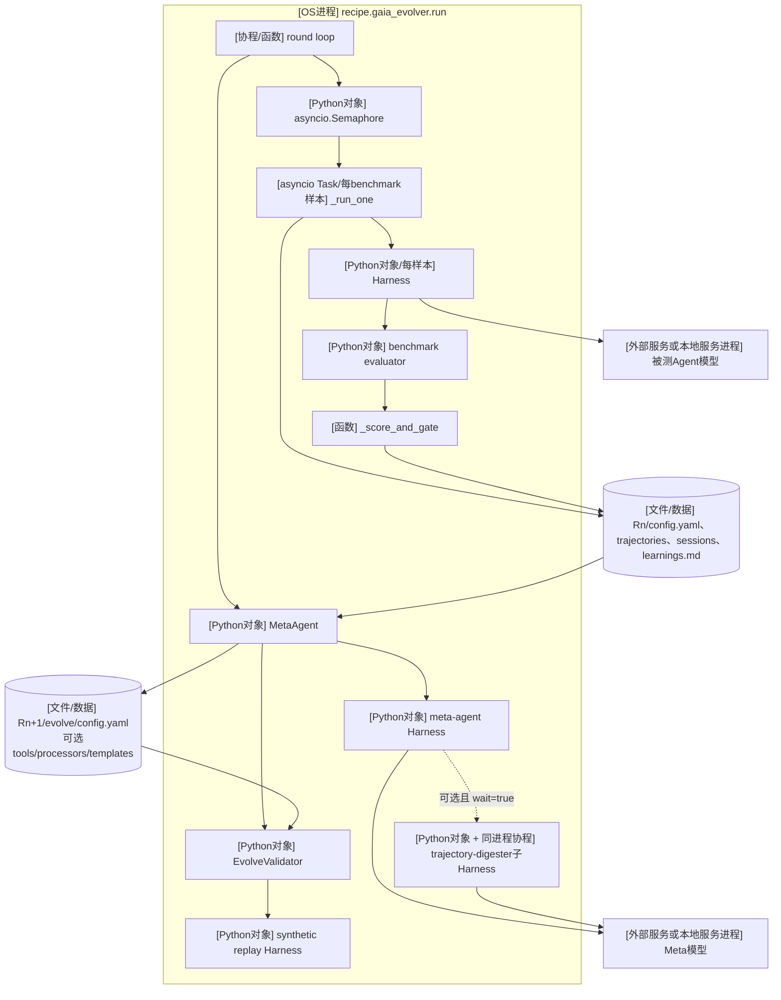

上图严格对应 GAIA evolver：每个 benchmark 样本创建一个 `Harness` 对象，以 `asyncio.gather` 并发，并由 Semaphore 限制并发量，见 [`gaia_evolver/run.py:715-774`](https://github.com/Darwin-Agent/HarnessX/blob/bf5f199ee65034d55db0c536e582f1e7c8abf669/recipe/gaia_evolver/run.py#L715-L774)。`MetaAgent` 又组装并运行一个普通 Harness，见 [`meta_harness/agent.py:579-626`](https://github.com/Darwin-Agent/HarnessX/blob/bf5f199ee65034d55db0c536e582f1e7c8abf669/harnessx/meta_harness/agent.py#L579-L626)。目前唯一实现的 reflect worker 是 `trajectory-digester`；它通过同一套子 Harness spawn 函数并以 `wait=True` 调用，仍在同一 Python 进程内，见 [`trajectory_digester.py:15-23`](https://github.com/Darwin-Agent/HarnessX/blob/bf5f199ee65034d55db0c536e582f1e7c8abf669/harnessx/meta_harness/workers/trajectory_digester.py#L15-L23) 和 [`trajectory_digester.py:167-241`](https://github.com/Darwin-Agent/HarnessX/blob/bf5f199ee65034d55db0c536e582f1e7c8abf669/harnessx/meta_harness/workers/trajectory_digester.py#L167-L241)。

三种演化 recipe 共享 `MetaAgent.evolve()`，但轨迹收集和 Gate 的物理执行方式不同：

| recipe | 可由本仓库确认的部署方式 |
|---|---|
| GAIA | 单个 evolver OS 进程；每样本一个 `asyncio Task` 和一个核心 `Harness` 对象；`Semaphore` 限流；本进程内执行 `_score_and_gate()` |
| Tau2 | 单个 evolver OS 进程；外层用 `asyncio.to_thread()` 调同步的 `tau2.run_tasks()`；其批处理并发由外部 Tau2 包实现，线程/进程细节在本仓库中不明确；本进程内执行自己的 `_score_and_gate()`，见 [`tau2_evolver/run.py:275-354`](https://github.com/Darwin-Agent/HarnessX/blob/bf5f199ee65034d55db0c536e582f1e7c8abf669/recipe/tau2_evolver/run.py#L275-L354)、[`tau2_evolver/run.py:1552-1578`](https://github.com/Darwin-Agent/HarnessX/blob/bf5f199ee65034d55db0c536e582f1e7c8abf669/recipe/tau2_evolver/run.py#L1552-L1578) 和 [`tau2_evolver/run.py:1667-1682`](https://github.com/Darwin-Agent/HarnessX/blob/bf5f199ee65034d55db0c536e582f1e7c8abf669/recipe/tau2_evolver/run.py#L1667-L1682) |
| TB2 | 单个 evolver OS 进程；可直接读取已有轨迹。`rerun` 模式通过 `asyncio.to_thread(subprocess.run)` 启动额外的 `bash <eval_script>` OS 子进程；TB2 adapter 读取 score，但没有 GAIA/Tau2 的 `_score_and_gate()`，见 [`tb2_trajspec.py:300-360`](https://github.com/Darwin-Agent/HarnessX/blob/bf5f199ee65034d55db0c536e582f1e7c8abf669/recipe/tb2_evolver/tb2_trajspec.py#L300-L360) 和 [`tb2_evolver/run.py:648-731`](https://github.com/Darwin-Agent/HarnessX/blob/bf5f199ee65034d55db0c536e582f1e7c8abf669/recipe/tb2_evolver/run.py#L648-L731) |

`MetaAgent` 演化引擎自身不使用 Ray，也不启动常驻服务；benchmark 轨迹收集是否创建额外线程或子进程由上述 recipe adapter 决定。

### 5.4 Slime 训练接入部署（外部框架边界）

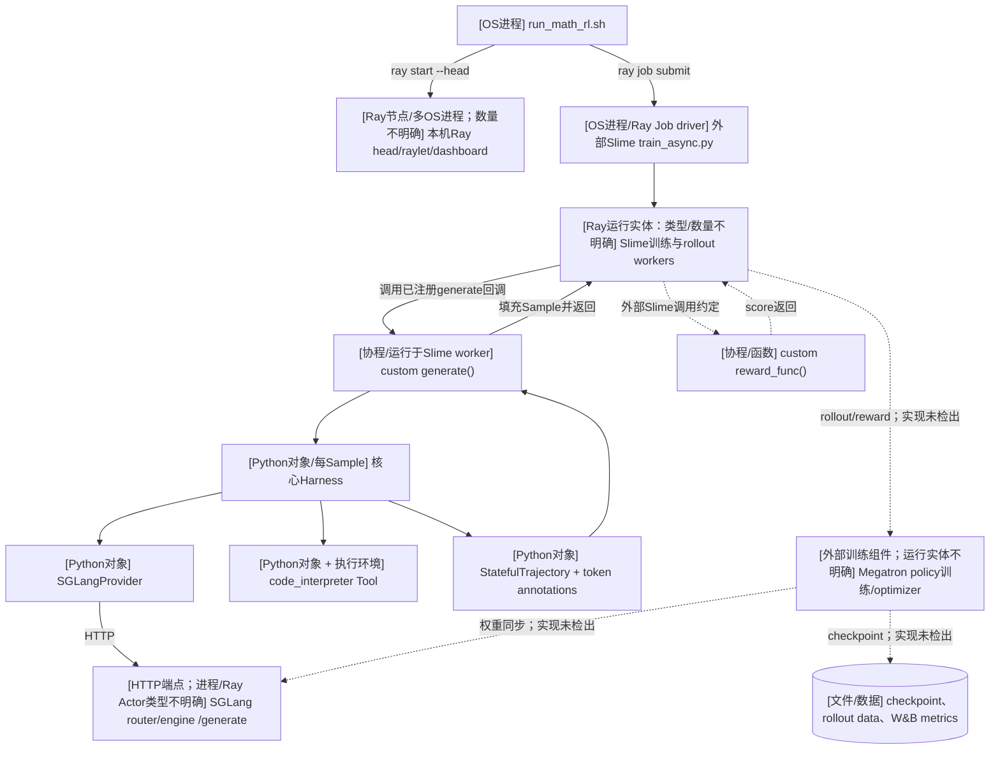

该 launch script 明确启动本机 Ray head，再提交外部 `SLIME_ROOT/train_async.py` 作业，默认把 4 张 GPU 配给训练 Actor 角色、4 张配给 rollout，并把 HarnessX 的 `generate`/`reward_func` 作为回调传入，见 [`run_math_rl.sh:35-45`](https://github.com/Darwin-Agent/HarnessX/blob/bf5f199ee65034d55db0c536e582f1e7c8abf669/recipe/slime/launch/run_math_rl.sh#L35-L45) 和 [`run_math_rl.sh:204-261`](https://github.com/Darwin-Agent/HarnessX/blob/bf5f199ee65034d55db0c536e582f1e7c8abf669/recipe/slime/launch/run_math_rl.sh#L204-L261)。但 Slime 源码不在本仓库中，所以 worker 的具体 Ray Actor 类、数量和进程布局**不明确**；图中不能把 `--actor-num-gpus-per-node` 误解成 Actor 数量。

Slime 的两个回调彼此没有直接调用：`generate()` 为每个 Sample 创建 `SGLangProvider`、`HarnessConfig` 和 `Harness`，执行后把 trajectory 转成 token、loss mask 和 rollout log probabilities；`reward_func()` 单独从 Sample/trajectory 中返回标量奖励。外部 Slime 何时调用两者、如何把奖励交给训练器以及如何同步新权重，本仓库没有实现。回调代码见 [`harness_rollout.py:93-203`](https://github.com/Darwin-Agent/HarnessX/blob/bf5f199ee65034d55db0c536e582f1e7c8abf669/recipe/slime/harness_rollout.py#L93-L203) 和 [`harness_rollout.py:206-325`](https://github.com/Darwin-Agent/HarnessX/blob/bf5f199ee65034d55db0c536e582f1e7c8abf669/recipe/slime/harness_rollout.py#L206-L325)，注册参数见 [`run_math_rl.sh:204-208`](https://github.com/Darwin-Agent/HarnessX/blob/bf5f199ee65034d55db0c536e582f1e7c8abf669/recipe/slime/launch/run_math_rl.sh#L204-L208)。

### 5.5 veRL 训练接入部署（外部框架边界）

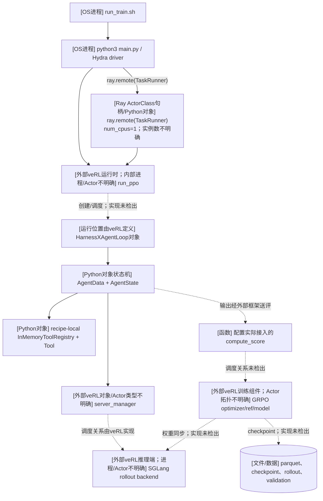

当前源码只直接确认 `TaskRunner` 被包装成 Ray ActorClass 句柄，见 [`main.py:13-19`](https://github.com/Darwin-Agent/HarnessX/blob/bf5f199ee65034d55db0c536e582f1e7c8abf669/recipe/verl_harnessX/main.py#L13-L19)；实际 Actor 实例由 `run_ppo` 如何创建并不明确。`HarnessXAgentLoop` 调用外部 veRL 的 `server_manager.generate()`，工具调用则在该对象内用 `asyncio.gather` 并发，见 [`agent_loop.py:269-347`](https://github.com/Darwin-Agent/HarnessX/blob/bf5f199ee65034d55db0c536e582f1e7c8abf669/recipe/verl_harnessX/agent_loop.py#L269-L347)。这里使用的是 recipe 内联的最小 Tool 框架，并非核心 `harnessx.tools` 注册表，见 [`recipe tools/base.py:1-4, 111-130`](https://github.com/Darwin-Agent/HarnessX/blob/bf5f199ee65034d55db0c536e582f1e7c8abf669/recipe/verl_harnessX/tools/base.py#L1-L130)。当前配置实际注册的 reward 入口只有 `reward.py::compute_score`，见 [`config.yaml:40-42`](https://github.com/Darwin-Agent/HarnessX/blob/bf5f199ee65034d55db0c536e582f1e7c8abf669/recipe/verl_harnessX/config.yaml#L40-L42)；`ToolRewardManager` 虽有定义，但这条启动配置没有接入。训练脚本配置 SGLang async rollout、每 prompt 8 条 rollout、GRPO、单节点 8 GPU，见 [`run_train.sh:89-138`](https://github.com/Darwin-Agent/HarnessX/blob/bf5f199ee65034d55db0c536e582f1e7c8abf669/recipe/verl_harnessX/run_train.sh#L89-L138)。

`recipe/verl_harnessX/verl` 是 Git submodule，地址见 [`.gitmodules`](https://github.com/Darwin-Agent/HarnessX/blob/bf5f199ee65034d55db0c536e582f1e7c8abf669/.gitmodules#L1-L3)；本次检出状态为 `-d206b819...`，前导 `-` 表示子模块未初始化。因此 `run_ppo` 内部还有哪些 Ray Actor、每类多少个、如何放置，**不能从当前本地源码可靠确定**。

## 6. 关键流程时序图

### 6.1 一次核心 Agent 运行

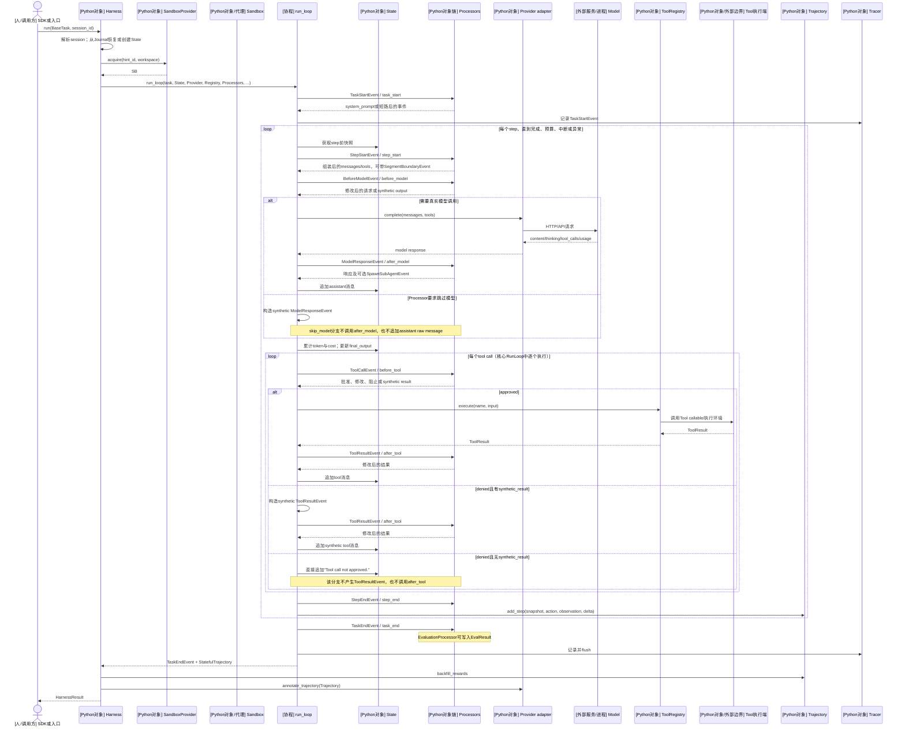

这张图中的顺序由 `run_loop` 直接给出：任务开始在 [`runloop.py:187-220`](https://github.com/Darwin-Agent/HarnessX/blob/bf5f199ee65034d55db0c536e582f1e7c8abf669/harnessx/core/runloop.py#L187-L220)，step/context 和模型调用在 [`runloop.py:255-444`](https://github.com/Darwin-Agent/HarnessX/blob/bf5f199ee65034d55db0c536e582f1e7c8abf669/harnessx/core/runloop.py#L255-L444)，工具调用在 [`runloop.py:488-649`](https://github.com/Darwin-Agent/HarnessX/blob/bf5f199ee65034d55db0c536e582f1e7c8abf669/harnessx/core/runloop.py#L488-L649)，`TrajectoryStep` 在 [`runloop.py:665-702`](https://github.com/Darwin-Agent/HarnessX/blob/bf5f199ee65034d55db0c536e582f1e7c8abf669/harnessx/core/runloop.py#L665-L702) 构造，任务结束在 [`runloop.py:826-852`](https://github.com/Darwin-Agent/HarnessX/blob/bf5f199ee65034d55db0c536e582f1e7c8abf669/harnessx/core/runloop.py#L826-L852)。核心 RunLoop 使用 `for tc in model_event.tool_calls`，因此同一步的多个工具调用是**顺序执行**；veRL adapter 的并行工具调用是另一套实现。

评价发生在 `task_end` hook：`EvaluationProcessor` 调用 evaluator，再用替换后的 `TaskEndEvent` 带回 `EvalResult`，见 [`evaluation.py:15-50`](https://github.com/Darwin-Agent/HarnessX/blob/bf5f199ee65034d55db0c536e582f1e7c8abf669/harnessx/processors/evaluation/evaluation.py#L15-L50)。随后 `Harness.run` 把 terminal reward 回填到每个轨迹 step，并允许 RL Provider 增加 token annotation，见 [`harness.py:1309-1317`](https://github.com/Darwin-Agent/HarnessX/blob/bf5f199ee65034d55db0c536e582f1e7c8abf669/harnessx/core/harness.py#L1309-L1317)。

### 6.2 子 Agent 创建与返回

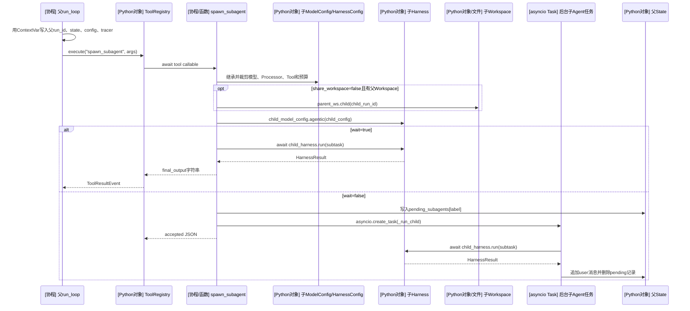

父 RunLoop 在调用 Tool 前通过 `ContextVar` 注入上下文，见 [`runloop.py:525-549`](https://github.com/Darwin-Agent/HarnessX/blob/bf5f199ee65034d55db0c536e582f1e7c8abf669/harnessx/core/runloop.py#L525-L549)。子 Agent 是新建的 `Harness` 普通对象；同步模式直接 `await`，异步模式通过 `asyncio.create_task` 调度并由 `_BACKGROUND_TASKS` 保存强引用，见 [`spawn_subagent.py:70-184`](https://github.com/Darwin-Agent/HarnessX/blob/bf5f199ee65034d55db0c536e582f1e7c8abf669/harnessx/tools/spawn_subagent.py#L70-L184) 和 [`spawn_subagent.py:186-235`](https://github.com/Darwin-Agent/HarnessX/blob/bf5f199ee65034d55db0c536e582f1e7c8abf669/harnessx/tools/spawn_subagent.py#L186-L235)。两种模式都没有创建 OS 进程或 Ray Actor。

数据模型支持 `TrajectoryStep.subagent_trajectories`，见 [`trajectory.py:243-268`](https://github.com/Darwin-Agent/HarnessX/blob/bf5f199ee65034d55db0c536e582f1e7c8abf669/harnessx/core/trajectory.py#L243-L268)；但当前 `spawn_subagent` 实现没有把 `child_harness.run()` 返回的 trajectory 写入这个字段。当前可以确认的是 `parent_run_id` 被传给子 run、Journal 可建立父子 trace 关系；“父 trajectory 已内嵌完整子 trajectory”在这条工具路径上**不能由源码确认**。

### 6.3 一轮 Harness 演化（以 GAIA evolver 为例）

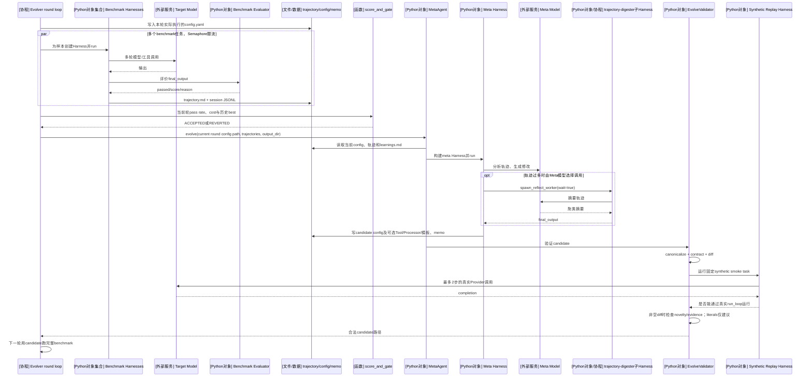

Meta Harness 的工具、写入边界和 Processor 在 [`meta_harness/agent.py:98-275`](https://github.com/Darwin-Agent/HarnessX/blob/bf5f199ee65034d55db0c536e582f1e7c8abf669/harnessx/meta_harness/agent.py#L98-L275) 中组装；`MetaAgent.evolve()` 的输入准备、运行和 post-flight 在 [`agent.py:538-678`](https://github.com/Darwin-Agent/HarnessX/blob/bf5f199ee65034d55db0c536e582f1e7c8abf669/harnessx/meta_harness/agent.py#L538-L678)。当前 `compute_changeset()` **可观测并报告**的 bucket 是 Tool 名称增删、Processor 标签增删/参数变化和模板路径/内容变化，见 [`agent.py:311-395`](https://github.com/Darwin-Agent/HarnessX/blob/bf5f199ee65034d55db0c536e582f1e7c8abf669/harnessx/meta_harness/agent.py#L311-L395) 与 [`agent.py:439-485`](https://github.com/Darwin-Agent/HarnessX/blob/bf5f199ee65034d55db0c536e582f1e7c8abf669/harnessx/meta_harness/agent.py#L439-L485)；这不是对 `HarnessConfig` 其他字段的修改禁令。Meta-Agent 的输出契约还允许写出对应 Python/Jinja 文件，见 [`SOUL.md:57-67`](https://github.com/Darwin-Agent/HarnessX/blob/bf5f199ee65034d55db0c536e582f1e7c8abf669/harnessx/meta_harness/workspace/SOUL.md#L57-L67)。

这里有两种不同含义的 Gate：

- `EvolveValidator` 的 validity/policy gate 检查配置能否加载、Processor contract、结构差分、证据和最小 smoke run，见 [`validate_workflow.py:857-940`](https://github.com/Darwin-Agent/HarnessX/blob/bf5f199ee65034d55db0c536e582f1e7c8abf669/harnessx/meta_harness/validate_workflow.py#L857-L940)。
- 候选是否真正提升任务性能，要到下一轮完整 benchmark 后由 `_score_and_gate()` 判断，见 [`gaia_evolver/run.py:798-820`](https://github.com/Darwin-Agent/HarnessX/blob/bf5f199ee65034d55db0c536e582f1e7c8abf669/recipe/gaia_evolver/run.py#L798-L820)。Synthetic replay 明确只跑一条固定小任务，并非 benchmark 回归，见 [`replay.py:1-14`](https://github.com/Darwin-Agent/HarnessX/blob/bf5f199ee65034d55db0c536e582f1e7c8abf669/harnessx/meta_harness/replay.py#L1-L14) 和 [`replay.py:64-151`](https://github.com/Darwin-Agent/HarnessX/blob/bf5f199ee65034d55db0c536e582f1e7c8abf669/harnessx/meta_harness/replay.py#L64-L151)。

### 6.4 Slime rollout 与外部训练接口

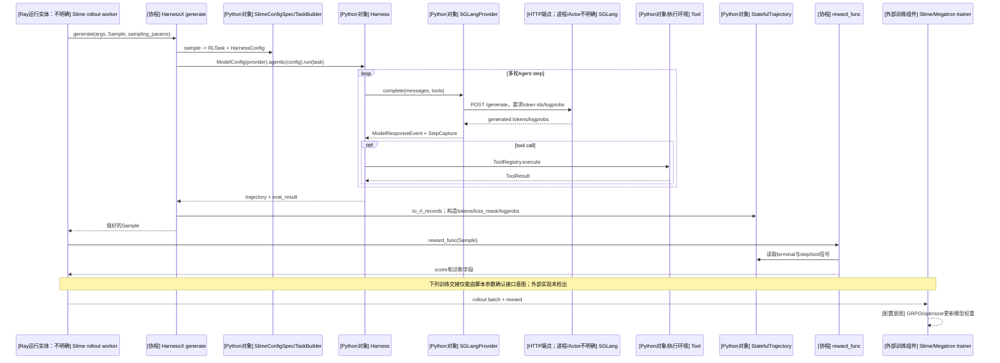

核心 RL 配置工厂把固定系统提示、token guard、RL signal、episode metrics、Evaluator 和 ToolRegistry 组合为每次运行的新 `HarnessConfig`，见 [`rl/builder.py:63-114`](https://github.com/Darwin-Agent/HarnessX/blob/bf5f199ee65034d55db0c536e582f1e7c8abf669/harnessx/rl/builder.py#L63-L114)。SGLang Provider 通过 token 级 `/generate` 接口记录每一轮的 input/output/logprob；实际 HTTP POST 见 [`providers/sglang.py:259-430`](https://github.com/Darwin-Agent/HarnessX/blob/bf5f199ee65034d55db0c536e582f1e7c8abf669/harnessx/providers/sglang.py#L259-L430)。训练器如何聚合梯度和更新权重属于外部 Slime/Megatron 源码，本仓库只能确认数据与回调接口，不能确认其内部 Actor 拓扑。

### 6.5 veRL rollout 与外部训练接口

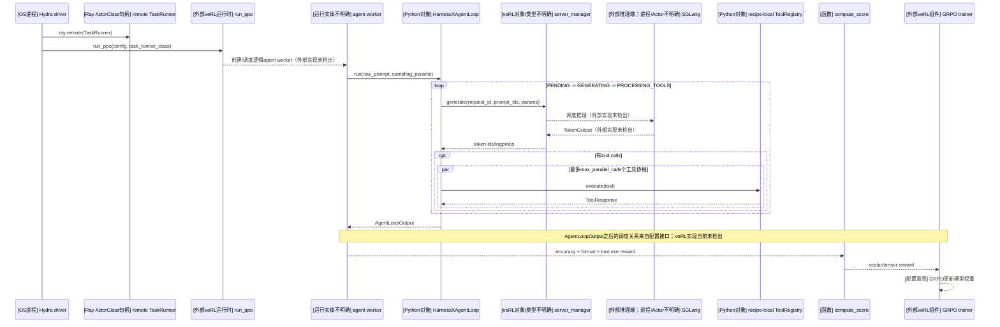

该路径的状态机由 [`agent_loop.py:194-257`](https://github.com/Darwin-Agent/HarnessX/blob/bf5f199ee65034d55db0c536e582f1e7c8abf669/recipe/verl_harnessX/agent_loop.py#L194-L257) 和 [`agent_loop.py:259-371`](https://github.com/Darwin-Agent/HarnessX/blob/bf5f199ee65034d55db0c536e582f1e7c8abf669/recipe/verl_harnessX/agent_loop.py#L259-L371) 实现；reward 组合为 accuracy、格式和 Tool 使用信号，见 [`reward.py:206-217`](https://github.com/Darwin-Agent/HarnessX/blob/bf5f199ee65034d55db0c536e582f1e7c8abf669/recipe/verl_harnessX/reward.py#L206-L217)。除了 `TaskRunner` ActorClass 句柄外，图中所有 veRL 内部创建与放置都标为不明确，原因是对应子模块源码当前未检出。

## 7. 源码揭示的关键架构边界

### 7.1 “Agent”不是额外的一层服务

在核心 API 中，`agentic(harness_config)` 直接返回 `Harness`。因此这里的 Agent 是“模型绑定 + 行为配置 + 执行状态”的组合语义，运行时承载对象就是 `Harness`，没有另一个 `Agent` 守护进程，见 [`model_config.py:73-86`](https://github.com/Darwin-Agent/HarnessX/blob/bf5f199ee65034d55db0c536e582f1e7c8abf669/harnessx/core/model_config.py#L73-L86)。

### 7.2 Harness 的修改面与 changeset 可见范围

Meta-Agent 的输出契约以配置和代码组件为主：

- Tool 的增删；
- Processor 的增删及参数变化；
- system-prompt 模板的增删和内容变化；
- 与上述配置关联的新 Python/Jinja 文件。

输出范围来自 Meta-Agent 契约 [`SOUL.md:57-67`](https://github.com/Darwin-Agent/HarnessX/blob/bf5f199ee65034d55db0c536e582f1e7c8abf669/harnessx/meta_harness/workspace/SOUL.md#L57-L67)。验证器的 `compute_changeset()` 只观测 Tool 名称、Processor 标签及参数、模板路径及内容；它没有比较 Processor 顺序、同标签重复项、同 symbol 不同文件路径、同名 Tool/Processor 的 Python 实现内容，也没有为 Workspace、Sandbox、Tracer 等其他 `HarnessConfig` 字段建立 diff bucket，见 [`agent.py:311-395`](https://github.com/Darwin-Agent/HarnessX/blob/bf5f199ee65034d55db0c536e582f1e7c8abf669/harnessx/meta_harness/agent.py#L311-L395) 和 [`agent.py:439-485`](https://github.com/Darwin-Agent/HarnessX/blob/bf5f199ee65034d55db0c536e582f1e7c8abf669/harnessx/meta_harness/agent.py#L439-L485)。所以这些 bucket 是**差分可见范围**，不是可修改范围；某类修改是否已被演化实验实际覆盖，仅凭当前源码没有可靠答案。

### 7.3 代码没有实现具名的 AEGIS Planner/Evolver/Critic 对象

仓库中没有 `AEGIS`、`Planner`、`Evolver` 或 `Critic` 类。当前实现是：一个 `MetaAgent` 创建一个普通 Meta Harness；该 Harness 按 `SOUL.md` 和 skills 中的提示流程完成读取、分析、候选设计、写出和自检；可选的具名子 worker 目前只有 `trajectory-digester`。`artifact-auditor` 与 `processor-probe-dryrun` 只是保留名称，尚未实现，见 [`trajectory_digester.py:15-23`](https://github.com/Darwin-Agent/HarnessX/blob/bf5f199ee65034d55db0c536e582f1e7c8abf669/harnessx/meta_harness/workers/trajectory_digester.py#L15-L23) 和 [`trajectory_digester.py:74-87`](https://github.com/Darwin-Agent/HarnessX/blob/bf5f199ee65034d55db0c536e582f1e7c8abf669/harnessx/meta_harness/workers/trajectory_digester.py#L74-L87)。

因此，如果论文或介绍图使用 Planner、Evolver、Critic 等角色，它们最多能映射为 Meta-Agent 的提示阶段，不能在代码部署图中标成独立对象、进程或 Actor。

### 7.4 Harness 演化与模型训练当前是分开的 recipe

Meta-Agent 的指导明确要求只修 Harness mechanism，并把模型能力缺口记入 memo 后跳过，见 [`SOUL.md:69-92`](https://github.com/Darwin-Agent/HarnessX/blob/bf5f199ee65034d55db0c536e582f1e7c8abf669/harnessx/meta_harness/workspace/SOUL.md#L69-L92)。`MetaAgent.evolve()` 也没有调用 Slime、veRL 或任何 optimizer。模型训练分别位于 `recipe/slime` 和 `recipe/verl_harnessX`。所以当前仓库提供了 Harness 演化和模型训练两种能力，但没有一段顶层代码把它们编排成自动交替、互相反馈的“模型—Harness 多轮共演化”控制循环。

### 7.5 两条 RL 接入的内核并不相同

| 方面 | Slime adapter | veRL adapter |
|---|---|---|
| Agent 循环 | 直接复用核心 `Harness.run/run_loop` | 自己实现 `HarnessXAgentLoop` 状态机 |
| Processor 八 hook | 使用 | 不使用核心 Processor pipeline |
| Tool 执行 | 核心 ToolRegistry 中逐个执行 | recipe 内联 ToolRegistry；`asyncio.gather` 并行，受 `max_parallel_calls` 限制 |
| 轨迹 | 核心 `StatefulTrajectory` + token annotation | veRL `AgentLoopOutput` + extra fields |
| 推理接口 | `SGLangProvider` HTTP `/generate` | veRL `server_manager.generate` |
| 可确认的 Ray 边界 | launch script 确认 Ray job；具体 Actor 类不明确 | `TaskRunner` 明确包装为 Ray ActorClass；实例与其余 Actor 不明确 |

这意味着修复或扩展核心 `Processor` 行为会自然影响 Slime rollout，但不会自动影响 veRL 的独立 Agent loop；后者需要在 `recipe/verl_harnessX/agent_loop.py` 中单独实现同等行为。

## 8. 需要关注的实现事实与风险

以下不是从命名推测，而是当前控制流直接呈现的结果：

1. **核心同一步内的 ToolCall 是顺序执行。** `run_loop` 对 `model_event.tool_calls` 使用 `for` 循环，见 [`runloop.py:488-549`](https://github.com/Darwin-Agent/HarnessX/blob/bf5f199ee65034d55db0c536e582f1e7c8abf669/harnessx/core/runloop.py#L488-L549)。高延迟、互不依赖的工具不会在核心路径中自动并发。
2. **Synthetic replay 只证明候选大致能运行。** 固定任务是“回复 OK”，默认最多 2 step，见 [`replay.py:64-88`](https://github.com/Darwin-Agent/HarnessX/blob/bf5f199ee65034d55db0c536e582f1e7c8abf669/harnessx/meta_harness/replay.py#L64-L88)。它不能证明 benchmark 性能，也很难覆盖新 Tool/Processor 的特定分支。
3. **GAIA rollback 与下一次 evolve 的基线存在控制流偏差。** Gate 回退时先把 `current_config` 设为历史 best，见 [`gaia_evolver/run.py:802-820`](https://github.com/Darwin-Agent/HarnessX/blob/bf5f199ee65034d55db0c536e582f1e7c8abf669/recipe/gaia_evolver/run.py#L802-L820)；但紧接着传给 `MetaAgent.evolve()` 的仍是本轮已经落盘的 `round_config_path`，见 [`gaia_evolver/run.py:939-946`](https://github.com/Darwin-Agent/HarnessX/blob/bf5f199ee65034d55db0c536e582f1e7c8abf669/recipe/gaia_evolver/run.py#L939-L946)，成功生成候选后又覆盖 `current_config`，见 [`gaia_evolver/run.py:947-965`](https://github.com/Darwin-Agent/HarnessX/blob/bf5f199ee65034d55db0c536e582f1e7c8abf669/recipe/gaia_evolver/run.py#L947-L965)。因此一次 `REVERTED` 不能保证下一轮成功候选从历史 best 分支产生；rollback 主要在 evolve 失败时才会保留下来。是否是有意设计，代码与注释没有说明，结论为**不明确**。
4. **子 trajectory 的内嵌能力与 spawn 工具接线不完整。** 数据类支持 `subagent_trajectories`，但当前 spawn 路径只返回文本或更新父 State，没有给父 `TrajectoryStep` 填入 child trajectory。若训练侧依赖完整的嵌套因果轨迹，需要补充明确接线或改由 Journal 重建。
5. **确定性的清理依赖调用方。** `Harness.run()` 结束后不会立即释放 Harness 级 Sandbox/Plugin；资源在 `Harness.cleanup()` 中释放，见 [`harness.py:1335-1368`](https://github.com/Darwin-Agent/HarnessX/blob/bf5f199ee65034d55db0c536e582f1e7c8abf669/harnessx/core/harness.py#L1335-L1368)。Lab 明确在 `finally` 中清理，见 [`api/routes/run.py:187-193`](https://github.com/Darwin-Agent/HarnessX/blob/bf5f199ee65034d55db0c536e582f1e7c8abf669/harnessx/api/routes/run.py#L187-L193)。框架另有进程退出时的 best-effort `atexit` 清理，但正在运行事件循环时会直接返回，见 [`harness.py:42-70`](https://github.com/Darwin-Agent/HarnessX/blob/bf5f199ee65034d55db0c536e582f1e7c8abf669/harnessx/core/harness.py#L42-L70)，所以长寿命调用方仍应显式管理生命周期。
6. **未被 changeset 跟踪的变化可能被当作 noop。** `compute_changeset()` 按集合或标签比较，未覆盖 Processor 顺序、重复同标签项、同 symbol 换来源文件和同名 Tool/Processor 的代码内容；而 `EvolveValidator` 只在 diff 非空时执行 novelty/evidence policy，见 [`agent.py:311-395`](https://github.com/Darwin-Agent/HarnessX/blob/bf5f199ee65034d55db0c536e582f1e7c8abf669/harnessx/meta_harness/agent.py#L311-L395) 和 [`validate_workflow.py:916-935`](https://github.com/Darwin-Agent/HarnessX/blob/bf5f199ee65034d55db0c536e582f1e7c8abf669/harnessx/meta_harness/validate_workflow.py#L916-L935)。这不等于候选一定错误，但说明“空 changeset”不能完整证明 Harness 没有变化。
7. **当前 TB2 evolver 入口与 `MetaAgent` 构造签名不一致。** TB2 传入 `require_evidence=...`，见 [`tb2_evolver/run.py:635-646`](https://github.com/Darwin-Agent/HarnessX/blob/bf5f199ee65034d55db0c536e582f1e7c8abf669/recipe/tb2_evolver/run.py#L635-L646)；当前 `MetaAgent.__init__()` 没有该参数，见 [`meta_harness/agent.py:507-536`](https://github.com/Darwin-Agent/HarnessX/blob/bf5f199ee65034d55db0c536e582f1e7c8abf669/harnessx/meta_harness/agent.py#L507-L536)。按当前 commit 的 Python 调用语义，这会在进入演化循环前抛出 `TypeError`；因此本报告描述的是 TB2 代码所表达的部署设计，不能据此认定该入口在审计基线可直接运行。

第 3、4、6、7 点属于源码审计发现，不代表项目维护者已经确认的 bug；这里准确描述可观察的接线结果，并把无法确认的设计意图标为不明确。

## 9. 不能由当前代码确定的内容

- 生产环境会使用云模型、本地模型还是 OpenAI-compatible proxy：由 Provider 参数和运行配置决定。
- Docker daemon 位于本机还是远程 socket：`docker_url` 可配置，静态源码不能判断。
- Slime 的 Ray Actor 类、worker/engine 数量与放置：`${SLIME_ROOT}` 是仓库外部依赖。
- veRL 中 `TaskRunner` 实例数、trainer/rollout/ref worker 的 Actor 类型和共置策略：子模块当前未初始化。
- `num_workers: 16` 是否对应 16 个进程或 16 个 Actor：它只是一项逻辑 worker 配置，见 [`config.yaml:35-38`](https://github.com/Darwin-Agent/HarnessX/blob/bf5f199ee65034d55db0c536e582f1e7c8abf669/recipe/verl_harnessX/config.yaml#L35-L38)。
- 论文中 AEGIS 的 Planner/Evolver/Critic 是否存在于未公开或其他分支：当前 commit 中没有对应实现。

## 10. 证据索引

| 主题 | 主要源码 |
|---|---|
| 配置分离与 Agent 构造 | [`model_config.py`](https://github.com/Darwin-Agent/HarnessX/blob/bf5f199ee65034d55db0c536e582f1e7c8abf669/harnessx/core/model_config.py#L11-L86)、[`harness.py`](https://github.com/Darwin-Agent/HarnessX/blob/bf5f199ee65034d55db0c536e582f1e7c8abf669/harnessx/core/harness.py#L743-L779) |
| 运行时对象实例化 | [`harness.py`](https://github.com/Darwin-Agent/HarnessX/blob/bf5f199ee65034d55db0c536e582f1e7c8abf669/harnessx/core/harness.py#L341-L350)、[`harness.py`](https://github.com/Darwin-Agent/HarnessX/blob/bf5f199ee65034d55db0c536e582f1e7c8abf669/harnessx/core/harness.py#L545-L684) |
| RunLoop | [`runloop.py`](https://github.com/Darwin-Agent/HarnessX/blob/bf5f199ee65034d55db0c536e582f1e7c8abf669/harnessx/core/runloop.py#L116-L852) |
| Processor 协议与八 hook | [`processor.py`](https://github.com/Darwin-Agent/HarnessX/blob/bf5f199ee65034d55db0c536e582f1e7c8abf669/harnessx/core/processor.py#L342-L439)、[`processor.py`](https://github.com/Darwin-Agent/HarnessX/blob/bf5f199ee65034d55db0c536e582f1e7c8abf669/harnessx/core/processor.py#L512-L714) |
| State 与 trajectory | [`state.py`](https://github.com/Darwin-Agent/HarnessX/blob/bf5f199ee65034d55db0c536e582f1e7c8abf669/harnessx/core/state.py#L120-L245)、[`trajectory.py`](https://github.com/Darwin-Agent/HarnessX/blob/bf5f199ee65034d55db0c536e582f1e7c8abf669/harnessx/core/trajectory.py#L243-L356) |
| Tool 与 Sandbox | [`tools/base.py`](https://github.com/Darwin-Agent/HarnessX/blob/bf5f199ee65034d55db0c536e582f1e7c8abf669/harnessx/tools/base.py#L27-L79)、[`sandbox/base.py`](https://github.com/Darwin-Agent/HarnessX/blob/bf5f199ee65034d55db0c536e582f1e7c8abf669/harnessx/sandbox/base.py#L38-L190) |
| 子 Agent | [`spawn_subagent.py`](https://github.com/Darwin-Agent/HarnessX/blob/bf5f199ee65034d55db0c536e582f1e7c8abf669/harnessx/tools/spawn_subagent.py#L43-L235) |
| Lab | [`api/app.py`](https://github.com/Darwin-Agent/HarnessX/blob/bf5f199ee65034d55db0c536e582f1e7c8abf669/harnessx/api/app.py#L32-L91)、[`api/routes/run.py`](https://github.com/Darwin-Agent/HarnessX/blob/bf5f199ee65034d55db0c536e582f1e7c8abf669/harnessx/api/routes/run.py#L22-L204)、[`cli.py`](https://github.com/Darwin-Agent/HarnessX/blob/bf5f199ee65034d55db0c536e582f1e7c8abf669/harnessx/cli.py#L1957-L2002) |
| Gateway | [`gateway/main.py`](https://github.com/Darwin-Agent/HarnessX/blob/bf5f199ee65034d55db0c536e582f1e7c8abf669/gateway/main.py#L322-L450)、[`gateway/core/dispatch.py`](https://github.com/Darwin-Agent/HarnessX/blob/bf5f199ee65034d55db0c536e582f1e7c8abf669/gateway/core/dispatch.py#L409-L483) |
| Meta-Harness | [`meta_harness/agent.py`](https://github.com/Darwin-Agent/HarnessX/blob/bf5f199ee65034d55db0c536e582f1e7c8abf669/harnessx/meta_harness/agent.py#L493-L678)、[`validate_workflow.py`](https://github.com/Darwin-Agent/HarnessX/blob/bf5f199ee65034d55db0c536e582f1e7c8abf669/harnessx/meta_harness/validate_workflow.py#L857-L1043) |
| GAIA 演化编排 | [`gaia_evolver/run.py`](https://github.com/Darwin-Agent/HarnessX/blob/bf5f199ee65034d55db0c536e582f1e7c8abf669/recipe/gaia_evolver/run.py#L683-L974) |
| Slime 接入 | [`harness_rollout.py`](https://github.com/Darwin-Agent/HarnessX/blob/bf5f199ee65034d55db0c536e582f1e7c8abf669/recipe/slime/harness_rollout.py#L42-L325)、[`run_math_rl.sh`](https://github.com/Darwin-Agent/HarnessX/blob/bf5f199ee65034d55db0c536e582f1e7c8abf669/recipe/slime/launch/run_math_rl.sh#L204-L261) |
| veRL 接入 | [`main.py`](https://github.com/Darwin-Agent/HarnessX/blob/bf5f199ee65034d55db0c536e582f1e7c8abf669/recipe/verl_harnessX/main.py#L13-L19)、[`agent_loop.py`](https://github.com/Darwin-Agent/HarnessX/blob/bf5f199ee65034d55db0c536e582f1e7c8abf669/recipe/verl_harnessX/agent_loop.py#L194-L371)、[`run_train.sh`](https://github.com/Darwin-Agent/HarnessX/blob/bf5f199ee65034d55db0c536e582f1e7c8abf669/recipe/verl_harnessX/run_train.sh#L73-L142) |
