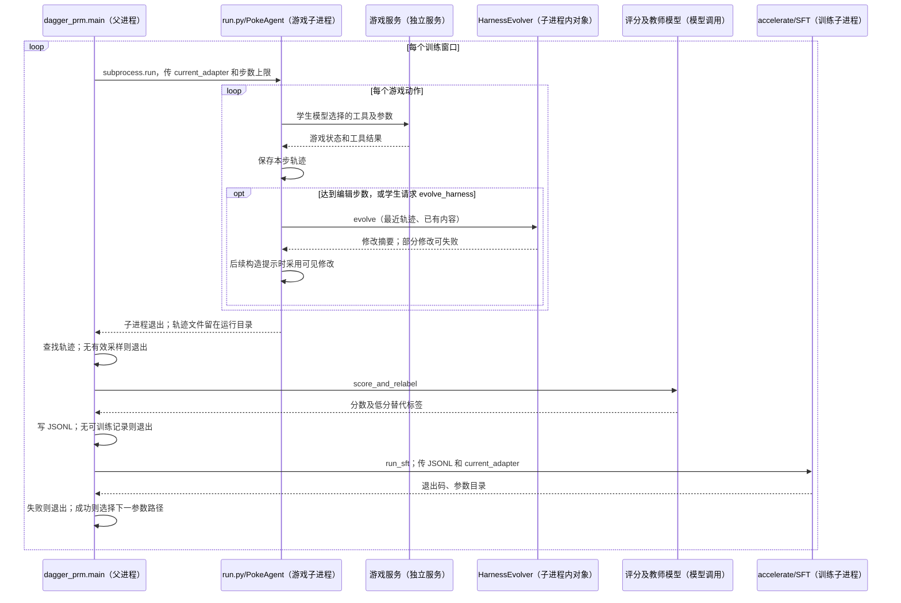

# Continual Harness：一次游戏窗口如何连接 Harness 编辑与模型训练

本文按实验提交 `2a74aa2bcf17d019844a8b86e3748ed566aede69` 的实际调用顺序阅读：父进程启动游戏子进程，子进程在游戏过程中修改 Harness；父进程等待子进程退出，再评分、纠正标签、启动训练，最后选择下一窗口的模型路径。**训练由窗口结束触发，不要求 Harness 修改成功，也不等待修改效果收敛。**入口见[外循环](https://github.com/sethkarten/continual-harness/blob/2a74aa2bcf17d019844a8b86e3748ed566aede69/train/dagger_prm.py#L1283)。

本地 `code-snapshots/continual-harness-2a74aa2/` 是 25 个文件的源码摘录，不是完整可运行工作树；当前 main 为 `bbab97ad73e460b7cd7c08527d10ced30cc03fbe`，两者不能混用。[来源与文件清单](../research/continual-harness/EXPERIMENT_SNAPSHOT_PROVENANCE.md?plain=1#L1)｜[总索引](README.md)

## 1. 先确定论文协议、代码入口与对象边界

论文描述在连续交互中修改 Harness，再利用过程评分和教师纠正训练学生模型；附录报告的窗口长度、训练轮数等与本入口默认值不同。本文复核的是实验代码路径，不把论文实验配置套成默认命令，也不将 main 当成该训练实现。[论文 §3.3、附录 D.4](https://arxiv.org/html/2605.09998v1)

| 名称 | 本文定义与代码实体 | 运行边界 |
|---|---|---|
| 窗口 | 一次有步数上限的 `run.py` 游戏运行；默认 200 步 | 游戏子进程的生命周期 |
| 学生模型 | 读画面、提示并选择工具动作的模型；本文选默认 `unsloth` 后端 | `UnslothBackend` 加载模型 |
| Harness | 战略提示、子 Agent 配置、Python 技能代码及长期记忆 | 游戏进程中的对象与存储文件 |
| 游戏决策对象 | `PokeAgent`，组织模型输入、工具执行与轨迹 | 普通对象，不是 Actor |
| 修改对象 | `HarnessEvolver`，调用编辑模型修改四类内容 | `PokeAgent` 使用的普通对象 |
| 评分/教师模型 | 前者给学生动作评分；后者为低分动作生成替代训练标签 | 父进程发起的模型调用 |
| 训练控制者 | `dagger_prm.main`，启动采样、处理数据并等待训练 | 父进程；训练另起子进程 |

对应入口：[窗口默认值](https://github.com/sethkarten/continual-harness/blob/2a74aa2bcf17d019844a8b86e3748ed566aede69/train/dagger_prm.py#L1065)、[后端默认值](https://github.com/sethkarten/continual-harness/blob/2a74aa2bcf17d019844a8b86e3748ed566aede69/train/dagger_prm.py#L1088)、[PokeAgent](https://github.com/sethkarten/continual-harness/blob/2a74aa2bcf17d019844a8b86e3748ed566aede69/agents/PokeAgent.py#L173)、[HarnessEvolver](https://github.com/sethkarten/continual-harness/blob/2a74aa2bcf17d019844a8b86e3748ed566aede69/agents/utils/harness_evolver.py#L177)、[模型加载](https://github.com/sethkarten/continual-harness/blob/2a74aa2bcf17d019844a8b86e3748ed566aede69/utils/agent_infrastructure/vlm_backends.py#L3472)。子 Agent 配置表示一种执行角色，不自动表示新进程。

## 2. 完整调用关系：先等待什么，再调用什么

图中的编辑在子进程内部完成；父进程不在每次编辑后启动训练。`subprocess.run` 是阻塞等待点，模型评分发生在它返回以后。[等待游戏结束](https://github.com/sethkarten/continual-harness/blob/2a74aa2bcf17d019844a8b86e3748ed566aede69/train/dagger_prm.py#L291)、[调用评分](https://github.com/sethkarten/continual-harness/blob/2a74aa2bcf17d019844a8b86e3748ed566aede69/train/dagger_prm.py#L1344)、[等待训练结束](https://github.com/sethkarten/continual-harness/blob/2a74aa2bcf17d019844a8b86e3748ed566aede69/train/dagger_prm.py#L970)

## 3. 父进程怎样启动当前组合，游戏动作怎样返回

外循环先设置 `current_adapter`，再调用 `run_rollout_harness(adapter_path=current_adapter, …)`。默认分支把该路径作为 `--base-model-id` 传给 `run.py`，同时指定 `--scaffold autoevolve` 和 `--max-steps`。`run.py` 据此开启 Harness 编辑，创建的 `PokeAgent` 随后运行 `run_step`。另选 Gemini 后端时不沿本条路径加载学生适配参数。[实际调用](https://github.com/sethkarten/continual-harness/blob/2a74aa2bcf17d019844a8b86e3748ed566aede69/train/dagger_prm.py#L1305)、[被调函数](https://github.com/sethkarten/continual-harness/blob/2a74aa2bcf17d019844a8b86e3748ed566aede69/train/dagger_prm.py#L206)、[学生后端命令](https://github.com/sethkarten/continual-harness/blob/2a74aa2bcf17d019844a8b86e3748ed566aede69/train/dagger_prm.py#L245)、[开启编辑](https://github.com/sethkarten/continual-harness/blob/2a74aa2bcf17d019844a8b86e3748ed566aede69/run.py#L413)、[单步入口](https://github.com/sethkarten/continual-harness/blob/2a74aa2bcf17d019844a8b86e3748ed566aede69/agents/PokeAgent.py#L2009)

用一段真实历史输入贯穿说明：main 随仓 Red 备份第 77 步位于 `OaksLab`、坐标 `[5,3]`，发出 `press_buttons(buttons=["DOWN","A"])`；第 78 步发出 `["A","A","A"]`，意图是推进对话。**这段旧历史不是实验分支产生的训练日志；后面的编辑与训练仅按源码作条件推演。**[原始动作](../research/continual-harness/history/trajectory_history.jsonl?plain=1#L75)

对这种输入，`PokeAgent` 把画面、状态、目标和当前指导文字传给学生模型。模型返回 `press_buttons` 后，`MCPToolAdapter` 将调用转成游戏服务的 `/mcp/press_buttons` 请求；工具返回后，`_log_trajectory_for_step` 保存提示、学生输出、参数和动作前状态。于是下一环节拿到的是刚产生的轨迹，而不是尚未执行的修改建议。[工具适配对象](https://github.com/sethkarten/continual-harness/blob/2a74aa2bcf17d019844a8b86e3748ed566aede69/agents/PokeAgent.py#L95)、[HTTP 工具映射](https://github.com/sethkarten/continual-harness/blob/2a74aa2bcf17d019844a8b86e3748ed566aede69/agents/PokeAgent.py#L109)、[记录轨迹](https://github.com/sethkarten/continual-harness/blob/2a74aa2bcf17d019844a8b86e3748ed566aede69/agents/PokeAgent.py#L3244)

## 4. 动作记录之后，谁触发分析，怎样修改 Harness

### 4.1 从步数检查进入修改函数

记录完成后，`PokeAgent` 检查 `HarnessEvolver.should_evolve`。实验实现热身 10 步，前 200 步每 10 步编辑，之后每 25 步编辑；该方法未采用传入的 frequency 值。条件不满足时，游戏继续下一步；满足时才调用 `evolve`。[动作后的条件](https://github.com/sethkarten/continual-harness/blob/2a74aa2bcf17d019844a8b86e3748ed566aede69/agents/PokeAgent.py#L2396)、[实际常量](https://github.com/sethkarten/continual-harness/blob/2a74aa2bcf17d019844a8b86e3748ed566aede69/agents/utils/harness_evolver.py#L27)、[判断方法](https://github.com/sethkarten/continual-harness/blob/2a74aa2bcf17d019844a8b86e3748ed566aede69/agents/utils/harness_evolver.py#L223)

还有另一入口：学生模型输出 `evolve_harness` 工具调用时，`_execute_evolve_harness` 在修改对象存在的条件下直接调用 `evolve`，不先检查上述周期。这次调用仍只编辑 Harness，不调用训练程序。[按需编辑](https://github.com/sethkarten/continual-harness/blob/2a74aa2bcf17d019844a8b86e3748ed566aede69/agents/PokeAgent.py#L869)

进入 `evolve` 后，修改对象先读取最近轨迹；没有轨迹则返回跳过结果。有轨迹时，它统计技能表现、尝试局部回退，再依次执行提示、子 Agent、技能、记忆修改；各项各自捕获异常。某一项失败不会形成四项一起撤销的事务。[读取、调用与返回](https://github.com/sethkarten/continual-harness/blob/2a74aa2bcf17d019844a8b86e3748ed566aede69/agents/utils/harness_evolver.py#L329)

### 4.2 分析材料如何变成具体写操作

窗口内的分析不消费窗口结束后的教师评分。`_extract_tool_failures` 先按 `success=False` 或 `error` 提取工具失败；编辑模型再读取轨迹、失败材料和已有内容，输出文字或 JSON。坐标不变只是线索：本例对话中连按 A 不等于失败。[规则提取](https://github.com/sethkarten/continual-harness/blob/2a74aa2bcf17d019844a8b86e3748ed566aede69/agents/utils/harness_evolver.py#L399)、[提示优化入口](https://github.com/sethkarten/continual-harness/blob/2a74aa2bcf17d019844a8b86e3748ed566aede69/agents/utils/prompt_optimizer.py#L141)

| `evolve` 调用的分支 | 模型输出如何被程序处理 | 下一步读取者 |
|---|---|---|
| `_evolve_prompt` | 调用 `PromptOptimizer.optimize_prompt` 更新指导文字 | `PokeAgent` 重建提示 |
| `_evolve_subagents` | 解析 `create/update/retire`；新建先筛工具白名单、限制回合和指令长度，再调用存储的 `add/update/remove` | 后续选择该角色的执行逻辑 |
| `_evolve_skills` | 解析 `add/update`；新增完整 Python `code`，或以非空新字段覆盖旧字段；不是行级补丁 | `_execute_run_skill` 按技能 ID 取代码 |
| `_evolve_memory` | 解析增加或修改记忆的建议，写入存储 | 后续提示中的记忆检索 |

对应实现：[提示](https://github.com/sethkarten/continual-harness/blob/2a74aa2bcf17d019844a8b86e3748ed566aede69/agents/utils/harness_evolver.py#L387)、[子 Agent 新建约束](https://github.com/sethkarten/continual-harness/blob/2a74aa2bcf17d019844a8b86e3748ed566aede69/agents/utils/harness_evolver.py#L512)、[更新与退役](https://github.com/sethkarten/continual-harness/blob/2a74aa2bcf17d019844a8b86e3748ed566aede69/agents/utils/harness_evolver.py#L556)、[技能新增](https://github.com/sethkarten/continual-harness/blob/2a74aa2bcf17d019844a8b86e3748ed566aede69/agents/utils/harness_evolver.py#L718)、[技能覆盖](https://github.com/sethkarten/continual-harness/blob/2a74aa2bcf17d019844a8b86e3748ed566aede69/agents/utils/harness_evolver.py#L747)、[记忆](https://github.com/sethkarten/continual-harness/blob/2a74aa2bcf17d019844a8b86e3748ed566aede69/agents/utils/harness_evolver.py#L765)。过滤空字段意味着不能用空字符串清空已有技能正文。

### 4.3 一个具体变化怎样影响后续动作

假设编辑模型针对重复对话动作新增 `advance_dialogue`：技能正文从 `args` 取有限次数，调用 `tools["get_game_state"]` 判断状态，再调用 `tools["press_buttons"]`。**这是说明修改载体的候选，不是历史记录中的实际补丁。**新增操作实际保存的是技能 ID、描述和 Python 正文。

`evolve` 返回后，`PokeAgent` 将修改摘要加入上下文，并在后续 `_build_optimized_prompt` 读取可见内容。只有学生模型之后选择 `run_skill`，`_execute_run_skill` 才按 ID 获取正文、检查参数、提供 `tools/args/result` 上下文并调用 `exec`；工具结果再回到普通游戏决策。因此“技能入库”“技能被选择”“技能执行成功”是三个先后条件。[摘要回接](https://github.com/sethkarten/continual-harness/blob/2a74aa2bcf17d019844a8b86e3748ed566aede69/agents/PokeAgent.py#L2585)、[重建提示](https://github.com/sethkarten/continual-harness/blob/2a74aa2bcf17d019844a8b86e3748ed566aede69/agents/PokeAgent.py#L2720)、[技能读取](https://github.com/sethkarten/continual-harness/blob/2a74aa2bcf17d019844a8b86e3748ed566aede69/agents/PokeAgent.py#L699)、[执行上下文](https://github.com/sethkarten/continual-harness/blob/2a74aa2bcf17d019844a8b86e3748ed566aede69/agents/PokeAgent.py#L794)、[执行代码](https://github.com/sethkarten/continual-harness/blob/2a74aa2bcf17d019844a8b86e3748ed566aede69/agents/PokeAgent.py#L854)

执行器限制按键数量和耗时，但这些限制不评价游戏收益。局部回退要求修改前后各至少调用三次且坐标不变比例增加超过 15 个百分点；其统计依赖 `post_state`，而轨迹管理器不再保存该字段，缺失时会退用动作前坐标。**明确实现缺口：不能将这个回退判断视为可靠的收益验收。**[执行预算](https://github.com/sethkarten/continual-harness/blob/2a74aa2bcf17d019844a8b86e3748ed566aede69/agents/PokeAgent.py#L760)、[回退条件](https://github.com/sethkarten/continual-harness/blob/2a74aa2bcf17d019844a8b86e3748ed566aede69/agents/utils/harness_evolver.py#L265)、[状态记录格式](https://github.com/sethkarten/continual-harness/blob/2a74aa2bcf17d019844a8b86e3748ed566aede69/utils/data_persistence/run_data_manager.py#L192)

## 5. 游戏子进程退出后，父进程怎样取得评分输入

游戏达到步数上限或提前退出后，父进程中的 `subprocess.run` 才返回。`run_rollout_harness` 随后找运行目录、按截图文件数计算 `steps`，复制轨迹到本窗口的 `rollout_trajectory.jsonl`，返回包含 `steps/trajectory/exit_code/evolutions` 的字典。这里的 `steps` 不是严格的轨迹行数。[等待点](https://github.com/sethkarten/continual-harness/blob/2a74aa2bcf17d019844a8b86e3748ed566aede69/train/dagger_prm.py#L291)、[查找目录与复制](https://github.com/sethkarten/continual-harness/blob/2a74aa2bcf17d019844a8b86e3748ed566aede69/train/dagger_prm.py#L298)、[返回值](https://github.com/sethkarten/continual-harness/blob/2a74aa2bcf17d019844a8b86e3748ed566aede69/train/dagger_prm.py#L333)

外循环读取返回值：`steps==0` 或没有轨迹路径时退出；有采样材料才调用 `score_and_relabel`。**子进程退出码非零只会先记录日志，并非立即禁止训练；Harness 编辑次数为零也不会禁止训练。**目录查找还可能退用已有 `run_*` 目录，因此仅有返回路径不能保证数据一定属于本窗口。[非零退出处理](https://github.com/sethkarten/continual-harness/blob/2a74aa2bcf17d019844a8b86e3748ed566aede69/train/dagger_prm.py#L295)、[数据检查](https://github.com/sethkarten/continual-harness/blob/2a74aa2bcf17d019844a8b86e3748ed566aede69/train/dagger_prm.py#L1323)、[下一调用](https://github.com/sethkarten/continual-harness/blob/2a74aa2bcf17d019844a8b86e3748ed566aede69/train/dagger_prm.py#L1344)

## 6. 评分返回后，低分动作怎样成为训练标签

`score_and_relabel` 先读 JSONL，再选择评分分支。默认 rubric（分项评分）分支调用 `_score_traj_records`，把输出、截图、动作前状态和近期动作交给评分模型；默认权重是进度 0.4、动作 0.3、推理 0.2、格式 0.1。另选 pairwise（成对比较）模式才调用对应的比较评分路径。分数用于构建训练数据，不负责接纳刚才的 Harness。[处理入口](https://github.com/sethkarten/continual-harness/blob/2a74aa2bcf17d019844a8b86e3748ed566aede69/train/dagger_prm.py#L657)、[模式分支](https://github.com/sethkarten/continual-harness/blob/2a74aa2bcf17d019844a8b86e3748ed566aede69/train/dagger_prm.py#L707)、[评分实参](https://github.com/sethkarten/continual-harness/blob/2a74aa2bcf17d019844a8b86e3748ed566aede69/train/dagger_prm.py#L496)、[分数组合](https://github.com/sethkarten/continual-harness/blob/2a74aa2bcf17d019844a8b86e3748ed566aede69/train/openclaw_judge.py#L344)

评分完成后，函数把低于默认阈值 0.3 的有效记录放入教师请求队列；预算限制可使部分记录不获纠正。函数等待并行教师调用返回，再逐条决定是否写出样本：输入缺失则跳过；低分且无教师回答则跳过；低分有回答则以教师文字作标签；高分保留学生输出。教师返回的动作**不补发给游戏**。[构造纠正队列](https://github.com/sethkarten/continual-harness/blob/2a74aa2bcf17d019844a8b86e3748ed566aede69/train/dagger_prm.py#L756)、[教师指令](https://github.com/sethkarten/continual-harness/blob/2a74aa2bcf17d019844a8b86e3748ed566aede69/train/dagger_prm.py#L585)、[筛选与写出](https://github.com/sethkarten/continual-harness/blob/2a74aa2bcf17d019844a8b86e3748ed566aede69/train/dagger_prm.py#L795)

对历史第 77 步的同类记录，只有实际评分低于阈值，教师才可能把另一组按键写成目标输出。本文没有该步的实验评分，不能判断是否纠正。最终每条训练记录含 `image_path/prompt/raw_response/_reward/_source`；函数返回保留、纠正、跳过数量，外循环据此判断是否还有可训练记录。[记录字段](https://github.com/sethkarten/continual-harness/blob/2a74aa2bcf17d019844a8b86e3748ed566aede69/train/dagger_prm.py#L827)、[处理统计](https://github.com/sethkarten/continual-harness/blob/2a74aa2bcf17d019844a8b86e3748ed566aede69/train/dagger_prm.py#L864)、[空数据退出](https://github.com/sethkarten/continual-harness/blob/2a74aa2bcf17d019844a8b86e3748ed566aede69/train/dagger_prm.py#L1363)

## 7. 数据准备返回后，谁启动训练并等待新参数

有可训练记录时，父进程先决定输入文件：默认 `online` 只取本窗口 JSONL；`accumulate` 汇总历史文件，`shard_window` 限制回看窗口数。随后 `run_sft` 接收这些文件与 `current_adapter`，拼出 `accelerate … train.sft_run` 命令并阻塞等待。这里没有“编辑成功后才训练”的额外判断。[选择文件](https://github.com/sethkarten/continual-harness/blob/2a74aa2bcf17d019844a8b86e3748ed566aede69/train/dagger_prm.py#L1367)、[调用训练](https://github.com/sethkarten/continual-harness/blob/2a74aa2bcf17d019844a8b86e3748ed566aede69/train/dagger_prm.py#L1394)、[训练函数](https://github.com/sethkarten/continual-harness/blob/2a74aa2bcf17d019844a8b86e3748ed566aede69/train/dagger_prm.py#L935)、[子进程命令](https://github.com/sethkarten/continual-harness/blob/2a74aa2bcf17d019844a8b86e3748ed566aede69/train/dagger_prm.py#L951)

训练子进程的 `load_records` 把图像和原 prompt 作为输入，把 `raw_response` 作为目标输出；`SFTTrainer` 训练 LoRA，即基础模型上的低秩适配参数。默认训练一轮、学习率 `2e-6`。`_reward` 未作为损失权重，代码也未读取教师概率分布，所以本路径可确认的是文本标签监督微调，不能仅据论文的 soft-SFT 名称推断概率蒸馏。[标签构造](https://github.com/sethkarten/continual-harness/blob/2a74aa2bcf17d019844a8b86e3748ed566aede69/train/sft_run.py#L85)、[训练器](https://github.com/sethkarten/continual-harness/blob/2a74aa2bcf17d019844a8b86e3748ed566aede69/train/sft_run.py#L350)、[默认训练参数](https://github.com/sethkarten/continual-harness/blob/2a74aa2bcf17d019844a8b86e3748ed566aede69/train/dagger_prm.py#L1077)

当前 Harness 的指导文字可随原 prompt 进入训练输入，学生或教师的回答成为目标；修改建议和技能 Python 正文并不自动成为训练目标。训练结束后，父进程检查退出码：非零则结束外循环；成功才执行参数路径选择。[失败与成功分支](https://github.com/sethkarten/continual-harness/blob/2a74aa2bcf17d019844a8b86e3748ed566aede69/train/dagger_prm.py#L1405)

## 8. 下一窗口是否真的使用新模型与新 Harness

父进程优先寻找 `checkpoint-*`，其次检查输出父目录的 `adapter_config.json`；找不到则保留旧 `current_adapter`。但训练脚本最终保存到 `lora_adapter_final`。**明确差异：最终保存目录与父进程查找规则不一致，训练成功不保证下一窗口采用最终参数。**[最终保存](https://github.com/sethkarten/continual-harness/blob/2a74aa2bcf17d019844a8b86e3748ed566aede69/train/sft_run.py#L430)、[路径选择](https://github.com/sethkarten/continual-harness/blob/2a74aa2bcf17d019844a8b86e3748ed566aede69/train/dagger_prm.py#L1409)

选择完成后，外循环重新启动 `run.py`，新 `UnslothBackend` 按路径加载模型。新的动作与轨迹随后又进入第 4 节的 Harness 分析；这才是新模型反馈到 Harness 的路径，不是训练器直接分析权重。

跨窗口的 Harness 继承则未完整接通。`reset-free` 默认关闭；启用后延续的是游戏保存状态，命令没有同步复制全部新提示、技能、记忆和子 Agent 配置。延续游戏状态或目标索引不等于延续相同 Harness。默认三窗口结束即停止，无采样、无训练记录或训练失败会提前结束。[reset-free 默认值](https://github.com/sethkarten/continual-harness/blob/2a74aa2bcf17d019844a8b86e3748ed566aede69/train/dagger_prm.py#L1135)、[外循环与状态传递](https://github.com/sethkarten/continual-harness/blob/2a74aa2bcf17d019844a8b86e3748ed566aede69/train/dagger_prm.py#L1283)、[下一窗口命令](https://github.com/sethkarten/continual-harness/blob/2a74aa2bcf17d019844a8b86e3748ed566aede69/train/dagger_prm.py#L245)

## 9. 论文、实验分支与 main 的边界

| 要核查的连接 | 当前结论 |
|---|---|
| 游戏内编辑 → 窗口后训练 | 实验代码已连接；靠进程退出和轨迹文件交接，不靠编辑成功事件 |
| Harness → 模型训练数据 | 原提示与动作记录进入标签构建；窗口内的不同 Harness 状态可能共同贡献记录 |
| 新模型 → 下一次 Harness 分析 | 有重新启动并再次采样的路径；实际新参数加载受目录选择缺口影响 |
| Harness 跨窗口保留 | 完整继承未定位，不能用游戏存档代替 Harness 版本 |
| 论文配置与默认命令 | 论文报告 256 步、3 个训练 epoch、`5e-6` 等；本入口默认 200 步、1 epoch、`2e-6`。属于配置差异，不据此否定论文实验 |
| main 与实验提交 | main 不是本文训练基线，不能将其存储 API 与实验调用混接 |

main 热身 25 步、前 200 步每 25 步编辑、之后每 100 步编辑；其新增存储条目返回 ID，但部分调用仍读取 `entry.id`，新增技能也漏传 code。游戏工具缓存存储对象，其他进程写文件不保证缓存同步。上述实现不用于补全实验分支。[返回 ID](https://github.com/sethkarten/continual-harness/blob/bbab97ad73e460b7cd7c08527d10ced30cc03fbe/utils/stores/base_store.py#L82)、[新增技能](https://github.com/sethkarten/continual-harness/blob/bbab97ad73e460b7cd7c08527d10ced30cc03fbe/agents/utils/harness_evolver.py#L429)、[服务端存储对象](https://github.com/sethkarten/continual-harness/blob/bbab97ad73e460b7cd7c08527d10ced30cc03fbe/server/game_tools.py#L623)。[main 周期](https://github.com/sethkarten/continual-harness/blob/bbab97ad73e460b7cd7c08527d10ced30cc03fbe/agents/utils/harness_evolver.py#L27)、[独立 bootstrap 选项](https://github.com/sethkarten/continual-harness/blob/bbab97ad73e460b7cd7c08527d10ced30cc03fbe/README.md#L353)

实验 `PromptOptimizer` 创建编辑模型时没有传入学生 adapter 路径，因此不能默认编辑模型也随学生训练更新。[编辑模型构造](https://github.com/sethkarten/continual-harness/blob/2a74aa2bcf17d019844a8b86e3748ed566aede69/agents/utils/prompt_optimizer.py#L54)

阅读顺序：先读 `dagger_prm.main` 的外循环，再跳入 `run_rollout_harness → PokeAgent.run_step → HarnessEvolver.evolve`，返回外循环后继续 `score_and_relabel → run_sft → 参数选择`。本次只做源码与引用核查，没有执行游戏、模型请求或训练；历史动作、条件补丁和实现缺口均已分别标记。
