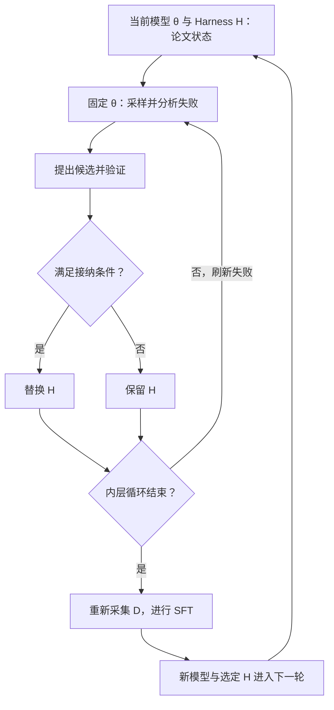

# Co-Harness：论文的交替流程与尚未定位的实现连接

2026-09-16 本轮重新访问论文、作者主页，并按标题及作者检索代码，**仍未找到可确认归属的官方实现仓库**。这是本次检索结果，不表示代码一定未发布。本文保留原文件名，但内容是论文协议核查，不能提供未经证实的类名、行号或部署图。[论文](https://arxiv.org/html/2607.22688v1)、[作者主页](https://tengxiao1.github.io/)｜[总索引](README.md)

## 1. 先定义图中的角色，不把论文名称当代码类

下文 θ 表示任务模型参数，H 表示任务执行所用 Harness，D 表示采集的交互记录。`HarnessCritic` 是论文中的失败归因角色；`Apply/Validate/SFT` 是论文算法步骤名，不是已定位的 Python 函数。SFT 指用输入与目标输出进行监督微调。所有实际进程、Actor、对象边界均不明确。

## 2. 论文规定的先后关系

论文算法先固定 θ，从失败记录归因并提出局部修改；模型自身错误可标为 `agent_error`，不生成 Harness 补丁。候选通过验证才替换 H，否则保留原 H，再刷新失败记录。**内层修改循环结束后**，系统重新采集并筛选轨迹 D，用 D 做 SFT，返回新模型与选定 H，再开始下一轮。不是每个补丁通过就立即训练。[论文算法 3、§3.3–3.5](https://arxiv.org/html/2607.22688v1#S3)

这是**论文逻辑图**，不是函数调用或进程部署图；图中顺序不能证明已有一个程序自动等待这些步骤完成。

## 3. 用论文的具体修改载体理解“改 Harness”

论文附录 B 的提示模板给出一个建议：把 `middleware.hooks.post_tool_call[0].type` 从空值改成 `retry_on_rate_limit`，即给工具返回后的处理位置增加限流重试策略。该例是**建议字段示例，不是已公开的真实运行补丁**。它说明修改可以作用于工具失败后的控制行为，而非模型参数。[论文附录 B](https://arxiv.org/html/2607.22688v1)

要将这条建议落为可阅读代码，还必须找到以下连续证据：谁解析字段路径 → 谁修改配置或源文件 → 谁构造重试处理对象 → 哪种错误事件触发重试 → 谁返回重试结果 → 谁用任务指标判断是否保留。当前这些实现均未定位，所以不能自行补造重试次数、等待时间或异常类。

同样，补丁建议文本不能直接当作模型训练标签。要证明训练数据确实来自修改后的执行过程，至少需要候选版本、采样配置、实际轨迹及训练输入的对应记录；当前未取得这些工程证据。

## 4. 按完整流程登记实现缺口

| 前一步结果 → 后一步 | 缺少的代码证据 | 当前判断 |
|---|---|---|
| 任务输入 → 模型和工具执行 | 启动入口、工具执行器、消息格式和停止条件 | 不明确 |
| 工具返回 → 任务评价 | 评分函数、标准答案、错误与版本记录 | 不明确 |
| 失败记录 → 归因建议 | 实际调用方、结构化解析、失败重试 | 只有论文角色，类和函数未定位 |
| 建议 → 文件或字段修改 | 路径解析、补丁应用、允许修改范围、运行时重载 | 不明确 |
| 候选 → 接纳/拒绝 | 验证命令、数据切分、数值规则、失败恢复 | 论文有协议，实现未定位 |
| 内层结束 → 新采样/训练 | 实际循环条件、采样调用、完成事件与训练启动者 | 不明确 |
| 轨迹 → SFT 数据 | 成功过滤、模板、目标 token、损失掩码 | 不明确 |
| 训练 → 下一轮组合 | 父模型、可训练参数、保存/加载方法和配对版本 | 不明确 |
| 异常或预算耗尽 → 停止 | 运行级退出、恢复和数据继承 | 不明确 |

## 5. 本项目能下的结论与阅读计划

论文提出的协同顺序明确；公开代码如何实现这条顺序仍不明确。因此不能认定论文与代码“一致”，也不能认定“不一致”，应标为**实现未定位**。

获得官方源码后，应先固定提交和一个真实任务，找到外循环，再逐个追踪上表的返回值和触发条件；若某步是独立命令，必须标出调用者和文件交接，不把论文箭头改写成自动调用。本次没有克隆未确认归属的仓库，没有代码运行或训练结果。
