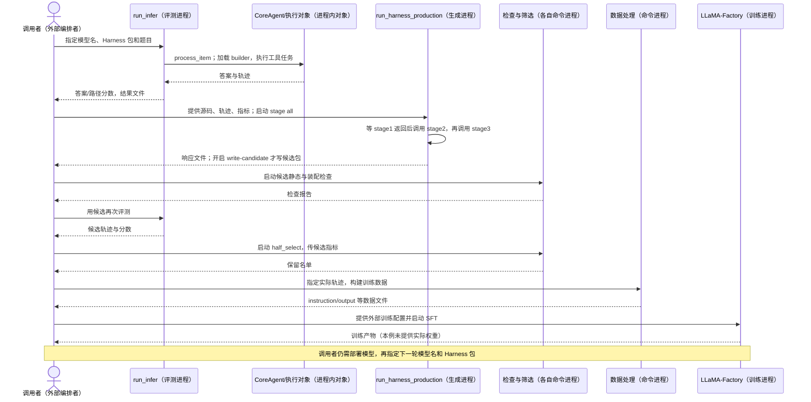

# HarnessForge：从 ToolHop 执行记录到候选代码、训练数据与下一轮组合

基线：`05b3ecadb3c9a7a938f75129ea22b8f2b36cf289`，阅读目录为 `HarnessForge_4B/`。**三个候选生成阶段可以由一条命令顺序执行；评测、候选检查、筛选、数据处理和模型训练是分别启动的入口。**本文把自动调用与调用者交接文件明确分开。[生成主函数](https://github.com/mingju-c/HarnessForge/blob/05b3ecadb3c9a7a938f75129ea22b8f2b36cf289/HarnessForge_4B/harness_production/run_harness_production.py#L612)｜[总索引](README.md)

## 1. 先确定案例、研究协议与对象

论文描述用选定 Harness 的成功轨迹训练模型，默认采用监督微调 SFT。公开代码提供轨迹转换和训练实现；论文中的完整迭代协议不能据此视为已经由一个公开控制程序自动串联。[论文附录 D.3](https://arxiv.org/html/2606.01779v1)

本文跟踪 ToolHop 数据第一条记录，原始 `id=161`，并阅读已公开候选 `harness_round03_01_5`。**数据 ID 不等于命令行题目位置；这条数据在文件中的顺序是第一条。**候选代码与题目都真实存在，但未找到“此题失败→生成该候选→模型训练改善此题”的端到端日志。[真实输入](https://github.com/mingju-c/HarnessForge/blob/05b3ecadb3c9a7a938f75129ea22b8f2b36cf289/eval_bench/toolhop/data/toolhop_final_blind_test.json#L3)

| 名称 | 定义与实体 | 边界 |
|---|---|---|
| Harness 包 | 包含 `builder.py`、规划/动作/记忆模块的 Python 包 | 评测进程加载的源文件 |
| 装配对象 | `CoreAgent`，按模型名和 Harness 包创建执行对象 | 普通对象 |
| 候选执行对象 | `Round03LedgerAgent`，处理模型动作、工具错误和最终提交 | 普通对象，不是独立 Actor |
| 工具执行域 | `ToolHopExecutionScope`，承载本题模拟工具及上下文 | 评测进程内对象 |
| 生成控制者 | `run_harness_production.main`，顺序调用修改模型 | 独立命令进程 |
| 验证器 | `validate_once` 函数，返回检查报告；不是任务评分模型 | 独立检查命令中的函数 |

定义：[CoreAgent](https://github.com/mingju-c/HarnessForge/blob/05b3ecadb3c9a7a938f75129ea22b8f2b36cf289/HarnessForge_4B/base_agent.py#L245)、[Round03LedgerAgent](https://github.com/mingju-c/HarnessForge/blob/05b3ecadb3c9a7a938f75129ea22b8f2b36cf289/HarnessForge_4B/evolved_pairs/harness_factory/rounds/round_03_01/harness_round03_01_5/action_module/round03_agent.py#L174)、[ToolHopExecutionScope](https://github.com/mingju-c/HarnessForge/blob/05b3ecadb3c9a7a938f75129ea22b8f2b36cf289/HarnessForge_4B/runtime/toolhop/runtime.py#L194)、[validate_once](https://github.com/mingju-c/HarnessForge/blob/05b3ecadb3c9a7a938f75129ea22b8f2b36cf289/HarnessForge_4B/harness_production/04_validation_retry.py#L394)。`run_infer` 的并发是线程池，不能把每题对象画成独立进程。[线程并发](https://github.com/mingju-c/HarnessForge/blob/05b3ecadb3c9a7a938f75129ea22b8f2b36cf289/HarnessForge_4B/run_infer.py#L1739)

## 2. 全流程中，哪些箭头需要调用者启动命令

图中的调用者可以是人工或外部程序，当前仓内未定位负责整图的自动调度器。`--stage all` 只负责生成进程内部三个阶段，不代表后续检查与训练自动发生。

## 3. 评测命令如何装配 Harness，并执行本题

`run_infer.process_item` 接收一题后创建 `CoreAgent`。后者按所选包加载 builder；候选 `build_agent_from_context` 准备上下文、取得动作 provider 并调用其 `build`，然后在返回的执行对象上设置规划、动作和 Harness 元数据，连接工具与结束等接口。provider 是构造执行对象的模块，不是模型服务。[单题入口](https://github.com/mingju-c/HarnessForge/blob/05b3ecadb3c9a7a938f75129ea22b8f2b36cf289/HarnessForge_4B/run_infer.py#L1288)、[装配顺序](https://github.com/mingju-c/HarnessForge/blob/05b3ecadb3c9a7a938f75129ea22b8f2b36cf289/HarnessForge_4B/evolved_pairs/harness_factory/rounds/round_03_01/harness_round03_01_5/builder.py#L51)、[构造动作对象](https://github.com/mingju-c/HarnessForge/blob/05b3ecadb3c9a7a938f75129ea22b8f2b36cf289/HarnessForge_4B/evolved_pairs/harness_factory/rounds/round_03_01/harness_round03_01_5/action_module/provider.py#L10)

本题询问 Hürriyet Daily News 的出版机构成立年份的下一年。数据自带的模拟工具规定如下调用链；返回值仅代表测试数据，不作为真实历史事实。

| 任务模型应选择的动作 | 工具返回及下一动作所需数据 |
|---|---|
| `newspaper_publisher_lookup(newspaper_name="Hürriyet Daily News")` | `Doğan Media`，供下一工具查询 |
| `organization_founding_date_finder(organization_name="Doğan Media")` | 字符串 `"1997"`，需转换为计算器要求的整数 |
| `enhanced_year_calculator(current_year=1997)` | `[1998]`，供模型形成最终答案 |
| `final_answer(answer="1998")` | 结束输出，等待外部评分 |

这一输入暴露一个具体恢复问题：若任务模型把 `"1997"` 原样传入计算器，工具会报整数类型错误。工具不负责自动修复，Harness 如何把错误反馈给模型、是否阻止完全相同的失败重试，决定后续执行路径。真实工具与数据见[本题定义](https://github.com/mingju-c/HarnessForge/blob/05b3ecadb3c9a7a938f75129ea22b8f2b36cf289/eval_bench/toolhop/data/toolhop_final_blind_test.json#L3)。

执行对象返回后，`evaluate_prediction` 调用 `evaluate_toolhop_item`，分别计算 `answer_correct`（答案正确性）和 `path_score`（工具路径匹配）。这两个指标被写入结果，供生成材料和候选筛选使用；“程序没有抛错”不是任务成功条件。[评分调用](https://github.com/mingju-c/HarnessForge/blob/05b3ecadb3c9a7a938f75129ea22b8f2b36cf289/HarnessForge_4B/run_infer.py#L688)、[规则](https://github.com/mingju-c/HarnessForge/blob/05b3ecadb3c9a7a938f75129ea22b8f2b36cf289/HarnessForge_4B/runtime/toolhop/evaluation.py#L26)

前轮直接运行本题纯工具、向评分器提供人工构造的三步轨迹，得到 `1/1.0`；只给正确答案而不给工具轨迹，得到 `1/0.0`。这只验证工具和评分规则，没有验证模型自主完成任务。[既有检查记录](evidence/harnessforge_toolhop_161.json)

## 4. 结果文件产生后，诊断、建议、代码怎样依次生成

评测结束不会自行启动修改。调用者启动 `run_harness_production` 并给出源码、轨迹、指标和历史材料；`build_values` 读取这些材料，`main` 根据 `--stage all` 进入三个阶段。每次 `run_stage` 返回响应后，`main` 才调用下一阶段，不是三个互不相关的报告。[材料读取](https://github.com/mingju-c/HarnessForge/blob/05b3ecadb3c9a7a938f75129ea22b8f2b36cf289/HarnessForge_4B/harness_production/run_harness_production.py#L455)、[修改模型调用](https://github.com/mingju-c/HarnessForge/blob/05b3ecadb3c9a7a938f75129ea22b8f2b36cf289/HarnessForge_4B/harness_production/run_harness_production.py#L521)、[阶段循环](https://github.com/mingju-c/HarnessForge/blob/05b3ecadb3c9a7a938f75129ea22b8f2b36cf289/HarnessForge_4B/harness_production/run_harness_production.py#L632)

具体交接为：阶段一的返回文字写入 `module_localization_report`，阶段二读取它并返回修改方向；阶段二返回文字写入 `improvement_direction_brief`，阶段三结合诊断、方向和源码输出文件正文。单独启动后续阶段时，代码尝试从已有响应文件补取前阶段材料。[前阶段文件与返回值传递](https://github.com/mingju-c/HarnessForge/blob/05b3ecadb3c9a7a938f75129ea22b8f2b36cf289/HarnessForge_4B/harness_production/run_harness_production.py#L637)

阶段二要求修改模型判断优先失败、责任模块和可借鉴实现，允许修改规划、动作、记忆及装配逻辑，禁止改数据集和评分器，也不在此阶段进行神经网络训练。随仓诊断提到参数错误与重复调用，但没有证明本题 id=161 导致本候选生成。[分析要求](https://github.com/mingju-c/HarnessForge/blob/05b3ecadb3c9a7a938f75129ea22b8f2b36cf289/HarnessForge_4B/harness_production/02_improvement_directions.yaml#L4)、[修改边界](https://github.com/mingju-c/HarnessForge/blob/05b3ecadb3c9a7a938f75129ea22b8f2b36cf289/HarnessForge_4B/harness_production/02_improvement_directions.yaml#L36)、[历史报告](https://github.com/mingju-c/HarnessForge/blob/05b3ecadb3c9a7a938f75129ea22b8f2b36cf289/HarnessForge_4B/harness_production/round1/base_harness_qwen3-4b-base_round1_module_localization.md#L1)

## 5. 阶段三的文字如何成为实际 Python 行为

阶段三返回后，**只有开启 `--write-candidate`，`main` 才调用 `extract_stage3_files` 写候选目录**；否则只保存生成响应。解析器从 `### FILE:` 文件块取路径和完整正文，拒绝绝对路径及 `..`，按覆盖选项新增或替换文件。这是完整文件写入，不是自动理解自然语言后修改旧类。[文件解析](https://github.com/mingju-c/HarnessForge/blob/05b3ecadb3c9a7a938f75129ea22b8f2b36cf289/HarnessForge_4B/harness_production/run_harness_production.py#L557)、[路径与覆盖检查](https://github.com/mingju-c/HarnessForge/blob/05b3ecadb3c9a7a938f75129ea22b8f2b36cf289/HarnessForge_4B/harness_production/run_harness_production.py#L590)、[写入条件](https://github.com/mingju-c/HarnessForge/blob/05b3ecadb3c9a7a938f75129ea22b8f2b36cf289/HarnessForge_4B/harness_production/run_harness_production.py#L653)

已公开的基础动作 provider 使用 ReAct，即模型推理与工具调用交替进行；本候选 provider 则构造 `Round03LedgerAgent`。因此候选包通过“provider 返回新类→builder 连接接口→下次评测装配新对象”改变实际编排，单写 `Description.md` 不会改变工具行为。[基础 provider](https://github.com/mingju-c/HarnessForge/blob/05b3ecadb3c9a7a938f75129ea22b8f2b36cf289/HarnessForge_4B/harness_factory/base_harness/action_module/provider.py#L9)、[候选 provider](https://github.com/mingju-c/HarnessForge/blob/05b3ecadb3c9a7a938f75129ea22b8f2b36cf289/HarnessForge_4B/evolved_pairs/harness_factory/rounds/round_03_01/harness_round03_01_5/action_module/provider.py#L10)

沿本题字符串年份错误，可逐步阅读候选的真实控制逻辑：

1. 模型提出计算器调用后，`_preflight_call` 检查工具名、参数对象和必需键；它不做字符串到整数的转换。
2. 检查通过后，`execute_tool_call` 执行工具；若工具返回错误，它保存“工具名＋参数”的失败签名。
3. 模型再次提出完全相同的失败调用时，该方法返回 `repeated_failed_call`，不再执行工具；模型收到的是 Harness 产生的反馈。
4. 模型若改传整数 `1997`，参数签名不同，可再次执行；工具成功后返回 `1998`。模型仍需自行作出这个修正，Harness 不保证它会修正。
5. 模型提出最终答案后，`step` 检查格式与支持证据；执行返回后，外部评分器仍独立检查答案和路径。

调用位置：[调用前检查](https://github.com/mingju-c/HarnessForge/blob/05b3ecadb3c9a7a938f75129ea22b8f2b36cf289/HarnessForge_4B/evolved_pairs/harness_factory/rounds/round_03_01/harness_round03_01_5/action_module/round03_agent.py#L778)、[执行、登记和重复拦截](https://github.com/mingju-c/HarnessForge/blob/05b3ecadb3c9a7a938f75129ea22b8f2b36cf289/HarnessForge_4B/evolved_pairs/harness_factory/rounds/round_03_01/harness_round03_01_5/action_module/round03_agent.py#L837)、[最终提交](https://github.com/mingju-c/HarnessForge/blob/05b3ecadb3c9a7a938f75129ea22b8f2b36cf289/HarnessForge_4B/evolved_pairs/harness_factory/rounds/round_03_01/harness_round03_01_5/action_module/round03_agent.py#L879)。

若第一步就拒绝参数，工具尚未执行，也尚未进入后续失败登记，所以重复拦截不覆盖所有输入错误。以上是“真实输入＋真实候选”的静态推演；没有补造修改前后运行分数。

## 6. 候选写出之后，谁检查、复评与选取

生成命令返回后，调用者另行启动检查。`validate_once` 依次检查必需文件、语法、接口、导入和对象构造，按失败阶段返回报告。检查报告是 [ValidationReport](https://github.com/mingju-c/HarnessForge/blob/05b3ecadb3c9a7a938f75129ea22b8f2b36cf289/HarnessForge_4B/harness_production/04_validation_retry.py#L59) 数据对象；装配检查使用 [DummyModel](https://github.com/mingju-c/HarnessForge/blob/05b3ecadb3c9a7a938f75129ea22b8f2b36cf289/HarnessForge_4B/harness_production/04_validation_retry.py#L101) 替身，不能证明真实模型能完成本题；依赖缺失与候选代码错误也分开报告。[检查顺序及报告](https://github.com/mingju-c/HarnessForge/blob/05b3ecadb3c9a7a938f75129ea22b8f2b36cf289/HarnessForge_4B/harness_production/04_validation_retry.py#L394)、[替身装配](https://github.com/mingju-c/HarnessForge/blob/05b3ecadb3c9a7a938f75129ea22b8f2b36cf289/HarnessForge_4B/harness_production/04_validation_retry.py#L335)

检查命令内部还可以自动修复：`main` 收到未通过报告后，在自动修复开启、状态可修复且未耗尽默认 3 次尝试时调用 `run_repair_agent`。默认 JSON 修复分支让模型提出文件替换，再 `apply_fix_payload` 写入候选，随后重新调用 `validate_once`；无改动、试运行或修复异常会中止重试。最后写报告并以退出码 0/1 表示检查是否通过。这是装配错误的修复循环，不是任务收益优化。[循环与退出](https://github.com/mingju-c/HarnessForge/blob/05b3ecadb3c9a7a938f75129ea22b8f2b36cf289/HarnessForge_4B/harness_production/04_validation_retry.py#L748)、[默认参数](https://github.com/mingju-c/HarnessForge/blob/05b3ecadb3c9a7a938f75129ea22b8f2b36cf289/HarnessForge_4B/harness_production/04_validation_retry.py#L115)、[JSON 修复调用](https://github.com/mingju-c/HarnessForge/blob/05b3ecadb3c9a7a938f75129ea22b8f2b36cf289/HarnessForge_4B/harness_production/04_validation_retry.py#L563)。

只有调用者再启动 `run_infer`，候选才按第 3 节产生真实任务指标。之后独立 `half_select` 读取指标，先考虑质量/成本上不被其他候选同时超过的候选，再按主分数排序；默认保留比例 0.5、最少 2 个，受实际候选数限制。返回的保留名单不是运行时加载事件，也不启动模型训练。[筛选及默认值](https://github.com/mingju-c/HarnessForge/blob/05b3ecadb3c9a7a938f75129ea22b8f2b36cf289/HarnessForge_4B/tools/half_select_harnesses.py#L102)

## 7. 选中轨迹怎样构造模型训练数据

筛选返回后，调用者必须指定输入轨迹并启动 `build_dataset_bundle`。函数加载执行记录，跳过只写记忆的记录及未通过条件的记录，从实际成功轨迹中提取规划和动作，把模型当时的输入写入 `instruction`、期望输出写入 `output`，并保留任务与 Harness 元信息。[读取、过滤与抽取](https://github.com/mingju-c/HarnessForge/blob/05b3ecadb3c9a7a938f75129ea22b8f2b36cf289/HarnessForge_4B/tools/prepare_trainer_harness_data.py#L282)

对本题，如果某条实际成功轨迹包含正确整数参数，它才可能提供“当前提示→计算器整数调用”的训练目标。训练学习的是模型决策输出，**不是直接把重复失败拦截器的 Python 正文作为标签**。前轮人工评分轨迹也没有因此自动成为训练数据。

该函数另可按候选答案构造答案级 SFT 样本和偏好对；偏好对可供 DPO 等方法使用，但生成这种文件不证明本实验采用 DPO。另一个 ToolHop 清洗脚本有 strict/balanced/aggressive 等规则，仅 strict 限定正确记录；必须检查具体命令所选分支。[答案与偏好数据](https://github.com/mingju-c/HarnessForge/blob/05b3ecadb3c9a7a938f75129ea22b8f2b36cf289/HarnessForge_4B/tools/prepare_trainer_harness_data.py#L342)、[不同过滤档位](https://github.com/mingju-c/HarnessForge/blob/05b3ecadb3c9a7a938f75129ea22b8f2b36cf289/HarnessForge_4B/tools/prepare_toolhop_rollout_sft.py#L55)

README 的清洗命令和数据汇总命令都读原始 `results.jsonl`，没有自动把前一个输出接给后一个。论文所述“成功轨迹→默认 SFT”与源码提供的能力一致；具体哪些候选轨迹参与哪次训练，仍需实际配置和日志确认。[示例命令](https://github.com/mingju-c/HarnessForge/blob/05b3ecadb3c9a7a938f75129ea22b8f2b36cf289/README.md#L350)

## 8. 数据返回后，谁训练、加载模型并开始下一轮

数据处理命令返回文件后，调用者提供外部训练 YAML 并启动 LLaMA-Factory；仓内 `run_sft` 提供监督训练实现。SFT 指在给定输入上学习目标输出；父模型、数据文件、全参数还是适配参数训练由配置决定。公开示例未给出本例完整配置，本文不猜测具体可训练参数。[训练命令](https://github.com/mingju-c/HarnessForge/blob/05b3ecadb3c9a7a938f75129ea22b8f2b36cf289/README.md#L372)、[训练实现](https://github.com/mingju-c/HarnessForge/blob/05b3ecadb3c9a7a938f75129ea22b8f2b36cf289/LlamaFactory/src/llamafactory/train/sft/workflow.py#L41)

训练返回后，仍需外部部署模型并绑定服务端模型名。`pairs.yaml` 将本候选与 `qwen3-4B-round_03_01-harness5` 配对，但对应目录明确没有提交权重；该表只记录组合，不负责加载或发布。调用者再次把模型名、Harness 包传给 `run_infer`，新模型才产生可供下一次生成命令分析的新轨迹。[组合记录](https://github.com/mingju-c/HarnessForge/blob/05b3ecadb3c9a7a938f75129ea22b8f2b36cf289/HarnessForge_4B/evolved_pairs/pairs.yaml#L7)、[未提交权重](https://github.com/mingju-c/HarnessForge/blob/05b3ecadb3c9a7a938f75129ea22b8f2b36cf289/HarnessForge_4B/evolved_pairs/policy_factory/qwen3-4B-round_03_01-harness5/README.md#L3)、[下一次评测参数](https://github.com/mingju-c/HarnessForge/blob/05b3ecadb3c9a7a938f75129ea22b8f2b36cf289/HarnessForge_4B/run_infer.py#L2032)

| 两种更新之间的事件 | 核查结果 |
|---|---|
| 任务失败 → Harness 修改 | 结果由评测保存，调用者提供给生成命令；不是评分器自动调用 |
| 候选通过/被选中 → 模型训练 | 没有自动触发；还需数据转换与独立训练命令 |
| Harness → 模型 | 选定 Harness 的成功决策可转为训练标签；本题实际训练归属不明确 |
| 模型 → Harness | 部署新模型、重新评测后，调用者再交新轨迹给生成命令；自动回接未定位 |
| 无提升、训练失败、版本回退 | 各命令有局部结果与错误；未定位统一的模型/Harness 配对回退和迭代停止控制 |

建议先追 `process_item → builder → Round03LedgerAgent → evaluate_prediction`，再读 `main → run_stage → extract_stage3_files`，最后读独立检查、筛选、数据与训练入口。本轮未运行模型或训练，保留前轮纯工具/评分检查的有限结论。仓库根许可证未明确，不能以内置 LLaMA-Factory 许可证替代全仓许可证。
