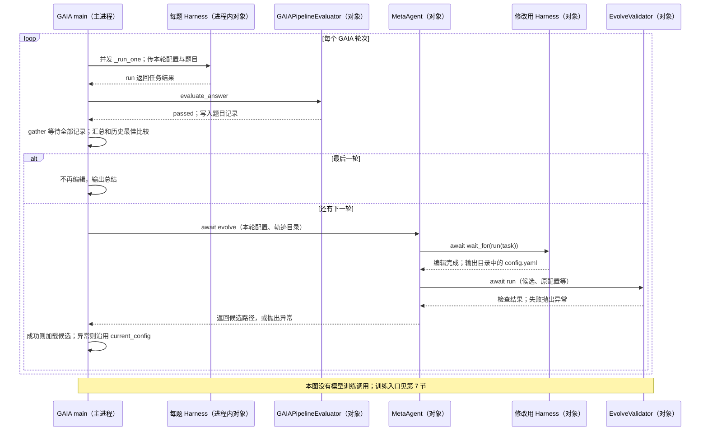

# HarnessX：GAIA 修改循环怎样运行，训练路径在哪里中断

基线：`bf5f199ee65034d55db0c536e582f1e7c8abf669`。本文先跟踪 `recipe/gaia_evolver/run.py` 的一轮执行，再跟踪候选配置如何生成、检查、进入下一轮，最后定位模型训练与这个循环的连接边界。**GAIA 入口会自动更新 Harness；它没有在候选通过后调用模型训练，也没有接收训练后的模型路径。**[编辑调用及后续分支](https://github.com/Darwin-Agent/HarnessX/blob/bf5f199ee65034d55db0c536e582f1e7c8abf669/recipe/gaia_evolver/run.py#L940)｜[总索引](README.md)

## 1. 研究主张、选定入口与代码对象

官方 README 描述先改 Harness、再改模型及二者组合的实验。当前代码可定位 GAIA 修改循环和两套训练适配，但完整组合实验怎样映射到这些入口尚未定位。下面的“连接未定位”限定于公开入口，不否定 README 报告的实验。[官方两种更新说明](https://github.com/Darwin-Agent/HarnessX/blob/bf5f199ee65034d55db0c536e582f1e7c8abf669/README.md#L170)、[组合实验](https://github.com/Darwin-Agent/HarnessX/blob/bf5f199ee65034d55db0c536e582f1e7c8abf669/README.md#L193)

| 名称 | 定义与实体 | 边界 |
|---|---|---|
| 模型配置 | `ModelConfig`，保存任务模型及服务调用配置 | 主进程普通对象，轮外创建 |
| Harness 配置 | `HarnessConfig`，指定工具、提示和 processor 等；processor 是响应执行事件的处理对象 | 可序列化 YAML，及其引用的 Python/提示文件 |
| 任务执行对象 | `Harness`，按配置运行模型—工具循环 | 每题新建的普通对象；题目之间用协程并发 |
| 任务评分对象 | `GAIAPipelineEvaluator`，判断题目答案 | 普通对象，不是训练器 |
| 修改对象 | `MetaAgent`，构造另一个 Harness 来读轨迹、编辑候选 | 普通对象；内部调用修改模型服务 |
| 候选检查对象 | `EvolveValidator`，检查候选可加载、接口和回放等 | 普通对象，由 `MetaAgent.evolve` 等待 |

定义位置：[ModelConfig](https://github.com/Darwin-Agent/HarnessX/blob/bf5f199ee65034d55db0c536e582f1e7c8abf669/harnessx/core/model_config.py#L11)、[HarnessConfig](https://github.com/Darwin-Agent/HarnessX/blob/bf5f199ee65034d55db0c536e582f1e7c8abf669/harnessx/core/harness.py#L743)、[Harness.run](https://github.com/Darwin-Agent/HarnessX/blob/bf5f199ee65034d55db0c536e582f1e7c8abf669/harnessx/core/harness.py#L1066)、[评分类](https://github.com/Darwin-Agent/HarnessX/blob/bf5f199ee65034d55db0c536e582f1e7c8abf669/benchmarks/gaia/evaluator.py#L160)、[MetaAgent](https://github.com/Darwin-Agent/HarnessX/blob/bf5f199ee65034d55db0c536e582f1e7c8abf669/harnessx/meta_harness/agent.py#L493)、[EvolveValidator](https://github.com/Darwin-Agent/HarnessX/blob/bf5f199ee65034d55db0c536e582f1e7c8abf669/harnessx/meta_harness/validate_workflow.py#L857)。外部模型服务与 Bash 工具启动的子进程是额外边界，不能把这些普通对象画成 Actor。[Bash 实现](https://github.com/Darwin-Agent/HarnessX/blob/bf5f199ee65034d55db0c536e582f1e7c8abf669/harnessx/tools/builtin/bash.py#L101)

## 2. 整轮的等待、返回与下一轮

评分在各 `_run_one` 内完成，`main` 的 `asyncio.gather` 等全部题目返回之后才汇总和编辑；图中评分箭头展开的是单题内部调用。[单题协程](https://github.com/Darwin-Agent/HarnessX/blob/bf5f199ee65034d55db0c536e582f1e7c8abf669/recipe/gaia_evolver/run.py#L723)、[整批等待](https://github.com/Darwin-Agent/HarnessX/blob/bf5f199ee65034d55db0c536e582f1e7c8abf669/recipe/gaia_evolver/run.py#L777)

## 3. 当前 Harness 怎样编排模型与工具，并形成评价材料

`main` 在轮外创建 `ModelConfig`，选择 GAIA 预设并进入轮次循环。每轮保存配置为 `round_config_path`；每题 `_run_one` 调用 `model_config.agentic(round_config)` 新建 Harness，再 `await _run_task(...)`。因此 processor 的运行状态通常属于本题对象，不是跨全部题目共享的一个计数器。[模型配置](https://github.com/Darwin-Agent/HarnessX/blob/bf5f199ee65034d55db0c536e582f1e7c8abf669/recipe/gaia_evolver/run.py#L562)、[预设选择](https://github.com/Darwin-Agent/HarnessX/blob/bf5f199ee65034d55db0c536e582f1e7c8abf669/recipe/gaia_evolver/run.py#L621)、[轮次](https://github.com/Darwin-Agent/HarnessX/blob/bf5f199ee65034d55db0c536e582f1e7c8abf669/recipe/gaia_evolver/run.py#L683)、[每题装配](https://github.com/Darwin-Agent/HarnessX/blob/bf5f199ee65034d55db0c536e582f1e7c8abf669/recipe/gaia_evolver/run.py#L731)

builder 根据配置装配工具与 processor。GAIA 可用工具包括 `WebSearch/WebFetch/Browser/Read/Bash`；运行循环先请求任务模型，收到工具调用后派发工具，再把结果送回模型，直到最终回答或预算、错误等退出条件。系统提示、预算和循环检测参与这个执行过程。[builder](https://github.com/Darwin-Agent/HarnessX/blob/bf5f199ee65034d55db0c536e582f1e7c8abf669/harnessx/core/builder.py#L73)、[GAIA 预设](https://github.com/Darwin-Agent/HarnessX/blob/bf5f199ee65034d55db0c536e582f1e7c8abf669/benchmarks/gaia/harness.py#L179)、[工具注册](https://github.com/Darwin-Agent/HarnessX/blob/bf5f199ee65034d55db0c536e582f1e7c8abf669/harnessx/tools/builtin/__init__.py#L140)、[模型调用](https://github.com/Darwin-Agent/HarnessX/blob/bf5f199ee65034d55db0c536e582f1e7c8abf669/harnessx/core/runloop.py#L371)、[工具派发](https://github.com/Darwin-Agent/HarnessX/blob/bf5f199ee65034d55db0c536e582f1e7c8abf669/harnessx/core/runloop.py#L497)

`Harness.run` 返回后，`_run_task` 调用 `GAIAPipelineEvaluator.evaluate_answer` 生成答案评价；`_run_one` 再取得已运行的 `LLMJudgeProcessor` 结果，统计工具调用与错误，把题目结果和完整轨迹写成 Markdown。任务通过率用于下一步接纳判断；模型裁判与行为字段提供诊断材料，不能统称为同一个分数。[运行后评分](https://github.com/Darwin-Agent/HarnessX/blob/bf5f199ee65034d55db0c536e582f1e7c8abf669/recipe/gaia_evolver/run.py#L174)、[答案评价](https://github.com/Darwin-Agent/HarnessX/blob/bf5f199ee65034d55db0c536e582f1e7c8abf669/benchmarks/gaia/evaluator.py#L247)、[模型裁判](https://github.com/Darwin-Agent/HarnessX/blob/bf5f199ee65034d55db0c536e582f1e7c8abf669/harnessx/processors/evaluation/llm_judge.py#L352)、[轨迹元信息](https://github.com/Darwin-Agent/HarnessX/blob/bf5f199ee65034d55db0c536e582f1e7c8abf669/recipe/gaia_evolver/run.py#L1026)、[落盘](https://github.com/Darwin-Agent/HarnessX/blob/bf5f199ee65034d55db0c536e582f1e7c8abf669/recipe/gaia_evolver/run.py#L1130)

### 用仓内测试具体理解一个处理环节

本仓可直接阅读的真实例子是 `test_loop_detection_detects_loop`：它给 `LoopDetectionProcessor(threshold=3, warn_threshold=2)` 连续输入三次相同 `Bash({"cmd":"ls"})`。第一次没有警告；第二次把警告加入工具结果；第三次在工具结果处理时抛出 `LoopDetectedError`。这是事件测试，不是模型完成 GAIA 题目的运行日志，本次未执行该测试。[真实测试](https://github.com/Darwin-Agent/HarnessX/blob/bf5f199ee65034d55db0c536e582f1e7c8abf669/tests/unit/test_processors.py#L94)

其原因是 `on_before_tool` 保存“工具名＋参数”的指纹，`on_after_tool` 统计连续重复并决定注入警告或抛错。`ls → cat → ls` 的交替调用不会按这个规则达到连续重复阈值。该机制改变模型之后能看到的工具反馈与退出条件，不改变模型参数。[记录指纹](https://github.com/Darwin-Agent/HarnessX/blob/bf5f199ee65034d55db0c536e582f1e7c8abf669/harnessx/processors/control/loop_detection.py#L150)、[结果处理](https://github.com/Darwin-Agent/HarnessX/blob/bf5f199ee65034d55db0c536e582f1e7c8abf669/harnessx/processors/control/loop_detection.py#L163)、[交替调用测试](https://github.com/Darwin-Agent/HarnessX/blob/bf5f199ee65034d55db0c536e582f1e7c8abf669/tests/unit/test_processors.py#L118)

## 4. 全部题目返回后，谁决定回退、继续与编辑

`main` 汇总 `passed`、任务数及成本后调用 `_score_and_gate`。第一轮建立基线；后续轮次计算“通过率减去成本增加惩罚”。只有低于历史最佳分数的容差、且通过题数变化也达到噪声阈值时，函数才返回历史最佳配置；否则保留当前配置。严格更好的分数才更新最佳记录。[调用方](https://github.com/Darwin-Agent/HarnessX/blob/bf5f199ee65034d55db0c536e582f1e7c8abf669/recipe/gaia_evolver/run.py#L795)、[返回协议](https://github.com/Darwin-Agent/HarnessX/blob/bf5f199ee65034d55db0c536e582f1e7c8abf669/recipe/gaia_evolver/run.py#L1174)、[判断实现](https://github.com/Darwin-Agent/HarnessX/blob/bf5f199ee65034d55db0c536e582f1e7c8abf669/recipe/gaia_evolver/run.py#L1218)

主循环收到回退配置后更新 `current_config`，并补充修改日志的结果。若已到最后一轮，程序跳过编辑；否则调用 `MetaAgent.evolve`，传入**本轮保存的配置路径**、本轮轨迹目录、下一轮输出目录以及回放模型。编辑并不以“本轮失败”或“模型训练收敛”为必需条件。[应用回退](https://github.com/Darwin-Agent/HarnessX/blob/bf5f199ee65034d55db0c536e582f1e7c8abf669/recipe/gaia_evolver/run.py#L813)、[最后一轮条件](https://github.com/Darwin-Agent/HarnessX/blob/bf5f199ee65034d55db0c536e582f1e7c8abf669/recipe/gaia_evolver/run.py#L903)、[编辑实参](https://github.com/Darwin-Agent/HarnessX/blob/bf5f199ee65034d55db0c536e582f1e7c8abf669/recipe/gaia_evolver/run.py#L940)

这里存在一个具体边界：即使 `current_config` 刚回退到最佳版本，编辑实参仍是 `round_config_path`，不是重新导出的最佳配置。因此后续候选可能继续基于刚判为退化的本轮版本生成，不能描述为“总是从最佳版本继续修改”。

## 5. `evolve` 怎样把诊断转成候选文件

`MetaAgent.evolve` 先检查轨迹目录、准备原配置和输出目录，再 `_prepare_brief_and_context` 写入 `TASK.md`，有历史记录时另写 `CONTEXT.md`。它为修改任务装配一个带 `Read/Grep/Write/Edit/Bash` 等工具的 Harness，然后等待 `harness.run(task)` 完成。分析和写文件是修改模型通过该 Harness 执行的动作，源码没有规定每次必定编辑哪一行。[准备与运行入口](https://github.com/Darwin-Agent/HarnessX/blob/bf5f199ee65034d55db0c536e582f1e7c8abf669/harnessx/meta_harness/agent.py#L538)、[任务与历史材料](https://github.com/Darwin-Agent/HarnessX/blob/bf5f199ee65034d55db0c536e582f1e7c8abf669/harnessx/meta_harness/agent.py#L699)、[修改工具](https://github.com/Darwin-Agent/HarnessX/blob/bf5f199ee65034d55db0c536e582f1e7c8abf669/harnessx/meta_harness/agent.py#L153)

修改指令要求从轨迹定位 Harness 的机制问题，并区分模型能力不足；允许修改配置、引用的 Python 组件与提示文件。模型可直接复制原配置表示不修改。`compute_changeset` 只是变化摘要，不是完整语义证明。[可改内容](https://github.com/Darwin-Agent/HarnessX/blob/bf5f199ee65034d55db0c536e582f1e7c8abf669/harnessx/meta_harness/workspace/SOUL.md#L57)、[归因要求](https://github.com/Darwin-Agent/HarnessX/blob/bf5f199ee65034d55db0c536e582f1e7c8abf669/harnessx/meta_harness/workspace/SOUL.md#L80)、[能力边界](https://github.com/Darwin-Agent/HarnessX/blob/bf5f199ee65034d55db0c536e582f1e7c8abf669/harnessx/meta_harness/workspace/SOUL.md#L86)、[差异摘要](https://github.com/Darwin-Agent/HarnessX/blob/bf5f199ee65034d55db0c536e582f1e7c8abf669/harnessx/meta_harness/agent.py#L439)

沿用第 3 节的重复 Bash 例子：如果真实轨迹显示警告太晚，修改模型可以把候选 YAML 中 `LoopDetectionProcessor` 的 `warn_threshold` 从 3 改为 2，保留其他字段；也可以修改其引用的 Python 实现，改变重复判断。**这个 3→2 补丁只是说明候选操作；真实测试仅证明设置为 2 后的组件行为，没有证明编辑模型实际生成过该补丁。**类的参数定义和测试共同限定这个推演。[构造参数](https://github.com/Darwin-Agent/HarnessX/blob/bf5f199ee65034d55db0c536e582f1e7c8abf669/harnessx/processors/control/loop_detection.py#L38)、[配置效果](https://github.com/Darwin-Agent/HarnessX/blob/bf5f199ee65034d55db0c536e582f1e7c8abf669/tests/unit/test_processors.py#L94)

修改 YAML 只改变下一次实例化参数；修改组件源码则改变该组件的执行逻辑。`HarnessConfig` 加载候选后，运行时构造器创建新的 processor 对象，模型下一次遇到相同 Bash 循环时才会受到新阈值影响。这不是向旧对象即时广播配置。[配置加载](https://github.com/Darwin-Agent/HarnessX/blob/bf5f199ee65034d55db0c536e582f1e7c8abf669/harnessx/core/harness.py#L923)、[运行时装配](https://github.com/Darwin-Agent/HarnessX/blob/bf5f199ee65034d55db0c536e582f1e7c8abf669/harnessx/core/harness.py#L545)

## 6. 修改返回之后，怎样验证、激活并再次评价

`evolve` 用 `asyncio.wait_for` 等修改 Harness 返回；超时会写说明并抛出异常，输出目录中的半成品不会被正常返回。未找到 `config.yaml` 也抛错。有文件时才创建 `EvolveValidator` 并 `await validator.run(...)`；全部必需检查完成后才向 GAIA 主循环返回候选路径。[等待、超时与文件检查](https://github.com/Darwin-Agent/HarnessX/blob/bf5f199ee65034d55db0c536e582f1e7c8abf669/harnessx/meta_harness/agent.py#L629)、[验证调用](https://github.com/Darwin-Agent/HarnessX/blob/bf5f199ee65034d55db0c536e582f1e7c8abf669/harnessx/meta_harness/agent.py#L671)

检查器依次规范化配置、检查组件契约、计算差异、做回放；有非空差异才继续新颖性及启用时的证据要求。空差异允许作为无修改轮。默认合成回放要求模型回答简单提示，主要检查可运行性；它不是 GAIA 题集收益评测，也没有严格断言回答文本等于 `OK`。[检查顺序](https://github.com/Darwin-Agent/HarnessX/blob/bf5f199ee65034d55db0c536e582f1e7c8abf669/harnessx/meta_harness/validate_workflow.py#L908)、[合成输入](https://github.com/Darwin-Agent/HarnessX/blob/bf5f199ee65034d55db0c536e582f1e7c8abf669/harnessx/meta_harness/replay.py#L80)、[通过判断](https://github.com/Darwin-Agent/HarnessX/blob/bf5f199ee65034d55db0c536e582f1e7c8abf669/harnessx/meta_harness/replay.py#L116)

虽然 GAIA 脚本定义了 `_gaia_task_loader`，实际 `evolve` 调用未传入该函数；不能仅凭注释写成“接纳前必定回放真实 GAIA 题目”。真正的任务收益比较仍在**下一轮跑题完成后**，回到第 4 节进行。[定义但未传入的加载器](https://github.com/Darwin-Agent/HarnessX/blob/bf5f199ee65034d55db0c536e582f1e7c8abf669/recipe/gaia_evolver/run.py#L923)、[实际参数](https://github.com/Darwin-Agent/HarnessX/blob/bf5f199ee65034d55db0c536e582f1e7c8abf669/recipe/gaia_evolver/run.py#L940)

`main` 收到候选路径后重新解析、规范化配置；字节相同则标 `noop`，否则标 `ok`，然后替换 `current_config`。若生成、验证或加载抛错，异常分支标 `crashed` 并保留现有配置。下一轮新建任务 Harness，才激活该配置；文件存在并不单独构成激活。[解析与 no-op](https://github.com/Darwin-Agent/HarnessX/blob/bf5f199ee65034d55db0c536e582f1e7c8abf669/recipe/gaia_evolver/run.py#L949)、[替换及异常处理](https://github.com/Darwin-Agent/HarnessX/blob/bf5f199ee65034d55db0c536e582f1e7c8abf669/recipe/gaia_evolver/run.py#L965)

## 7. 模型训练由哪个入口启动，数据与算法是什么

执行到这里，GAIA 主循环继续跑题或结束，**没有调用 Slime、veRL 或训练脚本**。调用者若要训练模型，必须另行启动训练入口；下面不是上一张图中已经自动接通的后半段。

| 独立入口 | 采样返回什么，谁消费数据 | 可确认的更新范围与缺口 |
|---|---|---|
| Slime `run_math_rl.sh` | 启动外部训练任务；`harness_rollout.generate` 接收训练样本，从任务注册表构建 Harness，运行后填充 token、采样概率和损失掩码；`reward_func` 给奖励 | 脚本配置 GRPO；优化器由外部 Slime/Megatron 提供。注册表是数学任务，没有自动读取 GAIA 候选目录 |
| veRL `main.py` | 创建 Ray `TaskRunner` Actor 并调用外部 `run_ppo`；`TextOnlyDataset` 提供题目和答案，`HarnessXAgentLoop` 自己执行模型—工具循环并返回 `AgentLoopOutput` | 脚本配置 GRPO；工具结果位置被掩码排除，奖励组合答案、格式和工具项。此 AgentLoop 不直接调用核心 `Harness.run` |

对应调用：[Slime 提交](https://github.com/Darwin-Agent/HarnessX/blob/bf5f199ee65034d55db0c536e582f1e7c8abf669/recipe/slime/launch/run_math_rl.sh#L222)、[generate](https://github.com/Darwin-Agent/HarnessX/blob/bf5f199ee65034d55db0c536e582f1e7c8abf669/recipe/slime/harness_rollout.py#L42)、[样本填充](https://github.com/Darwin-Agent/HarnessX/blob/bf5f199ee65034d55db0c536e582f1e7c8abf669/recipe/slime/harness_rollout.py#L206)、[奖励](https://github.com/Darwin-Agent/HarnessX/blob/bf5f199ee65034d55db0c536e582f1e7c8abf669/recipe/slime/harness_rollout.py#L294)、[任务注册](https://github.com/Darwin-Agent/HarnessX/blob/bf5f199ee65034d55db0c536e582f1e7c8abf669/recipe/slime/registry.py#L34)、[GRPO 参数](https://github.com/Darwin-Agent/HarnessX/blob/bf5f199ee65034d55db0c536e582f1e7c8abf669/recipe/slime/launch/run_math_rl.sh#L155)；[veRL 入口](https://github.com/Darwin-Agent/HarnessX/blob/bf5f199ee65034d55db0c536e582f1e7c8abf669/recipe/verl_harnessX/main.py#L13)、[题目数据](https://github.com/Darwin-Agent/HarnessX/blob/bf5f199ee65034d55db0c536e582f1e7c8abf669/recipe/verl_harnessX/dataset.py#L46)、[独立执行循环](https://github.com/Darwin-Agent/HarnessX/blob/bf5f199ee65034d55db0c536e582f1e7c8abf669/recipe/verl_harnessX/agent_loop.py#L194)、[工具掩码](https://github.com/Darwin-Agent/HarnessX/blob/bf5f199ee65034d55db0c536e582f1e7c8abf669/recipe/verl_harnessX/agent_loop.py#L339)、[奖励组合](https://github.com/Darwin-Agent/HarnessX/blob/bf5f199ee65034d55db0c536e582f1e7c8abf669/recipe/verl_harnessX/reward.py#L206)、[算法配置](https://github.com/Darwin-Agent/HarnessX/blob/bf5f199ee65034d55db0c536e582f1e7c8abf669/recipe/verl_harnessX/run_train.sh#L122)。

GRPO 指利用同题多次采样的相对奖励更新策略；掩码规定哪些输出位置参与损失。上述配置不等于本地已验证分布式优化成功：Slime 使用外部目录，HarnessX 固定的 veRL 子模块没有初始化，具体参数更新和同步应在相应依赖版本继续追踪，不能拿 ReSkill 的另一版本来补证。[外部依赖](https://github.com/Darwin-Agent/HarnessX/blob/bf5f199ee65034d55db0c536e582f1e7c8abf669/recipe/slime/launch/run_math_rl.sh#L245)、[固定子模块声明](https://github.com/Darwin-Agent/HarnessX/blob/bf5f199ee65034d55db0c536e582f1e7c8abf669/.gitmodules#L1)

## 8. 两种更新的连接边界，以及下一次阅读入口

| 连接事件 | 代码结论 |
|---|---|
| GAIA 轨迹产生 → 修改 Harness | 已连接：整批任务返回后，非最后一轮调用 `evolve` |
| 候选通过验证 → 训练模型 | 未连接：只替换 `current_config`，训练命令需另行启动 |
| 新 Harness → 训练记录 | Slime 可用 Harness 采样，但 GAIA 候选到其注册配置的映射未定位；veRL 的独立循环不会自然获得新 processor |
| 新模型 → GAIA 再评价 | 自动回接未定位：`ModelConfig` 轮外创建，循环不接收训练产物 |
| 模型与 Harness 联合版本、失败回滚 | GAIA 有配置回退；没有在本入口找到模型与配置的配对发布/回滚 |

对重复 Bash 例子，候选阈值首先改变下一轮工具反馈。若独立训练循环没有加载该 processor，训练记录就不包含这个修改效果；“模型训练支持工具”不能证明已经学习新 Harness。需要补齐候选加载、训练配置、模型部署到下一次 GAIA 的实际调用，才能确认 README 组合实验的完整工程映射。

建议按 `main → _run_one/_run_task → Harness.run → _score_and_gate → MetaAgent.evolve → EvolveValidator.run → main` 阅读，再单独读两条训练入口。前轮仅做过 shell 语法检查；本轮复核源码和文档链接，没有运行 GAIA、模型裁判、编辑模型或训练。测试文件在本文作为源码证据，不作为本次运行结果。
