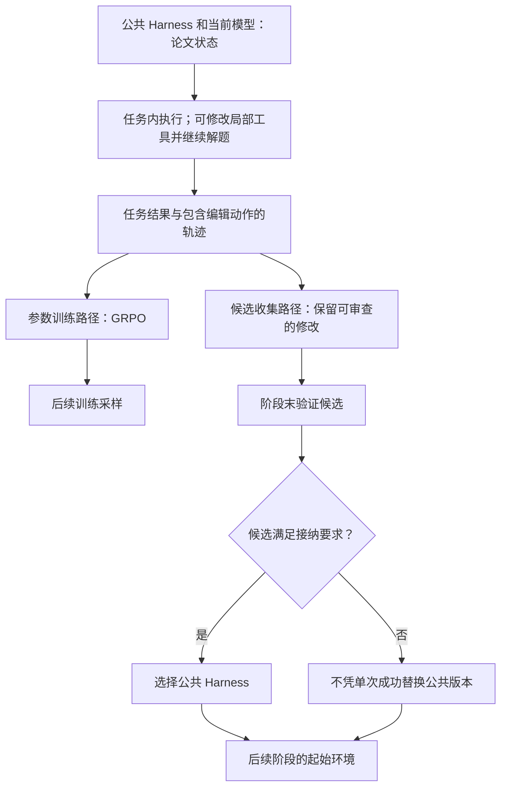

# HASE：区分任务内编辑、参数训练与阶段末公共 Harness 选择

2026-09-16 本轮重新访问论文并按完整标题检索代码，**仍未找到可确认归属的官方实现仓库**。本文是论文协议及实现缺口分析；附录代码片段不等于完整工程。代码提交、类、行号、进程和 Actor 边界均不明确。[论文](https://arxiv.org/html/2607.03935v1)｜[总索引](README.md)

## 1. 先定义三种不同的更新

本文用“任务内副本”指一次任务允许修改的 Harness 内容，用“公共 Harness”指后续任务共同采用的版本，用“阶段”指两次公共版本选择之间的训练区间。它们是解释论文流程的术语，不是已定位的代码类。

模型参数更新改变生成动作的概率；任务内编辑改变本次解题环境；公共版本选择决定后续任务从哪个环境开始。这三件事的实施主体和接口需要分别核实，不能由同一个“更新”词代替。

## 2. 论文案例如何从错误答案走到工具修改

Symptom2Disease 的发热、乏力和肌肉疼痛文本案例中，初始检索使模型错选 pneumonia；模型覆盖 `classification_tools.py`，改用症状重合度检索，随后第二次选中数据标签 dengue。训练最多三次尝试，首次正确奖励为 `1/尝试次数`；这是论文报告的基准分类案例，不是本次运行。任务内成功并不直接提交公共版本。[论文附录 A.1、A.4](https://arxiv.org/html/2607.03935v1)

论文将解题与编辑纳入同一模型的动作，并用 GRPO 训练；GRPO 利用同题多次采样的相对奖励更新策略。阶段末另审查候选，在分类案例中用基础 Qwen3-8B 做验证，接口有效且验证准确率提高才接纳；最终测试冻结 Harness，不继续编辑。[论文方法与附录 A.3–A.4](https://arxiv.org/html/2607.03935v1)

## 3. 将论文顺序串起来，同时保留代码空白

图是论文概念流程，节点不代表进程、Actor 或对象。尤其 `C→D` 的 token 数据构造、`E→G` 的阶段结束事件、`I→K` 的文件发布与加载均未取得源码，不能画成已验证的函数调用。

沿分类案例继续阅读时，关键不是仅找到 `classification_tools.py` 正文，而是把下列因果链逐一接通：模型返回编辑动作后谁写文件；写入返回后谁加载新函数；新检索结果怎样进入下一次模型输入；最终奖励怎样回到包含编辑动作的训练记录。缺少这些证据，无法确认论文示例在工程中的隔离和执行方式。

## 4. 对应每个环节的实现缺口

| 前一步结果 → 后一步 | 应定位的代码与数据 | 当前判断 |
|---|---|---|
| 分类输入 → 初始执行 | 数据加载器、标签集合、检索池、提示与工具装配 | 不明确 |
| 模型动作 → 检索/编辑/提交 | 动作协议、分支选择、允许工具和参数校验 | 不明确 |
| 文件编辑 → 本题重新执行 | 写入方法、文件副本、模块重载、异常反馈 | 只有论文局部示例，完整实现未定位 |
| 答案 → 奖励与重试 | 评分函数、尝试计数、终止事件 | 论文有规则，代码未定位 |
| 轨迹 → 模型更新 | 组 ID、编辑与解题 token 掩码、优势与优化器 | 论文称 GRPO，实际实现未定位 |
| 局部候选 → 阶段末验证 | 候选记录、去重、阶段结束条件与评测调用 | 不明确 |
| 验证通过 → 公共版本 | 接纳函数、发布位置、并发任务可见性 | 不明确 |
| 新模型/公共版本 → 下一阶段 | 模型加载、配置绑定、失败配对恢复 | 不明确 |
| 最终测试 | 禁用编辑和训练的入口开关及数据隔离实现 | 只有论文协议，尚不能做代码验收 |

## 5. 结论与后续阅读顺序

这里不能把“局部工具被改过”当成“公共 Harness 已接纳”，也不能把“模型生成编辑动作”当成“模型改写训练算法”。前者需要验证与发布证据，后者需要训练器本身被编辑的证据。

论文机制可描述，代码对应关系应标为**实现未定位**，不是已确认一致或不一致。获得官方工程后，优先沿同一个分类样例查 `任务入口→动作分派→文件写入和加载→评分/轨迹→训练→阶段选择→下一阶段装配`，再补真实类、方法、行号及部署图。本次没有运行论文片段、模型服务或训练。
