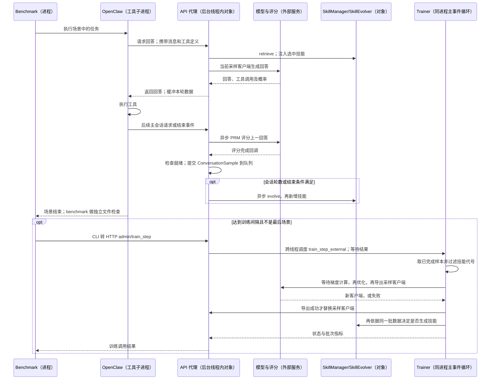

# MetaClaw：请求、异步评分、技能新增与手动训练怎样衔接

基线：`922caf3a1cd093fb316e95183a8acc8aa47b3b21`。本文选 benchmark 的 RL 手动训练配置：技能自动演化开启，训练时间窗口调度关闭，benchmark 每 5 个场景触发一次训练，最后场景除外。**一次手动调用先训练当前批次，再视同批失败情况新增技能；会话侧也能独立异步新增技能。**[选定配置](https://github.com/aiming-lab/MetaClaw/blob/922caf3a1cd093fb316e95183a8acc8aa47b3b21/benchmark/scripts/config/rl.yaml#L17)、[场景间隔](https://github.com/aiming-lab/MetaClaw/blob/922caf3a1cd093fb316e95183a8acc8aa47b3b21/benchmark/scripts/rl_run.py#L43)、[手动训练入口](https://github.com/aiming-lab/MetaClaw/blob/922caf3a1cd093fb316e95183a8acc8aa47b3b21/metaclaw/trainer.py#L375)｜[总索引](README.md)

## 1. 论文协议、案例与对象边界

论文要求区分用于产生技能的 support 数据与新技能下用于参数更新的 query 数据。本文把这种隔离称为“技能生成数据与模型训练数据分离”。**明确差异：所选手动入口先训练、后用同批数据生成技能，不能据清队列注释宣称已经严格实现论文隔离。**具体顺序见第 7–8 节。[论文 §3.4](https://arxiv.org/html/2603.17187v1)

贯穿案例是仓内 `metaclaw-bench-small/day03/r3`：在 `day03/` 生成 v2.3.0 部署记录 JSON，要求版本、发布时间、变更列表和部署者字段；错误反馈要求类似 `20260323_v230_changelog.json` 的文件名。这是真实任务输入，不是本次执行结果。[案例](https://github.com/aiming-lab/MetaClaw/blob/922caf3a1cd093fb316e95183a8acc8aa47b3b21/benchmark/data/metaclaw-bench-small/eval/day03/questions.json#L54)

| 名称 | 代码实体与职责 | 运行边界 |
|---|---|---|
| 场景控制者 | benchmark `infer_cmd`，运行场景、做文件检查、按间隔调用训练 | 独立进程 |
| 工具 Agent | OpenClaw，发模型请求并执行文件等工具 | benchmark 启动的子进程；本文不把外部工具实现视为 MetaClaw 源码 |
| 请求代理 | `MetaClawAPIServer`，注入技能、转发模型请求、收集回答 | MetaClaw 进程内对象，Uvicorn 后台线程提供接口 |
| 技能库/生成器 | `SkillManager` 保存和检索技能；`SkillEvolver` 调外部模型生成技能 | 普通对象 |
| 奖励对象 | `PRMScorer`，过程奖励模型的调用与投票封装 | 普通对象，调用评分服务 |
| 训练样本 | `ConversationSample`，保存一轮输入/回答、奖励、掩码与技能代号 | 数据对象，不是整个场景 |
| 训练控制者 | `MetaClawTrainer`，调用云端 LoRA 更新并换采样客户端 | 同进程主事件循环中的对象 |
| 队列持有者 | `AsyncRolloutWorker`，持有样本队列及代理引用 | 普通对象，不是 Ray Actor |

定义：[代理](https://github.com/aiming-lab/MetaClaw/blob/922caf3a1cd093fb316e95183a8acc8aa47b3b21/metaclaw/api_server.py#L471)、[技能库](https://github.com/aiming-lab/MetaClaw/blob/922caf3a1cd093fb316e95183a8acc8aa47b3b21/metaclaw/skill_manager.py#L142)、[生成器](https://github.com/aiming-lab/MetaClaw/blob/922caf3a1cd093fb316e95183a8acc8aa47b3b21/metaclaw/skill_evolver.py#L42)、[评分对象](https://github.com/aiming-lab/MetaClaw/blob/922caf3a1cd093fb316e95183a8acc8aa47b3b21/metaclaw/prm_scorer.py#L133)、[样本](https://github.com/aiming-lab/MetaClaw/blob/922caf3a1cd093fb316e95183a8acc8aa47b3b21/metaclaw/data_formatter.py#L34)、[训练器](https://github.com/aiming-lab/MetaClaw/blob/922caf3a1cd093fb316e95183a8acc8aa47b3b21/metaclaw/trainer.py#L39)、[队列对象](https://github.com/aiming-lab/MetaClaw/blob/922caf3a1cd093fb316e95183a8acc8aa47b3b21/metaclaw/rollout.py#L51)；进程/线程边界见[OpenClaw 启动](https://github.com/aiming-lab/MetaClaw/blob/922caf3a1cd093fb316e95183a8acc8aa47b3b21/benchmark/src/infer/infer_cmd.py#L397)、[代理后台线程](https://github.com/aiming-lab/MetaClaw/blob/922caf3a1cd093fb316e95183a8acc8aa47b3b21/metaclaw/api_server.py#L2388)。

## 2. 整体时序：请求返回不等于样本就绪



图中的技能生成和评分可与请求交错。训练接口等待结果时，代理事件循环仍可处理推理请求；它不是停止所有请求后的原子切换。[跨线程调度与等待](https://github.com/aiming-lab/MetaClaw/blob/922caf3a1cd093fb316e95183a8acc8aa47b3b21/metaclaw/api_server.py#L697)

## 3. 当前 Harness 如何把部署记录任务交给模型

启动阶段由 `launcher` 选择模式；RL 模式创建训练器，`setup` 创建 Tinker 的 LoRA 训练客户端及采样客户端。LoRA 是基础模型上的低秩适配参数，不是另一种奖励算法。`skills_only` 模式没有这条模型训练链。[模式装配](https://github.com/aiming-lab/MetaClaw/blob/922caf3a1cd093fb316e95183a8acc8aa47b3b21/metaclaw/launcher.py#L62)、[训练客户端初始化](https://github.com/aiming-lab/MetaClaw/blob/922caf3a1cd093fb316e95183a8acc8aa47b3b21/metaclaw/trainer.py#L131)

OpenClaw 发来本题后，`_handle_request` 读取消息和工具定义。`_inject_skills` 取最后一条用户消息调用 `SkillManager.retrieve`，将选中正文拼进 system 消息的 `Active Skills`；随后 `_forward_to_tinker` 使用当前采样客户端生成一次回答。代理将工具调用交回 OpenClaw，实际文件写入由 OpenClaw 执行，MetaClaw 不是直接调用文件工具的主体。[请求入口](https://github.com/aiming-lab/MetaClaw/blob/922caf3a1cd093fb316e95183a8acc8aa47b3b21/metaclaw/api_server.py#L1190)、[技能注入](https://github.com/aiming-lab/MetaClaw/blob/922caf3a1cd093fb316e95183a8acc8aa47b3b21/metaclaw/api_server.py#L2207)、[检索](https://github.com/aiming-lab/MetaClaw/blob/922caf3a1cd093fb316e95183a8acc8aa47b3b21/metaclaw/skill_manager.py#L333)、[模型调用](https://github.com/aiming-lab/MetaClaw/blob/922caf3a1cd093fb316e95183a8acc8aa47b3b21/metaclaw/api_server.py#L1504)

只有 `main` 类型请求进入本文采集路径：显式给会话 ID 却不给类型时默认 `side`；没有会话 ID 时使用默认会话并视为 `main`。因此本题存在并不能证明它必然进入训练队列，还需核实实际请求头。[会话类型规则](https://github.com/aiming-lab/MetaClaw/blob/922caf3a1cd093fb316e95183a8acc8aa47b3b21/metaclaw/api_server.py#L650)

## 4. 模型回答之后，谁评分，何时形成可训练样本

### 4.1 后续请求触发评分，评分完成触发入队

主会话回答产生后，代理保存待提交的 token 数据，并 `_buffer_record` 缓存文字记录。后续请求到来时，`_flush_pending_record` 取出上一记录、填入后续状态，再 `_fire_prm_scoring` 创建异步评分任务；配置了记录文件才会执行这条文字缓冲路径，不能忽略这个前提。[编码与缓冲](https://github.com/aiming-lab/MetaClaw/blob/922caf3a1cd093fb316e95183a8acc8aa47b3b21/metaclaw/api_server.py#L1385)、[文字缓冲条件](https://github.com/aiming-lab/MetaClaw/blob/922caf3a1cd093fb316e95183a8acc8aa47b3b21/metaclaw/api_server.py#L1042)、[后续状态触发](https://github.com/aiming-lab/MetaClaw/blob/922caf3a1cd093fb316e95183a8acc8aa47b3b21/metaclaw/api_server.py#L1015)

评分调用实际传入**上一回答和用户指令**，没有把后续工具状态正文传给 `PRMScorer.evaluate`。默认投票给 -1/0/1：完成、错误或证据不足由评分提示规定。后续状态是触发条件，不等于评分服务亲自检查了 JSON 文件。[评分实参](https://github.com/aiming-lab/MetaClaw/blob/922caf3a1cd093fb316e95183a8acc8aa47b3b21/metaclaw/api_server.py#L1092)、[判断标准](https://github.com/aiming-lab/MetaClaw/blob/922caf3a1cd093fb316e95183a8acc8aa47b3b21/metaclaw/prm_scorer.py#L51)、[投票](https://github.com/aiming-lab/MetaClaw/blob/922caf3a1cd093fb316e95183a8acc8aa47b3b21/metaclaw/prm_scorer.py#L117)

评分任务结束时，回调 `_maybe_submit_ready_samples(session_id)` 检查是否就绪：启用 PRM 时，评分还在运行就继续等；尚无评分任务则等待后续状态，除非会话结束强制提交；若启用 OPD（教师输出概率辅助训练），还需等待对应教师查询。满足条件才取出记录并调度 `_submit_turn_sample`。[完成回调](https://github.com/aiming-lab/MetaClaw/blob/922caf3a1cd093fb316e95183a8acc8aa47b3b21/metaclaw/api_server.py#L1105)、[就绪条件](https://github.com/aiming-lab/MetaClaw/blob/922caf3a1cd093fb316e95183a8acc8aa47b3b21/metaclaw/api_server.py#L2250)

`_submit_turn_sample` 构造 `ConversationSample`，包含输入/回答 token、回答采样概率、奖励、损失掩码和技能代号，再放入线程安全队列。token 是文本编码单元；掩码为 0 表示该回答位置不参与损失。没有后续状态的末轮置零掩码；奖励为 0 通常也排除，但已有后续状态且本会话尚无有效样本时，有一次提升为有效掩码的分支。不能笼统写成“所有零分都丢弃”。[掩码与样本构造](https://github.com/aiming-lab/MetaClaw/blob/922caf3a1cd093fb316e95183a8acc8aa47b3b21/metaclaw/api_server.py#L2298)、[入队](https://github.com/aiming-lab/MetaClaw/blob/922caf3a1cd093fb316e95183a8acc8aa47b3b21/metaclaw/api_server.py#L2340)

代理对规范化消息重新编码并调整概率数组长度，当前代码没有证明重构 token 与原采样 token 逐项对齐。评分失败或强制结束也可能形成零奖励记录；进入队列不保证最终有梯度贡献。[编码与概率处理](https://github.com/aiming-lab/MetaClaw/blob/922caf3a1cd093fb316e95183a8acc8aa47b3b21/metaclaw/api_server.py#L1385)

### 4.2 本题的文件检查为什么不是上述训练奖励

场景运行结束后，benchmark 独立执行 `check_filename.py --dir day03/ --ext json --min-count 2`。检查器验证符合命名规则的 JSON 文件数量，不核实题目要求的全部内容字段。runner 把反馈加入后续任务，但未将这个检查分数直接赋给 `ConversationSample.reward`。[检查命令](https://github.com/aiming-lab/MetaClaw/blob/922caf3a1cd093fb316e95183a8acc8aa47b3b21/benchmark/data/metaclaw-bench-small/eval/day03/questions.json#L61)、[检查范围](https://github.com/aiming-lab/MetaClaw/blob/922caf3a1cd093fb316e95183a8acc8aa47b3b21/benchmark/data/metaclaw-bench-small/eval/scripts/check_filename.py#L18)、[反馈传递](https://github.com/aiming-lab/MetaClaw/blob/922caf3a1cd093fb316e95183a8acc8aa47b3b21/benchmark/src/infer/infer_cmd.py#L897)

因此，“文件检查未通过”“PRM 给负分”“应当新增命名技能”需要分别证据支持；不能由其中一个自动推出另外两个。

## 5. 会话侧怎样分析并实际修改 Harness

主会话每达到默认 10 轮，或显式结束时满足对应条件，代理异步调用 `_evolve_skills_for_session`。它将会话输入/回答封装成奖励均为 0 的分析材料，调用 `SkillEvolver.evolve`；它不先等待 PRM 判定失败率。生成异常被捕获后返回，原请求路径不因此变成训练调用。[轮数触发](https://github.com/aiming-lab/MetaClaw/blob/922caf3a1cd093fb316e95183a8acc8aa47b3b21/metaclaw/api_server.py#L1428)、[结束触发](https://github.com/aiming-lab/MetaClaw/blob/922caf3a1cd093fb316e95183a8acc8aa47b3b21/metaclaw/api_server.py#L1483)、[分析材料与异常](https://github.com/aiming-lab/MetaClaw/blob/922caf3a1cd093fb316e95183a8acc8aa47b3b21/metaclaw/api_server.py#L2122)

`SkillEvolver` 把材料和已有技能交给外部模型，要求总结可复用指导；解析器从响应取 `name/description/content/category`，检查必需字段并整理名称。分析和写作在同次模型生成中完成，没有独立“给候选打任务收益分”的组件。[生成调用](https://github.com/aiming-lab/MetaClaw/blob/922caf3a1cd093fb316e95183a8acc8aa47b3b21/metaclaw/skill_evolver.py#L128)、[输出要求](https://github.com/aiming-lab/MetaClaw/blob/922caf3a1cd093fb316e95183a8acc8aa47b3b21/metaclaw/skill_evolver.py#L279)、[解析](https://github.com/aiming-lab/MetaClaw/blob/922caf3a1cd093fb316e95183a8acc8aa47b3b21/metaclaw/skill_evolver.py#L314)、[名称整理](https://github.com/aiming-lab/MetaClaw/blob/922caf3a1cd093fb316e95183a8acc8aa47b3b21/metaclaw/skill_evolver.py#L361)

若本题实际错误是写成 `changelog.json`，生成模型可能提出下面的技能；**这是说明性候选，本次没有生成或写入它**：

```json
{"name":"date-prefixed-artifact-names",
 "description":"生成带日期前缀的部署记录文件",
 "category":"coding",
 "content":"确认日期和目录；按规定命名 JSON；写入后检查文件存在与所需字段。"}
```

生成返回后，代理逐项调用 `SkillManager.add_skills`：`add_skill` 拒绝空名或同名条目，按类别追加到内存库、使向量检索缓存失效，再写 `<skills_dir>/<name>/SKILL.md`；有新增时增加 `generation`。这个代号是库计数，不是完整模型/Harness 版本。自然语言正文不会被编译为 Python，也不修改 OpenClaw 文件工具。[内存与去重](https://github.com/aiming-lab/MetaClaw/blob/922caf3a1cd093fb316e95183a8acc8aa47b3b21/metaclaw/skill_manager.py#L430)、[代号递增](https://github.com/aiming-lab/MetaClaw/blob/922caf3a1cd093fb316e95183a8acc8aa47b3b21/metaclaw/skill_manager.py#L463)、[文件写入](https://github.com/aiming-lab/MetaClaw/blob/922caf3a1cd093fb316e95183a8acc8aa47b3b21/metaclaw/skill_manager.py#L479)

此入口没有覆盖同名正文或删除旧技能的分支，也没有独立任务复评后才入库的门。文件打开/写入的 `OSError` 被记录后，内存修改不回滚；目录创建在该异常捕获之外。下一请求重新检索，只有选中该技能才将其注入提示，因此入库不等于下一任务一定采用。

## 6. 谁触发模型训练，触发时到底取哪批数据

会话新增技能不调用训练器。本例 benchmark 串行运行场景，每满 5 个且不是最后场景时，等待 `_trigger_train_step` 子命令；该 CLI 请求 `/v1/admin/train_step`。管理接口用 `run_coroutine_threadsafe` 将 `train_step_external()` 调度到 Trainer 的主事件循环，再等待返回；Uvicorn 线程可继续接受推理请求。[场景完成后的调用](https://github.com/aiming-lab/MetaClaw/blob/922caf3a1cd093fb316e95183a8acc8aa47b3b21/benchmark/src/infer/infer_cmd.py#L1348)、[CLI 启动与等待](https://github.com/aiming-lab/MetaClaw/blob/922caf3a1cd093fb316e95183a8acc8aa47b3b21/benchmark/src/infer/infer_cmd.py#L1215)、[HTTP 到训练器](https://github.com/aiming-lab/MetaClaw/blob/922caf3a1cd093fb316e95183a8acc8aa47b3b21/metaclaw/api_server.py#L697)

`train_step_external` 先检查云端训练客户端，随后从队列取当前所有已完成组，保留 `skill_generation >= _current_skill_generation` 的记录组成 batch。它不等待仍在评分的回答，也不按配置中的 `batch_size=4` 截取四条。没有样本则返回 `skipped`；有样本才等待 `_train_on_batch`，该方法抛错则返回 `error`，不继续后面的技能生成。[取批、过滤与返回分支](https://github.com/aiming-lab/MetaClaw/blob/922caf3a1cd093fb316e95183a8acc8aa47b3b21/metaclaw/trainer.py#L375)

## 7. `_train_on_batch` 怎样更新参数并交回采样客户端

进入训练方法后，`compute_advantages` 按**整个批次**奖励均值和标准差计算相对优势；`batch_to_datums` 把输入、目标 token、采样概率和带掩码优势交给训练服务。优势表示相对该批平均奖励的好坏；转换为空时直接返回。默认 `importance_sampling` 是损失名称，实际梯度计算在外部 Tinker 服务。[优势](https://github.com/aiming-lab/MetaClaw/blob/922caf3a1cd093fb316e95183a8acc8aa47b3b21/metaclaw/data_formatter.py#L217)、[训练数据](https://github.com/aiming-lab/MetaClaw/blob/922caf3a1cd093fb316e95183a8acc8aa47b3b21/metaclaw/data_formatter.py#L56)、[默认损失](https://github.com/aiming-lab/MetaClaw/blob/922caf3a1cd093fb316e95183a8acc8aa47b3b21/metaclaw/config.py#L25)、[训练方法](https://github.com/aiming-lab/MetaClaw/blob/922caf3a1cd093fb316e95183a8acc8aa47b3b21/metaclaw/trainer.py#L247)

该方法严格依次等待：`forward_backward_async` 计算梯度 → `optim_step_async(AdamParams(...))` 更新 LoRA 参数 → `save_weights_and_get_sampling_client_async` 导出采样客户端。之后 `AsyncRolloutWorker.update_sampling_client` 调用代理同名方法，替换后续推理使用的引用。已经开始的请求不会重新执行。[梯度、优化和导出](https://github.com/aiming-lab/MetaClaw/blob/922caf3a1cd093fb316e95183a8acc8aa47b3b21/metaclaw/trainer.py#L260)、[传递客户端](https://github.com/aiming-lab/MetaClaw/blob/922caf3a1cd093fb316e95183a8acc8aa47b3b21/metaclaw/rollout.py#L112)、[替换引用](https://github.com/aiming-lab/MetaClaw/blob/922caf3a1cd093fb316e95183a8acc8aa47b3b21/metaclaw/api_server.py#L2424)

导出超时或异常会在 `_train_on_batch` 内被捕获并直接返回，此时优化可能已完成，但代理仍用旧客户端；外层仍可能继续技能分析并返回 `ok`。所以“train-step 返回正常”不等于“新参数已经用于采样”。[导出失败路径](https://github.com/aiming-lab/MetaClaw/blob/922caf3a1cd093fb316e95183a8acc8aa47b3b21/metaclaw/trainer.py#L273)

每个请求只采一个回答，手动 batch 又可能包含不同任务，因此本实现不能直接称为“同题多回答分组的标准 GRPO”。可确认的是整批标准化优势、配置化策略损失与云端 LoRA 更新；云服务内部优化细节不在本仓。[采样数量](https://github.com/aiming-lab/MetaClaw/blob/922caf3a1cd093fb316e95183a8acc8aa47b3b21/metaclaw/api_server.py#L1549)

## 8. 训练方法返回后，为什么又使用同一批记录改技能

`train_step_external` 在 `_train_on_batch(batch)` 返回后调用 `_maybe_evolve_skills(batch)`。后者要求生成器和技能库存在，再判断 `reward>0` 的样本比例是否低于默认 0.4；满足时提取 `reward<=0` 的样本，等待 `SkillEvolver.evolve`，逐项新增技能。这里分析的仍是**训练前采集的 batch**，不是用新模型重跑的评价结果。[先后调用](https://github.com/aiming-lab/MetaClaw/blob/922caf3a1cd093fb316e95183a8acc8aa47b3b21/metaclaw/trainer.py#L401)、[触发与失败样本选择](https://github.com/aiming-lab/MetaClaw/blob/922caf3a1cd093fb316e95183a8acc8aa47b3b21/metaclaw/trainer.py#L325)

新增成功、代号增加后，Trainer 更新自己的代号基线，清除待用 batch 和输出队列，再返回本次状态。清队列只能影响未来取批，不能撤销刚才已完成的参数更新。因此论文要求的 support/query 分离与此入口顺序存在明确差异；部分样本因掩码或零优势可能没有梯度，不改变程序没有保证严格分离的判断。[代号与清理](https://github.com/aiming-lab/MetaClaw/blob/922caf3a1cd093fb316e95183a8acc8aa47b3b21/metaclaw/trainer.py#L356)

还有两处限制：样本在**提交时**读取当前技能代号，不保存实际推理时的完整技能快照；会话侧新增技能没有同步更新 Trainer 的代号基线。旧提示生成的回答可能被标成新代号，所以不能仅靠 `>=` 过滤证明异步数据隔离。[提交时打标](https://github.com/aiming-lab/MetaClaw/blob/922caf3a1cd093fb316e95183a8acc8aa47b3b21/metaclaw/api_server.py#L2321)、[会话新增路径](https://github.com/aiming-lab/MetaClaw/blob/922caf3a1cd093fb316e95183a8acc8aa47b3b21/metaclaw/api_server.py#L2140)

用 H0/H1 表示前后技能库、θ0/θ1 表示前后模型，本例手动链应理解为：

```text
H0 与 θ0 产生已完成数据 D0
→ 外部训练事件取 D0 → 更新参数并尝试发布 θ1
→ 若 D0 低成功率，则仍根据 D0 新增 H1
→ 后续请求检索技能，并使用当时可见的采样客户端，产生 D1
→ 后续会话条件或训练事件才消费 D1，形成下一次反馈
```

图省略了可能交错的会话侧新增。只有导出成功且相关技能被检索选中，后续请求才实际体现 θ1 与 H1；分析 D0 不等于复评 θ1。

## 9. 分支、继承和阅读边界

| 事件或入口 | 实际结果 |
|---|---|
| 技能新增 | 后续请求可重新检索；不立即触发参数训练 |
| 训练无样本/转换为空 | 前者返回 skipped；后者返回训练调用方，后续技能判断仍可能发生 |
| 训练导出失败 | 代理保留旧采样客户端，没有模型与技能联合回滚 |
| 连续 `run` 模式 | 按配置批量取样；启用 `SlowUpdateScheduler` 时等待训练窗口。该循环没有手动路径的 `_maybe_evolve_skills` 调用 |
| `skills_only` | 可演化技能，不创建本文的模型训练链 |
| benchmark 结束 | 临时技能目录会清理；运行时可见不等于永久保存 |
| 服务重启 | 技能代号从初始化值开始，不恢复完整模型/技能联合历史 |

分支依据：[连续入口](https://github.com/aiming-lab/MetaClaw/blob/922caf3a1cd093fb316e95183a8acc8aa47b3b21/metaclaw/trainer.py#L521)、[连续更新位置](https://github.com/aiming-lab/MetaClaw/blob/922caf3a1cd093fb316e95183a8acc8aa47b3b21/metaclaw/trainer.py#L623)、[时间窗口对象](https://github.com/aiming-lab/MetaClaw/blob/922caf3a1cd093fb316e95183a8acc8aa47b3b21/metaclaw/scheduler.py#L58)、[临时目录](https://github.com/aiming-lab/MetaClaw/blob/922caf3a1cd093fb316e95183a8acc8aa47b3b21/benchmark/scripts/rl_run.py#L246)、[清理](https://github.com/aiming-lab/MetaClaw/blob/922caf3a1cd093fb316e95183a8acc8aa47b3b21/benchmark/scripts/rl_run.py#L270)、[代号初始化](https://github.com/aiming-lab/MetaClaw/blob/922caf3a1cd093fb316e95183a8acc8aa47b3b21/metaclaw/skill_manager.py#L173)。

建议先追 `handle_request → flush_pending_record → PRM 回调 → submit_turn_sample`，再追 `admin_train_step → train_step_external → train_on_batch → maybe_evolve_skills → update_sampling_client`，最后对照独立的会话技能入口。本次未启动 OpenClaw、模型服务或训练；前轮语法/JSON 检查、仓内任务和说明性技能不能当成完整运行验证。
