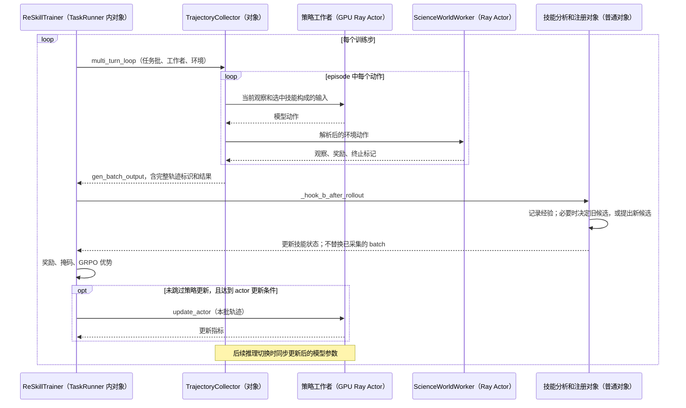

# ReSkill：采样返回后，技能更新与模型更新怎样衔接

基线：`reskill@a25e2534fcdef182f6684e4d24fa8a916e085ba5`，固定 veRL 子模块 `d62da4950573d7a4b7ef2362337952e7ab59e78d`。主线采用 ScienceWorld 配置中的 `test-conductivity` 任务。**每个训练步先采样，再处理技能版本，随后用刚才已经采集的记录训练模型；新技能影响后续采样，不会改写本批已生成的轨迹。**[实际先后](https://github.com/amazon-science/reskill/blob/a25e2534fcdef182f6684e4d24fa8a916e085ba5/reskill/reskill_trainer.py#L907)｜[总索引](README.md)

## 1. 论文协议与代码中的对象边界

论文描述策略训练与技能演化共同进行，在策略持续变化时比较技能版本。公开代码确实把技能处理接入训练循环；本篇进一步区分“提出技能”“开始比较”“最终保留”与每步模型更新，避免误写成先固定模型选出技能、再训练模型。[论文算法与版本比较](https://arxiv.org/html/2606.01619v2)

本文的 **Harness 修改对象**是注入模型输入的技能正文和触发规则，不是 ScienceWorld 模拟器、动作解析器或模型权重。**episode** 指从环境重置到成功、终止或步数上限的一条完整任务轨迹；一个 episode 含多个模型动作。

| 名称 | 代码实体及职责 | 实际运行边界 |
|---|---|---|
| 训练入口 | `run_reskill_ppo` 创建 `_ReSkillTaskRunner` 并等待其 `run` | 启动进程 → Ray Actor |
| 联合控制对象 | `ReSkillTrainer`，组织采样、技能处理、奖励与参数更新 | TaskRunner 内普通对象 |
| 轨迹采集对象 | `TrajectoryCollector`，推进多回合模型—环境交互 | 普通对象 |
| 策略执行/训练者 | `ActorRolloutRefWorker`，执行推理与参数更新 | GPU Ray Actor；内部有训练与推理组件 |
| 环境执行者 | `ScienceWorldWorker`，加载任务并执行环境动作 | Ray Actor |
| 技能读取/存储 | `SkillLoader`、`SkillRegistry`；单项数据为 `SkillModule` | 普通对象及 JSON/SKILL.md 文件 |
| 版本比较对象 | `VersionABTracker`，分配新旧版本并积累成功统计 | 普通对象，不是独立训练 Actor |

入口与类：[启动](https://github.com/amazon-science/reskill/blob/a25e2534fcdef182f6684e4d24fa8a916e085ba5/reskill/verl_integration/runner.py#L22)、[TaskRunner](https://github.com/amazon-science/reskill/blob/a25e2534fcdef182f6684e4d24fa8a916e085ba5/reskill/verl_integration/runner.py#L38)、[Trainer](https://github.com/amazon-science/reskill/blob/a25e2534fcdef182f6684e4d24fa8a916e085ba5/reskill/reskill_trainer.py#L37)、[Collector](https://github.com/amazon-science/reskill/blob/a25e2534fcdef182f6684e4d24fa8a916e085ba5/reskill/verl_integration/rollout.py#L32)、[环境 Actor](https://github.com/amazon-science/reskill/blob/a25e2534fcdef182f6684e4d24fa8a916e085ba5/reskill/environments/scienceworld/envs.py#L152)、[SkillModule](https://github.com/amazon-science/reskill/blob/a25e2534fcdef182f6684e4d24fa8a916e085ba5/reskill/skill_serving/skill_registry.py#L24)、[Registry](https://github.com/amazon-science/reskill/blob/a25e2534fcdef182f6684e4d24fa8a916e085ba5/reskill/skill_serving/skill_registry.py#L230)、[Tracker](https://github.com/amazon-science/reskill/blob/a25e2534fcdef182f6684e4d24fa8a916e085ba5/reskill/skill_serving/skill_ab_tracker.py#L51)。

## 2. 从入口到整步循环的调用顺序

`run_reskill_ppo` 初始化 Ray，创建 TaskRunner Actor，调用 `runner.run.remote(config)` 并 `ray.get` 等待。TaskRunner 检查 GRPO、vLLM（推理后端）、FSDP（分片分布式训练方式）等支持配置，创建环境、奖励对象、采集对象和 `ReSkillTrainer`，再依次调用 `init_workers()`、`fit()`。技能分析类由 Trainer 创建，不是另一个独立训练循环。[配置约束](https://github.com/amazon-science/reskill/blob/a25e2534fcdef182f6684e4d24fa8a916e085ba5/reskill/verl_integration/runner.py#L7)、[等待远程执行](https://github.com/amazon-science/reskill/blob/a25e2534fcdef182f6684e4d24fa8a916e085ba5/reskill/verl_integration/runner.py#L33)、[工作者装配](https://github.com/amazon-science/reskill/blob/a25e2534fcdef182f6684e4d24fa8a916e085ba5/reskill/verl_integration/runner.py#L61)、[技能分析组件](https://github.com/amazon-science/reskill/blob/a25e2534fcdef182f6684e4d24fa8a916e085ba5/reskill/reskill_trainer.py#L141)



`_hook_b_after_rollout` 是 Trainer 的普通方法；`fit` 在它返回后才继续奖励与训练。Hook 抛错会被外层捕获并打印，模型训练路径仍继续；技能生成失败不是全局训练停止事件。[Hook 的等待与异常处理](https://github.com/amazon-science/reskill/blob/a25e2534fcdef182f6684e4d24fa8a916e085ba5/reskill/reskill_trainer.py#L914)

## 3. 一次导电性任务如何使用当前技能并产生结果

配置指定 `test-conductivity`，每组 8 条采样、任务最多 30 步。数据准备脚本生成任务槽位；具体环境题目与变体由 `ScienceWorldWorker.reset` 加载，不是直接从数据文件取得一段固定问题文本。本文没有实际运行出的房间、物体名和完整通关轨迹，不虚构这些细节。[采样配置](https://github.com/amazon-science/reskill/blob/a25e2534fcdef182f6684e4d24fa8a916e085ba5/configs/scienceworld.yaml#L6)、[任务类型](https://github.com/amazon-science/reskill/blob/a25e2534fcdef182f6684e4d24fa8a916e085ba5/configs/scienceworld.yaml#L28)、[数据槽位](https://github.com/amazon-science/reskill/blob/a25e2534fcdef182f6684e4d24fa8a916e085ba5/scripts/data_prep/prepare_scienceworld.py#L24)、[重置与变体](https://github.com/amazon-science/reskill/blob/a25e2534fcdef182f6684e4d24fa8a916e085ba5/reskill/environments/scienceworld/envs.py#L186)

环境重置时，技能管理逻辑为整个 episode 选定一个新/旧技能版本。`ReSkillScienceWorldEnvManager.build_text_obs` 调用 `SkillLoader`，根据步数和上一动作选择触发技能，把正文与观察共同放入提示；版本在 episode 内保持不变，但技能是否触发可以随动作变化。[版本分配](https://github.com/amazon-science/reskill/blob/a25e2534fcdef182f6684e4d24fa8a916e085ba5/reskill/environments/base.py#L301)、[构建观察](https://github.com/amazon-science/reskill/blob/a25e2534fcdef182f6684e4d24fa8a916e085ba5/reskill/environments/scienceworld/skill_env_manager.py#L32)、[触发选择](https://github.com/amazon-science/reskill/blob/a25e2534fcdef182f6684e4d24fa8a916e085ba5/reskill/skill_serving/skill_loader.py#L62)、[正文格式](https://github.com/amazon-science/reskill/blob/a25e2534fcdef182f6684e4d24fa8a916e085ba5/reskill/skill_serving/skill_loader.py#L86)

任务模型输出 `<action>…</action>` 后，动作解析器抽取并规范化动作；环境管理器把动作交给 `ScienceWorldWorker`，取得新观察、原始分数与终止状态。导电性任务可用动作词汇由环境提供，技能只给模型自然语言指导，不会自动执行一串 Python 工具代码。[解析](https://github.com/amazon-science/reskill/blob/a25e2534fcdef182f6684e4d24fa8a916e085ba5/reskill/environments/scienceworld/projection.py#L5)、[环境调用](https://github.com/amazon-science/reskill/blob/a25e2534fcdef182f6684e4d24fa8a916e085ba5/reskill/environments/scienceworld/env_manager.py#L105)、[动作词汇](https://github.com/amazon-science/reskill/blob/a25e2534fcdef182f6684e4d24fa8a916e085ba5/reskill/environments/scienceworld/action_vocabulary.py#L6)

环境结束且原始分数 `>70` 时，`compute_reward` 返回 10，否则返回 0；中间步为 0。采集器在终止或步数上限后整理多轮记录，保留组 ID `uid`、轨迹 ID `traj_uid` 和成功结果，返回 `gen_batch_output`。`uid` 用于同任务分组，`traj_uid` 用于区分一次完整采样，两者不能互换。[奖励规则](https://github.com/amazon-science/reskill/blob/a25e2534fcdef182f6684e4d24fa8a916e085ba5/reskill/environments/scienceworld/envs.py#L124)、[标识与记录](https://github.com/amazon-science/reskill/blob/a25e2534fcdef182f6684e4d24fa8a916e085ba5/reskill/verl_integration/rollout.py#L342)、[回合上限](https://github.com/amazon-science/reskill/blob/a25e2534fcdef182f6684e4d24fa8a916e085ba5/reskill/verl_integration/rollout.py#L368)

## 4. 采样返回后，怎样判断是否分析或接纳技能

Trainer 收到本批结果后调用 `_hook_b_after_rollout`。该方法先 `_build_episode_trajectories` 重建 episode，按环境分配记录新/旧条件，再把经验写入 reservoir（经验记录容器）。因此分析读取的是刚结束的轨迹及历史经验，不是未来新技能产生的数据。[Hook 主体](https://github.com/amazon-science/reskill/blob/a25e2534fcdef182f6684e4d24fa8a916e085ba5/reskill/reskill_trainer.py#L203)、[轨迹重建](https://github.com/amazon-science/reskill/blob/a25e2534fcdef182f6684e4d24fa8a916e085ba5/reskill/reskill_trainer.py#L466)、[经验容器](https://github.com/amazon-science/reskill/blob/a25e2534fcdef182f6684e4d24fa8a916e085ba5/reskill/skill_creator/analysis/experience_reservoir.py#L80)

若当前正在测试一个技能版本，Hook 按唯一 `traj_uid` 记录一次成功结果，调用 `record_step`；只有 `should_decide` 达到测试步数和 episode 数要求，才 `_handle_ab_test_decision`。默认比较至少 5 个训练步、50 条 episode；这不是“一个新技能触发五次就通过”。[默认比较参数](https://github.com/amazon-science/reskill/blob/a25e2534fcdef182f6684e4d24fa8a916e085ba5/reskill/skill_serving/skill_ab_tracker.py#L51)、[决策条件](https://github.com/amazon-science/reskill/blob/a25e2534fcdef182f6684e4d24fa8a916e085ba5/reskill/skill_serving/skill_ab_tracker.py#L253)

决策比较新旧成功率的后验均值，即根据已观察成败更新后的成功概率均值，新版本严格更高才接纳，否则 `SkillRegistry.revert_version` 恢复操作快照。随后清除环境的旧版本引用、更新技能版本并保存记录。**这里只回退技能，不回退模型，也不删除本批采样。**决策结束后，如果已不在测试，同一个 Hook 还可能立即尝试提出下一候选。[接纳与回退](https://github.com/amazon-science/reskill/blob/a25e2534fcdef182f6684e4d24fa8a916e085ba5/reskill/reskill_trainer.py#L537)、[逆操作](https://github.com/amazon-science/reskill/blob/a25e2534fcdef182f6684e4d24fa8a916e085ba5/reskill/skill_serving/skill_registry.py#L471)、[继续演化条件](https://github.com/amazon-science/reskill/blob/a25e2534fcdef182f6684e4d24fa8a916e085ba5/reskill/reskill_trainer.py#L264)

## 5. 没有待比较版本时，分析结果怎样变成增改删操作

### 5.1 从经验门槛到四个生成环节

`_evolve_skills` 先检查经验数量；本配置从 `base.yaml` 取得门槛 100，方法本身的缺省兜底是 200，不能混写。达到门槛后抽取任务组；无任务组或分析无结果时直接返回。接着按下列顺序传递返回值：[本配置门槛](https://github.com/amazon-science/reskill/blob/a25e2534fcdef182f6684e4d24fa8a916e085ba5/configs/base.yaml#L82)、[演化入口与空结果分支](https://github.com/amazon-science/reskill/blob/a25e2534fcdef182f6684e4d24fa8a916e085ba5/reskill/reskill_trainer.py#L581)

| 调用与输入 | 返回值如何进入下一环节 |
|---|---|
| `EpisodeAnalyzer.analyze_groups(任务组, 当前技能)` | 外部模型逐条分析，返回 insights（逐条经验分析）；`summarize` 汇总成诊断材料 |
| `AssertionEngine.grade_batch(历史经验)`，再 `BatchDiagnoser.diagnose(...)` | 前者按已有规则检查动作，后者结合规则统计、分析摘要和当前技能生成诊断，并可提出规则增改删 |
| `SkillRecommender.recommend(诊断, 技能库摘要, 版本历史, insights, 动作词汇)` | 返回技能操作建议；无操作则停止这次演化 |
| `SkillAuthor.author(建议, insights, 技能库, 重试反馈, 动作词汇)` | 返回具体 `operations`；调用 `_phase_verify`，失败反馈给下一次 author，默认最多三次 |

实际顺序由[分析后的调用链](https://github.com/amazon-science/reskill/blob/a25e2534fcdef182f6684e4d24fa8a916e085ba5/reskill/reskill_trainer.py#L627)、[生成与验证重试](https://github.com/amazon-science/reskill/blob/a25e2534fcdef182f6684e4d24fa8a916e085ba5/reskill/reskill_trainer.py#L676)定义；分析方法见[EpisodeAnalyzer](https://github.com/amazon-science/reskill/blob/a25e2534fcdef182f6684e4d24fa8a916e085ba5/reskill/skill_creator/analysis/episode_analyzer.py#L90)、[Recommender](https://github.com/amazon-science/reskill/blob/a25e2534fcdef182f6684e4d24fa8a916e085ba5/reskill/skill_creator/authoring/skill_recommender.py#L149)、[Author](https://github.com/amazon-science/reskill/blob/a25e2534fcdef182f6684e4d24fa8a916e085ba5/reskill/skill_creator/authoring/skill_author.py#L100)。

上述四个生成角色的类分别为 [EpisodeAnalyzer](https://github.com/amazon-science/reskill/blob/a25e2534fcdef182f6684e4d24fa8a916e085ba5/reskill/skill_creator/analysis/episode_analyzer.py#L77)、[BatchDiagnoser](https://github.com/amazon-science/reskill/blob/a25e2534fcdef182f6684e4d24fa8a916e085ba5/reskill/skill_creator/diagnosis/batch_diagnoser.py#L33)、[SkillRecommender](https://github.com/amazon-science/reskill/blob/a25e2534fcdef182f6684e4d24fa8a916e085ba5/reskill/skill_creator/authoring/skill_recommender.py#L134)、[SkillAuthor](https://github.com/amazon-science/reskill/blob/a25e2534fcdef182f6684e4d24fa8a916e085ba5/reskill/skill_creator/authoring/skill_author.py#L82)；其中批次诊断入口是 [diagnose](https://github.com/amazon-science/reskill/blob/a25e2534fcdef182f6684e4d24fa8a916e085ba5/reskill/skill_creator/diagnosis/batch_diagnoser.py#L46)。

`AssertionEngine` 是规则执行对象，支持动作出现、顺序和重复等检查；它的通过率用于诊断，不替代环境奖励，也不直接更新模型参数。外部生成模型负责解释和编写技能，策略模型才是后面的 GRPO 训练对象。[规则引擎](https://github.com/amazon-science/reskill/blob/a25e2534fcdef182f6684e4d24fa8a916e085ba5/reskill/skill_creator/diagnosis/assertion_engine.py#L139)、[规则检查](https://github.com/amazon-science/reskill/blob/a25e2534fcdef182f6684e4d24fa8a916e085ba5/reskill/skill_creator/diagnosis/assertion_engine.py#L153)

### 5.2 一个候选如何具体改变下一次模型输入

以“导电性任务中，模型使用了观察中不存在的物体名”作**条件示例**，不是仓内已发生的错误日志。Author 可提出新增 `copy-visible-object-name`，正文要求先读取观察、按原文复制物体名，触发类型为 `action_pattern`，模式为 `^look around$`。实际修改的是技能数据，不是新增环境工具。

`_phase_verify` 会模拟触发：分母是经验中的 episode 数，分子是至少一个动作可触发该技能的 episode 数；默认要求比例至少 0.5。若不足，Author 收到反馈后重写，不能直接进入比较。长度检查仅覆盖代码指定的字典式正文及 examples，不能宣称对所有正文类型都严格执行同一长度约束。[比例定义](https://github.com/amazon-science/reskill/blob/a25e2534fcdef182f6684e4d24fa8a916e085ba5/reskill/skill_serving/trigger_matcher.py#L64)、[验证与长度边界](https://github.com/amazon-science/reskill/blob/a25e2534fcdef182f6684e4d24fa8a916e085ba5/reskill/reskill_trainer.py#L738)

验证通过后，`_phase_ab_test` 先保存旧库快照，再调用 `apply_version(operations)` 修改当前库。操作含义如下：

| 操作 | 程序实际改变什么 |
|---|---|
| `add` | 新增 `SkillModule` 的 name/content/trigger_type/trigger_pattern，状态直接设 active，用于版本测试 |
| `modify` | 找到目标名称；字典 content 局部合并，否则整体替换；可改 trigger_pattern，该分支没有同步修改 trigger_type |
| `delete` | 保存完整旧条目后删除；可供拒绝版本时恢复 |

对应[apply_version](https://github.com/amazon-science/reskill/blob/a25e2534fcdef182f6684e4d24fa8a916e085ba5/reskill/skill_serving/skill_registry.py#L380)、[新增](https://github.com/amazon-science/reskill/blob/a25e2534fcdef182f6684e4d24fa8a916e085ba5/reskill/skill_serving/skill_registry.py#L394)、[修改](https://github.com/amazon-science/reskill/blob/a25e2534fcdef182f6684e4d24fa8a916e085ba5/reskill/skill_serving/skill_registry.py#L417)、[删除](https://github.com/amazon-science/reskill/blob/a25e2534fcdef182f6684e4d24fa8a916e085ba5/reskill/skill_serving/skill_registry.py#L452)。容量不足或目标不存在可使单项被跳过，不能仅据方法注释称为全有或全无事务。

`_phase_ab_test` 随后把旧库引用交给训练和验证环境，保存当前 JSON/SKILL.md 与比较状态，再返回 Hook。未来 episode 若选中新增版本，且上一动作匹配 `look around`，`SkillLoader` 才把本技能正文注入下一输入。添加成功不表示每一步都会读到它。[快照、应用与发布](https://github.com/amazon-science/reskill/blob/a25e2534fcdef182f6684e4d24fa8a916e085ba5/reskill/reskill_trainer.py#L788)、[文件保存](https://github.com/amazon-science/reskill/blob/a25e2534fcdef182f6684e4d24fa8a916e085ba5/reskill/skill_serving/skill_registry.py#L627)、[实际触发](https://github.com/amazon-science/reskill/blob/a25e2534fcdef182f6684e4d24fa8a916e085ba5/reskill/skill_serving/trigger_matcher.py#L30)

## 6. 技能处理返回后，为什么本步模型仍用旧采样训练

Hook 返回后，`fit` 才将 `gen_batch_output` 设为训练 batch，构造回答掩码并计算奖励。掩码限定参与损失的模型输出位置；技能正文、观察和提示不是监督标签。本批是在 Hook 之前采集的，所以刚新增的 `copy-visible-object-name` 不会“补入”本批原提示。[返回后的数据流](https://github.com/amazon-science/reskill/blob/a25e2534fcdef182f6684e4d24fa8a916e085ba5/reskill/reskill_trainer.py#L923)

`EpisodeRewardManager` 把整条 episode 的奖励写到各记录最后一个有效回答 token；无效动作惩罚另行扣除。`compute_grpo_outcome_advantage` 按 `uid` 比较同任务轨迹，用 `traj_uid` 去重后求组内统计，再将优势分配到回答位置。优势表示相对同组其他采样的好坏，不是技能分析器的文字评价。[奖励写入](https://github.com/amazon-science/reskill/blob/a25e2534fcdef182f6684e4d24fa8a916e085ba5/reskill/verl_integration/reward_manager.py#L53)、[无效动作惩罚](https://github.com/amazon-science/reskill/blob/a25e2534fcdef182f6684e4d24fa8a916e085ba5/reskill/verl_integration/algorithms.py#L9)、[GRPO 分组与优势](https://github.com/amazon-science/reskill/blob/a25e2534fcdef182f6684e4d24fa8a916e085ba5/reskill/verl_integration/algorithms.py#L35)

若 `skip_policy_update` 开启，本步不更新策略；否则满足 `critic_warmup <= global_steps` 后调用 `actor_rollout_wg.update_actor(batch)` 并等待结果。GPU 工作者将数据交给 actor 更新，优化器实际执行参数步进。默认基础模型配置 `lora_rank=0`，不能把本路径写成默认 LoRA 训练；可训练参数以实际模型配置为准。[跳过分支](https://github.com/amazon-science/reskill/blob/a25e2534fcdef182f6684e4d24fa8a916e085ba5/reskill/reskill_trainer.py#L934)、[更新条件与调用](https://github.com/amazon-science/reskill/blob/a25e2534fcdef182f6684e4d24fa8a916e085ba5/reskill/reskill_trainer.py#L1046)、[工作者更新入口](https://github.com/volcengine/verl/blob/d62da4950573d7a4b7ef2362337952e7ab59e78d/verl/workers/fsdp_workers.py#L865)、[优化器步进](https://github.com/volcengine/verl/blob/d62da4950573d7a4b7ef2362337952e7ab59e78d/verl/workers/actor/dp_actor.py#L455)、[默认参数配置](https://github.com/volcengine/verl/blob/d62da4950573d7a4b7ef2362337952e7ab59e78d/verl/trainer/config/model/hf_model.yaml#L42)

## 7. 新模型和候选技能怎样共同进入后续采样

更新返回后，Trainer 按频率验证、保存、递增训练步；达到最后一步即返回，否则开始下一批。后续策略工作者切换到推理模式时同步更新后的参数，再生成动作。因此新模型通过**后续行为及成败记录**反馈给第 4–5 节，不是直接把权重交给技能分析模型。[验证、保存和停止](https://github.com/amazon-science/reskill/blob/a25e2534fcdef182f6684e4d24fa8a916e085ba5/reskill/reskill_trainer.py#L1053)、[推理入口](https://github.com/volcengine/verl/blob/d62da4950573d7a4b7ef2362337952e7ab59e78d/verl/workers/fsdp_workers.py#L924)、[推理模式参数同步](https://github.com/volcengine/verl/blob/d62da4950573d7a4b7ef2362337952e7ab59e78d/verl/workers/fsdp_workers.py#L660)

候选正在比较时，`VersionABTracker` 用 Thompson sampling 分配新旧版本；这是根据成功率分布抽样的策略，新版概率被限制在 0.15–0.85，不是每组固定四条旧版、四条新版。模型仍在这些步之间更新，故比较期间得到的是随模型变化的新旧技能结果，不是冻结模型的静态评测。[分配概率](https://github.com/amazon-science/reskill/blob/a25e2534fcdef182f6684e4d24fa8a916e085ba5/reskill/skill_serving/skill_ab_tracker.py#L115)

把第 5 节候选记为 H1、原技能库记为 H0，将当前模型记为 θ0，本例顺序是：

```text
H0 + θ0 生成本批 D0
→ Hook 从 D0 和历史经验提出 H1，并开启新旧版本比较
→ 仍用 D0 更新模型到 θ1
→ 后续 episode 分别选 H0 或 H1，以可见的新模型采样 D1
→ Hook 记录 D1 的版本成功结果；满足门槛后接纳或回退 H1
→ 每步模型更新继续；拒绝 H1 不会撤销已发生的模型更新
```

即使某一步没有技能操作，只要模型更新条件满足，仍会训练；即使某步拒绝技能，本步已采集的两种技能轨迹仍可参与训练。以上协同顺序由同一个 `fit` 和 Hook 直接连接，不依赖外部手工移动轨迹文件。

## 8. 可确认的闭环与仍需补齐的实现证据

| 检查项 | 结论 |
|---|---|
| Harness 修改与模型更新的触发关系 | 已连接但不同步触发：模型按训练步更新，技能按经验量、测试状态和验证条件更新 |
| 谁评价候选 | 环境成功结果进入版本比较；分析规则只提供诊断；两者不混用 |
| 候选失败与异常 | Author 验证失败重试，耗尽则跳过；Hook 异常可继续训练；版本拒绝回退技能 |
| 新旧版本与模型共同继承 | 运行中已接通；没有模型/技能配对回滚 |
| 默认命令是否可直接复现 | ScienceWorld 配置缺少环境构造所读的部分 seed/resources 字段，需补配置；本次未运行模拟器 |
| 恢复中的比较状态 | Tracker 可读恢复状态，但环境旧版本引用的完整重建未确认，不能保证中途恢复与连续运行等价 |
| 验证集含义 | `_phase_ab_test` 也给验证环境旧库引用，不能直接称验证始终只使用当前单一技能版本 |

限制入口：[环境构造](https://github.com/amazon-science/reskill/blob/a25e2534fcdef182f6684e4d24fa8a916e085ba5/reskill/environments/make_envs.py#L13)、[配置读取](https://github.com/amazon-science/reskill/blob/a25e2534fcdef182f6684e4d24fa8a916e085ba5/reskill/environments/scienceworld/__init__.py#L17)、[恢复](https://github.com/amazon-science/reskill/blob/a25e2534fcdef182f6684e4d24fa8a916e085ba5/reskill/reskill_trainer.py#L92)、[旧库状态](https://github.com/amazon-science/reskill/blob/a25e2534fcdef182f6684e4d24fa8a916e085ba5/reskill/environments/base.py#L331)、[两类环境注入](https://github.com/amazon-science/reskill/blob/a25e2534fcdef182f6684e4d24fa8a916e085ba5/reskill/reskill_trainer.py#L803)。

建议阅读顺序为 `runner → fit → multi_turn_loop → _hook_b_after_rollout → _evolve_skills/_handle_ab_test_decision → 返回 fit 的奖励与 update_actor → 下一次采样`。本次仅核查代码；前轮技能文件/触发契约检查不证明完整训练成功，本文的物体名技能是解释性候选。
