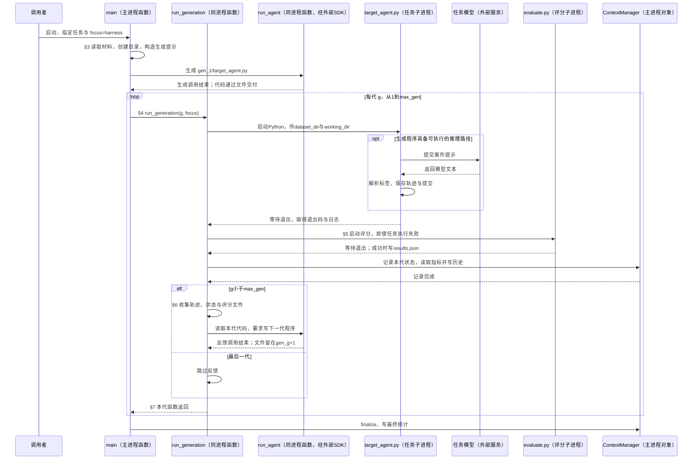
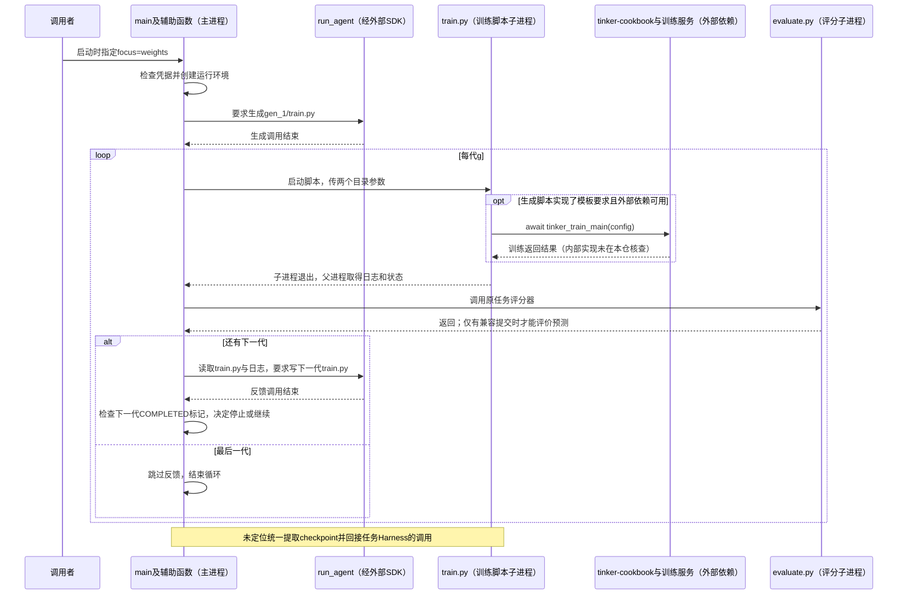

# SIA 代码 Walkthrough：从启动、程序修改到训练分支的完整调用链

源码基线：`sia@7fd04d07bd2f47a110115674432b73622ebf7455`。论文版本：`2605.27276v1`。本文以 LawBench 的真实输入 `id=0` 追踪程序执行，再说明它怎样进入评分、反馈与下一代；训练分支单独从真实入口接入，未定位的连接明确断开。本次只阅读源码与论文，没有运行模型、生成程序或训练。[返回总索引](README.md)

## 1. 阅读前先明确：论文的联合循环与公开入口并不完全对应

**论文机制：**反馈角色根据当前轨迹和表现选择修改 Harness 或更新模型，两种动作允许交替。实验章节描述先改 Harness、进展停滞后训练。LawBench 的 Harness 阶段涉及 TF-IDF 文本特征与 LinearSVC 分类器，随后选择 GRPO 训练模型；README 报告 Harness-only 为 50.0%，W+H 为 70.1%。这些是作者报告，不是本次复现。[论文 §5–6](https://arxiv.org/html/2605.27276v1#S5)、[README 实验结果](https://github.com/hexo-ai/sia/blob/7fd04d07bd2f47a110115674432b73622ebf7455/README.md#L42)

**公开代码：**`main` 启动时接收一个 `focus`，此后每代使用同一个值。`harness` 分支生成并执行 `target_agent.py`；`weights` 分支生成并执行 `train.py`。已核查入口没有让反馈结果改变 `focus`，也没有统一接收训练产物并替换任务模型的调用。故本文可以还原两个分支，但不能将它们拼成已经核实的 W+H 实验调用链。[模式参数](https://github.com/hexo-ai/sia/blob/7fd04d07bd2f47a110115674432b73622ebf7455/sia/cli.py#L83)、[固定模式循环](https://github.com/hexo-ai/sia/blob/7fd04d07bd2f47a110115674432b73622ebf7455/sia/orchestrator.py#L925)

这里存在的是**论文机制到公开入口的完整实现未定位**，不能据此断言作者没有完成联合实验。尤其不能把下文的参考程序认作论文中演化后的分类流水线。

本文使用以下名称：

| 名称 | 指代对象与运行边界 |
|---|---|
| 编排器 | SIA 主进程中的 `orchestrator.main` 和辅助函数，负责安排生成、执行、评分和反馈；不是单独的类。 |
| Harness | 本例每代保存的 `target_agent.py` 及其依赖代码，负责组织任务模型调用、解析输出和交付结果。 |
| 任务模型 | 回答分类题的模型，通过外部模型服务调用。参考程序用 `TINKER_MODEL` 指定名称。[参考模型配置](https://github.com/hexo-ai/sia/blob/7fd04d07bd2f47a110115674432b73622ebf7455/sia/tasks/lawbench/reference/reference_target_agent.py#L30) |
| 首代生成角色、反馈角色 | 两次用途不同的代码生成调用，均经过 `run_agent`。本文统称改进器；没有两个对应的常驻 Agent 类。[分发函数](https://github.com/hexo-ai/sia/blob/7fd04d07bd2f47a110115674432b73622ebf7455/sia/agent_impls/base.py#L49) |
| 评分器 | LawBench 的 `evaluate.py` 子进程，其中 `evaluate` 函数比较预测和标准答案。它不负责分析根因或修改程序。[评分函数](https://github.com/hexo-ai/sia/blob/7fd04d07bd2f47a110115674432b73622ebf7455/sia/tasks/lawbench/data/public/evaluate.py#L21) |
| 历史管理对象 | 主进程内的 `ContextManager` 实例，把各代指标和摘要写入 `context.md`。[类定义](https://github.com/hexo-ai/sia/blob/7fd04d07bd2f47a110115674432b73622ebf7455/sia/context_manager.py#L23) |
| 训练器 | 权重分支要求生成脚本调用的外部 `tinker_cookbook.rl.train.main`，不是 SIA 内部已实现的训练类。[训练调用模板](https://github.com/hexo-ai/sia/blob/7fd04d07bd2f47a110115674432b73622ebf7455/sia/prompts.py#L557) |

下文先沿 `focus=harness`、两代、`sandbox=none`、关闭 Web 展示的阅读路径展开；这组条件用于明确分支，不是一条已执行实验。生成工具以 Claude runner 为例，其他 runner 不套用它的工具配置。

## 2. 全篇时序：什么完成后，谁调用下一步

图中的 `main` 与 `run_generation` 都属于同一主进程，拆开只是为了显示返回关系。SDK 是外部软件库；图中不推断它内部的进程结构。本文核查的编排层没有 Ray Actor。



这张图描述正常返回时的控制流；文件读取或生成调用抛出未捕获异常时，流程可能提前中断。关键调用集中在 [首代生成](https://github.com/hexo-ai/sia/blob/7fd04d07bd2f47a110115674432b73622ebf7455/sia/orchestrator.py#L905)、[执行与评分](https://github.com/hexo-ai/sia/blob/7fd04d07bd2f47a110115674432b73622ebf7455/sia/orchestrator.py#L680)、[反馈条件](https://github.com/hexo-ai/sia/blob/7fd04d07bd2f47a110115674432b73622ebf7455/sia/orchestrator.py#L716)、[返回后的处理](https://github.com/hexo-ai/sia/blob/7fd04d07bd2f47a110115674432b73622ebf7455/sia/orchestrator.py#L947)。下面按图中顺序展开同一条链。

## 3. 调用者启动后，main 怎样交付第一代程序

**入口事件是调用者启动 `sia`。**安装入口把命令映射到 `orchestrator.main`。`main` 解析参数，解析 LawBench 目录，并读取生成模型和任务模型的 profile；profile 是记录模型、服务与参考源码等信息的配置。两份配置分别装入 `MetaAgentProfile` 与 `TargetAgentProfile` 数据对象。此时尚未执行分类，也尚未训练。[命令入口](https://github.com/hexo-ai/sia/blob/7fd04d07bd2f47a110115674432b73622ebf7455/pyproject.toml#L46)、[main 入口](https://github.com/hexo-ai/sia/blob/7fd04d07bd2f47a110115674432b73622ebf7455/sia/orchestrator.py#L765)、[生成配置类](https://github.com/hexo-ai/sia/blob/7fd04d07bd2f47a110115674432b73622ebf7455/sia/profiles.py#L33)、[任务配置类](https://github.com/hexo-ai/sia/blob/7fd04d07bd2f47a110115674432b73622ebf7455/sia/profiles.py#L51)

配置读完后，`main` 调用 `load_task_files`，把任务说明、参考 Python 和示例轨迹读入 `TaskFiles` 数据对象；随后调用 `setup_run_directory`，创建运行目录、`gen_1`、Python 依赖环境和 `ContextManager`，再把这些对象与路径放进 `RunSetup` 返回给 `main`。运行目录已存在时，初始化函数直接退出，不进入生成步骤。[TaskFiles 与 RunSetup](https://github.com/hexo-ai/sia/blob/7fd04d07bd2f47a110115674432b73622ebf7455/sia/run_setup.py#L32)、[读取材料](https://github.com/hexo-ai/sia/blob/7fd04d07bd2f47a110115674432b73622ebf7455/sia/run_setup.py#L52)、[创建目录和返回](https://github.com/hexo-ai/sia/blob/7fd04d07bd2f47a110115674432b73622ebf7455/sia/run_setup.py#L160)

`main` 拿到 `TaskFiles/RunSetup` 后，调用 `build_meta_prompt(..., focus="harness")`，得到要求生成 `target_agent.py` 的提示；然后通过 `asyncio.run(run_agent(...))` **等待生成调用完成**。`run_agent` 根据 runner 名称分发，Claude runner 再调用 SDK 的 `query`，允许生成模型使用 Read、Write、Edit、Bash、Glob。此处这些工具用于读写和检查代码，不是 LawBench 分类程序的工具。[提示构造与生成调用](https://github.com/hexo-ai/sia/blob/7fd04d07bd2f47a110115674432b73622ebf7455/sia/orchestrator.py#L885)、[提示分支](https://github.com/hexo-ai/sia/blob/7fd04d07bd2f47a110115674432b73622ebf7455/sia/prompts.py#L638)、[runner 分发](https://github.com/hexo-ai/sia/blob/7fd04d07bd2f47a110115674432b73622ebf7455/sia/agent_impls/base.py#L72)、[工具与工作目录](https://github.com/hexo-ai/sia/blob/7fd04d07bd2f47a110115674432b73622ebf7455/sia/agent_impls/claude.py#L32)

生成调用通过在 `gen_1` 写文件交付程序；它没有把 Python 源码作为返回值传给 `main`。**生成调用返回，才是 main 进入第一代循环的事件。**主循环没有在这里执行“文件存在且性能合格”的接纳判断，下一节会直接尝试运行这个路径。若生成调用本身抛错，当前路径也没有自动重试后继续的外层分支。[等待生成后进入循环](https://github.com/hexo-ai/sia/blob/7fd04d07bd2f47a110115674432b73622ebf7455/sia/orchestrator.py#L905)

## 4. main 调用第一代：程序如何执行 LawBench 输入

### 4.1 run_generation 启动子进程并等待

第一代循环开始时，`main` 调用 `run_generation(current_gen=1, ...)`。该函数根据 `focus` 选择 `gen_1/target_agent.py`；若本代存在 `requirements.txt`，先安装声明的依赖，然后调用 `_run_target_agent`。依赖安装位于任务执行之前，不能把安装异常等同于一个已被捕获的任务失败。[主循环调用](https://github.com/hexo-ai/sia/blob/7fd04d07bd2f47a110115674432b73622ebf7455/sia/orchestrator.py#L925)、[选择程序与依赖处理](https://github.com/hexo-ai/sia/blob/7fd04d07bd2f47a110115674432b73622ebf7455/sia/orchestrator.py#L663)

在本文选定的 `sandbox=none` 路径，`_run_target_agent` 把程序路径、`--dataset_dir` 和 `--working_dir` 交给 `_stream_to_log`。后者用 `subprocess.Popen` 启动 Python 子进程，将标准错误合并到标准输出，持续写日志，最后调用 `process.wait()` 等待退出。**父进程不会在任务仍运行时先启动本代评分。**[实际命令参数](https://github.com/hexo-ai/sia/blob/7fd04d07bd2f47a110115674432b73622ebf7455/sia/orchestrator.py#L390)、[启动、日志与等待](https://github.com/hexo-ai/sia/blob/7fd04d07bd2f47a110115674432b73622ebf7455/sia/orchestrator.py#L291)

### 4.2 子进程内：从 id=0 到预测文件

为了说明生成程序需要做什么，下面读仓内 LawBench 参考程序。公开输入有 913 条记录，第一条 `id=0`；标签集合有 191 项。**参考程序是生成材料，不能替代尚未取得的 `gen_1/target_agent.py`。**[真实输入](https://github.com/hexo-ai/sia/blob/7fd04d07bd2f47a110115674432b73622ebf7455/sia/tasks/lawbench/data/public/test.csv#L2)、[标签集合](https://github.com/hexo-ai/sia/blob/7fd04d07bd2f47a110115674432b73622ebf7455/sia/tasks/lawbench/data/public/classes.json#L1)

参考 `main` 收到两个目录参数后，先创建模型客户端，再读取 `test.csv`、`classes.json` 和 `train.csv`。这里出现一个实际输入缺口：当前公开目录没有 `train.csv`，但读取语句没有存在性判断。若生成程序保留这个实现，在凭据与依赖满足的情况下，它会在进入 id=0 的推理循环前失败。外层异常分支保存 `execution_summary.json` 并以状态码 1 退出；父进程随后按第 4.3 节继续处理。[程序入口](https://github.com/hexo-ai/sia/blob/7fd04d07bd2f47a110115674432b73622ebf7455/sia/tasks/lawbench/reference/reference_target_agent.py#L61)、[缺文件路径](https://github.com/hexo-ai/sia/blob/7fd04d07bd2f47a110115674432b73622ebf7455/sia/tasks/lawbench/reference/reference_target_agent.py#L122)、[异常保存与退出](https://github.com/hexo-ai/sia/blob/7fd04d07bd2f47a110115674432b73622ebf7455/sia/tasks/lawbench/reference/reference_target_agent.py#L298)

只有输入读取成功，参考程序才逐题执行以下调用链：

1. `main` 取出 id=0 的 `text`，把案件、最多十个示例标签名、前二十个候选标签拼成提示，再调用 `client.chat.completions.create`。调用返回之前，程序不会解析这道题的标签。[构造提示与模型请求](https://github.com/hexo-ai/sia/blob/7fd04d07bd2f47a110115674432b73622ebf7455/sia/tasks/lawbench/reference/reference_target_agent.py#L147)
2. 模型服务返回文本后，`main` 调用 `extract_charge(text, valid_classes)`。该函数按列表顺序找第一个子串匹配，失败后清理文字再匹配，仍失败则返回首个标签。`main` 接收返回标签，追加到 `predictions`；单题模型调用异常时也追加首个标签，不立即结束整批任务。[解析函数](https://github.com/hexo-ai/sia/blob/7fd04d07bd2f47a110115674432b73622ebf7455/sia/tasks/lawbench/reference/reference_target_agent.py#L34)、[使用返回值与单题异常](https://github.com/hexo-ai/sia/blob/7fd04d07bd2f47a110115674432b73622ebf7455/sia/tasks/lawbench/reference/reference_target_agent.py#L190)
3. 当前题处理结束后，`main` 将提示、原始回答和提取标签写入 `agent_execution/execution_q0.json`。全部题目完成后，它才将所有 `id/label` 写成 `submission.csv` 并退出；因此外部评分在本路径中评价整批提交，不是每回答一题就启动一次。[逐题轨迹](https://github.com/hexo-ai/sia/blob/7fd04d07bd2f47a110115674432b73622ebf7455/sia/tasks/lawbench/reference/reference_target_agent.py#L216)、[整批提交](https://github.com/hexo-ai/sia/blob/7fd04d07bd2f47a110115674432b73622ebf7455/sia/tasks/lawbench/reference/reference_target_agent.py#L239)

这条参考路径没有检索工具、终端工具或多 Agent 协作。其 Harness 的具体编排就是：读数据 → 构造提示 → 单次模型请求 → 标签解析/兜底 → 逐题记录 → 整批提交。本次没有 id=0 的实际模型回答，不给它补造正确率。

### 4.3 子进程退出后：执行状态返回到谁

`process.wait()` 返回后，`_run_target_agent` 读取日志，根据退出码构造四个返回值：执行是否成功、输出文本、错误文本和错误说明。`run_generation` 接住这些值，随后调用评分器。**非零退出码不会在这里直接结束代际循环。**[退出码到返回状态](https://github.com/hexo-ai/sia/blob/7fd04d07bd2f47a110115674432b73622ebf7455/sia/orchestrator.py#L394)、[接收状态并调用评分](https://github.com/hexo-ai/sia/blob/7fd04d07bd2f47a110115674432b73622ebf7455/sia/orchestrator.py#L680)

对缺 `train.csv` 的情况，下一步通常没有提交文件可评；但“没有提交”会由评分子进程检查，而不是由任务函数提前取消评分。这一失败分支继续进入下一节。

## 5. 任务结束后：评分结果怎样到达反馈角色

`run_generation` 收到任务执行状态后，无论该状态是否成功，都会调用 `run_evaluation(gen_dir, dataset_dir, venv_dir)`。`run_evaluation` 找到评分脚本后，通过 `subprocess.run(..., --gen-dir gen_dir)` 启动并等待；没有评分脚本则返回 skipped，超时或非零退出则返回 error。[无条件评分调用](https://github.com/hexo-ai/sia/blob/7fd04d07bd2f47a110115674432b73622ebf7455/sia/orchestrator.py#L693)、[评分函数与等待](https://github.com/hexo-ai/sia/blob/7fd04d07bd2f47a110115674432b73622ebf7455/sia/orchestrator.py#L185)

LawBench 评分子进程的 `main` 收到 `gen_dir` 后，先找 `submission.csv`，再找 `predictions.csv`。**两者均不存在时，评分程序退出 1，不产生正常指标。**找到提交后，它调用 `evaluate`：按 id 左连接私有标准答案，缺失预测记为 `__missing__`，计算标签严格相等的比例，返回 `accuracy/n_correct/n_total/per_class`；评分 `main` 将字典写到本代 `results.json`。[查找提交与失败分支](https://github.com/hexo-ai/sia/blob/7fd04d07bd2f47a110115674432b73622ebf7455/sia/tasks/lawbench/data/public/evaluate.py#L67)、[计算分数](https://github.com/hexo-ai/sia/blob/7fd04d07bd2f47a110115674432b73622ebf7455/sia/tasks/lawbench/data/public/evaluate.py#L21)、[返回值落盘](https://github.com/hexo-ai/sia/blob/7fd04d07bd2f47a110115674432b73622ebf7455/sia/tasks/lawbench/data/public/evaluate.py#L83)

这个分数评价程序与模型的组合，不会自动区分是解析错误还是模型判断错误。正常的一条 id 对应一条预测时，缺失预测计为错误；代码未先拒绝重复 id，因此不能额外声称评分器完整验证了提交规范。

评分子进程结束后，`run_evaluation` 返回状态字典，但 **`run_generation` 没有保存或判断这个返回值**。它接着调用 `ContextManager.add_generation`，后者从本代目录提取指标、读取已有修改说明，并追加 `context.md`。因此后续反馈主要通过文件取得评分结果，不是通过传递评分函数的返回对象。[评分返回后的下一调用](https://github.com/hexo-ai/sia/blob/7fd04d07bd2f47a110115674432b73622ebf7455/sia/orchestrator.py#L693)、[记录历史](https://github.com/hexo-ai/sia/blob/7fd04d07bd2f47a110115674432b73622ebf7455/sia/context_manager.py#L210)

历史写入完成后，`run_generation` 才检查 `current_gen < max_gen`。本文两代案例的第一代满足条件，于是进入第 6 节；第二代不满足条件，则直接返回第 7 节的主循环。**反馈的触发条件是“还有下一代”，不是“低分”“失败”或“停滞”。**[反馈分支条件](https://github.com/hexo-ai/sia/blob/7fd04d07bd2f47a110115674432b73622ebf7455/sia/orchestrator.py#L716)

## 6. 非最后一代：反馈怎样从失败材料生成真正的代码修改

### 6.1 run_generation 先收集材料，再调用反馈

条件满足后，`run_generation` 先调用 `_build_feedback_context`，传入本代路径、执行成功标记和日志。该函数调用 `load_agent_execution` 读取逐题 JSON 或单文件轨迹，再尝试读取 `results.json`；没有评分文件时，它写入“无结果”的说明。函数返回两个字符串：执行状态说明与轨迹材料。[材料构造调用](https://github.com/hexo-ai/sia/blob/7fd04d07bd2f47a110115674432b73622ebf7455/sia/orchestrator.py#L721)、[材料构造实现](https://github.com/hexo-ai/sia/blob/7fd04d07bd2f47a110115674432b73622ebf7455/sia/orchestrator.py#L425)、[轨迹读取](https://github.com/hexo-ai/sia/blob/7fd04d07bd2f47a110115674432b73622ebf7455/sia/orchestrator.py#L91)

这里还有两个不能混淆的口径：提示中的“Successful”轨迹数主要按 JSON 是否为列表统计，不表示答对题数；提示内只预览前三个轨迹条目，其余给出目录供反馈角色继续读取。因而不能把轨迹加载成功当作任务成功，也不能声称全部轨迹正文都自动嵌入了提示。[轨迹计数与预览](https://github.com/hexo-ai/sia/blob/7fd04d07bd2f47a110115674432b73622ebf7455/sia/orchestrator.py#L446)、[评分文件读取](https://github.com/hexo-ai/sia/blob/7fd04d07bd2f47a110115674432b73622ebf7455/sia/orchestrator.py#L496)

`run_generation` 拿到这两个字符串后，调用 `_run_feedback_agent`。后者读取本代 `target_agent.py` 和 `task.md`，把源码、状态、轨迹、历史文件位置交给 `build_feedback_prompt`，得到要求分析问题并交付下一代程序的提示。**分析器在这里是代码生成模型的角色；没有另一个先给根因打分的分析类。**[反馈调用](https://github.com/hexo-ai/sia/blob/7fd04d07bd2f47a110115674432b73622ebf7455/sia/orchestrator.py#L737)、[源码读取与提示参数](https://github.com/hexo-ai/sia/blob/7fd04d07bd2f47a110115674432b73622ebf7455/sia/orchestrator.py#L575)、[分析及交付要求](https://github.com/hexo-ai/sia/blob/7fd04d07bd2f47a110115674432b73622ebf7455/sia/prompts.py#L907)

### 6.2 反馈调用的输出是下一代文件

提示生成后，`_run_feedback_agent` 创建 `gen_2`，按配置复制原始参考辅助文件，保存反馈提示，再调用 `asyncio.run(run_agent(..., agent_working_directory=gen_2))` 等待反馈完成。Claude runner 的编辑工具让模型在这个目录写 `improvement.md` 与完整 `target_agent.py`；本框架没有统一的结构化补丁类或确定性源码重写器。[目录、文件与等待](https://github.com/hexo-ai/sia/blob/7fd04d07bd2f47a110115674432b73622ebf7455/sia/orchestrator.py#L609)、[复制原始参考](https://github.com/hexo-ai/sia/blob/7fd04d07bd2f47a110115674432b73622ebf7455/sia/agent_reference.py#L117)、[实际编辑工具](https://github.com/hexo-ai/sia/blob/7fd04d07bd2f47a110115674432b73622ebf7455/sia/agent_impls/claude.py#L32)

反馈模型接收到的提示要求先分析、再写说明、再实现代码；这是对模型的指令，不是三个由编排器分别验收的函数。框架不保证模型按照文字步骤执行，也不保证写出的文件正确。模型可以用 Bash 自行检查，但编排器没有在反馈返回后固定执行一套候选验收。[提示内步骤](https://github.com/hexo-ai/sia/blob/7fd04d07bd2f47a110115674432b73622ebf7455/sia/prompts.py#L913)、[反馈调用后的返回](https://github.com/hexo-ai/sia/blob/7fd04d07bd2f47a110115674432b73622ebf7455/sia/orchestrator.py#L620)

### 6.3 用同一份 LawBench 输入说明修改前后

继续沿用第 4 节的缺文件分支：假设第一代保留参考实现，程序在读取 `train.csv` 时退出。第 5 节评分找不到提交；第 6.1 节向反馈角色提供非零退出、缺少结果的说明和日志位置。反馈角色再从本代源码定位无条件读取。**下面是解释性修复，不是已经生成或验证的补丁：**

```python
# 第一代参考逻辑：文件缺失会中断整批任务
train_df = pd.read_csv(train_path)
sample_charges = train_df['label'].unique().tolist()[:10]

# 反馈模型可以写入 gen_2/target_agent.py 的替代逻辑
sample_charges = []
if train_path.is_file():
    train_df = pd.read_csv(train_path)
    sample_charges = train_df['label'].unique().tolist()[:10]
```

这次修改的主体是反馈模型，操作是改写下一代 `main` 中的数据读取分支，交付物是新的 Python 文件。下一代执行时，缺文件会得到空示例列表，程序因而可以继续到 id=0 的提示和模型请求；**它修复的是执行路径，不证明分类正确率提升**。被替换的位置见 [原始读取逻辑](https://github.com/hexo-ai/sia/blob/7fd04d07bd2f47a110115674432b73622ebf7455/sia/tasks/lawbench/reference/reference_target_agent.py#L122)。

若后续程序已经能生成提交，反馈角色还可以替换 `extract_charge` 的匹配顺序，或修改提示中的标签集合。前者改变同一响应怎样成为标签，后者改变模型实际收到的输入。它们仍通过“写下一代文件 → 下一代重新执行”生效，而不是修改当前进程里的模型参数。[标签解析位置](https://github.com/hexo-ai/sia/blob/7fd04d07bd2f47a110115674432b73622ebf7455/sia/tasks/lawbench/reference/reference_target_agent.py#L34)、[提示构造位置](https://github.com/hexo-ai/sia/blob/7fd04d07bd2f47a110115674432b73622ebf7455/sia/tasks/lawbench/reference/reference_target_agent.py#L155)

## 7. 反馈返回后：谁激活第二代，什么时候停止

反馈调用完成后，`_run_feedback_agent` 返回 `run_generation`，后者返回 `main`。在 harness 分支，`main` 没有比较新旧准确率，也没有切换成 weights；它直接推进循环，再次调用 `run_generation(current_gen=2, focus="harness")`。本次函数选择 `gen_2/target_agent.py`，重新启动 Python，因此第 6 节写入的代码在此生效。[反馈调用结束位置](https://github.com/hexo-ai/sia/blob/7fd04d07bd2f47a110115674432b73622ebf7455/sia/orchestrator.py#L737)、[下一代调用](https://github.com/hexo-ai/sia/blob/7fd04d07bd2f47a110115674432b73622ebf7455/sia/orchestrator.py#L925)、[按代选择程序](https://github.com/hexo-ai/sia/blob/7fd04d07bd2f47a110115674432b73622ebf7455/sia/orchestrator.py#L663)

第二代沿第 4–5 节再次执行和评分。因为 `current_gen == max_gen`，它跳过反馈并返回；`main` 在循环结束后调用 `ContextManager.finalize` 写最终统计。这个方法记录最佳准确率，不把执行路径回滚到最佳程序。若代数更多，较差结果也不会仅凭低分阻止继续生成下一代。[最后一代跳过反馈](https://github.com/hexo-ai/sia/blob/7fd04d07bd2f47a110115674432b73622ebf7455/sia/orchestrator.py#L753)、[结束总结](https://github.com/hexo-ai/sia/blob/7fd04d07bd2f47a110115674432b73622ebf7455/sia/orchestrator.py#L956)、[最佳指标处理](https://github.com/hexo-ai/sia/blob/7fd04d07bd2f47a110115674432b73622ebf7455/sia/context_manager.py#L267)

需要区别“程序失败仍可反馈”和“所有异常都能恢复”：目标子进程非零退出被转换成状态；但反馈开始时直接读取本代源文件，文件缺失会抛错，生成 SDK 异常也会继续向外抛出。该路径未实现统一的失败回滚事务。多文件继承也只自动复制原始参考辅助文件，不自动复制上一代全部新增文件。[直接读取文件](https://github.com/hexo-ai/sia/blob/7fd04d07bd2f47a110115674432b73622ebf7455/sia/orchestrator.py#L582)、[runner 异常处理](https://github.com/hexo-ai/sia/blob/7fd04d07bd2f47a110115674432b73622ebf7455/sia/agent_impls/claude.py#L93)、[辅助文件继承范围](https://github.com/hexo-ai/sia/blob/7fd04d07bd2f47a110115674432b73622ebf7455/sia/agent_reference.py#L117)

**论文对照——实现未定位：**论文把反馈后的下一动作选择交给反馈角色；当前外层代码在这一位置没有读取“下一步训练”的决定，也没有修改 `focus`。因此公开的这条两代调用链只解释 Harness 的跨代修改，不能把第二代之后画成自动进入训练。[论文 §5.1](https://arxiv.org/html/2605.27276v1#S5.SS1)、[传递固定 focus](https://github.com/hexo-ai/sia/blob/7fd04d07bd2f47a110115674432b73622ebf7455/sia/orchestrator.py#L942)

## 8. 权重分支从哪里进入，怎样执行并反馈

### 8.1 训练由启动配置触发，不承接上一节的自动事件

若调用者启动时选择 `focus=weights`，`main` 在第 3 节的初始化阶段就检查 Tinker 凭据；选择 Modal 时还检查对应凭据。Tinker 是外部模型训练服务，Modal 是可供生成训练脚本使用的外部执行平台。缺少必需值时直接抛错，不进入首代生成。[训练分支前置条件](https://github.com/hexo-ai/sia/blob/7fd04d07bd2f47a110115674432b73622ebf7455/sia/orchestrator.py#L822)

检查通过后，`main` 仍调用 `build_meta_prompt`，但这次该函数进入 `_build_weights_meta_prompt`，要求生成模型写 `gen_1/train.py`。生成调用返回后，主循环仍调用 `run_generation`；该函数根据同一个 focus 选择 `train.py`，再经 `_run_target_agent/_stream_to_log` 启动 Python 并等待退出。**训练脚本从首代就执行，不以 Harness 停滞为前置条件。**[权重提示分支](https://github.com/hexo-ai/sia/blob/7fd04d07bd2f47a110115674432b73622ebf7455/sia/prompts.py#L638)、[等待生成](https://github.com/hexo-ai/sia/blob/7fd04d07bd2f47a110115674432b73622ebf7455/sia/orchestrator.py#L905)、[训练脚本选择](https://github.com/hexo-ai/sia/blob/7fd04d07bd2f47a110115674432b73622ebf7455/sia/orchestrator.py#L663)



图中外部训练调用是**提示模板规定的接口**，不是本次取得的实际生成脚本记录。下一节解释模板如何传递任务数据，不能把图中的条件分支当作训练已成功执行。

### 8.2 生成脚本怎样把任务交给训练库

`train.py` 的模板入口先解析两个目录参数，再构造训练 `Config`，其中包含 `MyDatasetBuilder`；随后 `await tinker_train_main(config)`。这些 `My...` 名称是**提示字符串中要求模型生成的类**，不是仓内现成的 LawBench 训练实现。外部库如何调度它们的精确调用顺序未在本仓核实。[模板导入与组件](https://github.com/hexo-ai/sia/blob/7fd04d07bd2f47a110115674432b73622ebf7455/sia/prompts.py#L480)、[配置、调用与返回](https://github.com/hexo-ai/sia/blob/7fd04d07bd2f47a110115674432b73622ebf7455/sia/prompts.py#L557)

模板表达的数据连接如下，各环节都有尚需生成代码补齐的位置：

| 数据交接 | 模板要求的动作 | LawBench 中尚需明确的实现 |
|---|---|---|
| 目录 → 任务集合 | `MyDatasetBuilder.__call__` 调用 `load_tasks_from_dataset_dir`，把任务交给 `MyRLDataset`。 | 实际训练文件、训练/评测划分及每条记录字段；该加载函数只是占位调用。[构建数据集](https://github.com/hexo-ai/sia/blob/7fd04d07bd2f47a110115674432b73622ebf7455/sia/prompts.py#L545) |
| 任务 → 同题采样组 | `MyRLDataset` 为每题创建 `MyGroupBuilder`；其 `make_envs` 创建多个 `MyEnv`。 | `MyEnv` 如何使用选定 Harness 的提示、解析与工具；不是自动导入上一轮 `target_agent.py`。[分组](https://github.com/hexo-ai/sia/blob/7fd04d07bd2f47a110115674432b73622ebf7455/sia/prompts.py#L508)、[批次构造](https://github.com/hexo-ai/sia/blob/7fd04d07bd2f47a110115674432b73622ebf7455/sia/prompts.py#L526) |
| 环境 → 模型动作与任务反馈 | `MyEnv.initial_observation/step` 应提供输入并处理模型输出；`compute_group_rewards` 应把轨迹转成任务奖励。 | 两个环境方法为 `pass`，奖励示例中的 `correct` 未定义；评分依据需生成脚本实现。[环境占位](https://github.com/hexo-ai/sia/blob/7fd04d07bd2f47a110115674432b73622ebf7455/sia/prompts.py#L494)、[奖励占位](https://github.com/hexo-ai/sia/blob/7fd04d07bd2f47a110115674432b73622ebf7455/sia/prompts.py#L517) |
| 采样与奖励 → 参数更新 | 配置交给外部训练库；提示介绍 GRPO，即按同题多个回答的相对奖励更新策略。 | 本地没有固定的损失实现、训练位置掩码或 LawBench 可训练参数配置。[训练指导](https://github.com/hexo-ai/sia/blob/7fd04d07bd2f47a110115674432b73622ebf7455/sia/prompts.py#L311)、[示例超参数](https://github.com/hexo-ai/sia/blob/7fd04d07bd2f47a110115674432b73622ebf7455/sia/prompts.py#L558) |
| 训练结果 → 脚本输出 | 模板等待外部函数返回，再打印结果；文字要求交付 checkpoint 地址，即保存的模型参数位置。 | 编排器没有据此解析地址、加载参数或更新任务模型配置。[产物要求](https://github.com/hexo-ai/sia/blob/7fd04d07bd2f47a110115674432b73622ebf7455/sia/prompts.py#L440)、[模板返回与输出](https://github.com/hexo-ai/sia/blob/7fd04d07bd2f47a110115674432b73622ebf7455/sia/prompts.py#L576) |

对于 id=0，公开材料支持跟踪评测输入，却不能直接把它认作某次训练样本；更不能把 `submission.csv` 自动当作带标签的训练集。当前外层代码也没有从第 6 节候选程序中提取训练样本的调用。

**论文对照——配置差异与实现缺口：**论文报告基础模型为 gpt-oss-120b、LoRA rank 32；LoRA 是在基础模型上训练的低秩适配参数。当前提示模板的示例配置写 Qwen 模型名，不能当作该论文实验配置。实际生成脚本如何采用论文模型、算法与参数，仍需对应产物证明。[论文 §4.3](https://arxiv.org/html/2605.27276v1#S4.SS3)、[模板模型名](https://github.com/hexo-ai/sia/blob/7fd04d07bd2f47a110115674432b73622ebf7455/sia/prompts.py#L558)

### 8.3 训练脚本退出后，评分与下一代继续怎样衔接

子进程退出后，`run_generation` 沿第 5 节调用原 LawBench 评分器，随后记录历史。若训练脚本只输出训练指标或参数地址，没有在本代目录写兼容的预测 CSV，评分器会走“找不到提交”的错误分支。**训练成功、预测生成成功、外部分类评分成功不是同一个事件。**[训练后仍用统一评分](https://github.com/hexo-ai/sia/blob/7fd04d07bd2f47a110115674432b73622ebf7455/sia/orchestrator.py#L693)、[提交接口](https://github.com/hexo-ai/sia/blob/7fd04d07bd2f47a110115674432b73622ebf7455/sia/tasks/lawbench/data/public/evaluate.py#L67)

若还有下一代，`_run_feedback_agent` 这次读取的是 `train.py`；权重反馈提示要求分析奖励、环境和采样问题，写下一代 `improvement.md/train.py`。因此下一代可能改变训练外围代码，但没有因此启动另一条 `target_agent.py` 修改循环。[选择反馈源码](https://github.com/hexo-ai/sia/blob/7fd04d07bd2f47a110115674432b73622ebf7455/sia/orchestrator.py#L575)、[权重反馈交付与修改范围](https://github.com/hexo-ai/sia/blob/7fd04d07bd2f47a110115674432b73622ebf7455/sia/prompts.py#L813)

反馈返回到 `main` 后，`main` 检查下一代目录是否有 `COMPLETED`：有则退出循环，没有则继续执行下一代训练脚本，直到代数上限。这是文件存在条件，不是准确率阈值；反馈提示要求的两个文件也没有包含该标记，不能推断反馈模型一定会正确使用它。[停止检查](https://github.com/hexo-ai/sia/blob/7fd04d07bd2f47a110115674432b73622ebf7455/sia/orchestrator.py#L947)、[要求交付的文件](https://github.com/hexo-ai/sia/blob/7fd04d07bd2f47a110115674432b73622ebf7455/sia/prompts.py#L813)

下一代脚本只接收相同的目录参数，编排器没有自动传入上一代 checkpoint。故“连续执行两代 train.py”不保证“连续训练同一份新模型”；是否续训、是否用新模型生成下一代轨迹，取决于实际生成脚本。主循环本身没有保证这条反向反馈。[执行实参](https://github.com/hexo-ai/sia/blob/7fd04d07bd2f47a110115674432b73622ebf7455/sia/orchestrator.py#L390)、[跨代传参](https://github.com/hexo-ai/sia/blob/7fd04d07bd2f47a110115674432b73622ebf7455/sia/orchestrator.py#L925)

另一个入口差异是 Docker：`_run_target_agent_sandboxed` 固定执行 `/work/target_agent.py`，没有采用传入的 `train.py` 路径。本文因此用 `sandbox=none` 解释权重分支，不将 Docker 分支写成同样可达的训练流程。[Docker 命令构造](https://github.com/hexo-ai/sia/blob/7fd04d07bd2f47a110115674432b73622ebf7455/sia/orchestrator.py#L311)

## 9. 回到 W+H：代码已经连接了什么，断点在哪里

| 流程连接 | 已核实的公开代码 | 与论文的关系 |
|---|---|---|
| 任务执行 → 评价 → Harness 修改 | 子进程退出后评分；非末代收集材料；反馈写下一代文件。 | 有对应实现，但本例只有静态调用与参考输入，没有完整运行日志。 |
| Harness 修改 → 模型训练 | 下一代沿固定 focus 执行；未找到读取停滞或反馈决策后切换训练的调用。 | **实现未定位**，不能把论文机制接成代码中的下一条箭头。 |
| 新 Harness → 训练数据 | 权重模板要求自行实现环境和数据加载；未自动载入所选候选或其轨迹。 | **数据连接未定位**。不能默认两阶段共享同一候选与数据。 |
| 新模型 → Harness 再执行与分析 | 编排器没有统一解析、加载 checkpoint，也没有更新任务模型配置。 | **模型回接未定位**；生成脚本可自行实现，但需实际源码与产物核实。 |
| 论文参数 → 公开训练配置 | 论文与模板示例模型不同，模板还有环境与奖励占位。 | **存在配置差异**；模板能力不是实验复现证据。 |

这五项分别由第 4–8 节的调用点支持。要补齐 LawBench W+H 的代码 walkthrough，需要找到相互对应的候选 Harness、训练入口与数据、参数保存地址、加载新参数的执行入口，以及更新对象选择逻辑。当前未取得这些对应证据，本文在断点处停止推断。

## 10. 代码阅读顺序与验证范围

按正文顺序阅读即可逐次跟随调用：`main` 初始化与生成 → `run_generation` → `_run_target_agent/_stream_to_log` → LawBench 参考 `main` → `run_evaluation/evaluate` → `ContextManager.add_generation` → `_build_feedback_context` → `_run_feedback_agent/build_feedback_prompt` → 返回 `main`。最后改变阅读条件为 `weights`，沿第 8 节检查生成模板和回接缺口。相关函数链接均放在首次讲解其动作的位置。

本次重新访问论文并复核了上述静态调用、条件与返回关系；没有执行模型、安装依赖或运行训练。缺文件分支和修复代码属于基于源码的条件推演；前轮 GPQA 评分与 CLI 参数解析不作为本例的运行证据。[既有参数检查记录](evidence/sia_focus_parser.json)。本文校验范围见[本次核查记录](evidence/sia_call_chain_validation.json)。
